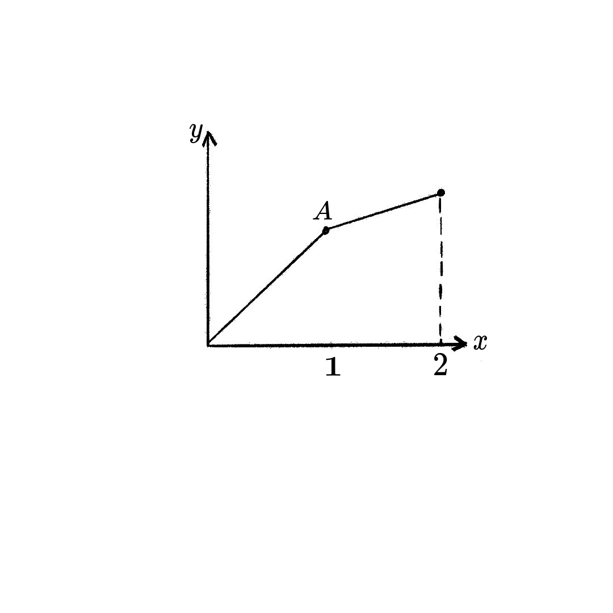

[toc]

# 第5章 微分的应用

## 5.1 中值定理

> [!tip]
> 
> **中值定理**是微积分中的核心结论. 类似于连续函数的**介值定理**, **中值定理**揭示了连续且可导的函数局部和整体之间的某种联系.

### 5.1.1 拉格朗日中值定理

> [!important]
>
> 
>
>  **微分中值定理（拉格朗日中值定理）：**
>  设函数 $f(x)$ 在闭区间 $[a, b]$ 上连续，并且在开区间 $(a, b)$ 上可导。那么，存在一个点 $c \in (a, b)$，使得：
>  $$
>  f'(c) = \frac{f(b) - f(a)}{b - a}
>  $$
>  
>  该定理的几何意义是：在曲线 $y = f(x)$ 上，至少存在一点 $c$，它的切线斜率等于割线通过点 $(a, f(a))$ 和 $(b, f(b))$ 的斜率。
> 
>  
>  

> [!warning]
> 
> ==定理的直观理解==
> 
> 想象你开车从A城市到B城市，总距离是 $f(b)-f(a)$，总时间是 $b-a$，那么你的平均速度就是 $\frac{f(b)-f(a)}{b-a}$。
> 
> 微分中值定理告诉我们：在整个旅途中，**至少存在某一时刻**，你的瞬时速度（导数）恰好等于这个平均速度。
> 
> 从几何角度看，连接曲线两端点的割线斜率就是这个平均变化率，而定理保证曲线上至少有一点，该点的切线平行于这条割线。

> [!warning]  
> 
>  **注意**: 该定理的结论也是**存在性**的, 并没有给出这个点 $c$ 的具体计算方法.
> 
> 微分中值定理建立了函数的**局部性质**（导数）与**整体性质**（函数值变化）之间的桥梁：
> 
> - **局部到整体**：通过各点的局部变化率，可以推断函数在整个区间上的变化情况
> - **微观到宏观**：无穷小的微分信息蕴含着有限增量的整体信息
> - **存在性到构造性**：虽然定理只保证存在性，但为许多问题的解决提供了关键思路
> 
> 这个定理是后续泰勒展开、函数单调性分析、极值理论等重要内容的基础，在微分方程、优化理论等领域都有广泛应用。

> [!note]
> 
> 定理的应用举例
> 
> **例1** 证明不等式：$|\sin x - \sin y| \leq |x-y|$
> 
> 证明：对函数 $f(t)=\sin t$ 在区间 $[x,y]$（或 $[y,x]$）上应用中值定理：
> 存在 $c$ 介于 $x,y$ 之间，使得：
> $$
> \frac{\sin x - \sin y}{x-y} = \cos c
> $$
> 
> 因为 $|\cos c| \leq 1$，所以：
> $$
> \left|\frac{\sin x - \sin y}{x-y}\right| \leq 1
> $$
> 
> 即 $|\sin x - \sin y| \leq |x-y|$。
> 
> **例2** 证明：如果 $f'(x)=0$ 在整个区间上成立，则 $f(x)$ 是常数函数。
> 
> 证明：任取 $a<b$，由中值定理，存在 $c\in(a,b)$ 使得：
> $$
> f(b)-f(a) = f'(c)(b-a) = 0
> $$
> 
> 所以 $f(b)=f(a)$，即函数值不变，$f(x)$ 是常数函数。
> 

>[!note]
>
> ==反例==
> 
> 如下图，该函数在 $ (0, 2) $ 上不可导，不满足拉格朗日中值定理的前提条件，所以不能应用该定理。
>
>

> [!note]
> 
>  ==例1==
>  
>  **$f(x) = x^2$ 对任意两点 $x_1$, $x_2$.**
> 
> 解： $ f(x) = x^2 $ 是多项式函数，在任意区间 $[x_1, x_2]$ 上连续且可导，满足拉格朗日中值定理的条件。  
> 
>  $\displaystyle\frac{f(x_2) - f(x_1)}{x_2 - x_1} = \frac{x_2^2 - x_1^2}{x_2 - x_1} = x_2 + x_1$  
> 
> 根据定理，存在 $ c \in (x_1, x_2) $ 使得：
   $\displaystyle f'(c) = 2c = x_2 + x_1$解得：
   $\displaystyle c = \frac{x_1 + x_2}{2}$结论：中值点 $ c $ 为区间中点，满足定理要求。  
> 
>> ==例2==
>  
> **$f(x) = x^3$ 对 $x_1 = 0$, $x_2 = 1$.**
> 
> 解： $ f(x) = x^3 $ 在 $[0, 1]$ 上连续且可导，满足定理条件。
> $\displaystyle \frac{f(1) - f(0)}{1 - 0} = \frac{1^3 - 0^3}{1} = 1$ 
>  根据定理，存在 $ c \in (0, 1) $ 使得：$\displaystyle f'(c) = 3c^2 = 1$  $\displaystyle  c = \frac{1}{\sqrt{3}} \approx 0.577$  结论：中值点 $ c = \frac{1}{\sqrt{3}} $ 满足定理要求。  

> [!caution]

> ==补充应用:利普希茨Lipschitz连续==
> 
> 若 $ f(x) $ 在区间 $ I $ 上满足拉格朗日中值定理，且导数有界（即 $ |f'(x)| \leq M $），则 $ f(x) $ 是 **Lipschitz连续** 的，即：
> $\displaystyle|f(x_1) - f(x_2)| \leq M |x_1 - x_2|, \quad \forall x_1, x_2 \in I.$
> 
> 
> **有限增量公式**
> 
> 对任意 $ x, y \in [a, b] $，存在 $ \theta \in (0, 1) $，使得：
> $\displaystyle f(y) - f(x) = f'(x + \theta \Delta x) \Delta x, \quad 0 < \theta < 1.$  其中 $ \Delta x = y - x $

### 5.1.2 罗尔中值定理和柯西中值定理

> [!important]
> 
> ==罗尔中值定理==
> 
> **罗尔中值定理：**
> 设函数 $f(x)$ 在闭区间 $[a, b]$ 上连续，在开区间 $(a, b)$ 上可导，并且 $f(a) = f(b)$。那么，存在一个点 $c \in (a, b)$，使得：
> $$
> f'(c) = 0
> $$
> 
> **几何意义**：如果一条连续光滑的曲线在两个端点处的高度相同，那么至少存在一点，该点的切线是水平的。
> 
> **证明思路**：如果函数在闭区间上恒为常数，结论显然成立。否则，根据极值定理，函数在闭区间上必有最大值和最小值，且至少有一个极值点出现在开区间内部，在该点处导数为零。

> [!important]
>
> ==拉格朗日中值定理==
> 
> 设函数 $f(x)$ 在闭区间 $[a, b]$ 上连续，并且在开区间 $(a, b)$ 上可导。那么，存在一个点 $c \in (a, b)$，使得：
> $$
> f'(c) = \frac{f(b) - f(a)}{b - a}
> $$
>
> **几何意义**：在曲线 $y = f(x)$ 上，至少存在一点 $c$，它的切线斜率等于割线通过点 $(a, f(a))$ 和 $(b, f(b))$ 的斜率。
> 
> **证明思路**：构造辅助函数 $g(x) = f(x) - \frac{f(b)-f(a)}{b-a}(x-a)$，使得 $g(a)=g(b)$，然后应用罗尔定理。
> 

> [!important]
>
> ==柯西中值定理==
> 
> 设函数 $f(x)$ 和 $g(x)$ 在闭区间 $[a, b]$ 上连续，在开区间 $(a, b)$ 上可导，且 $g'(x) \neq 0$ 对于所有 $x \in (a, b)$ 成立。那么，存在一个点 $c \in (a, b)$，使得：
> $$
> \frac{f(b) - f(a)}{g(b) - g(a)} = \frac{f'(c)}{g'(c)}
> $$
> 
> **几何意义**：考虑由参数方程 $x = g(t), y = f(t)$ 表示的曲线，从 $t=a$ 到 $t=b$。连接曲线两端点的割线斜率为 $\frac{f(b)-f(a)}{g(b)-g(a)}$，而曲线上在 $t=c$ 处的切线斜率为 $\frac{f'(c)}{g'(c)}$。柯西中值定理说明，至少存在一点 $c$，使得切线斜率等于割线斜率。
> 
> **证明思路**：构造辅助函数 $h(x) = f(x) - \frac{f(b)-f(a)}{g(b)-g(a)}[g(x)-g(a)]$，使得 $h(a)=h(b)$，然后应用罗尔定理。

> [!important]
> 
> ==三个中值定理的关系==
> 
> - **罗尔定理**是**拉格朗日定理**的特殊情况：当 $f(a)=f(b)$ 时，拉格朗日定理的结论退化为罗尔定理的结论。
> - **拉格朗日定理**是**柯西定理**的特殊情况：当 $g(x)=x$ 时，柯西定理的结论退化为拉格朗日定理的结论。
> - 这三个定理都是描述函数在区间上整体变化率与局部变化率之间的关系，都是**存在性**定理。

> [!note]
> 
> **例1** 书上的例子.

### 5.1.3 积分中值定理

> [!tip]
> 
> 在介绍了微分中值定理系列之后，下面我们要探讨积分学中对应的**积分中值定理**。这个定理建立了定积分与函数值之间的重要联系，在理论和应用中都有重要价值。

> [!tip]
> 
> ==积分中值定理的引入==
> 
> 回顾定积分的几何意义：它表示曲边梯形的面积。一个自然的问题是：这个面积能否用某个"平均高度"乘以底边长度来表示？
> 
> **直观理解**：对于连续函数 $f(x)$ 在区间 $[a,b]$ 上的定积分，存在某个点 $c \in [a,b]$，使得以 $f(c)$ 为高的矩形面积等于曲边梯形的面积。

> [!important]
>  
> ==积分中值定理==
> 
> 设函数 $f(x)$ 在闭区间 $[a, b]$ 上连续，则存在一点 $c \in [a, b]$，使得
> $$
> \int_a^b f(x)  dx = f(c)(b - a)
> $$
> 
> 数值 $\frac{1}{b-a} \int_a^b f(x)  dx$ 称为函数 $f(x)$ 在区间 $[a,b]$ 上的**积分平均值**。
> 
> **几何意义**：由曲线 $y = f(x)$、直线 $x=a$、$x=b$ 和 $x$ 轴所围成的曲边梯形的面积，等于以 $f(c)$ 为高的矩形的面积。
> 
> **证明**：
> 
> 由于 $f(x)$ 在 $[a, b]$ 上连续，根据闭区间上连续函数的性质：
> 
> 1. $f(x)$ 在 $[a, b]$ 上取得最小值 $m$ 和最大值 $M$，即
>    $$
>    m \leq f(x) \leq M, \quad \forall x \in [a,b]
>    $$
> 
> 2. 对不等式两边在 $[a,b]$ 上积分：
>    $$
>    \int_a^b m  dx \leq \int_a^b f(x)  dx \leq \int_a^b M  dx
>    $$
>    即
>    $$
>    m(b-a) \leq \int_a^b f(x)  dx \leq M(b-a)
>    $$
> 
> 3. 因此：
>    $$
>    m \leq \frac{1}{b-a} \int_a^b f(x)  dx \leq M
>    $$
> 
> 4. 根据连续函数的介值定理，存在 $c \in [a,b]$，使得
>    $$
>    f(c) = \frac{1}{b-a} \int_a^b f(x)  dx
>    $$
> 
> 5. 即：
>    $$
>    \int_a^b f(x)  dx = f(c)(b-a)
>    $$
> 
> 证毕。

> [!warning]
> 
> ### 注意事项
> 
> 1. **连续性要求**：定理要求函数连续，这是结论成立的关键条件
> 
> 2. **存在性而非构造性**：定理只保证存在性，不提供求 $c$ 的具体方法
> 
> 3. **点的位置**：$c$ 一般在区间内部，但定理只保证在闭区间上
> 

> [!note]
> 
> ==应用举例==
> 
> **例1** 求函数 $f(x) = x^2$ 在区间 $[0, 2]$ 上满足积分中值定理的点 $c$
> 
> **解**：计算积分
> $$
> \int_0^2 x^2  dx = \left[ \frac{x^3}{3} \right]_0^2 = \frac{8}{3}
> $$
> 
> 根据积分中值定理：
> $$
> \frac{8}{3} = f(c)(2-0) = 2c^2
> $$
> 
> 解得：
> $$
> c^2 = \frac{4}{3}, \quad c = \frac{2}{\sqrt{3}} \approx 1.155
> $$
> 
> **例2** 证明：若 $f(x)$ 在 $[a,b]$ 上连续，且 $\int_a^b f(x)  dx = 0$，则存在 $c \in [a,b]$ 使得 $f(c) = 0$
> 
> **证明**：由积分中值定理，存在 $c \in [a,b]$，使得
> $$
> \int_a^b f(x)  dx = f(c)(b-a) = 0
> $$
> 
> 由于 $b-a \neq 0$，所以 $f(c) = 0$。
> 
> **例3** 估计积分 $\int_0^1 e^{-x^2}  dx$ 的值
> 
> **解**：函数 $f(x) = e^{-x^2}$ 在 $[0,1]$ 上连续，且
> $$
> e^{-1} \leq e^{-x^2} \leq 1
> $$
> 
> 由积分中值定理，存在 $c \in [0,1]$，使得
> $$
> \int_0^1 e^{-x^2}  dx = e^{-c^2}
> $$
> 
> 由于 $e^{-1} \leq e^{-c^2} \leq 1$，所以
> $$
> \frac{1}{e} \leq \int_0^1 e^{-x^2}  dx \leq 1
> $$
> 
> 这个估计虽然粗糙，但不需要具体计算积分值。

> [!important]
> 
> ==推广的积分中值定理==
>
> 设函数 $f(x)$ 和 $g(x)$ 在闭区间 $[a, b]$ 上连续，且 $g(x)$ 在 $[a, b]$ 上不变号，则存在一点 $c \in [a, b]$，使得
> $$
> \int_a^b f(x) g(x)  dx = f(c) \int_a^b g(x)  dx
> $$
> 
> **证明思路**：类似基本定理的证明，利用最值定理和介值定理。
> 
> **应用**：在加权平均、概率论和物理问题中有广泛应用。

> [!warning]
> 
> ==积分中值定理与微分中值定理的联系==
> 
> 积分中值定理和微分中值定理都描述了函数在区间上的"平均"行为：
> 
> | 定理 | 描述对象 | 结论形式 |
> |------|----------|----------|
> | 微分中值定理 | 导数 $f'(x)$ | $f'(c) = \frac{f(b)-f(a)}{b-a}$ |
> | 积分中值定理 | 函数 $f(x)$ | $f(c) = \frac{1}{b-a} \int_a^b f(x)  dx$ |
> 
> 它们共同构成了微积分基本理论的重要组成部分。
> 

> [!warning]
> 
> 积分中值定理是微积分中的基本定理之一：
> 
> - 它用简洁的形式表达了定积分与函数值的关系
> - 其证明体现了连续函数性质的典型应用
> - 在理论和实际问题中都有广泛用途
> - 与微分中值定理相辅相成，共同揭示了函数的整体与局部性质

### 5.1.4 运用中值定理证明洛必达法则

> [!important]
> 
> **洛必达法则**：
> 设函数 $f(x)$ 和 $g(x)$ 在点 $a$ 的某个去心邻域内可导，且满足：
> 1. $\lim\limits_{x \to a} f(x) = \lim\limits_{x \to a} g(x) = 0$（或 $\infty$）
> 2. $g'(x) \neq 0$ 在该邻域内
> 3. $\lim\limits_{x \to a} \dfrac{f'(x)}{g'(x)}$ 存在（或为 $\infty$）
> 
> 则：
> $$
> \lim_{x \to a} \frac{f(x)}{g(x)} = \lim_{x \to a} \frac{f'(x)}{g'(x)}
> $$

> **证明（0/0型情形）**：

> **第一步：函数延拓**
> 定义：
> $$
> F(x) = 
> \begin{cases}
> f(x) & x \neq a \\
> 0 & x = a
> \end{cases},
> \quad G(x) = 
> \begin{cases}
> g(x) & x \neq a \\
> 0 & x = a
> \end{cases}
> $$
> 
> 由于 $\lim\limits_{x \to a} f(x) = \lim\limits_{x \to a} g(x) = 0$，$F(x)$ 和 $G(x)$ 在 $x=a$ 处连续。
> 
> **第二步：应用柯西中值定理**
> 在包含 $a$ 和 $x$ 的区间上（$x \neq a$），$F(x)$ 和 $G(x)$ 满足柯西中值定理的条件：
> - 在闭区间上连续
> - 在开区间上可导
> - $G'(x) = g'(x) \neq 0$
> 
> 因此，存在 $\xi$ 介于 $a$ 和 $x$ 之间，使得：
> $$
> \frac{F(x) - F(a)}{G(x) - G(a)} = \frac{F'(\xi)}{G'(\xi)}
> $$
> 
> 由于 $F(a) = G(a) = 0$，上式化为：
> $$
> \frac{F(x)}{G(x)} = \frac{f'(\xi)}{g'(\xi)}
> $$
> 
> **第三步：取极限**
> 当 $x \to a$ 时，$\xi \to a$（因为 $\xi$ 介于 $a$ 和 $x$ 之间），所以：
> $$
> \lim_{x \to a} \frac{f(x)}{g(x)} = \lim_{x \to a} \frac{F(x)}{G(x)} = \lim_{\xi \to a} \frac{f'(\xi)}{g'(\xi)} = \lim_{x \to a} \frac{f'(x)}{g'(x)}
> $$
> 
> 这就完成了 0/0 型情形的证明。

## 5.2 泰勒展开

### 5.2.1 高阶无穷小

> [!tip]
> 
> 在深入研究泰勒展开之前，我们需要先理解**无穷小量**和**高阶无穷小**的概念，这些概念为我们提供了衡量函数在局部趋近于零时的"速度标尺"。

> [!important]
> 
> ==无穷小量的定义==
> 
> **无穷小量**是指在某个极限过程中趋近于零的量。更精确地说：
> 
> 设函数 $f(x)$ 在点 $x_0$ 的某个去心邻域内有定义。如果
> $$
> \lim_{x \to x_0} f(x) = 0
> $$
> 则称 $f(x)$ 为 $x \to x_0$ 时的无穷小量。
> 
> 类似地，可以定义 $x \to \infty$ 时的无穷小量。
> 
> **例子**：
> - 当 $x \to 0$ 时，$x$, $x^2$, $\sin x$ 都是无穷小量
> - 当 $x \to \infty$ 时，$\frac{1}{x}$, $\frac{1}{x^2}$ 都是无穷小量

> [!important]
> 
> ==无穷小量的比较==
> 
> 不同的无穷小量趋近于零的"速度"可能不同。为了比较这种差异，我们引入以下概念：
> 
> 设 $\alpha(x)$ 和 $\beta(x)$ 都是 $x \to x_0$ 时的无穷小量，且 $\beta(x) \neq 0$。
> 
> 1. **高阶无穷小**：如果 $\lim_{x \to x_0} \frac{\alpha(x)}{\beta(x)} = 0$，则称 $\alpha(x)$ 是 $\beta(x)$ 的高阶无穷小，记作 $\alpha(x) = o(\beta(x))$。
> 
> 2. **等价无穷小**：如果 $\lim_{x \to x_0} \frac{\alpha(x)}{\beta(x)} = 1$，则称 $\alpha(x)$ 与 $\beta(x)$ 是等价无穷小，记作 $\alpha(x) \sim \beta(x)$。
> 
> 3. **同阶无穷小**：如果 $\lim_{x \to x_0} \frac{\alpha(x)}{\beta(x)} = c \neq 0$（$c$ 为常数），则称 $\alpha(x)$ 与 $\beta(x)$ 是同阶无穷小。

> [!note]
> 
> - 当 $x \to 0$ 时，$x^2 = o(x)$，因为 $\lim_{x \to 0} \frac{x^2}{x} = 0$
> - 当 $x \to 0$ 时，$\sin x \sim x$，因为 $\lim_{x \to 0} \frac{\sin x}{x} = 1$
> - 当 $x \to 0$ 时，$1 - \cos x \sim \frac{1}{2}x^2$，因为 $\lim_{x \to 0} \frac{1 - \cos x}{\frac{1}{2}x^2} = 1$

> [!warning]
> 
> ==无穷大量==
> 
> 与无穷小量相对的是**无穷大量**：
> 
> 设函数 $f(x)$ 在点 $x_0$ 的某个去心邻域内有定义。如果对于任意正数 $M$，总存在 $\delta > 0$，使得当 $0 < |x - x_0| < \delta$ 时，有 $|f(x)| > M$，则称 $f(x)$ 为 $x \to x_0$ 时的无穷大量。
> 
> 类似地，可以定义 $x \to \infty$ 时的无穷大量。
> 
> **例子**：
> - 当 $x \to 0$ 时，$\frac{1}{x}$ 是无穷大量
> - 当 $x \to \infty$ 时，$x$, $x^2$ 都是无穷大量

> [!important]
> 
> ==标准无穷小量==
> 
> 幂函数 $x^n$ 在 $x \to 0$ 时构成了一套自然的"标尺"，用于衡量其他无穷小量的阶数：
> 
> - $x$ 是一阶无穷小
> - $x^2$ 是二阶无穷小
> - $x^3$ 是三阶无穷小
> - 一般地，$x^n$ 是 $n$ 阶无穷小
> 
> 当我们说 $f(x) = o(x^n)$ 时，意味着 $f(x)$ 趋近于零的速度比 $x^n$ 更快。
> 
> 这套标尺的重要性在于：**任何足够光滑的函数在零点附近都可以用这些标准无穷小量的线性组合来近似表示**——这正是泰勒展开的核心思想。
> 
> **例子**：
> - $e^x - 1 \sim x$（一阶近似）
> - $e^x - 1 - x \sim \frac{1}{2}x^2$（二阶近似）
> - $\sin x - x \sim -\frac{1}{6}x^3$（三阶近似）
> 
> 在下一节中，我们将看到如何系统性地构造这种近似，即泰勒展开。

### 5.2.2 泰勒展开的概念

> ![tip]
>  
> ==泰勒展开的核心概念==
> 
> 任何足够光滑的函数在零点附近都可以用标准无穷小量 $x^n$ 的线性组合来近似表示。

> [!note]
> 
> **例1：指数函数 $e^x$ 在 $x=0$ 附近**
> 
> 我们知道：
> - $e^0 = 1$
> - 在 $x=0$ 附近，$e^x \approx 1 + x$（一阶近似）
> - 更好的近似：$e^x \approx 1 + x + \frac{x^2}{2}$（二阶近似）
> - 更更好的近似：$e^x \approx 1 + x + \frac{x^2}{2} + \frac{x^3}{6}$（三阶近似）
> 
> 这个模式可以继续下去，每一项都是 $x^n$ 的倍数。
> 
> **例2：正弦函数 $\sin x$ 在 $x=0$ 附近**
> 
> 我们知道：
> - $\sin 0 = 0$
> - 在 $x=0$ 附近，$\sin x \approx x$（一阶近似）
> - 更好的近似：$\sin x \approx x - \frac{x^3}{6}$（三阶近似）
> - 更更好的近似：$\sin x \approx x - \frac{x^3}{6} + \frac{x^5}{120}$（五阶近似）
> 
> 注意到这里只出现奇数次项，这与正弦函数的奇函数性质相符。

> [!note]
> 
> ==数值实验证据==
> 
> 让我们通过数值计算来验证这些近似的有效性（取 $x=0.1$）：
> 
> | 函数 | 精确值 | 一阶近似 | 二阶近似 | 三阶近似 |
> |------|--------|----------|----------|----------|
> | $e^{0.1}$ | 1.105170918 | 1.1 | 1.105 | 1.105166667 |
> | $\sin(0.1)$ | 0.099833417 | 0.1 | - | 0.099833333 |
> 
> 可以看到：
> - 随着近似阶数的增加，精度显著提高
> - 三阶近似已经非常接近真实值
> - 不同的函数需要不同阶数的近似来达到相同的精度

> [!important]
> 
> ==确定泰勒展开的系数==
> 
> 假设我们希望用多项式来近似函数 $f(x)$：
> $$
> f(x) \approx a_0 + a_1x + a_2x^2 + a_3x^3 + \cdots + a_nx^n
> $$
> 
> 如何确定系数 $a_0, a_1, a_2, \ldots, a_n$？
> 
> **思路**：让近似多项式在 $x=0$ 处与函数 $f(x)$ 有尽可能多的"一致性"。
> 
> **推导过程**：
> 
> 1. **零阶一致性**：在 $x=0$ 处，函数值与近似值相等
>    $$
>    f(0) = a_0 \quad \Rightarrow \quad a_0 = f(0)
>    $$
> 
> 2. **一阶一致性**：在 $x=0$ 处，一阶导数相等
>    $$
>    f'(0) = a_1 \quad \Rightarrow \quad a_1 = f'(0)
>    $$
> 
> 3. **二阶一致性**：在 $x=0$ 处，二阶导数相等
>    $$
>    f''(0) = 2a_2 \quad \Rightarrow \quad a_2 = \frac{f''(0)}{2}
>    $$
> 
> 4. **n阶一致性**：在 $x=0$ 处，n阶导数相等
>    $$
>    f^{(n)}(0) = n! \cdot a_n \quad \Rightarrow \quad a_n = \frac{f^{(n)}(0)}{n!}
>    $$
> 
> 因此，我们得到了泰勒展开的系数公式：
> $$
> a_n = \frac{f^{(n)}(0)}{n!}
> $$
> 
> 完整的泰勒公式（在 $x=0$ 处，也称为麦克劳林公式）为：
> $$
> f(x) = f(0) + f'(0)x + \frac{f''(0)}{2!}x^2 + \frac{f'''(0)}{3!}x^3 + \cdots + \frac{f^{(n)}(0)}{n!}x^n + R_n(x)
> $$
> 
> 其中 $R_n(x)$ 是余项，表示近似误差。
> 
> **例子验证**：对于 $f(x) = e^x$
> - $f(0) = 1$ ⇒ $a_0 = 1$
> - $f'(0) = 1$ ⇒ $a_1 = 1$
> - $f''(0) = 1$ ⇒ $a_2 = \frac{1}{2}$
> - $f'''(0) = 1$ ⇒ $a_3 = \frac{1}{6}$
> 
> 这与我们之前的观察完全一致！
> 
> 这个美妙的公式告诉我们：**函数在一点附近的行为完全由它在该点的各阶导数决定**。这是微分学最深刻的结论之一。

### 5.2.3 泰勒展开的余项估计

> [!tip]
>
> 本节我们将估计泰勒展开的余项 $R_n(x)$ 的大小. 为什么余项的大小很重要? 这是因为泰勒展开的核心价值在于用多项式来近似复杂函数，但作为近似我们自然关心一个关键问题：这种近似的误差有多大？是否可控？
> 
> 答案是肯定的！本节的余项分析告诉我们：
> 
> - 对于充分光滑的函数，泰勒近似的误差确实是可以控制的
> 
> - 误差随着展开阶数 $n$ 的增加而减小
> 
> - 在展开点附近，误差比展开式的最后一项更快地趋近于零
> 
> 这种可控性使得泰勒展开在数值计算、物理建模、工程优化等领域有着广泛的应用。
> 

> [!important]
> 
> ==皮亚诺余项==
> 
> 设函数 $f(x)$ 在 $x=0$ 处有 $n$ 阶导数，则存在邻域 $U(0)$，使得对于任意 $x \in U(0)$，有
> $$
> f(x) = f(0) + f'(0)x + \frac{f''(0)}{2!}x^2 + \cdots + \frac{f^{(n)}(0)}{n!}x^n + o(x^n)
> $$
> 其中 $o(x^n)$ 表示当 $x \to 0$ 时，余项是 $x^n$ 的高阶无穷小。
> 
> **证明**
> 
> 我们需要证明：$\lim_{x \to 0} \frac{R_n(x)}{x^n} = 0$，其中 $R_n(x) = f(x) - P_n(x)$，$P_n(x)$ 是 $n$ 次泰勒多项式。
> 
> **方法一：使用柯西中值定理**
> 
> 考虑函数 $\phi(t) = f(t) - P_n(t)$ 和 $\psi(t) = t^{n+1}$
> 
> 在区间 $[0,x]$ 上应用柯西中值定理：
> $$
> \frac{\phi(x) - \phi(0)}{\psi(x) - \psi(0)} = \frac{\phi'(\xi)}{\psi'(\xi)} \quad \text{对某个 } \xi \in (0,x)
> $$
> 
> 由于 $\phi(0) = 0$，$\psi(0) = 0$，我们有：
> $$
> \frac{R_n(x)}{x^{n+1}} = \frac{\phi'(\xi)}{(n+1)\xi^n}
> $$
> 
> 但 $\phi'(t) = f'(t) - P_n'(t)$，而 $P_n'(t)$ 是 $f'(t)$ 的 $(n-1)$ 阶泰勒多项式
> 
> 由归纳假设，$\lim_{t \to 0} \frac{\phi'(t)}{t^n} = 0$
> 
> 因此：
> $$
> \lim_{x \to 0} \frac{R_n(x)}{x^{n+1}} = \lim_{\xi \to 0} \frac{\phi'(\xi)}{(n+1)\xi^n} = 0
> $$
> 
> 这就证明了 $R_n(x) = o(x^n)$。
> 
> **方法二：使用洛必达法则**
> 
> 考虑极限 $\lim_{x \to 0} \frac{R_n(x)}{x^n}$
> 
> 注意到：
> - $R_n(0) = 0$
> - $R_n'(0) = 0$
> - ...
> - $R_n^{(n-1)}(0) = 0$
> 
> 这是因为泰勒多项式 $P_n(x)$ 的前 $n$ 阶导数在 $x=0$ 处与 $f(x)$ 完全相同。
> 
> 应用洛必达法则 $n$ 次：
> $$
> \lim_{x \to 0} \frac{R_n(x)}{x^n} = \lim_{x \to 0} \frac{R_n'(x)}{nx^{n-1}} = \cdots = \lim_{x \to 0} \frac{R_n^{(n-1)}(x)}{n!x}
> $$
> 
> 现在考虑最后一个极限：
> $$
> \lim_{x \to 0} \frac{R_n^{(n-1)}(x)}{n!x} = \frac{1}{n!} \lim_{x \to 0} \frac{R_n^{(n-1)}(x) - R_n^{(n-1)}(0)}{x}
> $$
> 
> 根据导数的定义，这个极限等于 $\frac{1}{n!} R_n^{(n)}(0)$
> 
> 但 $R_n^{(n)}(0) = f^{(n)}(0) - P_n^{(n)}(0) = f^{(n)}(0) - n! \cdot \frac{f^{(n)}(0)}{n!} = 0$
> 
> 因此：
> $$
> \lim_{x \to 0} \frac{R_n(x)}{x^n} = 0
> $$
> 
> 这就证明了 $R_n(x) = o(x^n)$。
>

> [!warning]
> 
> ==两种证明方法的比较==
> 
> - **柯西中值定理方法**：更加几何化，通过构造辅助函数和区间分析来证明
> - **洛必达法则方法**：更加代数化，直接通过极限运算和导数定义来证明

> [!warning]
> 
> ==余项的直观理解==
> 
> 余项 $o(x^n)$ 的含义是：
> - 当 $x$ 很小时，泰勒多项式的误差比 $x^n$ 更快地趋近于零
> - 展开的阶数 $n$ 越高，近似精度越高
> - 对于固定的 $n$，当 $x \to 0$ 时，误差趋近于零的速度由 $x^n$ 决定
> 
> **例子**：比较 $e^x$ 的不同阶泰勒近似的误差
> 
> | $x$ | 精确值 | 一阶近似误差 | 二阶近似误差 | 三阶近似误差 |
> |-----|--------|--------------|--------------|--------------|
> | 0.1 | 1.10517 | 0.00517 | 0.00017 | 0.000004 |
> | 0.01 | 1.01005 | 0.00005 | 1.67×10⁻⁷ | 4.17×10⁻¹⁰ |
> 
> 可以看到：
> - 误差确实随着 $x$ 减小而快速减小
> - 高阶近似的误差减小得更快
> - 当 $x=0.01$ 时，三阶近似的误差已经可以忽略不计

> [!warning]
> 
> ==皮亚诺余项的意义==
> 
> 皮亚诺余项 $o(x^n)$ 给出了泰勒近似的**渐近性质**：
> - 它告诉我们当 $x \to 0$ 时误差的行为
> - 但它不提供具体的误差界
> - 对于固定的 $x$，我们不知道误差到底有多大
>
> 皮亚诺余项确认了我们的直观：用多项式逼近光滑函数是可行的，且逼近误差在原点附近是可以控制的. 在实际应用中，我们有时需要更精确的误差估计，这时可以使用下面将要介绍的**拉格朗日余项**或**柯西余项**。
> 

> [!tip]
> 
> 皮亚诺余项 $o(x^n)$ 告诉我们余项是 $x^n$ 的高阶无穷小，但它没有给出具体的误差估计。在实际应用中，我们经常需要知道误差的具体范围，这时就需要使用**拉格朗日余项**。
>

> [!important]
> 
> ==拉格朗日余项==
> 
> 设函数 $f(x)$ 在包含 $0$ 和 $x$ 的区间上具有 $n+1$ 阶连续导数，则存在 $\xi$ 介于 $0$ 和 $x$ 之间，使得
> $$
> f(x) = f(0) + f'(0)x + \frac{f''(0)}{2!}x^2 + \cdots + \frac{f^{(n)}(0)}{n!}x^n + \frac{f^{(n+1)}(\xi)}{(n+1)!}x^{n+1}
> $$
> 
> 其中 $\frac{f^{(n+1)}(\xi)}{(n+1)!}x^{n+1}$ 称为**拉格朗日余项**。
> 
> **证明思路**：
> 
> 考虑辅助函数：
> $$
> F(t) = f(x) - \left[ f(t) + f'(t)(x-t) + \frac{f''(t)}{2!}(x-t)^2 + \cdots + \frac{f^{(n)}(t)}{n!}(x-t)^n \right]
> $$
> 
> 和
> $$
> G(t) = (x-t)^{n+1}
> $$
> 
> 在区间 $[0,x]$（或 $[x,0]$）上应用柯西中值定理：
> $$
> \frac{F(x) - F(0)}{G(x) - G(0)} = \frac{F'(\xi)}{G'(\xi)} \quad \text{对某个 } \xi \in (0,x)
> $$
> 
> 经过计算可得：
> $$
> F'(\xi) = -\frac{f^{(n+1)}(\xi)}{n!}(x-\xi)^n, \quad G'(\xi) = -(n+1)(x-\xi)^n
> $$
> 
> 代入并整理即得拉格朗日余项公式。
>

> [!warning]
> 
> ==拉格朗日余项的意义==
> 
> 1. **具体误差界**：拉格朗日余项给出了误差的具体表达式
> 2. **可计算性**：如果知道 $f^{(n+1)}$ 的界，就可以计算误差的范围
> 3. **实用性**：在数值计算和工程应用中非常有用

> [!note]
> 
> **例子**：估计 $e^{0.1}$ 的三阶泰勒近似的误差
> 
> $e^x$ 的四阶导数为 $e^x$，在 $[0,0.1]$ 上，$|e^x| \leq e^{0.1} < 1.11$
> 
> 因此误差：
> $$
> |R_3(0.1)| \leq \frac{1.11}{4!}(0.1)^4 \approx 4.625 \times 10^{-6}
> $$
> 
> 这与我们之前观察到的实际误差 $4 \times 10^{-6}$ 吻合。

> [!important]
>
> ==柯西余项==
> 
> **泰勒定理（带柯西余项）**：
> 设函数 $f(x)$ 在包含 $0$ 和 $x$ 的区间上具有 $n+1$ 阶连续导数，则存在 $\theta \in (0,1)$，使得
> $$
> f(x) = f(0) + f'(0)x + \frac{f''(0)}{2!}x^2 + \cdots + \frac{f^{(n)}(0)}{n!}x^n + \frac{f^{(n+1)}(\theta x)}{n!}(1-\theta)^n x^{n+1}
> $$
> 
> 其中 $\frac{f^{(n+1)}(\theta x)}{n!}(1-\theta)^n x^{n+1}$ 称为**柯西余项**。
> 
> **证明思路**：
> 
> 使用与拉格朗日余项类似的证明方法，但选择不同的辅助函数 $G(t)$。
> 
> **柯西余项的特点**：
> 
> 1. **形式不同**：柯西余项与拉格朗日余项的表达式不同
> 2. **适用范围**：在某些情况下，柯西余项能给出更精确的误差估计
> 3. **理论价值**：在分析泰勒级数的收敛性时很有用

> [!important]
> 
> ==积分余项==
>
> 设函数 $f(x)$ 在包含 $0$ 和 $x$ 的区间上具有 $n+1$ 阶连续导数，则
> $$
> f(x) = f(0) + f'(0)x + \frac{f''(0)}{2!}x^2 + \cdots + \frac{f^{(n)}(0)}{n!}x^n + R_n(x)
> $$
> 其中积分余项为：
> $$
> R_n(x) = \frac{1}{n!} \int_0^x (x-t)^n f^{(n+1)}(t)  dt
> $$
>
> 
> **推导过程**：
> 
> 1. 从微积分基本定理出发：
>    $$
>    f(x) = f(0) + \int_0^x f'(t)  dt
>    $$
> 
> 2. 对积分 $\int_0^x f'(t)  dt$ 进行分部积分，令 $u = f'(t)$, $dv = dt$：
>    $$
>    \int_0^x f'(t)  dt = \left[ f'(t) \cdot t \right]_0^x - \int_0^x t f''(t)  dt = x f'(0) + \int_0^x (x-t) f''(t)  dt
>    $$
> 
> 3. 重复此过程，每次分部积分都会产生一个新的泰勒项和余下的积分：
>    $$
>    f(x) = f(0) + x f'(0) + \frac{x^2}{2!} f''(0) + \cdots + \frac{x^n}{n!} f^{(n)}(0) + \frac{1}{n!} \int_0^x (x-t)^n f^{(n+1)}(t)  dt
>    $$
> 
> 这样就得到了积分余项公式。

> [!warning]
> 
> ==积分余项的优势==
> 
> 与其他余项形式相比，积分余项具有独特优势：
> 
> 1. **精确表达式**：积分余项给出了余项的精确表达式，而非存在性结果
> 
> 2. **适用范围广**：可用于推导各种数值方法的误差估计
> 
> 3. **理论价值**：在泛函分析和偏微分方程中有重要应用
> 
> 4. **灵活性**：可以通过不同的积分估计技术得到不同的误差界

> [!warning]
> 
> ==积分余项的局限性==
> 
> 1. **计算复杂**：实际计算积分可能很困难
> 
> 2. **条件较强**：要求 $f^{(n+1)}$ 连续，而皮亚诺余项只需 $n$ 阶导数存在
> 
> 3. **实用性有限**：在实际数值计算中，拉格朗日余项通常更便于使用

> [!warning]
> 
> ==各种余项形式的比较总结==
>
> | 余项类型 | 表达式 | 条件 | 主要应用 |
> |----------|--------|------|----------|
> | 皮亚诺余项 | $o(x^n)$ | $f$ 在 $x_0$ 处 $n$ 阶可导 | 极限计算，渐近分析 |
> | 拉格朗日余项 | $\frac{f^{(n+1)}(\xi)}{(n+1)!}x^{n+1}$ | $f^{(n+1)}$ 在区间上存在 | 误差估计，不等式证明 |
> | 柯西余项 | $\frac{f^{(n+1)}(\theta x)}{n!}(1-\theta)^n x^{n+1}$ | $f^{(n+1)}$ 在区间上存在 | 特殊情形的误差分析 |
> | 积分余项 | $\frac{1}{n!}\int_0^x (x-t)^n f^{(n+1)}(t) dt$ | $f^{(n+1)}$ 连续 | 理论分析，数值方法推导 |

> [!warning]
> 
> ==积分余项与其他余项的关系==
> 
> 积分余项可以推导出拉格朗日余项和柯西余项：
> 
> **推导拉格朗日余项**：
> 
> 由积分中值定理，存在 $\xi \in (0,x)$ 使得：
> $$
> \int_0^x (x-t)^n f^{(n+1)}(t)  dt = f^{(n+1)}(\xi) \int_0^x (x-t)^n  dt = f^{(n+1)}(\xi) \frac{x^{n+1}}{n+1}
> $$
> 
> 代入积分余项得：
> $$
> R_n(x) = \frac{f^{(n+1)}(\xi)}{(n+1)!} x^{n+1}
> $$
> 
> 这正是拉格朗日余项。
> 
> **推导柯西余项**：
> 
> 令 $t = \theta x$，则 $dt = x d\theta$，积分变为：
> $$
> \int_0^x (x-t)^n f^{(n+1)}(t)  dt = x^{n+1} \int_0^1 (1-\theta)^n f^{(n+1)}(\theta x)  d\theta
> $$
> 
> 由积分中值定理，存在 $\theta_0 \in (0,1)$ 使得：
> $$
> \int_0^1 (1-\theta)^n f^{(n+1)}(\theta x)  d\theta = f^{(n+1)}(\theta_0 x) \int_0^1 (1-\theta)^n  d\theta = \frac{f^{(n+1)}(\theta_0 x)}{n+1}
> $$
> 
> 因此：
> $$
> R_n(x) = \frac{f^{(n+1)}(\theta_0 x)}{n!} \cdot \frac{x^{n+1}}{n+1}
> $$
> 
> 这与柯西余项形式略有不同，但本质相同。

> [!note]
> 
> ==应用实例：计算 $\pi$ 的近似值==
> 
> 利用 $\arctan x$ 的泰勒展开：
> $$
> \arctan x = x - \frac{x^3}{3} + \frac{x^5}{5} - \frac{x^7}{7} + \cdots
> $$
> 
> 取 $x = 1$，得：
> $$
> \frac{\pi}{4} = 1 - \frac{1}{3} + \frac{1}{5} - \frac{1}{7} + \cdots
> $$
> 
> 使用拉格朗日余项可以估计需要多少项才能达到指定的精度。
> 
> 例如，要计算 $\pi$ 到小数点后 6 位，需要：
> $$
> |R_n(1)| \leq \frac{1}{2n+1} < 10^{-6}
> $$
> 
> 解得 $n > 5 \times 10^5$，即需要约 50 万项！这说明虽然泰勒展开理论上是精确的，但实际计算时收敛速度可能很慢。
> 

### 5.2.4 常见函数的泰勒展开

> [!tip]
> 
> 掌握常见函数的泰勒展开式是应用泰勒展开的基础。这些展开式在数学分析、物理学、工程计算等领域有着广泛的应用。

> [!note]
> 
> ==指数函数 $e^x$==
> 
> **泰勒展开式**：
> $$
> e^x = 1 + x + \frac{x^2}{2!} + \frac{x^3}{3!} + \frac{x^4}{4!} + \cdots = \sum_{n=0}^{\infty} \frac{x^n}{n!}
> $$
> 
> **收敛性**：对所有实数 $x$ 都收敛
> 
> **推导**：
> - $f(x) = e^x$，$f^{(n)}(x) = e^x$，$f^{(n)}(0) = 1$
> - 代入泰勒公式：$a_n = \frac{f^{(n)}(0)}{n!} = \frac{1}{n!}$
> 
> **应用**：计算 $e$ 的近似值
> $$
> e = e^1 \approx 1 + 1 + \frac{1}{2} + \frac{1}{6} + \frac{1}{24} + \frac{1}{120} \approx 2.71667
> $$

> [!note]
> 
> ==正弦函数 $\sin x$==
> 
> **泰勒展开式**：
> $$
> \sin x = x - \frac{x^3}{3!} + \frac{x^5}{5!} - \frac{x^7}{7!} + \cdots = \sum_{n=0}^{\infty} \frac{(-1)^n x^{2n+1}}{(2n+1)!}
> $$
> 
> **收敛性**：对所有实数 $x$ 都收敛
> 
> **推导**：
> - $\sin^{(n)}(x) = \sin\left(x + \frac{n\pi}{2}\right)$
> - $\sin^{(n)}(0)$ 的值为：0, 1, 0, -1, 0, 1, ...（循环）
> - 只有奇数次项非零，且符号交替
> 
> **特点**：只包含奇数次项，这与 $\sin x$ 是奇函数相符

> [!note]
> 
> ==余弦函数 $\cos x$==
> 
> **泰勒展开式**：
> $$
> \cos x = 1 - \frac{x^2}{2!} + \frac{x^4}{4!} - \frac{x^6}{6!} + \cdots = \sum_{n=0}^{\infty} \frac{(-1)^n x^{2n}}{(2n)!}
> $$
> 
> **收敛性**：对所有实数 $x$ 都收敛
> 
> **推导**：
> - $\cos^{(n)}(x) = \cos\left(x + \frac{n\pi}{2}\right)$
> - $\cos^{(n)}(0)$ 的值为：1, 0, -1, 0, 1, 0, ...（循环）
> - 只有偶数次项非零，且符号交替
> 
> **特点**：只包含偶数次项，这与 $\cos x$ 是偶函数相符

> [!note]
> 
> ==自然对数 $\ln(1+x)$==
> 
> **泰勒展开式**：
> $$
> \ln(1+x) = x - \frac{x^2}{2} + \frac{x^3}{3} - \frac{x^4}{4} + \cdots = \sum_{n=1}^{\infty} \frac{(-1)^{n+1} x^n}{n}
> $$
> 
> **收敛区间**：$-1 < x \leq 1$
> 
> **推导**：
> - $f(x) = \ln(1+x)$，$f'(x) = \frac{1}{1+x} = \sum_{n=0}^{\infty} (-1)^n x^n$（几何级数）
> - 逐项积分得到 $\ln(1+x)$ 的展开式
> 
> **注意**：当 $x=1$ 时，得到著名的交错调和级数
> $$
> \ln 2 = 1 - \frac{1}{2} + \frac{1}{3} - \frac{1}{4} + \cdots
> $$

> [!note]
> 
> ==二项式展开 $(1+x)^\alpha$==
> 
> **泰勒展开式**（广义二项式定理）：
> $$
> (1+x)^\alpha = 1 + \alpha x + \frac{\alpha(\alpha-1)}{2!}x^2 + \frac{\alpha(\alpha-1)(\alpha-2)}{3!}x^3 + \cdots
> $$
> 
> **收敛区间**：
> - 当 $\alpha$ 是非负整数时：对所有 $x$ 成立（有限项）
> - 当 $\alpha$ 不是非负整数时：$|x| < 1$
> 
> **特殊情况**：
> - $\alpha = -1$：$\frac{1}{1+x} = 1 - x + x^2 - x^3 + \cdots$
> - $\alpha = \frac{1}{2}$：$\sqrt{1+x} = 1 + \frac{1}{2}x - \frac{1}{8}x^2 + \frac{1}{16}x^3 - \cdots$
> - $\alpha = -\frac{1}{2}$：$\frac{1}{\sqrt{1+x}} = 1 - \frac{1}{2}x + \frac{3}{8}x^2 - \frac{5}{16}x^3 + \cdots$

> [!warning]
> 
> ==收敛性总结表==
> 
> | 函数 | 展开式 | 收敛区间 |
> |------|--------|----------|
> | $e^x$ | $\sum \frac{x^n}{n!}$ | $(-\infty, \infty)$ |
> | $\sin x$ | $\sum \frac{(-1)^n x^{2n+1}}{(2n+1)!}$ | $(-\infty, \infty)$ |
> | $\cos x$ | $\sum \frac{(-1)^n x^{2n}}{(2n)!}$ | $(-\infty, \infty)$ |
> | $\ln(1+x)$ | $\sum \frac{(-1)^{n+1} x^n}{n}$ | $(-1, 1]$ |
> | $(1+x)^\alpha$ | $\sum \binom{\alpha}{n} x^n$ | 见上文说明 |
> 
> 掌握这些常见函数的泰勒展开式，能够帮助我们解决各种极限计算、近似计算和级数求和问题。在实际应用中，我们可以根据精度要求截取适当的前几项进行计算。

### 5.2.5 泰勒展开的应用

> [!tip]
> 
> 泰勒公式不仅是理论分析的有力工具，在实际问题中也有着广泛的应用。本节将通过具体例子展示泰勒公式在极限计算、近似计算、不等式证明和微分方程求解等方面的应用。

> [!important]
> 
> ==极限计算==
> 
> 泰勒展开为计算复杂极限提供了系统的方法，特别是当洛必达法则变得繁琐时。

> [!note]
> 
> **例1** 计算 $\lim_{x \to 0} \frac{e^x - 1 - x}{x^2}$
> 
> **解**：将 $e^x$ 展开到二阶：
> $$
> e^x = 1 + x + \frac{x^2}{2} + o(x^2)
> $$
> 
> 代入得：
> $$
> \frac{e^x - 1 - x}{x^2} = \frac{(1 + x + \frac{x^2}{2} + o(x^2)) - 1 - x}{x^2} = \frac{\frac{x^2}{2} + o(x^2)}{x^2} = \frac{1}{2} + o(1)
> $$
> 
> 因此：
> $$
> \lim_{x \to 0} \frac{e^x - 1 - x}{x^2} = \frac{1}{2}
> $$
>

> [!note]
> 
> **例2** 计算 $\lim_{x \to 0} \frac{\sin x - x}{x^3}$
> 
> **解**：将 $\sin x$ 展开到三阶：
> $$
> \sin x = x - \frac{x^3}{6} + o(x^3)
> $$
> 
> 代入得：
> $$
> \frac{\sin x - x}{x^3} = \frac{(x - \frac{x^3}{6} + o(x^3)) - x}{x^3} = -\frac{1}{6} + o(1)
> $$
> 
> 因此：
> $$
> \lim_{x \ to 0} \frac{\sin x - x}{x^3} = -\frac{1}{6}
> $$

> [!important]
> 
> ==近似计算==
> 
> 泰勒展开为函数值的近似计算提供了系统方法，特别在数值分析和工程计算中应用广泛。

> [!note]
> 
> **例3** 计算 $\sin 1^\circ$ 的近似值
> 
> **解**：先将角度转换为弧度：$1^\circ = \frac{\pi}{180} \approx 0.0174533$
> 
> 使用 $\sin x$ 的展开：
> $$
> \sin x = x - \frac{x^3}{6} + \frac{x^5}{120} - \cdots
> $$
> 
> 代入 $x = 0.0174533$：
> $$
> \sin 1^\circ \approx 0.0174533 - \frac{(0.0174533)^3}{6} \approx 0.0174524
> $$
> 
> 与精确值 $0.0174524064$ 相比，误差约为 $10^{-8}$。

> [!important]
> 
> ==不等式证明==
> 
> 泰勒展开为证明函数不等式提供了有效方法。

> [!note]
> 
> **例5** 证明：当 $x > 0$ 时，$e^x > 1 + x + \frac{x^2}{2}$
> 
> **证明**：将 $e^x$ 展开到三阶：
> $$
> e^x = 1 + x + \frac{x^2}{2} + \frac{e^\xi}{6}x^3 \quad (\xi \in (0,x))
> $$
> 
> 由于 $e^\xi > 0$，所以：
> $$
> e^x = 1 + x + \frac{x^2}{2} + \frac{e^\xi}{6}x^3 > 1 + x + \frac{x^2}{2}
> $$
> 
> 证毕。

> [!note]
> 
> **例6** 证明：当 $0 < x < \frac{\pi}{2}$ 时，$\sin x > x - \frac{x^3}{6}$
> 
> **证明**：将 $\sin x$ 展开到五阶：
> $$
> \sin x = x - \frac{x^3}{6} + \frac{\cos \xi}{120}x^5 \quad (\xi \in (0,x))
> $$
> 
> 当 $0 < x < \frac{\pi}{2}$ 时，$\cos \xi > 0$，所以：
> $$
> \sin x = x - \frac{x^3}{6} + \frac{\cos \xi}{120}x^5 > x - \frac{x^3}{6}
> $$
> 
> 证毕。

### 5.2.6 大O符号

> [!tip]
> 
> 在前面的讨论中，我们介绍了皮亚诺余项 $o(x^n)$ 和拉格朗日余项。现在我们将引入**大O符号**，它提供了另一种描述余项行为的方式，在数值分析和算法分析中特别有用。

> [!important]
>
> ==大O符号的定义==
>
> 设函数 $f(x)$ 和 $g(x)$ 在 $x_0$ 的某个去心邻域内有定义。如果存在常数 $M > 0$ 和 $\delta > 0$，使得当 $0 < |x - x_0| < \delta$ 时，有
> $$
> |f(x)| \leq M|g(x)|
> $$
> 则称 $f(x)$ 是 $g(x)$ 的大O，记作 $f(x) = O(g(x))$（当 $x \to x_0$）。
>
> **直观理解**：$f(x) = O(g(x))$ 表示 $f(x)$ 的**增长速率不超过** $g(x)$ 的常数倍。
>
> ### 大O符号与皮亚诺余项的比较
>
> | 符号 | 定义 | 含义 | 强弱关系 |
> |------|------|------|----------|
> | $f(x) = o(g(x))$ | $\lim_{x \to x_0} \frac{f(x)}{g(x)} = 0$ | $f(x)$ 是 $g(x)$ 的高阶无穷小 | 更强 |
> | $f(x) = O(g(x))$ | $\exists M > 0, |\frac{f(x)}{g(x)}| \leq M$ | $f(x)$ 不超过 $g(x)$ 的常数倍 | 更弱 |
>
> **关键区别**：
>
> - $o(x^n)$ 保证余项比 $x^n$ **更快地**趋近于零
> - $O(x^{n+1})$ 保证余项最多是 $x^{n+1}$ 的**常数倍**

> [!note]
> 
> ==泰勒展开中的大O符号==
> 
> 设函数 $f(x)$ 在 $x=0$ 处有 $n+1$ 阶连续导数，则
> $$
> f(x) = f(0) + f'(0)x + \frac{f''(0)}{2!}x^2 + \cdots + \frac{f^{(n)}(0)}{n!}x^n + O(x^{n+1})
> $$
> 
> **证明思路**：
> 由拉格朗日余项公式：
> $$
> R_n(x) = \frac{f^{(n+1)}(\xi)}{(n+1)!}x^{n+1}
> $$
> 
> 由于 $f^{(n+1)}(x)$ 在 $x=0$ 附近连续，故有界，即存在 $M > 0$ 使得 $|f^{(n+1)}(x)| \leq M$，因此
> $$
> |R_n(x)| \leq \frac{M}{(n+1)!}|x|^{n+1}
> $$
> 
> 即 $R_n(x) = O(x^{n+1})$。
>

> [!note]
> 
> ==函数展开的比较==
> 
> **例1** 比较 $e^x$ 和 $\cos x$ 的展开式
> 
> - $e^x = 1 + x + \frac{x^2}{2} + O(x^3)$
> - $\cos x = 1 - \frac{x^2}{2} + O(x^4)$
> 
> 这表明：
> - $e^x$ 的三阶误差是 $O(x^3)$
> - $\cos x$ 的三阶误差是 $O(x^4)$，实际上更小

> [!warning]
> 
> ==大O符号在数值分析中的重要性==
> 
> 大O符号在数值分析和算法分析中极为重要：
> 
> 1. **算法复杂度分析**：描述算法时间或空间需求随输入规模增长的速度
> 
> 2. **数值方法误差分析**：描述数值方法的截断误差
> 
> 3. **渐近分析**：研究函数在无穷远处或奇点附近的行为
> 
> **例5** 数值积分的误差分析
> 
> 梯形公式的误差为 $O(h^2)$，辛普森公式的误差为 $O(h^4)$，这表明辛普森公式收敛更快。