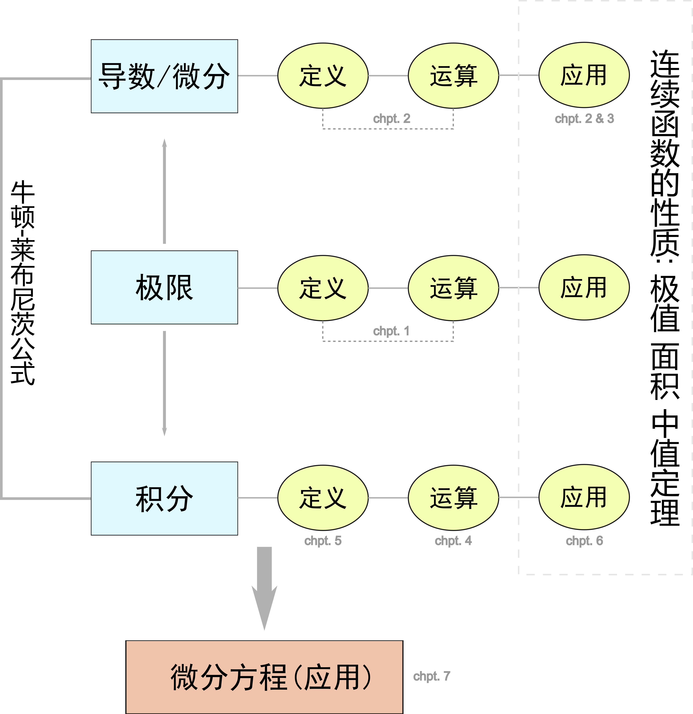

# 导数

> [!tip]
> 
> 实际问题中人们经常会考虑某个函数的**极值**, 函数的**切线方向**是分析函数极值的有力工具: 
> - 切线斜率为正时函数单调递增
> - 切线斜率为负时函数单调递减
> - 切线斜率为零时函数取到极值
>
> 那么怎么求函数在某处**切线的斜率**呢? 这个问题困扰了数学家好多年, 直到后来有人发现**切线斜率可以看作是一个极限**, 这个极限就叫做**导数**.
>

> [!tip]
> 
> ==思维导图==
> 
> 导数是一种通过极限定义的运算, 由此可见极限的重要性, 在后面的章节中, 我们还将从极限出发引出积分的概念. 本课程各部分内容之间的关系如图.
> 
> 

## 导数和导函数

> [!tip]
>
> 导数是函数某处的**切线斜率**, 是研究函数性质的重要工具.
> 
>  **问题**: 求使得函数 $\displaystyle f(x) = \sin(x) - \frac{2x}{\pi}$ 最大的的 $x \ (0 \le x \le \pi)$ 的值.
> 
>  **求解**: $f(x)$ 的图像如图, 问题要求我们找到图像的最高点, 从图像上看函数的最高点处的切线是水平的(即斜率为0), 为了计算斜率我们可以对函数求导, 得到：
> $$
> f'(x) = \cos(x) - \frac{2}{\pi}.
> $$
> 再令 $f'(x) = 0$，解得切线水平的地方位于：
> $$
> x^* = \arccos\left(\frac{2}{\pi}\right),
> $$
> 所使得函数 $\displaystyle f(x)$ 最大的 $x$.
>  
>  

### 导数的定义

> [!important]
>
> 
>  ==导数的定义==
>
> 导数是切线的斜率，而切线的斜率可以定义为割线在割距趋于 0 的斜率的极限。
> 
> 设函数 $f(x)$ 在点 $x_0$ 附近有定义，则过点 $(x_0, f(x_0))$ 和 $(x_0 + \Delta x, f(x_0 + \Delta x))$ 的割线斜率为 
>$$
>\frac{f(x_0 + \Delta x) - f(x_0)}{\Delta x}
>$$
>
>当 $\Delta x \to 0$ 时，这个割线斜率的**极限**（若存在）就是切线的斜率，也即**导数**：
> $$
> f'(x_0) = \lim_{\Delta x \to 0} \frac{f(x_0 + \Delta x) - f(x_0)}{\Delta x} =\lim_{\Delta x \to 0} \frac{\Delta y}{\Delta x}
> $$
>
> 这样，切线的斜率和导数都通过极限的方式被严格定义。

>  
>  

> [!extension]
>
> ==切线的数学定义==
> 
> 早期，古希腊数学家如欧几里得和阿波罗尼斯主要用几何方法描述切线，把切线看作“只与曲线在一点相交且不过该点的直线”。但这种定义对复杂曲线（如圆外的曲线）不适用。
> 
> 直到17世纪，笛卡尔和费马等人提出了代数方法，尝试用斜率和代数方程描述切线。牛顿和莱布尼茨发明微积分后，才用“割线的极限”来严格定义切线斜率，也就是现代导数的定义。
> 
> 所以，现代切线的定义必须依靠极限，因为只有极限才能精确描述“割线趋近于切线”的过程，从而适用于所有光滑曲线。没有极限，切线的定义就不够一般和严密。
>

> [!note]
> 
> ==由定义计算导数==
> 
> **例1: 求 $f(x) = c$ 在 $x_0=1$ 处的导数.**
> 
> **解**: 根据导数的定义:
>
>$$
\begin{align*}
f'(1) &= \lim_{\Delta x \to 0} \frac{f(1 + \Delta x) - f(1)}{\Delta x} \\
&= \lim_{\Delta x \to 0} \frac{C - C}{\Delta x} = 0.
\end{align*}
>$$

> [!note]
>
> **例2: 求 $f(x) = x^2$ 在 $x_0=2$ 处的导数.**
>  
> **解**：根据导数的定义：
> 
> $$
> \begin{align*}
> \ f'(2) &= \lim_{\Delta x \to 0} \frac{(2 + \Delta x)^2 - 2^2}{\Delta x} \\ 
> & = \lim_{\Delta x \to 0} \frac{4 + 4\Delta x + (\Delta x)^2 - 4}{\Delta x} \\
> & = \lim_{\Delta x \to 0} (4 + \Delta x)  = 4.
> \end{align*}
> $$

### 导函数

> [!important]
> 
> 对函数 $f(x)$ 定义域上的每一点都求导 (假设每一点的导数都存在), 得到一个新的函数, 称为**导函数**, 记作 $f'(x)$. 导函数是由 $f(x)$ **衍生**出来的, 正好和 Derivative (导数) 的意思一致.

> [!caution]
>
> ==Derivative(金融衍生品)==
>
> 数学中的“导数”（Derivative）是由原函数“衍生”出来的新函数，反映原函数的变化率。
>
> 金融中的“衍生品”（Derivative）是指价值依赖于其他基础资产（如股票、债券等）的金融工具。期权（Option）是一种金融衍生品，允许持有者以指定价格来购买股票。
> - 如果股票价格上涨（函数递增），看涨期权的价值增加（导数为正）。
> - 如果股票价格下跌（函数递减），看涨期权的价值减少（导数为负）。
>
> 类比：
> - 数学导数：$f'(x)$ 依赖于 $f(x)$，描述 $f(x)$ 的变化率，是由 $f(x)$ “衍生”出来的。
> - 金融期权：期权的价格依赖于股票价格，是由股票“衍生”出来的金融产品。

> [!note]
>
> **例3: 求函数 $f(x) = x^2$ 的导函数.**
>
> **解**：
>
>$$
> \begin{align*}
> f'(x) & = \lim_{\Delta x\to 0} \frac{(x+\Delta x)^2 - x^2}{\Delta x}\\
> & = \lim_{\Delta x\to 0} \frac{2x\Delta x + \Delta x^2}{\Delta x} \\
> & = \lim_{\Delta x\to 0} 2x + \Delta x = x.
> \end{align*}
> $$
> 
> 

> [!note]
>
>  **例4: 求函数 $f(x) = \cos x$ 的导数.**
>
> **解**：
> $$
> \begin{align*}
> f'(x) & = \lim_{\Delta x \to 0} \frac{\cos(x + \Delta x) - \cos x}{\Delta x} \\
> & = \lim_{\Delta x \to 0} \frac{-2 \sin\left( x + \frac{\Delta x}{2} \right) \sin\left( \frac{\Delta x}{2} \right)}{\Delta x} \\
> & = - \lim_{\Delta x \to 0} \sin\left( x + \frac{\Delta x}{2} \right) \cdot \lim_{\Delta x \to 0} \frac{\sin \frac{\Delta x}{2}}{\frac{\Delta x}{2}} \\
> & = \sin{x}.
> \end{align*}
> $$
> 
> 

### 幂函数, 对数函数和指数函数的导数

> [!note]
>
>  ==幂函数的导数== 
> 
> **例5: 求正整数次幂函数 $f(x) = x^m$ 的导数.**
> 
> **解**：
当 $m = 1$ 时：
> $$
> \ f'(x) = \lim_{\Delta x \to 0} \frac{(x+\Delta x) - x}{\Delta x} = \lim_{\Delta x \to 0} \frac{\Delta x}{\Delta x} = 1
>$$
> 
> 当 $m > 1$ 时：
> $$
> \begin{align*}
> \ f'(x) & = \lim_{\Delta x \to 0} \frac{(x+\Delta x)^m - x^m}{\Delta x} \\
> & = \lim_{\Delta x \to 0} \left[ \frac{x^m + m x^{m-1} \Delta x + \frac{m(m-1)}{2} x^{m-2} (\Delta x)^2 + \cdots + (\Delta x)^m -  x^m}{\Delta x} \right]\\
> & = \lim_{\Delta x \to 0} \left[ m x^{m-1} + \frac{m(m-1)}{2} x^{m-2} \Delta x + \cdots + (\Delta x)^{m-1} \right] \\ 
> & = m x^{m-1}
> \end{align*}
> $$
> 
> 考虑到 $x^0 = 1$, 上面两种情况可以统一为
> $$
> (x^m)' = m x^{m-1}, \ m = 1, 2, \cdots
> $$

> [!warning]
> 我们不加证明的指出, 上述公式对任意的 $m \in \mathbb{R}$ 都成立, 即
> $$
> \boxed{
> (x^m)' = m x^{m-1}, \ m \in \mathbb{R}.
> }
> $$
> 

> [!note]
> 
> ==先导结论==
>
> 在计算**指数函数**和**对数函数**的导数时我们需要用到下面的结论. 我们可以把他们当作求极限的练习题.
>
> **先导结论1: $\displaystyle \lim_{x \to 0} \frac{\ln(1+ x)}{x} = 1$**
> 
> **证明**: 利用重要极限的结论,
> $$
>\begin{align*}
>\lim_{x \to 0} \frac{\ln(1 + x)}{x} &= \lim_{x \to 0} \ln (1+x)^{\frac{1}{x}} \\
>&=\ln e = 1
>\end{align*}
>$$
>
> **先导结论2: $\displaystyle \lim_{x \to 0} \frac{\log_a(1+ x)}{x} = \frac{1}{\ln a}$**
>
> **证明**: 利用对数换底公式, 
> $$
>\begin{align*}
>\lim_{x \to 0} \frac{\log_a (1+x)}{x} &= \lim_{x \to 0} \frac{\frac{\ln(1+x)}{\ln a}}{x} \\
>&= \frac{1}{\ln a} \lim_{x \to 0} \frac{\ln(1+x)}{x} \\
>&= \frac{1}{\ln a}
>\end{align*}
>$$

> [!important]
> 
>  ==对数函数的导数== 
> 
> **求对数函数 $f(x) = \log_u x$ 的导数, 其中 $u$ 是大于 0 且不等于 1 的常数.**
> 
> **解**：
> $$
> f'(x) = \lim_{\Delta x \to 0} \frac{\log_u (x + \Delta x) - \log_u x}{\Delta x}
> $$
> 
> 利用换底公式 $\displaystyle \log_u a = \frac{\ln a}{\ln u}$, 
> 
>$$
\begin{align*}
f'(x) &= \lim_{\Delta x \to 0} \frac{\frac{\ln(x + \Delta x)}{\ln u} - \frac{\ln x}{\ln u}}{\Delta x} \\
>&= \frac{1}{\ln u} \cdot \lim_{\Delta x \to 0} \frac{\ln(x + \Delta x) - \ln x}{\Delta x} \\
>&= \frac{1}{\ln u} \cdot \lim_{\Delta x \to 0} \frac{\ln\left(1 + \frac{\Delta x}{x}\right)}{\Delta x} \\
>&= \frac{1}{x \ln u} \cdot \lim_{\Delta x \to 0} \frac{\ln\left(1 + \frac{\Delta x}{x}\right)}{\frac{\Delta x}{x}}
>\end{align*}
>$$
>
> 令 $\displaystyle h = \frac{\Delta x}{x}$，当 $\Delta x \to 0$ 时 $h \to 0$，则：
> $$
> f'(x) = \frac{1}{x \ln u} \cdot \lim_{h \to 0} \frac{\ln(1 + h)}{h} = \frac{1}{x \ln u}
> $$
>
> 注: 最后一步用到了上面的先导结论.
>
> 由此我们得到对数函数的导数为:
> 
> $$
>\boxed{(\log_u x)' = \frac{1}{x \ln u}}
> $$

> [!warning]
>
> 特别的, 当 $u=e$ 时, $\log_u x = \ln x$, 此时 
> $$
>\boxed{(\ln x)' = \frac{1}{x}}
> $$

> [!important]
> 
>  ==指数函数的导数== 
> 
> **求指数函数 $f(x) = q^x$ 的导数，其中底数 $q$ 是大于 0 且不等于 1 的常数.**
> 
> 解：
> 
>$$
>\begin{align*}
>f'(x) &= \lim_{\Delta x \to 0} \frac{q^{x + \Delta x} - q^x}{\Delta x} \\
>&= \lim_{\Delta x \to 0} \frac{q^x \cdot q^{\Delta x} - q^x}{\Delta x} \\
>&= q^x \cdot \lim_{\Delta x \to 0} \frac{q^{\Delta x} - 1}{\Delta x}
>\end{align*}
>$$
>
>我们注意到当 $\displaystyle \Delta x\to 0$ 时, $\displaystyle q^{\Delta x} \to 1$
>
>而 $\displaystyle q^{\Delta x} -1 \to 0$, 于是我们把 $\displaystyle q^{\Delta x} -1$ 看作一个新的变量 $h$, 故此时有当 $\displaystyle \Delta x\to 0$ 时 $h \to 0$.
>
>于是根据**极限运算的换元法**
> $$
> \lim_{\Delta x \to 0} \frac{q^{\Delta x} - 1}{\Delta x} = \lim_{h \to 0} \frac{h}{\log_q(1+h)} = \ln q
> $$
>
> 上式中的最后一个等式用到了前面的先导结论.
> 
> 因此，
>$$
>\boxed{(q^x)' = q^x \ln q}
>$$
> 
> 这就是指数函数的导数公式。

> [!warning]
> 
> 特别的, 当 $q = e$ 时，有
>$$
>\boxed{(e^x)' = e^x}
>$$
> 
> 也就是说, 以欧拉数 $e$ 为底数的指数函数的导数正是**它自己**, 由此也可以看出 $e$ 在数学上的特殊性.

### 可导函数与连续函数

> [!caution]
> 
> ==连续与可导的关系==
>
> 处处可导的函数称为**可导函数**, 处处连续的函数称为**连续函数**. 函数在一点可导则在该点也必连续, 但函数在一点连续并不保证在该点可导. 
> 

> [!note]
> 
>  ==连续但不可导的反例1==
>  
>  **绝对值函数 $f(x) = |x|$ 在 0 点连续但不可导.**
> 
>  绝对值函数在 $x = 0$ 处是连续的. 在 $x=0$ 处, 
> $$
> \lim_{\Delta x \to 0} \frac{f(0+\Delta x)-f(0)}{\Delta x} = \lim_{\Delta x \to 0} \frac{|\Delta x|}{\Delta x}
> $$
> 
> 当 $\Delta x < 0$ 时, $\displaystyle \frac{|\Delta x|}{\Delta x} = -1$; 
>
> 当 $\Delta x > 0$ 时, $\displaystyle \frac{|\Delta x|}{\Delta x} = 1$, 
>
> 左右极限不相等，故极限不存在, 因此，函数 $f(x) = |x|$ 在 $x=0$ 处不可导.
> 
> 

> 
>  ==连续但不可导的反例2==
>  
>  **函数 $\displaystyle f(x) = x^{\frac{1}{3}}$ 在 0 点处连续但不可导.**
> 
>  函数在 $x = 0$ 处连续. 下面我们来计算该函数在 $x=0$ 处的导数.
>
> - **方法一: 根据定义计算**
> 
> $$
> \frac{f(0+\Delta x)-f(0)}{\Delta x} = \frac{(0+\Delta x)^{\frac{1}{3}} - 0^{\frac{1}{3}}}{\Delta x} = (\Delta x)^{-\frac{2}{3}}.
> $$
>
> 当 $\Delta x \to 0$ 时，极限趋于无穷大，故函数在 $x = 0$ 处**不可导**.
>
> - **方法二: 对导函数取极限**
>
> 根据幂函数的求导公式可以得到
>
> $$
> f'(x) = \frac{1}{3}x^{-\frac{2}{3}}, \ x\ne 0.
> $$
>
> 当 $x \to 0$ 时, 导函数 $f'(x)$ 趋于无穷大, 提示 $f'(0)$ 可能不存在. 需要特别指出, 上述对导数取极限的做法主要提供一个感性认识(直觉), 要严格证明导数在 0 点不存在还是需要根据定义计算.
>
> **注意:** 
>
> 上述两种方法都涉及到极限, 但是取极限的对象不同, 方法一中是对 $\Delta x$ 取极限, 而方法二中是对 $x$ 取极限, 尽管都趋于无穷大(而且指数项都是 $-\frac{2}{3}$), 但两者的意义是不一样的, 请注意体会.
>
> 

### 单侧导数

> [!important]
> 
> ==单侧导数==
>
> 在计算绝对值函数在 0 点的导数时, 我们注意到 $f(x) = |x|$ 在 0 点左右两侧的切线斜率都存在, 为了更加细致的分析函数的行为, 我们可以引入**单侧导数**的概念. 
> 
> 我们定义函数 $f(x)$ 在 $x_0$ 处的**左导数**
> $$
> f'_-(x_0) = \lim_{\Delta x  \to 0^-} \frac{f(x_0 + \Delta x ) - f(x_0)}{\Delta x },
> $$
>
> 和**右导数**  
> $$
> f'_+(x_0) = \lim_{\Delta x  \to 0^+} \frac{f(x_0 + \Delta x ) - f(x_0)}{\Delta x }.
> $$
>
> 左导数和右导数统称为单侧导数, 函数 $ f(x) $ 在点 $ x_0 $ 处可导的条件是左导数和右导数都存在且相等.
>
> 对绝对值函数在 $x_0 = 0$ 点处而言, 其单侧导数都存在, 但是不相等, 因此在该点并不可导.
>

## 导数的计算

> [!tip]
>
> 求给定函数的导数的操作称为求导运算。本节将介绍常见函数的求导公式与导数的四则运算法则。熟练运用这些法则，将能显著简化求导过程，提高运算效率。

### 初等函数求导公式

> [!important]
> 
> ==常见初等函数的求导公式==
> 1. 幂函数
> - 如果 $f(x) = x^n$，则：
> $$\displaystyle f'(x) = n \cdot x^{n-1}$$
> 
> 2. 指数函数
> - 如果 $f(x) = e^x$，则：
> $$\displaystyle f'(x) = e^x$$
> 
> - 如果 $f(x) = a^x$，则：
> $$\displaystyle f'(x) = a^x \ln(a)$$
> 
> 3. 对数函数
> - 如果 $f(x) = \ln(x)$，则：
> $$\displaystyle f'(x) = \frac{1}{x}$$
> 
> - 如果 $f(x) = \log_a(x)$，则：
> $$\displaystyle f'(x) = \frac{1}{x \ln(a)}$$
> 
> 4. 三角函数
> - 如果 $f(x) = \sin(x)$，则：
> $$\displaystyle f'(x) = \cos(x)$$
> 
> - 如果 $f(x) = \cos(x)$，则：
> $$\displaystyle f'(x) = -\sin(x)$$
> 
> 5. 反三角函数 (不要求)
> - 如果 $f(x) = \arcsin(x)$，则：
> $$\displaystyle f'(x) = \frac{1}{\sqrt{1 - x^2}}$$
> 
> - 如果 $f(x) = \arccos(x)$，则：
> $$\displaystyle f'(x) = \frac{-1}{\sqrt{1 - x^2}}$$
> 
> - 如果 $f(x) = \arctan(x)$，则：
> $$\displaystyle f'(x) = \frac{1}{1 + x^2}$$

### 导数的四则运算

> [!tip]
> 
> 下面的导数四则法则都可以根据导数的定义加以证明.
> 

> [!important]
> 
> ==导数的四则运算法则==
> 
> - **加法**: 若函数 $f(x)$ 和 $g(x)$ 在点 $x$ 处可导，则：
>
> $$
> \boxed{
> [f(x) + g(x)]' = f'(x) + g'(x)
> }
> $$
>
> **证明**:
> 根据导数的定义：
> $$
> \begin{align*}
> [f(x) + g(x)]' &= \lim_{h \to 0} \frac{[f(x+h) + g(x+h)] - [f(x) + g(x)]}{h} \\
> & = \lim_{h \to 0} \left[ \frac{f(x+h) - f(x)}{h} + \frac{g(x+h) - g(x)}{h} \right] \\
> & = \lim_{h \to 0} \frac{f(x+h) - f(x)}{h} + \lim_{h \to 0} \frac{g(x+h) - g(x)}{h} \\ 
> & = f'(x) + g'(x)
> \end{align*}
> $$
>
> 
> - **减法**: 若函数 $f(x)$ 和 $g(x)$ 在点 $x$ 处可导，则：
>
> $$
> \boxed{
> [f(x) - g(x)]' = f'(x) - g'(x)
> }
> $$
>
> 该性质的证明跟导数的加法运算完全类似.
> 
> - **乘法**: 若函数 $f(x)$ 和 $g(x)$ 在点 $x$ 处可导，则：
> $$
> \boxed{
> [f(x) \cdot g(x)]' = f'(x)g(x) + f(x)g'(x)
> }
> $$
>
> **证明：**
> 根据导数的定义：
> $$
> \begin{align*}
> [f(x)g(x)]' &= \lim_{h \to 0} \frac{f(x+h)g(x+h) - f(x)g(x)}{h} \\
> &= \lim_{h \to 0} \frac{f(x+h)g(x+h) - f(x+h)g(x) + f(x+h)g(x) - f(x)g(x)}{h} \\
> &= \lim_{h \to 0} \left( f(x+h) \frac{g(x+h) - g(x)}{h} + g(x) \frac{f(x+h) - f(x)}{h} \right) \\
> &= \lim_{h \to 0} f(x+h) \cdot \lim_{h \to 0} \frac{g(x+h) - g(x)}{h} + g(x) \cdot \lim_{h \to 0} \frac{f(x+h) - f(x)}{h} \\
> &= f(x)g'(x) + g(x)f'(x)
> \end{align*}
> $$
>
> - **除法**
> 若函数 $f(x)$ 和 $g(x)$ 在点 $x$ 处可导，且 $g(x) \ne 0$，则：
>$$
> \boxed{
> \left[ \frac{f(x)}{g(x)} \right]' = \frac{f'(x)g(x) - f(x)g'(x)}{[g(x)]^2}
> }
> $$
> 
>**证明**: $\dfrac{f(x)}{g(x)}$ 可以看作 $f(x)$ 与 $\dfrac{1}{g(x)}$ 的乘积, 而 $\dfrac{1}{g(x)}$ 可以看成是函数 $\dfrac{1}{x}$ 与 $g(x)$ 的复合. 于是我们可以联合复合函数求导和上面的乘法求导法则来推导上述除法求导公式.
> $$
> \begin{align*}
> \left[ \frac{f(x)}{g(x)} \right]' &= f'(x)\left[ \dfrac{1}{g(x)} \right] + f(x)\left[ \dfrac{1}{g(x)} \right]'\\
> &= \dfrac{f'(x)}{g(x)} - f(x) \cdot \dfrac{g'(x)}{[g(x)]^2} \\
> &= \frac{f'(x)g(x) - f(x)g'(x)}{[g(x)]^2}
> \end{align*}
> $$

> [!note]
> 
> **例1: 求函数 $y = 3x^3 - 4x^2 + 5x - 9$ 的导数.**
> 
>**解**：
>$$
>\begin{align*}
>y' &= (3x^3)' - (4x^2)' + (5x)' - (9)' \\
>&= 3 \cdot 3x^{3-1} - 4 \cdot 2x^{2-1} + 5 \cdot 1x^{1-1} - 0\\
>&= 9x^2 - 8x + 5
>\end{align*}
>$$

> [!note]
>
> **例2: 求函数 $y = 2e^{x}(\sin x + 2\cos x)$ 的导数.**
>
> **解**：
>$$
>\begin{align*}
>y' &= (2e^{x})'(\sin x + 2\cos x) + 2e^{x}(\sin x + 2\cos x)' \\
>&= 2e^{x}(\sin x + 2\cos x) + 2e^{x}(\cos x - 2\sin x) \\
>&= 2e^{x}\sin x + 4e^{x}\cos x + 2e^{x}\cos x - 4e^{x}\sin x \\
>&= 6e^{x}\cos x - 2e^{x}\sin x \\
>&= 2e^{x}(3\cos x - \sin x)
>\end{align*}
>$$

> [!note]
>
> **例3: 求函数 $f(x) = x^3 + 3\sin x + \dfrac{5}{2}$ 的导数 $f'(x)$ 及 $f'\left(\dfrac{\pi}{4}\right)$**
> 
>**解**：
>$$
>\begin{align*}
>f'(x) &= (x^3)' + (3\sin x)' + \left( \frac{5}{2} \right)' \\
>&= 3x^2 + 3\cos x \\
>f'\left( \frac{\pi}{4} \right) &= \frac{3\pi^2}{16} + \frac{3\sqrt{2}}{2}
>\end{align*}
>$$
>

> [!note]
>
>**例4: 求函数 $y = \tan x$ 的导数.**
> 
> **解**：
>$$
>\begin{align*}
>y' &= \left( \frac{\sin x}{\cos x} \right)' \\
>&= \frac{(\sin x)' \cos x - \sin x (\cos x)'}{\cos^2 x} \\
>&= \frac{\cos^2 x + \sin^2 x}{\cos^2 x} = \frac{1}{\cos^2 x}
>\end{align*}
>$$

### 高阶导数
> [!tip]
> 
> 导函数也是函数, 所以可以继续对导函数求导, 也就是二阶导数. 二阶导数反应了导函数的变化率. 依次可以继续到三阶导数, 四阶导数, ...
> 

> [!important]
> 
> ==二阶导数==
> 
> $f''(x) = (f'(x))'$
>
> ==高阶导数==
> 
> - $f'(x)$, $f''(x)$, $f'''(x)$, $f^{(n)}(x)$, $\cdots$.

> [!note]
> 
> **例1: 设 $y = ax^2 + bx + c$，求 $y''$**
> 
> **解**： 
> 
> 一阶导数: 
> $$
> y' = 2ax + b 
> $$
> 
> 二阶导数:
> $$
> y'' = 2a
> $$
>

> [!note]
> 
> **例2: 求幂函数 $y = x^{a}$ ($a$ 是任意常数) 的 $n$ 阶导数**
> 
> **解**:
> $$
> \begin{align*}
> y' &= a x^{a-1}\\
> y'' & = a (a - 1) x^{a-2}\\
> y''' & = a (a - 1)(a - 2) x^{a-3}\\
> \end{align*}
> $$
> 一般的,
> $$
> y^{(n)} = a (a - 1)(a - 2) \cdots (a - n + 1) x^{a-n}
> $$
>
> 特别的, 当 $a = n$ 为整数时,
> $$
> (x^n)^{(m)} = 
> \begin{cases}
> C_n^m x^{n-m}, & m \le n, \\
> 0, & m > n.
> \end{cases}
> $$

> [!warning]
>
> ==导数与物体运动==
> 
> 在物理中, 给定位移关于时间的函数 $s(t)$, 物体的速度 $v(t)$ 便是 $s(t)$ 的导数. 
> 
> 我们来看两个例子. 
>
> **自由落体运动** 
>
> 
>
> 从静止开始的自由落体物体, 其位移随时间的函数为
>  
> $$
> s(t) = \frac{1}{2}gt^2.
> $$
> 
> 该物体的速度对应 $s(t)$ 的**导数**, 即 
> $$
> v(t) = s'(t) = gt.
> $$
> 
> 其加速度对应 $v(t)$ 的导数, 或 $s(t)$ 的**二阶导数**,
> $$
> a(t) = v'(t) = s''(t) = g.
> $$
> 
> 所以自由落体为加速度等于 $g$ 的**匀加速直线运动**. 这与自由下落物体的**牛顿第二定律** $F = mg = ma$ 是吻合的.
>
>
>
> **简谐振动**
>
> 
> 
> 连结弹簧的小球在光滑水平面上围绕平衡位置做震荡运动, 其位移随时间的函数为
> 
> $$
> x(t) = A \sin (\omega t).
> $$
> 
> 其瞬时速度为 $x(t)$ 的**导数**, 即 
> $$
> v(t) = x'(t) = A \omega \cos(\omega t).
> $$
> 
> 其加速度对应 $v(t)$ 的导数, 或 $x(t)$ 的**二阶导数**,
> $$
> a(t) = v'(t) = x''(t) = - A \omega^2 \sin (\omega t).
> $$
>
> 对 $A = 2$, $\omega = \dfrac{2\pi}{3}$, 小球的位移, 速度和加速度如下图.
>
> 
> 
> 注意, 加速度和位移满足关系
> $$
> a(t) = -k x(t)
> $$
> 其中常数 $k = \omega^2$. 而另一方面, 由**胡克定律**和**牛顿第二定律**, 我们可以得到小球的运动方程为
> $$
> F = ma(t) = -kx(t)
> $$
> 可见我们刚才从运动方程中的到的加速度与位移的关系与牛顿定律的结论是吻合的(在相差一个可约化的常数 $m$ 的意义下).
> 

## 利用导数来研究函数的性质

> [!tip]
> 
> 导数是用来研究函数性质的**直观工具**.

### 单调性

> [!important]
> 
> - 导数$>0$, 单调递增;
> - 导数$<0$, 单调递减;
> - 导数$=0$, 无法判断.
>

> [!note]
> 
>  **例1: 讨论函数 $y = x + \cos x$ 在 $[0, 2\pi]$ 上的单调性**
> 
> **解**： 函数在 $[0, 2\pi]$ 上连续，在 $(0, 2\pi)$ 内可导. 求导得
>$$
>y' = 1 - \sin x \ge 0.
>$$
>
> 故函数 $y = x + \cos x$ 在 $[0, 2\pi]$ 上单调递增
>

> [!note]
> 
>  **例2: 讨论函数 $\displaystyle y = e^x - x + 3$ 的单调性**
> 
> **解**： 对函数求导得
>$$ 
>y' = e^x - 1.
>$$
> 
> 当 $x < 0$ 时, $y' < 0$, 故函数在 $(-\infty, 0]$ 上单调递减;
> 当 $x \ge 0$ 时, $y' \ge 0$, 故函数在 $[0, +\infty)$ 上单调递增.

### 极值

> [!important]
>
> 导数为 $0$ 的点也称为**驻点**或**临界点**, 在临界点处:
>  
> - 二阶导数 $>0 \Rightarrow$ 极小
> - 二阶导数 $<0 \Rightarrow$ 极大
> - 二阶导数 $=0 \Rightarrow$ 无法判断. 

> [!note]
> 
> **例1: 求函数 $f(x) = x^4 - 4x^2$ 的极值**
> 
> **解**：令一阶导数等于0, 得到方程
>$$
>f'(x) = 4x^3 - 8x = 4x(x^2 - 2) = 0
>$$
>
> 其根(临界点)为
> 
>$$
> x_1 = 0, \quad x_2 = \sqrt{2}, \quad x_3 = -\sqrt{2}
>$$
>
> $f(x)$ 的二阶导数为
>
>$$
> f''(x) = (4x^3 - 8x)' = 12x^2 - 8
>$$
>
> 下面计算临界点处的二阶导数值:
> 
> - $x_1: \quad f''(x_1) = -8 < 0$, 为极大值，此时 $f(x_1) = 0$.
> - $x_2: \quad f''(x_2) = 16 > 0$, 为极小值，此时 $f(x_2) = -4$.
> - $x_3: \quad f''(x_3) = 16 > 0$, 为极小值，此时 $f(x_3) = -4$.

>
> [!important]
> 
> ==闭区间上连续函数最值的求解步骤==
> 
> 设 $f(x)$ 在 $[a, b]$ 上连续，则其最大值和最小值可按以下步骤求解：
> 
> 1. **确定临界点**：
>   - 求 $f(x)$ 在 $(a, b)$ 内的 **驻点** (即 $f'(x) = 0$ 的解);
>   - 找出 $f(x)$ 的 **不可导点** (如间断点、无穷大点等).
> 
> 2. **计算候选值**：
> 
> - 计算驻点、不可导点处的函数值 $f(x_i)$；
> - 计算端点值 $f(a)$ 和 $f(b)$。
> 
> 3. **比较结果**：选出最大值和最小值

> [!warning]
> 
> ==光路最短原理==
>
> **问题：** 一束光线从空气中的点A出发，经过水面折射后到达水中的点B。已知光在空气中和水中的传播速度分别为 $v_1$ 和 $v_2$，试确定光线从点A到点B传播耗时最短的路径。
>
> **解：**
>
> 如图所示，我们建立一个直角坐标系，将光线传播路径与水面（$x$ 轴）的交点设为 $P$。
>
> * 点 $A$ 的坐标为 $(0, h_1)$。
> * 点 $B$ 的坐标为 $(l, -h_2)$。
> * 点 $P$ 的坐标为 $(x, 0)$。
>
> 
>
>
> 光线从 $A$ 到 $P$ 在空气中传播的距离为 $S_1 = \sqrt{h_1^2 + x^2}$
>
>从 $P$ 到 $B$ 在水中传播的距离为 $S_2 = \sqrt{h_2^2 + (l - x)^2}$
>
> 根据**光路最短原理（费马原理）**，光线在两点之间传播时，所走的路径是耗时最短的路径。因此，光线从A到B的总传播时间 $T(x)$ 必须取最小值。
>
>$$
>\begin{align*}
T(x) &= \frac{S_1}{v_1} + \frac{S_2}{v_2} \\
&= \frac{\sqrt{h_1^2 + x^2}}{v_1} + \frac{\sqrt{h_2^2 + (l - x)^2}}{v_2},  x \in[0, l]
\end{align*}
>$$
>
> 为了找到使 $T(x)$ 最小的 $x$ 值，我们对函数 $T(x)$ 求导并令其等于零。
>
>$$
\begin{align*}
T'(x) &= \frac{1}{v_1} \cdot \frac{2x}{2\sqrt{h_1^2 + x^2}} + \frac{1}{v_2} \cdot \frac{2(l-x)(-1)}{2\sqrt{h_2^2 + (l - x)^2}} \\
&= \frac{1}{v_1} \cdot \frac{x}{\sqrt{h_1^2 + x^2}} - \frac{1}{v_2} \cdot \frac{l - x}{\sqrt{h_2^2 + (l - x)^2}}
\end{align*}
>$$
>
> 令 $T'(x) = 0$，得到：
>
> $$
>\frac{1}{v_1} \cdot \frac{x}{\sqrt{h_1^2 + x^2}} = \frac{1}{v_2} \cdot \frac{l - x}{\sqrt{h_2^2 + (l - x)^2}}
>$$
>
> 观察几何关系，我们可以看到：
>
> * $\displaystyle \frac{x}{\sqrt{h_1^2 + x^2}} = \sin \theta_1$
> * $\displaystyle \frac{l - x}{\sqrt{h_2^2 + (l - x)^2}} = \sin \theta_2$
>
> 其中，$\theta_1$ 是入射光线与法线之间的夹角，$\theta_2$ 是折射光线与法线之间的夹角。将这两个关系代入上式，我们得到：
>
> $$
>\frac{\sin \theta_1}{v_1} = \frac{\sin \theta_2}{v_2}
>$$
>
> 这就是著名的**斯涅耳定律（Snell's Law）**。它精确地描述了光线在两种介质交界面上发生折射时的行为。
>
>**光路最短原理（费马原理，Fermat's Principle）**，是几何光学中最基本、最重要的原理之一，它指出光在两点之间传播时，所走的路径是光程最短的路径，而非距离最短的路径。这个例子很好地说明了如何利用微积分来证明费马原理与斯涅耳定律的等价性。

### 凸性

> [!important]
> 
> ==凸函数的定义==
>
> 如果函数 $f(x)$ 满足: 对于定义域内**任意**的 $x_1, x_2$，都有
> $$
> f\left(\frac{x_1 + x_2}{2}\right) \leq \frac{f(x_1) + f(x_2)}{2}
> $$
> 则称函数 $f(x)$ 是**凸函数**。
> 
> 更一般地，对于任意 $t \in [0,1]$，都有：
> $$
> f(tx_1 + (1-t)x_2) \leq tf(x_1) + (1-t)f(x_2)
> $$
> 这称为**Jensen不等式**，是凸函数的**等价**定义。
>
> 与凸函数相对的, 我们还有**凹函数**的概念. 如果在上面的定义中把不等号反向, 我们就得到了凹函数的定义. 不难发现, 讨论函数 $f(x)$ 的凹性等价于讨论函数 $-f(x)$ 的凸性, 所以我们有凸性的定义就够用了. 
> 
> **注意**：这里采用的是**国际通用的凸函数定义**（"凸"对应英文的"convex"），与某些国内教材的定义可能相反。

> [!warning]
>
> ==凸函数的几何意义==
>
>
>
> 1. **弦在图像上方**：凸函数图像上任意两点间的弦（连接这两点的线段）始终位于函数图像之上或与之重合。
>
> 2. **切线在图像下方**：对于可导的凸函数，其图像上任意一点的切线都位于函数图像之下。
>
> 3. **局部极小即全局极小**：凸函数的任何局部极小值点都是全局极小值点，这一性质在优化问题中极为重要。

> [!important]
> 
> ==根据二阶导数判定函数的凸凹性==
> 
> 对于二阶可导的函数 $f(x)$：
> 
> - 若在区间 $I$ 上 $f''(x) \geq 0$，则 $f(x)$ 在 $I$ 上是凸函数
> - 若在区间 $I$ 上 $f''(x) \leq 0$，则 $f(x)$ 在 $I$ 上是凹函数
> - 若在区间 $I$ 上 $f''(x) > 0$，则 $f(x)$ 在 $I$ 上是严格凸函数
> - 若在区间 $I$ 上 $f''(x) < 0$，则 $f(x)$ 在 $I$ 上是严格凹函数
>

> [!warning]
> 
> ==凸函数的性质==
> 
> - 凸函数的局部极小值就是全局极小值.
> - 严格凸函数若有极小值，则极小值点唯一.
> 
> **凸函数的良好性质使其在优化理论中占据核心地位**：
> - **全局最优性**：凸优化问题的任何局部最优解都是**全局最优解**.
> - **高效算法**：存在多种高效算法（如**梯度下降法**、**内点法**等）求解凸优化问题.

> [!note]
> 
> **例1: 判断函数 $y = \sqrt{x} (x \ge 0)$ 的凹凸性**
> 
> **解**：函数的一阶导数和二阶导数分别为
>$$
> \begin{align*}
> y' &= \frac{1}{2\sqrt{x}} \\
> y'' &= -\frac{1}{4x^{3/2}} 
> \end{align*}
>$$
>
> 在函数定义域 $(0, +\infty)$ 内 $y'' < 0$，故 $y = \sqrt{x}$ 为凹函数。

> [!note]
> 
> **例2: 判断函数 $y = x^2$ 的凹凸性**
> 
> **解**：计算二阶导数：$y'' = 2 > 0$，故 $y = x^2$ 为凸函数。

> [!note]
> 
> **例3: 判断函数 $y = \ln(x) (x>0)$ 的凹凸性**
> 
> **解**：计算二阶导数：$y'' = -\frac{1}{x^2} < 0$，故 $y = \ln(x)$ 为凹函数。

> [!warning] 
> 
> ==保凸运算==
> 
> - **凸函数的非负加权和仍是凸函数** 
> 
> **定理**: 若 $f_1(x), f_2(x), \ldots, f_n(x)$ 都是凸函数，且 $\alpha_1, \alpha_2, \ldots, \alpha_n \geq 0$，则函数
> 
> $$
> g(x) = \alpha_1 f_1(x) + \alpha_2 f_2(x) + \cdots + \alpha_n f_n(x)
> $$
> 
> 也是凸函数。
>
> **几何解释**：见下面的例子。
> 
> - **凸函数的逐点最大值仍是凸函数**
>
> **定理**：若 $f_1(x), f_2(x), \ldots, f_n(x)$ 都是凸函数，则函数
> $$
> h(x) = \max\{f_1(x), f_2(x), \ldots, f_n(x)\}
> $$
> 也是凸函数。
>
> **几何解释**：见下面的例子。
> 
> - **凸函数的仿射变换仍是凸函数**
> 
> **定理**：若 $f(x)$ 是凸函数，则对于任意 $a \neq 0$ 和任意 $b$，函数
> $$
> k(x) = f(ax + b)
> $$
> 也是凸函数。
> 
> **几何解释**：仿射变换 $ax + b$ 对应于坐标轴的缩放和平移，这些操作不会改变函数的凸性。

> [!note]
> 
> 考虑两个凸函数：
> - $f_1(x) = x^2$（凸函数，因为 $f_1''(x) = 2 > 0$）
> - $f_2(x) = e^x$（凸函数，因为 $f_2''(x) = e^x > 0$）
> 
> 取非负权重 $\alpha_1 = 2, \alpha_2 = 1$，则
> $$
> g(x) = 2x^2 + e^x
> $$
> 也是凸函数，因为
> $$
> g''(x) = 4 + e^x > 0
> $$
>
>

> [!note]
> 
> 考虑两个凸函数：$f_1(x) = x^2$, $f_2(x) = (x-1)^2 + 1$
> 则它们的逐点最大值
> $$
> h(x) = \max\{x^2, (x-1)^2 + 1\}
> $$
> 也是凸函数。
> 
> 
> 

> [!note]
> 考虑凸函数 $f(x) = x^2$，取 $a = 2, b = 1$，则
> $$
> k(x) = f(2x + 1) = (2x + 1)^2 = 4x^2 + 4x + 1
> $$
> 也是凸函数，因为
> $$
> k''(x) = 8 > 0
> $$
> 
> 

> [!caution]
>
> ==支持向量机中的优化问题==
>
> 支持向量机(SVM)是机器学习中的重要算法. SVM的优化问题利用了保凸运算的性质, 其待优化的目标函数可以表示为：
> $$
> \min_{w,b} \frac{1}{2}\|w\|^2 + C\sum_{i=1}^n \max(0, 1-y_i(w^T x_i + b))
> $$
> 
> 其中向量 $w$ 和标量 $b$ 是待优化的自变量. 这里：
> - $\frac{1}{2}\|w\|^2$ 是凸函数（二次函数的叠加）
> - $\max(0, 1-y_i(w^T x_i + b))$ 是凸函数（凸函数的逐点最大值）
> - 它们的非负加权和（$C > 0$）仍然是凸函数
> 
> 因此，SVM的优化问题是凸优化问题，保证了全局最优解的存在性和高效求解的可能性。

> [!caution]
>
> ==神经网络的损失函数并非凸函数==
>
> 与支持向量机(SVM)等凸优化问题不同，**神经网络**的损失函数通常是**高度非凸**的. 神经网络的非凸性不是缺陷，而是其特征的一部分。理解这一性质不仅帮助我们设计更好的优化算法，也促使我们重新思考机器学习中的基本概念。
>
> ==上机实验==
> 
> - nonconvex_landscape.ipynb: .

## 导数在人工智能中的应用: 梯度下降法

> [!important]
> 
> ==梯度下降法==
> 
> 想象你在调一台老式收音机，它只有一个旋钮 $ w $ 用来调频道。你转动旋钮时，耳朵会立刻听到声音的变化：有时候，往一个方向轻轻一转，会发现杂音立刻变小了，但也有时候，刚一转动旋钮，嗞嗞的噪声突然变大。整个过程就像是在黑暗中摸索，只能凭耳朵判断该往哪边走，一边转旋钮，一边听声音的变化，一步步靠近那个最清晰的频道。
> 你的目标：找到让声音最清晰的那个旋钮位置。
>
>损失函数：$ L(w) $ 表示：当旋钮在位置$ w $时，收音机的杂音强度是多少。
>- 杂音大 → $L(w)$ 大  
>- 杂音小 → $L(w)$ 小
>  
>我们的目标，就是找到让 $L(w)$ 最小的那个 $w$，也就是杂音最小、声音最清晰的旋钮位置。
>
>
>
> **导数的含义**
> 
>如果$\displaystyle L'(w)>0$，说明 $L(w)$ 随 $w$ 增大而增大，所以我们要让 $w$ 变小  
>
>如果$\displaystyle L'(w)<0$，说明 $L(w)$ 随 $w$ 增大而减小，所以我们要让 $w$ 变大  
>
>导数的符号告诉我们当前这一刻旋钮往哪边调，杂音$($损失函数 $L(w))$会增加还是减少，而沿着负导数的方向调旋钮，就能让函数值 $L(w)$ 逐步减小。
>
> **学习率：控制 “转旋钮的幅度**
>
>数学上，用学习率控制幅度，公式是：$\displaystyle w \leftarrow w - \eta \cdot L'(w)$  
>
>- 如果 $\eta$ 太大 → 你猛地把旋钮转过头，直接跨过谷底，来回震荡，甚至跑到更高的山上  
>- 如果 $\eta$ 太小 → 你像用牙签拨旋钮，一次几乎没动，走到谷底需要很久  
>
>
>
> **收敛**
>
>在迭代公式:
> $$
> w \leftarrow w - \eta \cdot L'(w)
> $$
>
>当导数很接近 $0$ 时，更新步长会非常小，参数 $w$ 变化几乎停下来，这时我们就找到了让 $L(w)$ 最小的 $w$，参数就收敛到了最优点。
>
> **梯度下降的过程**
>
>- 观察 $L(w)$ 数值变化（计算导数）  
>- 按合适的幅度调节 $w$  
>- 反复进行，直到导数接近 $0$，迭代结束
