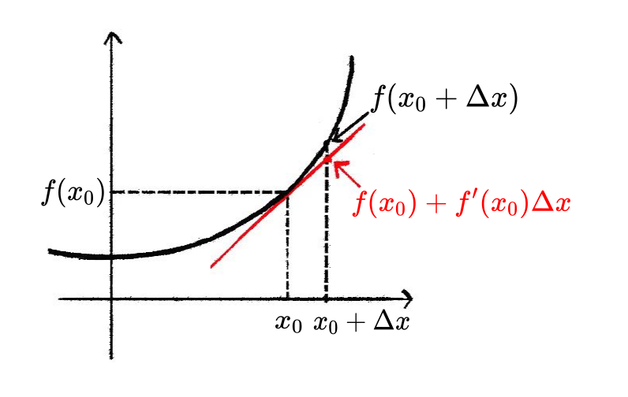

# 微分

> [!tip]
>
> 上一章我们通过极限给出了**导数的定义**, 并指出导数的几何意义是函数某一点处**切线的斜率**. 通过计算函数切线的斜率, 我们可以判断函数的增减性及其极值.
>
> 本章我们将介绍**微分**的概念, 并揭示微分与导数之间的朴实却深刻的联系. 微分是微积分的核心思想, 将在后续的课程中贯穿始终.
>

## 微分的概念

> [!tip]
>
> **微分 (differential)** 的意思是 **无穷小的改变量 (infinitesimally small change)**, 莱布尼茨为微分创立了其专属符号 "$d$", 例如 $dx$ 表示变量 $x$ 的微分, $dy$ 表示变量 $y$ 的微分. 与之对应的, 物理上经常用 $\Delta x$ 表示一个很小的改变量, 比如一小段位移. 直观上看, $\Delta x$ 和 $dx$ 想传达的意思很相近, 都是**很小的量**, 但是在数学上它们是有区别的.
>
> - $\Delta x$ 表示一个非常小但**固定的数**.
>
> - $dx$ 则表示一个"无穷小量", 它不再是一个固定的数, 而是蕴含了某个**极限过程**.
>

> [!tip]
>
> 如图, 考虑一个做直线运动的物体, 它在经过一小段时间 $\Delta t$ 之后位移的变化量为 $\Delta s = s(t +\Delta t) - s(t)$. 此时我们考虑 $\Delta t \to 0$ 的极限, 就得到**时间的微分** $dt$ 以及对应的**位移的微分** $ds$.
>
> 

> [!tip]
>
> 如图, 从原点位置以角度 $\theta$ 发射一束激光, 设激光与直线 $y = b$ 的交点坐标为 $(x, b)$. 如果我们将发射角做一个微小的改变 $\Delta \theta$, 与之对应的激光光斑的位置会在 $x$-轴方向上发生了一个 $\Delta x$ 的偏移. 此时我们考虑 $\Delta \theta \to 0$ 的极限, 就得到**角度的微分** $d\theta$ 以及对应的**x的微分** $dx$.
>
> 
>

### 微分与导数

> [!tip]
>
> 在研究实际问题的时候, 我们经常关心两个微分之间的关系. 例如, 设想我们需要控制一个机械手臂在黑板上画图, 粉笔移动一个小位移, 机械臂的各个关节也要相应的移动一个小量. 我们可以把关节移动的小量认为是 $dx$, 粉笔移动的小量认为是 $dy$. 很多时候我们关心两个微分之间的联动关系, 比如在机器人控制领域, 给定 $dx$ 计算 $dy$ 叫做**正动力学**, 给定 $dy$ 计算 $dx$ 叫做**逆动力学**. 又比如在例1中 $dx$ 与 $dt$ 的关系反映了物体的位移随时间的变化关系; 例2中 $dx$ 与 $d\theta$ 的关系反映了激光光斑的位置随发射角度之间的变化关系, 这些都是物理中所关心的量.
>
> 那么如何确定两个微分之间的关系呢? 如果我们能够写出两个变量之间所满足的**函数关系**, 很容易就可以得到这两个变量所对应的微分之间的关系, 这是**微分学**的一个重要成就.

> [!important: 微分与导数的关系]
>
> 一般的, 假定两个变量 $x$, $y$ 满足函数关系 $y = f(x)$, 则 $dy = f'(x) dx$.

::: {.exercise id="chpt3-ex-001"}
:::

::: {.exercise id="chpt3-ex-002"}
:::

> [!warning]
>
> 接下来我们结合导数的定义来理解微分公式. 在上一章中, 我们曾从函数图像切线的角度出发, 借助极限给出导数的定义:
>
>$$
> f'(x) = \lim_{\Delta x \to 0} \frac{f(x + \Delta x) - f(x)}{\Delta x}.
>$$
>
> 上式的分子就是 $\Delta y$. 因此形式上我们有
>
>$$
> f'(x) = \lim_{\Delta x \to 0} \frac{\Delta y}{\Delta x} = \frac{dy}{dx}
>$$
>
>
> 由此可见, 当 $\Delta x \to 0$ 时, 差分商 $\displaystyle\frac{\Delta y}{\Delta x}$ 的极限正是微分之商 $\displaystyle\frac{dy}{dx}$.
>
> 在微积分的逻辑体系内, $\displaystyle\frac{dy}{dx}$ 最初是一个整体符号代表导数. 事实上, 我们也常用符号 $\dfrac{dy}{dx}$ 表示导数, 常见的表达方式包括:
>
>$$
> \frac{dy}{dx} \sim y'(x)
>$$
>
>$$
> \frac{df(x)}{dx} \sim f'(x)
>$$
>
>$$
> \left. \frac{df(x)}{dx} \right\rvert_{x = x_0} \sim f'(x_0)
>$$
>
> 但这里我们形式上将 $dx$ 和 $dy$ 作为独立的“微分”概念, 从而将导数的定义式
>
>$$
> \frac{dy}{dx} = f'(x)
>$$
>
> 变形成等式
>
>$$
> dy = f'(x) dx
>$$
>

> [!important]
>
> 微分公式表明函数值 $y$ 的微分与自变量 $x$ 的微分呈线性关系, 它的背后体现了**化曲为直**的思想, 具体体现在
>
>$$
>\begin{align*}
> &\boxed{dy = f'(x_0) dx} \\
> &\quad \downarrow \\
> &\boxed{\Delta y \approx f'(x_0) \Delta x} \\
> &\quad \downarrow \\
> &\boxed{f(x_0+ \Delta x) - f(x_0) \approx f'(x_0) \Delta x} \\
> &\quad \downarrow \\
> &\boxed{f(x_0+ \Delta x) \approx f(x_0) + f'(x_0) \Delta x}
> \end{align*}
>$$
>
> 
>
> 最后一个公式说明, 函数在 $x_0$ 附近可近似看作一条过点 $(x_0, f(x_0))$, 斜率为 $f'(x_0)$ 的**直线**. **在局部用一条直线来近似函数**也就是所谓的**化曲为直**, 这是微积分中一个极其重要的思想.
>

> [!warning]
>
> 基于微分符号所建立的导数定义与运算规则非常直观, 在后续课程中, 我们将进一步领略**微分**思想的强大力量, 并体会良好符号系统为数学带来的美感与实用价值.

## 借助微分计算导数

> [!tip]
>
> 借助微分的思想和符号可以帮助我们去处理更加复杂的求导运算, 包括复合函数求导和隐函数求导.
>

### 复合函数求导的链式法则

> [!tip]
>
> 非常重要!
>

> [!important: 链式法则 (Chain Rule)]
>
> 若函数 $y = f(u)$ 在点 $u = g(x)$ 可导, 且 $u = g(x)$ 在点 $x$ 可导, 则:
>$$
> [f(g(x))]' = f'(g(x)) g'(x)
>$$
>
> 基于微分的思想, 链式法则可以直观的理解为: 分子分母同时乘以无穷小量 $du$, 得到
>
>$$
> \frac{dy}{dx} = \frac{dy}{du} \cdot \frac{du}{dx}.
>$$

::: {.exercise id="chpt3-ex-003"}
:::

::: {.exercise id="chpt3-ex-004"}
:::

::: {.exercise id="chpt3-ex-005"}
:::

::: {.exercise id="chpt3-ex-006"}
:::

::: {.exercise id="chpt3-ex-007"}
:::

::: {.exercise id="chpt3-ex-008"}
:::

::: {.exercise id="chpt3-ex-009"}
:::

### 隐函数求导

> [!tip]
>
> 隐函数将自变量 $x$ 和函数值 $y$ 通过某个等式联系起来, 从这个等式里我们可以推测 $dy$ 和 $dx$ 之间的关系, 一些复杂的函数的导数通过隐函数更容易计算.

::: {.exercise id="chpt3-ex-010"}
:::

::: {.exercise id="chpt3-ex-011"}
:::

::: {.exercise id="chpt3-ex-012"}
:::

### 反函数求导

> [!tip]
>
> 反函数求导可以看作是隐函数求导的特例.
>

::: {.exercise id="chpt3-ex-013"}
:::

::: {.exercise id="chpt3-ex-014"}
:::

::: {.exercise id="chpt3-ex-015"}
:::

::: {.exercise id="chpt3-ex-016"}
:::

### 更多的高阶导数计算

> [!tip]
>
> 微分的思想也可以帮助我们来理解和计算高阶导数, 结合链式法则, 我们可以进行更加复杂的计算.
>

> [!caution: 常用记号]
>
> - $f'(x)$, $f''(x)$, $f'''(x)$, $f^{(n)}(x)$, $\cdots$.
> - $\displaystyle \frac{d}{dx}f(x)$, $\displaystyle \frac{d^2}{dx^2}f(x)$, $\displaystyle \frac{d^3}{dx^3}f(x)$, $\displaystyle \frac{d^{n}}{dx^{n}}f(x)$, $\cdots$.
>

::: {.exercise id="chpt3-ex-017"}
:::

::: {.exercise id="chpt3-ex-018"}
:::

::: {.exercise id="chpt3-ex-019"}
:::

> [!tip]
>
> 最后我们回过头来看一下图2中所给出的例子. 上面我们已经得到
>$$
> dx = -b \frac{1}{\sin^2 \theta}d\theta, \quad dl = -b \frac{\cos \theta}{\sin^2 \theta}d\theta
>$$
>
> 如果我们希望计算 $dx$ 与 $dl$ 的关系, 即 $\dfrac{dx}{dl}$, 可以采用以下两种方法:
>
> **方法一: 建立 x 与 l 的显式函数关系**
>
> 由 $l = \dfrac{b}{\sin \theta}$ 可得 $\sin \theta = \dfrac{b}{l}$, 代入 $x = \dfrac{b}{\tan \theta} = b\dfrac{\cos \theta}{\sin \theta}$ 得:
>$$
>\begin{aligned}
>x &= b \cdot \frac{\cos \theta}{\sin \theta} \\
>& = b \cdot \frac{\sqrt{1 - \sin^2 \theta}}{\sin \theta}\\
>& = b \cdot \frac{\sqrt{1 - (b/l)^2}}{b/l} \\
>& = l \cdot \sqrt{1 - \left(\frac{b}{l}\right)^2}
>\end{aligned}
>$$
>
> 对 $l$ 求导得:
>$$
>\begin{aligned}
>\frac{dx}{dl} &= \sqrt{1 - \left(\frac{b}{l}\right)^2} + l \cdot \frac{1}{2\sqrt{1 - (b/l)^2}} \cdot \frac{2b^2}{l^3}\\
>& = \frac{1}{\sqrt{1 - (b/l)^2}} \\
>& = \frac{1}{\cos \theta}\
>\end{aligned}
>$$
>
> 因此 $dx = \dfrac{1}{\cos \theta} dl$.
>
> **方法二: 直接利用微分之比**
>
> 由 $dx$ 和 $dl$ 的表达式直接相除:
>$$
>\frac{dx}{dl} = \frac{-b \frac{1}{\sin^2 \theta}d\theta}{-b \frac{\cos \theta}{\sin^2 \theta}d\theta} = \frac{1}{\cos \theta}
>$$
>
> 同样得到 $dx = \dfrac{1}{\cos \theta} dl$.
>
> 两种方法结果一致, 但第二种方法通过直接操作微分, 避免了复杂的函数关系和求导过程, 显示了微分运算的简洁性与灵活性. 在实际问题中, 灵活运用微分关系可以大大简化计算, 这正是微分思想的强大之处.

## 借助微分计算极限

> [!tip]
>
> 借助微分的思想和符号还可以帮助我们去理解一个较为实用的求极限方法: 洛必达法则.

### 洛必达法则

> [!important]
>
> **洛必达法则**是用于计算在不定形式 (未定式, 即: $\displaystyle\frac{0}{0}$或$\displaystyle\frac{\infty}{\infty}$) 下极限的有力工具.
>
> 如果函数 $f(x)$ 和 $g(x)$ 在点 $x=c$ 的某个邻域内可导, 且在该点附近有:
>
> - $f(c) = 0$ 且 $g(c) = 0$ (或 $f(x)$ 和 $g(x)$ 的极限趋于 $\infty$).
> - $g'(x) \ne 0$.
>
> 那么
>
>$$
>\lim_{x\rightarrow c} \frac{f(x)}{g(x)} = \lim_{x\rightarrow c} \frac{f'(x)}{g'(x)},
>$$
>
> 前提是后者的极限存在.
>
> **注意**: 有时可能需要多次应用洛必达法则, 特别是当 $\displaystyle\frac{f'(x)}{g'(x)}$ 仍然是 $\displaystyle\frac{0}{0}$ 或 $\displaystyle\frac{\infty}{\infty}$ 的形式时.
>

> [!warning]
>
> 下面我们借助微分的思想来理解洛必达法则.
>
> 当 $x$ 充分接近 $c$ 时, 我们可以用函数的线性近似 (即微分) 来替代原函数. 由于 $f(c) = g(c) = 0$, 在点 $c$ 附近有:
>
>$$
>f(x) \approx f(c) + f'(c)(x - c) = f'(c)(x - c)
>$$
>
>$$
>g(x) \approx g(c) + g'(c)(x - c) = g'(c)(x - c)
>$$
>
> 因此, 原比式的极限可近似表示为:
>
>$$
>\frac{f(x)}{g(x)} \approx \frac{f'(c)(x - c)}{g'(c)(x - c)} = \frac{f'(c)}{g'(c)}
>$$
>
> 当 $x \to c$ 时, 这一近似将趋于精确. 这正是洛必达法则的直观含义——在极限过程中, 分子与分母的**变化趋势**由它们在该点的导数之比决定.
>
> 对于 $\infty/\infty$ 型未定式, 虽然不能直接使用上述推导, 但微分思想仍然适用: 此时我们比较的是 $f(x)$ 与 $g(x)$ 在 $x \to c$ 过程中的**相对变化速率**, 而导数正是刻画这种瞬时变化率的工具.
>
> 需要强调的是, 上述推导仅为理解洛必达法则提供了直观的几何图像. 严格证明需依赖**柯西中值定理**, 该定理能够将 $\dfrac{f'(c)}{g'(c)}$ 替换成 $\dfrac{f'(\xi)}{g'(\xi)}$, 其中 $\xi$ 位于 $x$ 与 $c$ 之间, 从而得到使用起来更加灵活的洛必达法则. 这部分内容我们放在了后面的章节中.

::: {.exercise id="chpt3-ex-020"}
:::

::: {.exercise id="chpt3-ex-021"}
:::

::: {.exercise id="chpt3-ex-022"}
:::

::: {.exercise id="chpt3-ex-023"}
:::

::: {.exercise id="chpt3-ex-024"}
:::

::: {.exercise id="chpt3-ex-025"}
:::

::: {.exercise id="chpt3-ex-026"}
:::

::: {.exercise id="chpt3-ex-027"}
:::

::: {.exercise id="chpt3-ex-028"}
:::

::: {.exercise id="chpt3-ex-029"}
:::

> [!warning]
>
> 后面的章节中, 我们会介绍更加强大的计算极限的工具---泰勒展开. 而泰勒展开体现的也是微分的思想.