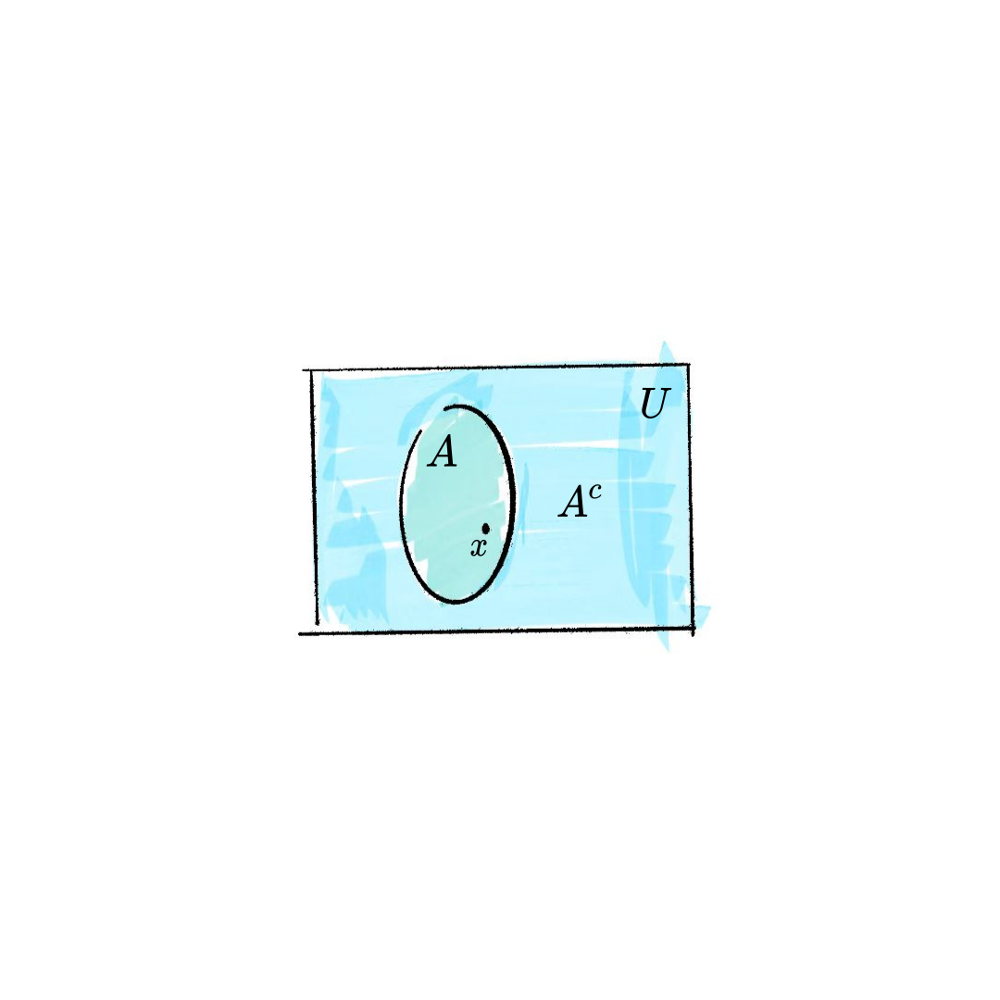
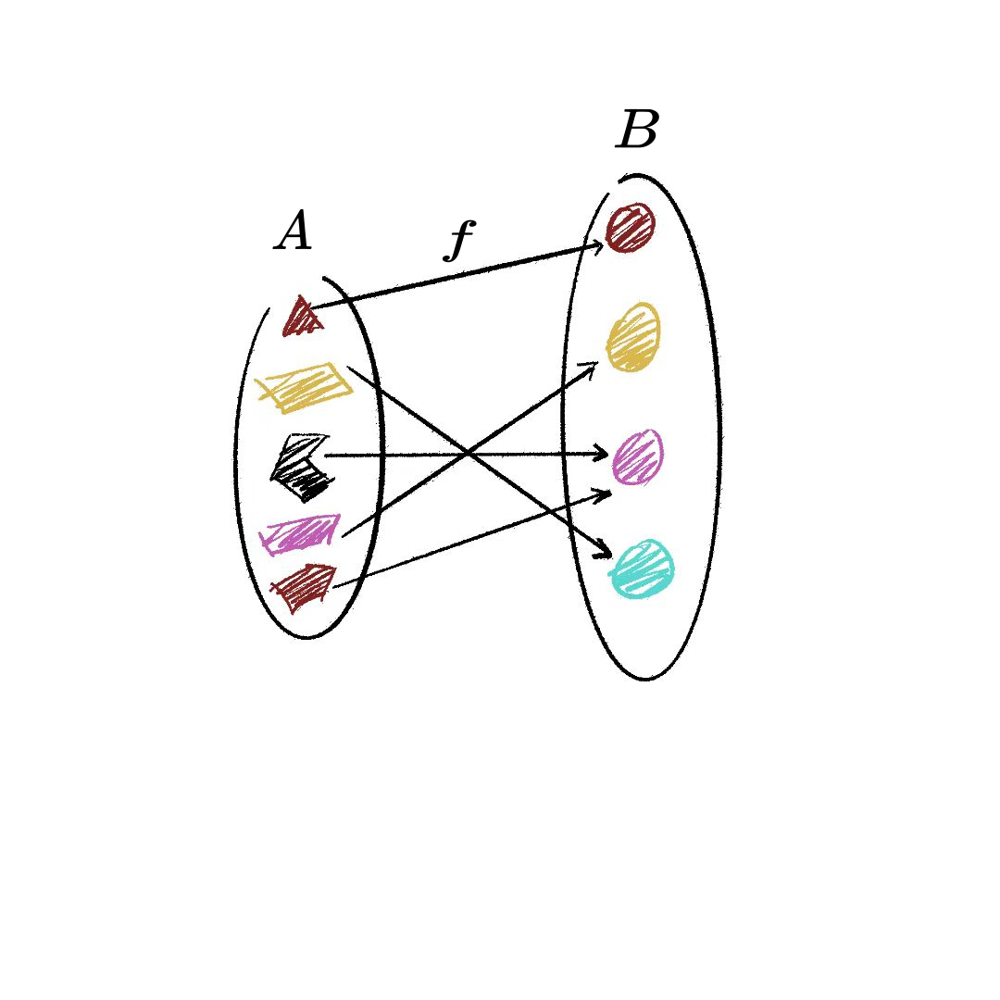
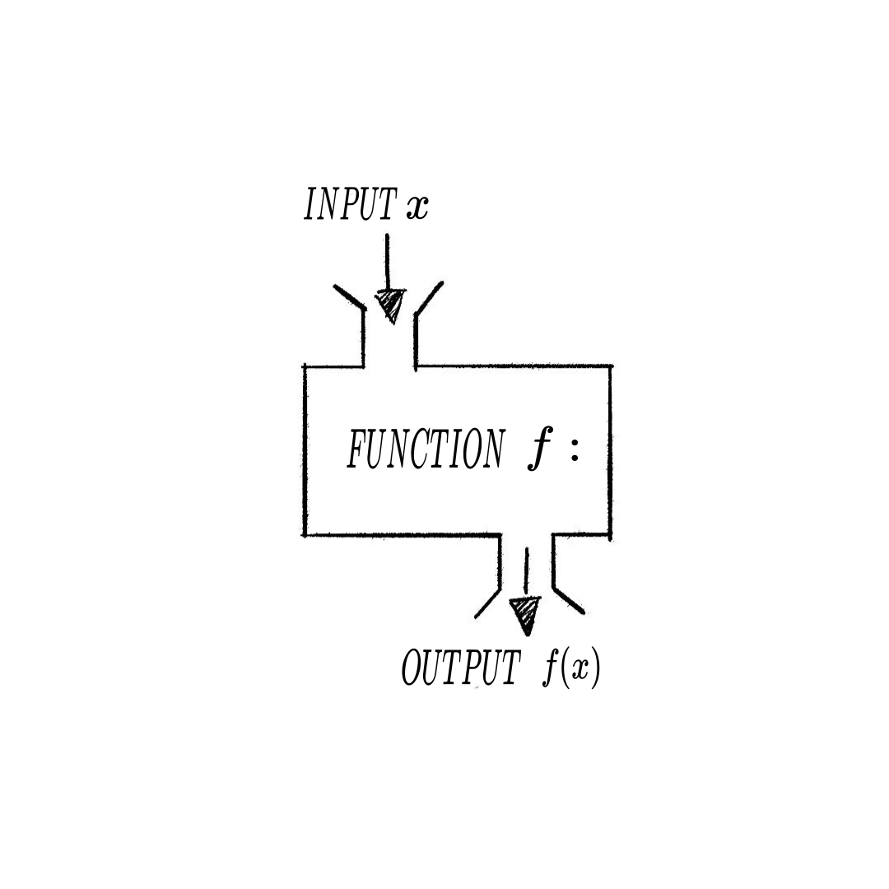
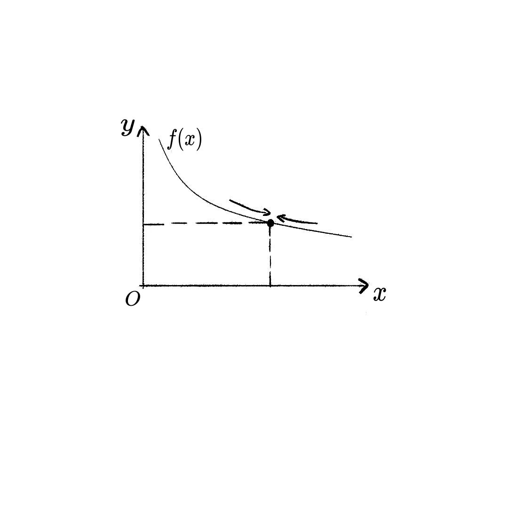

[toc]

# 极限

> [!tip] 
> 微积分是本课程的核心内容, 而极限则是微积分中的核心概念. 极限的概念很直观, 但经过数学的严格化后会变得非常抽象. 可以说极限的公理化是一道门槛, 是我们从中学的初等数学迈向大学的高等数学的必经之路. 要学好极限并不容易, 这里面涉及从有限到无穷的观念转变. 我们会发现这条路一开始会辗转反复, 让人晕头转向, 但是当你学完这门课程再回头来看, 会发现这么做是值得的, 数学概念的严格化其实不是在追求外表的精美, 而是让我们的内心变得更加的强大, 使我们有力量走得更远. 那么, 我们深呼吸一下, 一起敲开通向高等数学的大门吧.


## 集合与映射

> [!tip]
>
> ==集合与映射是数学研究从具体到抽象的第一步.==
>
> 举个例子, 比如我们上这门高数课, 最后需要给每个上课的学生一个成绩. 为了从数学上来更加严格的定义这个任务, 我们可以把所有选课的同学构放到一个**集合** $S$ 中, 同时把所有可能的成绩 (比如A, B, C, D四个档次) 放到另一个**集合** $G$ 中, 那么给学生成绩的这个任务在数学上就可以看成是**从集合 $S$ 到集合 $G$ 的一个映射**. 引入集合和映射的概念可以让一个问题变得更清晰, 更严格.
> 
> 
>

### 集合
#### 集合的概念

> [!TIP]
> 
> 当我们用**数学语言**来描述世界时, 首先要把我们**感兴趣的对象**给拿出来, 进行适当的抽象, 然后再研究它们的规律. **集合**就是数学中用来界定对象的一个概念.
> 

> [!Note]
> 
> ==集合举例==
>
> 1. *`太阳系八大行星`* --- $\{水星, 金星, 地球, 火星, 木星, 土星, 天王星, 海王星\}$
> 2. *`10个阿拉伯数字`* --- $\{0, 1, 2, 3, 4, 5, 6, 7, 8, 9\}$
> 3. *`一个班所有男生的姓氏`* --- $\{李, 王, 张, 杨, 周, 诸葛, 徐, 孙, 胡\}$
> 4. *`1 ~ 10 之间的所有偶数`* $A=\left \{  2,4,6,8,10\right \} $
> 6. *`自然数集`* --- $\mathbb{N} = \left\{0, 1, 2, 3, \cdots \right\}$
> 7. *`整数集`* --- $\mathbb{Z} = \left\{0, \pm 1, \pm 2, \pm 3, \cdots \right\}$
> 8. *`实数集`*  --- $\mathbb{R} = \left\{x: -\infty < x < \infty \right\}$
> 9. *`满足不等式 x-3<10 的所有实数 x`* --- $A=\left \{x < 7\right \} $

> [!Important]
>
> 我们把所要研究的对象统称为**元素** (element), 这些元素所组成的总体叫做**集合** (set). 
>
> 描述集合的方式既可以通过文字叙述, 也可以把所有的元素写在 $\{\}$ 里面, 不管用那种方式, 一定要让人能够判断某个对象是不是在这个集合里.
>
> 集合需要满足下面两个性质: 
>
> 1. ###### **互异性**: 集合中的任何两个元素都是不同的. 比如在集合3的例子中, 即使这个班里有3个同学姓“王”, 在集合3中“王”姓也只出现一次, 重复的不算.
>
> 2. **无序性**: 集合中的元素没有顺序之分. 所以集合 $\{水星, 金星, 地球\}$ 与集合 $\{地球, 水星, 金星\}$ 是没有区别的.
>

> [!Caution]
>
> 一般用大写字母如 $A, B, C$ 表示集合, 用小写字母如 $x$ 或 $a, b, c$ 来表示集合中的元素.
>
> 我们说一个对象**在**或**不在**一个集合中, 用数学术语就是**属于**或**不属于**: 
>
> - 如果 $x$ 是集合 $A$ 的元素, 就说 $x$ **属于** 集合 $A$ , 记作 $x\in A$ ; 
> - 如果 $x$ 不是集合 $A$ 中的元素, 就说 $x$ **不属于** 集合 $A$, 记作 $a \notin A$.

> [!Warning]
> 
> ==图像掩码 (mask)==
> 
> **图像掩码**是计算机视觉中的重要概念. 掩码 (mask) 通常是一个二值 (0或1) 图像, 像素值为0表示不关心的区域, 1表示感兴趣的区域. 因此**所有像素值为1的像素点构成的集合**就是我们感兴趣的区域 (ROI, Region of Interest). 比如下图中, 左侧是我们拿到的一张图片 , 我们只关心图片中狗的区域, 因此对应的掩码就是中间的一个二值图像 (黑色区域的像素值为0, 白色区域的像素值为1), 将这个掩码逐像素的跟原图相乘, 得到的结果就是右边的这张只有狗的图 (狗所在部分的值跟原图一样, 之外部分的值都等于0).
>
> 
> 

#### 集合的性质

> [!TIP]
> 
> 集合是一个包罗万象的容器, 不同的集合可能包含截然不同对象, 我们在研究集合的时候, 首先要搞清楚**集合内部元素的性质**.
> 

> [!important]
>
> ==有序性==
>
> 如果一个集合中的元素可以排序, 那么这个集合就是**有序集**, 否则就是**无序集**. 
>
> 注意这个并不是一个严格的数学定义, 即使在实际操作中也是模糊的, 比如集合 $\{红, 绿, 蓝\}$, 理解成三个汉字的话可能无法排序, 但理解成颜色所对应的波长则可以间接的通过波长大小进行排序. 所以关键的问题是, 你在建立这个集合时所关心的**具体问题**是什么. 我们在使用集合这个工具的时候一定要先想清楚这一点, 这很重要, 尤其是对于学习**编程**_~Rd~_的同学！例如, 在程序里, 有序集通常可以使用**array**数据结构, 其中的元素可以通过指标很方便的访问；而无序集则往往使用**set**数据结构, 其中的元素需要一个一个去比较.
>

> [!Note]
>
> ==有序性和无序集==
> 
> 下面的集合中的元素之间通常是可以比较大小, 如: 
>
> - 实数集 $\mathbb{R}$
> - 音阶集 $\{ 哆, 来, 咪, 发, 嗦, 啦, 西\}$
> 
> 下面的集合中的元素之间通常无法比较大小(至少没有显而易见的比较大小的规则), 如: 
>
> - 天气集 $\{ 天晴, 多云, 下雨, 雾霾\}$ 
> - 动物集 $\{ 猫, 狗, 牛, 马\}$
> 

> [!Important]
> 
> ==等价关系==
> 
> 如果我们能够在一个集合上定义某种**等价关系**, 那么凡是“等价”的元素都可以划分到一个子集中, 而这些子集也被称为**等价类**. **等价关系**是集合元素间的一种二元关系, 以符号 $\sim$ 表示, 它满足以下三个条件: 
>
> 1. **自反性**: 对于所有 $a \in A$, 有 $a \sim a$.
> 2. **对称性**: 对于所有 $a, b \in A$, 如果 $a \sim b$, 则 $b \sim a$.
> 3. **传递性**: 对于所有 $a, b, c \in A$, 如果 $a \sim b$ 且 $b \sim c$, 则 $a \sim c$.

> [!Note]
>
> ==等价关系==
>
> - 整数集 $ℤ$ 模 2 的等价关系: 如果 $a, b$ 除 2 的余数相等则 $a$ 和 $b$ 等价. 在该等价关系下, 所有偶数 (除2余0) 构成了一个等价类, 所有奇数 (除2余1) 构成了另一个等价类.
> - 记某个班全体同学构成的集合为 $A$, 按照座位我们规定, 如果 $a, b$ 两位同学坐在同一列则 $a$ 和 $b$ 等价. 在该等价关系下, 每一列的同学构成一个等价类. 老师就经常利用上述等价关系对同学进行分组或收发作业.

> [!Important]
> 
> ==一些常用的集合性质==
> 
> - 有限集 (有穷集) : 含有有限个元素的集合, 如 $\{ 2, 4, 5, 8\}$.
> - 无限集 (无穷集) : 含有无穷多个元素的集合, 如自然数集 $\mathbb{N}$.
> 
> **数集**中常用的性质还有
> 
> - 有界集: 集合中的所有元素 $x$ 的绝对值都小于 $M$, 如开区间 $(0, 1)$.
> - 无界集: 如 $(0, +\infty)$.

#### 集合之间的关系

> [!TIP]
> 
> 集合 $A$ 和 $B$ 之间能不能进行比较?有没有大小关系? 例如, 如何通过数学的语言来描述一个班全体男生构成的集合 $A$, 全体女生构成的集合 $B$, 以及全班所有同学构成的集合 $C$ 之间的关系呢?

> [!IMPORTANT]
>
> ==两个集合间的包含关系==
>
> 如果集合 $A$ 中**任意**_~Rd~_一个元素都是集合 $B$ 中的元素, 则称 $A$ **包含于** $B$ (或 $B$ **包含**$A$), 记作 $A\subseteq B$ 或 $B\supseteq A$, 此时称 $A$ 为 $B$ 的 **子集** (subset). 
> 
> 基于集合的包含关系我们再引入两个概念: 
> 1. **空集**: 不包含任何元素的集合叫做 **空集** (emptyset), 记为 $\phi $, 空集是任何集合的子集.
> 2. **集合相等**: 如果 $A\subseteq B$, 同时 $B\subseteq A$, 则集合 $A$, $B$ 中的元素是完全一样的, 此时我们说集合 $A$ 等于集合 $B$, 记作$A=B$.
> 
> 在上面的例子中, 全体男生构成的集合 $A$ 包含于全班同学构成的集合 $C$, 全体女生构成的集合 $B$ 也包含于集合 $C$, 但是 $A, B$ 之间没有包含与被包含的关系.

> [!Caution] 
> ==借助图像表示集合间的包含关系==
> 
> 集合 $A$ 包含于集合 $B$ 可以用下图表示
> 
>  

> [!Note]
> 
> 下面例子中的 $A$ 和 $B$ 存在包含关系:
> 
> 1. $A=\left\{ 1,2,3 \right\},$  $B=\left\{1,2,3,4,5\right\}.$
> 2. $A$ 为所有等腰三角形, $B$ 为所有三角形.
> 
> 下面例子中的 $A$ 和 $B$ 不存在包含关系 (找反例: 是否能找到 $A$ 中的一个元素, 使其不在 $B$ 中):
> 
> 1. $A=\left\{ 1,2,6 \right\}$, $B=\left\{1,2,3,4,5\right\}$.
> 2. $A$ 为所有等腰三角形, $B$ 为锐角三角形.
> 

#### 集合之间的运算

> [!TIP]
> 
> 集合 $A$ 和 $B$ 之间能不能做运算? *`加`* *`减`*法是没有的, 但是有*`交`* *`并`* *`补`*运算. 

> [!Important]
> 
> ==交集==
> 
> 所有既属于 $A$ 又属于 $B$ 的元素组成的集合称为 $A$ 与 $B$ 的 **交集** (intersection set), 记作 $A\cap B$ (读作“$A$ 交 $B$”), 即
> 
> $$
> A\cap B=\left \{ x: x\in A \ \mathrm{and} \ x\in B \right \}
> $$
> 
> 下图展示了交集运算: 
> 
> 

> [!Note]
> 1. $A=\left\{2, 4, 6, 8, 10 \right\}$, $B=\left\{ 3, 5, 8, 12 \right\}$,  则 $ A \cap B =\left\{ 8 \right\}$. 
> 2. $A=\left \{全校女同学 \right \} $, $B=\left \{所有高一级同学 \right \} $,  $A \cap B = \left \{ 高一级全体女同学 \right \}$.

> [!important]
> 
> ==并集==
>
> 所有属于集合 $A$ 或属于集合 $B$ 的元素组成的集合, 称为集合 $A$ 与 $B$ 的 **并集** (union set), 记作 $A\cup B$ (读作“ $A$ 并 $B$ ”), 即
> 
> $$
> A\cup B=\left \{ x: x\in A \ \mathrm{or} \ x\in B \right \}
> $$
> 
> 下图展示了并集运算: 
> 
> 
> 

> [!Note]
> 
> 1. $A=\left \{ 1,3,5 \right \} $, $B=\left \{ 2,4,6 \right \} $, $A \cup B=\left \{ 1,2,3,4,5,6 \right \} $；
> 2. $A=\left \{有理数 \right \} $, $B=\left \{无理数 \right \} $, $A \cup B=\left \{实数 \right \} $.

> [!Important]
> 
> ==补集==
> 
> 如果集合 $A$ 是集合 $B$ 的子集, 则所有 $B$ 中不属于 $A$ 的所有元素构成的集合称为 $A$ 相对于 $B$ 的 **补集** (complementary set), 记作 $C_BA$ 或 $A^C$, 即
> 
> $$
> \bar{A} = C_B A = \{x \in B: \ x\notin A\}
> $$
> 
> 下图展示了补集运算: 
> 
> 

> [!Note]
> 
> 1. $A=\left \{ 1,3,5 \right \} $, $B=\left \{ 1,2,3,4,5,6 \right \} $, $C_BA = \{ 2, 4, 6\}$.
> 2. $A=\left \{有理数 \right \} $, $B=\left \{ 实数 \right \} $, $C_BA = \{无理数\}$.

> [!Warning]
>
> ==图像掩码与集合的交集==
>
> 假设在一个图像里面我们有两个感兴趣的区域集合 $A$ 和集合 $B$, 分别对应掩码 $M_A$ 和 $M_B$, 则集合 $A \cap B$ 对应的掩码可以通过逐像素相乘运算得到, 即 $ M_{A \cap B} = M_A * M_B$, 其中 $*$ 表示每个对应位置的像素分别相乘.
>
> *==掩码的交集==*
> ||||
> |:-:|:-:|:-:|
> |$M_A$|$M_B$| $M_{A \cap B}$|
>
> ==图像掩码中的集合并运算==
>
> 假设在一个图像里面我们有两个感兴趣的区域集合 $A$ 和集合 $B$, 分别对应掩码 $M_A$ 和 $M_B$, 则集合 $A \cup B$ 对应的掩码可以通过逐像素作“或”运算得到.“或”运算的符号为 $ \lor$, 运算规则为 
>
> $$
> 1 \lor 1 = 1, \ 1\lor 0 = 0 \lor 1 = 1, \ 0 \lor 0 = 0.
> $$
>
> 我们有 $ M_{A \cup B} = M_A \lor M_B$.
>
> *==掩码的并集==*
>
> || | |
> |:-:    |:-:    |:-:            |
> |$M_A$|$M_B$| set $M_{A \cup B}$|
>
> ==图像掩码与集合的补集==
>
> 如下图, 假设在一个图像里面我们有一个感兴趣的区域集合 $A$, 对应掩码 $M_A$, 则图像中我们不感兴趣的区域可以看成是集合 $A$ 在以整个图像为全集的补集 $C_{M}A $,  $C_{M}A $ 可以通过取反运算得到, 即 $ M_{C_{M}A} = \mathrm{NOT}(M_A)$, 其中 $\mathrm{NOT}$ 表示每个对应位置的像素分别取反运算($\mathrm{NOT}(0) = 1, \mathrm{NOT}(1) = 0$).
>
> *==掩码的补集==*
> |||
> |:-:|:-:|
> |$M_A$|$M_{C_{M}A}$|


> [!Warning]
> 
> ==训练集和测试集==
> 
> **训练集和测试集**是机器学习中常见的两个集合. 假设我们手中有一个包含1000张图像的数据集, 我们通常会将这些图像分成两个不相交的部分: 一部分用来训练模型 (称为训练集), 另一部分用来评估模型性能 (称为测试集). **训练集是图像全集的一个子集**, 同样, 测试集也是全集的一个子集, 但它们**没有交集**——也就是说, 一个图像不能同时出现在训练集和测试集中. 这种划分就是集合的一个典型应用: 给定全集 $A$, 我们从中选出两个不相交的子集 $B$ 和 $C$, 满足 $A = B \cup C$ 且 $B \cap C = \emptyset$. 在实际应用中, 我们通常用70%的图像作为训练集, 30%的图像作为测试集, 也就是说我们从集合的角度划分数据, 保证模型的训练与测试在**不同的样本**上进行, 从而更好地评估模型的泛化能力.


### 映射

> [!TIP]
>
> 前面所讲的**集合**的概念是为了给**映射**做铺垫. 映射是集合与集合之间的关联, 集合对数学就好像计算机中的**键盘**, 无非就是100多个键; 而映射对数学就好像计算机中的**程序**, 变幻无穷. 
>
> 回到我们之前给学生打分的例子, 为了更加合理的给学生打分, 我们可以把学生努力的程度转化成数值, 然后把分数对应成绩点, 从而把打分的问题变成了一个从数到数的映射, 也就是**函数**. 可以看到函数是用来解决具体问题的一个很方便的工具.
>
> 
>

#### 映射的概念

> [!Important]
> 
> ==映射的定义==
> 
> 映射 (map) 描述了从一个集合到另一个集合的某种对映关系. 设集合 $A$ 和 集合 $B$ 是两个集合, 如果存在一个对映关系 $f$, 使得集合 $A$ 中的每个元素都唯一的对映到 $B$ 中的一个元素, 则称 $f$ 为从 $A$ 到 $B$ 的映射, 记作
> $$
> f: A \rightarrow B
> $$
>
> 映射 $f$ 把集合 $A$ 中的元素 $a$ 对映到 $B$ 中的元素 $b$, 可记作
> $$
> f(a) = b
> $$
> 此时 $b$ 称为 $a$ 的**象**, $a$ 称为 $b$ 的**原象**.
>
> 映射可以通过下面的图像来理解: 
>
> 
> 
> 图中箭头表示了集合 $A$ 中元素与集合 $B$ 中元素的对映关系. 
> 
> 根据定义, 映射需要满足两个要求: **随处取值, 唯一对映**.
>
> - **随处取值**是指 $A$ 中的任何一个元素在 $B$ 中都有对映；
> - **唯一对映**是指 $f$ 可以把 $A$ 中的不同元素映射到 $B$ 中的同一个元素, 但不能把 $A$ 中的一个元素映射到 $B$ 中的多个元素.

> [!Caution]
>
> ==映射的性质==
>
> 1. **单射**：如果 $A$ 中的每个元素都对映 $B$ 中的不同元素, 则称 $f$ 为单射.
> 2. **满射**：如果 $B$ 中的每个元素都有原象, 则称 $f$ 为满射.
> 3. **一一映射**：顾名思义, 一一映射就是集合 $A$ 中元素与集合 $B$ 中的元素一个对映一个.
> 可以证明, $f$ 是一一映射等价于 $f$ 既是单射又是满射.
>
> ==逆映射==
>
> 对于一一映射 $f: A \rightarrow B $, 把映射的象和原象反过来, 得到一个把集合 $B$ 映射到集合 $A$ 的新的映射, 称为逆映射, 记作 $f^{-1}: B\rightarrow A$.

> [!Note]
> 
> ==映射的例子==
> 
> 映射的例子在我们的生活中随处可见, 例如：
>
> 1. **名字**：集合 $A$ 是所有的人, 集合 $B$ 是所有的名字. 每个人都有一个名字, 我们允许重名, 但不允许一个人有2个名字.
> 2. **地图**：没错, map 本身就是一个 map！(我们希望)这是一个从地图到真实世界的一一映射.
> 3. **颜色**：为什么我们能看到不同的颜色？颜色是一个从光波长到我们主观感受的映射.
> 
> 从上面的例子可以感受到, 映射的作用在于把集合 $A$ 中的元素作为**输入信号**, 例如如不同的人、GPS坐标、光的波长等, 经过某种操作, 转换成我们关心的输出, 如名字、位置和颜色. 从这个意义上理解, 映射就是就是把输入 $x$ 转化成 $f(x)$ 的一个机器.
> 
> 

> [!Caution]
>
> ==映射与函数==
>
> 映射的概念如此重要, 以至于在不同的场合映射还有不同的专业名称. 在计算机编程中, **函数**(function) 就是映射, 是一个从输入 (可以是数、数组、函数等）到输出 (也可以是数、数组、函数等）的一系列操作. 在数学里, 当集合 $A$ 和 $B$ 都是数集的时候, 映射也叫做**函数 **(function), 如函数 $f(x) = 2x+3$ 是一个从实数集到实数集的一个映射. 函数是高等数学上册的主要研究对象, 而多元函数 (从 $n$ 维实数空间到实数空间的映射, $n>2$ )则是高等数学下册的主要研究对象 (前面的给学生打分的例子可以进一步细化成一个多元函数, 也就是把平时, 期中, 期末和其它因素的成绩统一考虑, 然后映射到一个分数上).
>
> 

#### 数列

> [!TIP]
> 
> **数列**是一类特殊的映射, 它把自然数集 $\mathbb{N}$ 映射到实数集 $\mathbb{R}$ 中, 进一步, 这还是一个数到数的映射, 因此同时也是一个函数, 这个函数可以记作 $a(n)$, 不过更多的时候我们会把 $n$ 作为下标, 以 $a_n$ 表示数列得第 $n$ 项, 并以 $\{ a_n \} $ 表示整个数列.

---

> [!Note]
> ==等差数列==
> 
> - 首项为 $a_{1}$,  公差为 $d$ 的等差数列的**通项公式**为
>
> $$
> a_{n} =a_{1} +(n-1)d
> $$
>
> - 等差数列的**前 $n$ 项和**为
> $$
> \quad S_{n}=na_1+\frac{n(n-1)}{2}d
> $$

> [!Note]
> ==等比数列==
>
> - 首项为 $a_{1}$ , 公比为 $q$ 的等比数列的**通项公式**为
> $$
> a_{n}=a_{1} q^{n-1}
> $$
>
> - 等比数列的**前 $n$ 项和**为
> $$
> S_{n}=a_{1}\frac{1-q^n }{1-q} （q\ne 1)
> $$

#### 函数

> [!TIP]
>
> 函数是用数学解决实际问题的重要**工具**, 函数之于数学就像**程序**之于计算机. 
> 
> 学习函数的时候不要去跟冰冷的公式硬刚, 而应该把函数的图像放在心里, 产生画面感, 把公式具象化, 成为直觉的一部分. 因此, **函数的图像非常重要!**_~Rd~_

> [!important]
> 
> ==函数的定义==
>
> 从**数集** $A$ 到**数集** $B$ 的映射 $f:A \rightarrow B$ 称为**函数** (function). 可以把函数写成 $y = f(x)$ 的形式, 并把 $x$ 称为**自变量**, $y$ 称为 $x$ 对映的**函数值**.
> 

> [!note]
> 
> ==初等函数==
> 
> 1. 幂函数: $y=x^{\alpha}$
> 2. 指数函数: $y=a^x$, 特别的有 $y=\mathrm{e}^x$, 后者在 python 中有专门的函数 $numpy.exp(x)$
> 3. 对数函数: $y=\mathrm{log}_a^{x}$, 特别的有 $y=\mathrm{ln}^{x}$, 后者在 python 中有专门的函数 $numpy.log(x)$
> 4. 三角函数: $y=\sin(x)$, $y=\cos(x)$, $y=\tan(x)$
> 5. 反三角函数: $y = \mathrm{arcsin}(x)$
> 
> ==其它常用函数==
>
> 1. 绝对值函数: $y=|x|$
> 2. 符号函数
> $$
> y=\mathrm{sgn}(x)=\left\{\begin{matrix}
>  1, &  x>0& \\
>  0, &  x=0& \\
>  -1, &  x<0&
> \end{matrix}\right.
> $$
> 
> 3. Sigmoid函数
> $$
> \sigma (x)=\frac{1}{1+e^{-x}}
> $$

> [!Note]
> 
> ==函数的性质==
>
> - 单调性
> - 奇偶性
> - 周期性
> 

> [!Caution]
>
> ==反函数== 
>
> **反函数**是**逆映射**的一个特例, 对于函数 $f: x \rightarrow y$ (也要求 $f$ 是一一映射), 其反函数为 $f^{-1}: y \rightarrow x$.
>
> [!Note]
> - $y = 3x + 1$ 的反函数为 $y = (x-1)/3$
> - $y = \mathrm{e}^x$ 的反函数为 $y = \mathrm{ln}x$. 
>
> 反函数本质上是把 $x$ 和 $y$ 的顺序对调了一下, 因此不难发现原函数与反函数的图像是关于直线 $y = x$ 对称的.
> 
> 

> [!Caution]
> 
> ==复合函数==
> 
> 对于函数 $f$ 和 $g$, 我们可以构造一个**新的函数** $y = f[g(x)]$, 它把自变量 $x$ 通过函数 $g$ 映射到 $u = g(x)$, 再把 $u$ 视作自变量 (也称为**中间变量**) 通过函数 $f$ 映射到 $y = y = f[g(x)]$. 这个过程可以表示为:
> 
> $$
> x \stackrel{g}{\longrightarrow} u \stackrel{f}{\longrightarrow} y.
> $$
> 
> 我们把这个新函数 $y = f[g(x)]$ 称为函数 $f$ 和 $g$ 的**复合函数**, 记作 $f \circ g$. 注意函数复合是讲顺序的, 一般来说 $f\circ g \ne g\circ f$.
> 

> [!note]
> 
> 假设 $f(x) = x + 2$, $g(x) = x^2$, 则
> 
> $$
> \begin{align}
> f\circ g &= g(x) + 2 = x^2 + 2, \\
> g\circ f &= [f(x)]^2 = (x+2)^2. 
> \end{align}
> $$

> [!Warning]
>
> ==深度学习与复合函数==
>
>  
> 
> 人工智能中的核心技术为**深度学习**, 深度学习的背后其实就是有很多层 (从几十到几千层都有) 的**神经网络** (Neuron Network). 神经网络的本质正是复合函数. 对于图中所示的神经网络, 从最左端的**输入信号**开始, 之后每一层都是上一层信号的复合, 因此神经网络就是一个复合了很多次的函数, 这个函数把输入 (比如一张图片) 映射到我们关心的结果 (比如图像有猫还是狗的概率). 


## 极限

> [!TIP] 
> 
> **极限**是高等数学有别于初等数学的核心概念. 极限的出现代表了数学思想的一次转变, 而促成这一转变的动机来自于现实问题中对**曲线**相关问题的需求. 在初等数学中我们会计算矩形的周长和面积, 会计算三角形的周长和面积, 甚至是任意多边形的周长和面积, 但是, 这些都是由直线构成的结构, 而到了曲线大家就不会了. 曲线的长度怎么算? 由曲线构成区域的面积怎么算? 尽管我们初中就知道圆的周长是 $2\pi r$, 面积是 $\pi r^2$, 但是为什么是这样, 只有运用微积分才能给出严格的证明.
> 
> 如果我们拿西游记作为类比, 那初等数学就是**小乘佛法**, 可以修身养性, 而微积分则是**大乘佛法**, 可以普度众生. 数学史上, 微积分的确立历经了千难万险, 九九八十一难, 要说这里面的**孙悟空**之名, 我认为当属**牛顿**: 牛顿的时代还没有微积分, 正是他开创性的运用我们今天微积分中的各种思想和方法, 成功的解决了**天体运行理论** (注意天体运行的轨迹就是**曲线**), 开启了人类理性思潮的革命.
> 
> 今天, 我们将追随西天取经的足迹, 开启一场精神朝圣之旅. 一路上我们会经历重重磨难, 但最终我们会穿上牛顿的衣钵, 运用我们所学的微积分, 来推导**天体运行理论**, 揭示宇宙运行的奥义. 而**极限**_~Rd~_是我们西行路上的第一难, 这个**观念上的转变**是重要的, 我们一开始慢慢来, 好好的理解, 这个转变做得**越深刻越彻底**, 对以后的学习就越有帮助.

### 数列极限

> [!tip]
> 
> ==极限与圆的面积==
> 
> 圆的面积怎么算? 我们来看教材 P18 的例子. 这个例子体现了极限中从有限到无限再到极限的思想: 为了计算圆的面积, 我们构造了一**系列**圆的内接正多边形, 这些正多边形的面积是可以通过初等数学计算的, 我们把它们的面积记作 $A_n, n = 1, 2, \cdots$. 通过**直觉**我们能感受到, **当 $n$ 趋于无穷大时, $A_n$ 的面积会无限接近圆的面积**_~Rd~_. 接下来我们要做的就是**把这个直觉通过数学语言给严格化**. 
> 
>
> 
> 极限是一个**动中取静**_~Rd~_的过程. 
> 
> - 什么在动?
> 	在上面的例子中, 我们构造了一个数列 $\{ A_n \}$, 前面说过数列是个从自然数集 $\mathbb{N}$ 到实数集 $\mathbb{R}$ 的映射. 我们说的**动**发生在集合 $\mathbb{N}$ 中, 指标 $n$ 从 1, 2 直到 1千, 一万 ..., 这是**数列极限**概念中**动**的部分. 
> 
> - 什么是静?
> 	**数列极限**概念中**静**的部分来自于集合 $\mathbb{R}$ 中, 它表示 $A_n$ 的取值会慢慢**趋于稳定**, 到最后**几乎不变**了, 数学上我们称这种行为叫**收敛**. 
> 

> [!Note]
>
> ==极限存在的例子==
>
> **一尺之捶，日取其半 (版本1)**
> 
> 站在棒子的角度, 这个过程可以用一个数列描述. $n$ 代表天数, $a_n$ 代表杠剩下的长度.
>
> $$
> \begin{align*}
> a_0 &= 1,  \\
> a_1 &= 1/2,  \\
> a_2 &= 1/4,  \\
> & \cdots \\
> a_n & = 1/2^n, \\
> & \cdots
> \end{align*}
> $$
> 
> 随着 $n$ 的增加 (**动**), $a_n$ 的值不断靠近0 (**静**), 直觉告诉我们当 $n$ 区域无穷大时 $a_n$ 的极限是0.
>
> **一尺之捶，日取其半 (版本2)**
> 
> 站在砍棒人的角度, 这个过程也可以用一个数列描述. $n$ 代表天数, $b_n$ 代表到第 $n$ 天为止所取的棒子的总数.
> 
> $$
> \begin{align*}
> b_0 &= 0,  \\
> b_1 &= 1/2,  \\
> b_2 &= 1/2 + 1/4 = 3/4,  \\
> & \cdots \\
> b_n & = 1/2 + 1/4 + \cdots + 1/2^n = 1 - \frac{1}{2^n}, \\
> & \cdots
> \end{align*}
> $$
>
> 随着 $n$ 的增加 (**动**), $b_n$ 的值不断靠近1 (**静**), 直觉告诉我们当 $n$ 区域无穷大时 $b_n$ 的极限是1.
> 
> **P21 例1**
> 
> $$
> a_n = \frac{n + (-1)^{n-1}}{n}
> $$
> 
> 随着 $n$ 的增加 (**动**), $a_n$ 的值不断靠近1 (**静**), 直觉告诉我们当 $n$ 区域无穷大时 $a_n$ 的极限是1.
>
> **P22 例2**
> 
> $$
> a_n = \frac{(-1)^{n}}{(n+1)^2}, \\
> $$
> 
> 随着 $n$ 的增加 (**动**), $a_n$ 的值不断靠近0 (**静**), 直觉告诉我们当 $n$ 区域无穷大时 $a_n$ 的极限是0.

> [!Note]
> 
> ==极限不存在的例子==
>
> **例3**
>  
> 数列 $\{ 1, -1, 1, -1, \cdots\}$ 不收敛, 因为直觉告诉我们这个数列**静**不下来.
>
> **例4**
>  
> 数列 $\{ 1, 2, 3, 4, \cdots\}$ 不收敛, 这个数列不断增长, 直觉告诉我们这个数列也**静**不下来.

>**直觉**_~Rd~_: 所以数列 $\{a_n\}$ 有极限就是, 当 $n$ 足够大时, $a_n$ 的值无限接近某个数 $A$.

> [!important]
> 
> ==数列极限的定义== (非常重要!!!)
> 
> 设 $\{a_n\}$ 为一数列, $A$ 为一常数, 如果**对于任意给定的正数 $\varepsilon$**, **总存在正整数 $N$**, 使得当 $n>N$ 时有
> $$
> |a_n - A| < \varepsilon,
> $$
> 则称 $A$ 为数列 $\{a_n\}$ 的**极限**, 记作
> $$
> \lim_{n\rightarrow \infty} a_n = A.
> $$
> 

> [!Note]
> 
> 上述定义把数列极限的直觉具象化了, 从而使得直觉变得可操作了. 根据定义, 我们现在可以严格的判断前面例子中数列的极限.
>
> ==一尺之捶，日取其半 (版本1)==
> 
> **直觉**: $a_n  = 1/2^n$ 的极限为0.
> 
> **证明**: 对于任意给定的 $\varepsilon > 0$, 要找到 $N$ 使得 $|1/2^N - 0| = 1/2^N < \varepsilon$, 取 $N = \left[ -\mathrm{ln} \varepsilon / \mathrm{ln} 2 \right] + 1$, 可知当 $n > N$ 时, 总有 $|a_n - 0| < \varepsilon$. 因此 $\displaystyle \lim_{n \rightarrow \infty} a_n = 0$.
> 
> ==一尺之捶，日取其半 (版本2)==
> 
> **直觉**: $b_n  = 1 - \frac{1}{2^n}$ 的极限为1.
> 
> **证明**: 对于任意给定的 $\varepsilon > 0$, 要找到 $N$ 使得 $|1-1/2^N - 1| = 1/2^N< \varepsilon$, 取 $N = \left[ -\mathrm{ln} \varepsilon / \mathrm{ln} 2 \right] + 1$, 可知当 $n > N$ 时, 总有 $|b_n - 1| < \varepsilon$. 因此 $\displaystyle \lim_{n \rightarrow \infty} b_n = 1$.
>
>
> ==P21 例1==
> 
> **直觉**: $\displaystyle a_n  = \frac{n + (-1)^{n-1}}{n}$ 的极限为1.
> 
> **证明**: 对于任意给定的 $\varepsilon > 0$, 要找到 $N$ 使得 $\displaystyle \left|\frac{n + (-1)^{n-1}}{n} - 1\right| = \frac{1}{n}< \varepsilon$, 取 $N = \left[ 1/ \varepsilon\right] + 1$, 可知当 $n > N$ 时, 总有 $|a_n - 1| < \varepsilon$. 因此 $\displaystyle \lim_{n \rightarrow \infty} a_n = 1$.
>
> ==P22 例2==
> 
> **直觉**: $\displaystyle a_n  = \frac{(-1)^n}{(n+1)^2}$ 的极限为0.
> 
> **证明**: 对于任意给定的 $\varepsilon > 0$, 要找到 $N$ 使得 $\displaystyle \left| \frac{(-1)^n}{(n+1)^2} - 0\right| = \frac{1}{(n+1)^2}< \varepsilon$, 取 $N = \left[ \sqrt{1/ \varepsilon}\right]$, 可知当 $n > N$ 时, 总有 $|a_n - 0| < \varepsilon$. 因此 $\displaystyle \lim_{n \rightarrow \infty} a_n = 0$.

> [!warning]
> 在极限的概念里, **有限**和**无限**, **动**和**静**交汇到了一起.
> 
> - 任意改变数列的有限多项, 不影响极限的收敛.

> [!caution]
> 
> ==数列极限的几条性质 (了解, 不需要证明)==
> 
> 1. 如果数列 $a_n$ 有极限, 那么它的极限唯一.
> 2. 如果数列 $a_n$ 有极限, 那么数列 $a_n$ 一定有界.
> 3. 如果 $\displaystyle \lim_{n\rightarrow \infty} a_n = A$, 且 $A > 0$, 那么存在正整数 $N$, 当 $n > N$ 时有 $x_n > 0$.
> 4. 如果 $\displaystyle \lim_{n\rightarrow \infty} a_n = A$, 那么 $a_n$ 的任一子数列的极限也是 $A$.

### 函数极限

> [!tip]
> 
> 函数极限跟数列极限本质上都是极限, 都是**动中取静**, 只不过数列极限中动的是 $n$, 而函数极限中动的是自变量 $x$. 之前我们强调过**函数图像**的重要性, 函数的极限过程同样可以通过函数图像来理解. 下面这张图可以作为我们对函数极限的**直觉**, 图中展示了 $\displaystyle \lim_{x\rightarrow 2} f(x) = 4$, 请大家想想在这个极限过程中什么在**动**, 什么是**静**?
>
>  
>  

> [!note]
> 
> 考虑函数 $\displaystyle f(x) = \frac{\sin(x)}{x}$ 在 $x \rightarrow 0$ 时的极限. 从下面的表格和图像中我们**感觉**_~Gn~_这个极限等于1. 
> 
> *==函数极限举例==*
> | $x$ | $\displaystyle \frac{\sin(x)}{x}$|
> |:--:|:--:|
> |1|0.841471...|
> |0.1|0.998334...|
> |0.01|0.999983...|
> 
> 
> 

> [!warning]
>  
> **直觉**_~Rd~_: 所以函数 $\{f(x)\}$ 在 $x\rightarrow x_0$ 时有极限就是, 当 $x$ 足够接近 $x_0$ 时, $f(x)$ 的值无限接近某个数 $A$.
>
> 注意跟数列极限进行对比:
> 数列 $\{a_n\}$ 有极限就是, 当 $n$ 足够大时, $a_n$ 的值无限接近某个数 $A$.

> [!important]
> 
> ==函数极限的定义== (非常重要!!!)
> 
> 设函数 $\{f(x)\}$ 在点 $x_0$ 的某一去心领域内有定义 ( 为了让 $x$ 能够动起来), $A$ 为一常数. 如果**对于任意给定的正数 $\varepsilon$**, **总存在正数 $\delta$**, 使得当 $0 < |x-x_0| < \delta$ 时有
> $$
> |f(x) - A| < \varepsilon,
> $$
> 则称 $A$ 为函数 $\{f(x)\}$ 在 $x_0$ 的**极限**, 记作
> $$
> \lim_{x\rightarrow x_0} f(x) = A.
> $$
> 
> 上述定义可以通过下图来理解
> 
> 

> [!note]
> 跟数列极限的定义一样, 上面关于函数极限的定义提供了一个**可操作的流程**, 能够将我们关于函数极限的直观**具象化**. 
> 
> 
> ==例1==
> 
> **直觉**: $\displaystyle f(x)  = x^2 + 1$ 在 $x_0=2$ 的极限为5.
> 
> **证明**: 对于任意给定的 $\varepsilon > 0$, 要找到 $\delta$ 使得只要 $0 < |x-2|< \delta$, 总有 
> $$
> \begin{align*}
> \left|f(x) - 5\right| &= \left| x^2+1 - 5\right| \\
> & = \left| x^2 - 4\right| \\
> & = \left| x - 2\right| \left| x + 2\right|  \\
> & < 2.5|x-2| < \varepsilon
> \end{align*}
> $$
> 
> 取 $\displaystyle \delta = \frac{\varepsilon}{2.5}$, 可知当 $0< |x-2|<\delta$ 时, 总有 $|f(x) - 5| < \varepsilon$. 因此 $\displaystyle \lim_{x \rightarrow 2} f(x) = 5$.
> 
> 
>
> ==例2==
> 
> **直觉**: $\displaystyle \frac{\sin(x)}{x}$ 的极限为1.
> 
> **证明**: 根据定义来证明这个极限比较困难, 后面我们会介绍更加强大的方法.
> 
> 
> 

> [!caution]
> 
> ==函数极限的性质==
> 
> 1. 如果 $\displaystyle \lim_{x\rightarrow x_0}f(x)$ 存在, 则极限唯一.
> 2. 如果 $\displaystyle \lim_{x\rightarrow x_0}f(x) = A$, 则 $f(x)$ 在 $x_0$ 周围有界, 即存在 $M >0$ 和 $\delta > 0$, 使得当 $0< |x-x_0|<\delta$ 时 $|f(x)| < M$ .
> 3. 如果 $\displaystyle \lim_{x\rightarrow x_0}f(x) = A > 0$, 则 $f(x)$ 在 $x_0$ 周围一定大于0, 即存在 $\delta > 0$, 使得当 $0< |x-x_0|<\delta$ 时 $f(x) > 0$.
>

> [!warning]
> 
> ==$\varepsilon-\delta$ 语言==
> 
> 本章的主要内容是*`数列极限`*和*`函数极限`*的**定义**, 在数学上我们也把这套定义极限的方法称为 $\varepsilon-N$ 语言 (数列) 或 $\varepsilon-\delta$ 语言 (函数). 这样的定义看似繁缛, 但只有这样才能把极限的本质说清楚. 初学者不要怕麻烦, 做题时应该一字一句的把极限的定义写清楚. 怕麻烦不想写字的同学, 在熟练掌握了极限的定义之后, 可以使用两个约定的缩写符号:
> 
> 1. $\forall$: **对于任意**_~Rd~_
> 2. $\exist$: **存在**_~Rd~_
> 
> 使用这两个符号, 数列极限和函数极限的定义可以写成下面的形式 (仅仅是少几个字而已).
> 
> ==数列极限的定义==
> 
> $\displaystyle \lim_{n\rightarrow \infty} a_n = A \iff  \forall \varepsilon > 0$, $\exist N$, s. t., $\ |a_n - A| < \varepsilon$ if $n > N$.
> 
> ==函数极限的定义==
> 
> $\displaystyle \lim_{x\rightarrow x_0} f(x) = A \iff \forall \varepsilon > 0$, $\exist \delta$, s. t., $|f(x) - A| < \varepsilon$ if $0 < |x-x_0| < \delta$.
> 

> [!warning]
> 
> ==对无穷大的描述==
> 
> 我们有时候会说一个数列或函数**趋于无穷大**, 也会写 $\displaystyle \lim_{n\rightarrow \infty} a_n = \infty$ 或 $\displaystyle \lim_{x\rightarrow x_0} f(x) = \infty$, 请注意, 这只是一种**习惯**上的说法, 并**不是**_~Rd~_真正意义上的 (有限的) 极限. 尽管如此, 我们可以借用类似 $\varepsilon-N$ 语言的做法来从数学上定义什么叫**趋于无穷大**, 例如:
> 
> 
> **数列趋于无穷大**
> 
> $\displaystyle \lim_{n\rightarrow \infty} a_n = \infty \iff  \forall M > 0$, $\exist N$, s. t., $|a_n| > M$ if $n > N$.
> 
>**函数趋于无穷大**
> 
> $\displaystyle \lim_{x\rightarrow x_0} f(x) = \infty \iff \forall M > 0$, $\exist \delta$, s. t., $|f(x)| > M$ if $0 < |x-x_0| < \delta$.
> 

### 极限的运算

> [!tip]
> 
> 这一讲我们主要关心如何计算极限.
> 
> - 对于一些简单的极限计算, 每次都用直觉和 $\varepsilon-\delta$ 语言来计算极限太繁琐, 也没有必要. 很多时候**极限的四则运算**能够帮上大忙.
> - 有一些困难的极限问题, 我们需要跟强大的数学结论和工具, 本讲介绍的**三明治定理**和**单调有界数列有极限**请收好.
>
> 注意, 本讲的性质和定理全部都建立在上一讲**极限定义**的基础之上, 其根本还是 $\varepsilon-\delta$ 语言.
> 

> [!warning]
>
> ==希尔伯特的旅店==
>
> 极限运算涉及到了**无限**_~Rd~_的概念, 对初学者来说这是一个之前从未踏足过的位置领域, 一些**有限世界中的直觉**将不再成立. **希尔伯特的旅店**是一个有趣的故事, 通过这个故事希望能让大家对**无限**_~Rd~_有一颗**敬畏之心**.
>
> [待补充]

> [!important]
>
> **数列极限四则运算**
> 
>  *`加减法`*: 如果 $\displaystyle \lim_{n\rightarrow \infty}a_n = A$, $\displaystyle \lim_{n\rightarrow \infty}b_n = B$, 则 $\displaystyle \lim_{n\rightarrow \infty}[a_n \pm b_n]= A \pm B$.
>  **证明**:  
>  对任意 $\varepsilon > 0$，存在 $N_1$ 使当 $n > N_1$ 时 $|a_n - A| < \frac{\varepsilon}{2}$，  
>  存在 $N_2$ 使当 $n > N_2$ 时 $|b_n - B|$ < $\frac{\varepsilon}{2}$。  
>  取 
> 
>  $|(a_n \pm b_n)$ - $(A \pm B)$| $\leq |a_n - A|$ + $|b_n - B|$ < $\varepsilon$.
>  
> 
>  *`乘法`*: 如果 $\displaystyle \lim_{n\rightarrow \infty}a_n = A$, $\displaystyle \lim_{n\rightarrow \infty}b_n = B$, 则 $\displaystyle \lim_{n\rightarrow \infty}a_nb_n = AB$.
>  **证明**:  
>  关键分解：\|$a_nb_n - AB$|$ = $|$a_nb_n - Ab_n + Ab_n - AB|$ $\leq $|$b_n||a_n - A| + |A||b_n - B$|  
>  因\{$b_n\}$收敛，故存在M>0使|$b_n|\leq M$  
>  对$\varepsilon > 0$，取$N_1$使当$n>N_1$时$|a_n-A|<\frac{\varepsilon}{2M}$  
>  取$N_2$使当$n>N_2$时$|b_n-B|<\frac{\varepsilon}{2|A|+1}$  
>  取$N=\max\{N_1,N_2\}$，则当$n>N$时：  
>  $|a_nb_n - AB| < \frac{\varepsilon}{2} + \frac{\varepsilon}{2} = \varepsilon$
> 
>  *`除法`*: 如果 $\displaystyle \lim_{n\rightarrow \infty}a_n= A$, $\displaystyle \lim_{n\rightarrow \infty}b_n = B$, 且 $B \ne 0$, 则 $\displaystyle \lim_{n\rightarrow \infty}\frac{a_n}{b_n}= \frac{A}{B}$.
>  **证明**:  
>  先证$\varepsilon > 0，取$$N_2$使当$n>N_2$时$|b_n-B|<\frac{\varepsilon B^2}{2}$  
>  则当$n>\max\{N_1,N_2\}$时：  
>  $\left|\frac{1}{b_n} - \frac{1}{B}\right| = \frac{|b_n - B|}{|b_nB|} < \frac{2}{|B|^2} \cdot \frac{\varepsilon B^2}{2} = \varepsilon$ 
>  再结合乘法法则即得结论。

> [!important]
>
> **函数极限四则运算**
> 
>  *`加减法`*: 如果 $\displaystyle \lim_{x\rightarrow x_0}f(x) = A$, $\displaystyle \lim_{x\rightarrow x_0}g(x) = B$, 则 $\displaystyle \lim_{x\rightarrow x_0}[f(x) \pm g(x)]= A \pm B$.
>  **证明**：
> 
>  对任意$\varepsilon > 0$，由 $lim_{x \to x_0} f(x) = A$，存在 $\delta_1$ > 0，  
>  使得当 $0 < |x - x_0| < \delta_1$ 时，$|f(x) - A| < \frac{\varepsilon}{2}$  
> 
>  由 $\lim_{x \to x_0} g(x) = B$，存在 $\delta_2 > 0$，  
>  使得当 $0 < |x - x_0| < \delta_2$ 时，$|g(x) - B| < \frac{\varepsilon}{2}$  
> 
>  取 $\delta = \min\{\delta_1, \delta_2\}$，则当 $0 < |x - x_0| < \delta$ 时：  
>  $
>  |[f(x) \pm g(x)] - [A \pm B]| \leq |f(x) - A| + |g(x) - B| < \varepsilon
>  $

> [!important]
> 
>  *`乘法`*: 如果 $\displaystyle \lim_{x\rightarrow x_0}f(x) = A$, $\displaystyle \lim_{x\rightarrow x_0}g(x) = B$, 则 $\displaystyle \lim_{x\rightarrow x_0}f(x)g(x)= AB$.
>  **证明**：
> 
>  对任意$\varepsilon > 0$，由 $\lim_{x \to x_0} f(x) = A$，存在 $\delta_1 > 0$，  
>  使得当 $0 < |x - x_0| < \delta_1$ 时，$|f(x) - A| < \frac{\varepsilon}{2}$  
> 
>  由 $\lim_{x \to x_0} g(x) = B，存在 \delta_2 > 0$，  
>  使得当 $0 < |x - x_0| < \delta_2$时，$|g(x) - B| < \frac{\varepsilon}{2}$  
> 
>  取 $\delta = \min\{\delta_1, \delta_2\}，则当 0 < |x - x_0| < \delta$ 时：  
>  $|[f(x) \pm g(x)] - [A \pm B]| \leq |f(x) - A| + |g(x) - B| < \varepsilon
>  $

> [!important]
> 
>  *`除法`*: 如果 $\displaystyle \lim_{x\rightarrow x_0}f(x) = A$, $\displaystyle \lim_{x\rightarrow x_0}g(x) = B$, 且 $B \ne 0$, 则 $\displaystyle \lim_{x\rightarrow x_0}\frac{f(x)}{g(x)}= \frac{A}{B}$.
> 
>  **证明**：
> 
>  先证 $\lim_{x \to x_0} \frac{1}{g(x)} = \frac{1}{B}$：  
> 
>  由 $\lim_{x \to x_0} g(x) = B \neq 0，存在 \delta_1 > 0使当 0 < |x - x_0| < \delta_1时，|g(x)| > \frac{|B|}{2}$  
> 
>  - 对任意$\varepsilon > 0$，取 $\delta_2 > 0 使当 0 < |x - x_0| < \delta_2$ 时：  
>    $
>    |g(x) - B| < \frac{\varepsilon B^2}{2}
>    $ 
>  - 取 $\delta = \min\{\delta_1, \delta_2\}$，则当 $0 < |x - x_0| < \delta$ 时：  
>    $
>    \left| \frac{1}{g(x)} - \frac{1}{B} \right| = \frac{|g(x) - B|}{|g(x)B|} < \frac{2}{|B|^2} \cdot \frac{\varepsilon B^2}{2} = \varepsilon
>    $
> 
>  2. 再结合乘法法则即得：  
>  $
>     \lim_{x \to x_0} \frac{f(x)}{g(x)} = \lim_{x \to x_0} \left( f(x) \cdot \frac{1}{g(x)} \right) = A \cdot \frac{1}{B} = \frac{A}{B}
>     $
> 

> [!note]
>
> ==极限四则运算的例子==
>
>
>
> **例1**
> 
> 证明 $\displaystyle \lim_{n\rightarrow \infty}\frac{1}{n}=0$
> 
> **证明**：  
> 
>  对任意给定的 $\varepsilon > 0$，我们需要找到正整数 $N$，使得当 $n > N$ 时：  
>  $
>  \left| \frac{1}{n} - 0 \right| = \frac{1}{n} < \varepsilon
>  $ 
> 
>  解不等式 $\frac{1}{n} < \varepsilon$ 得 $n > \frac{1}{\varepsilon}$  
> 
>  取 $N = \left\lfloor \frac{1}{\varepsilon} \right\rfloor + 1$（即不小于 $\frac{1}{\varepsilon}$ 的最小整数）  
> 
>  则当 $n > N$ 时，必有 $\frac{1}{n} < \varepsilon$  
> 
>  由极限定义，$\displaystyle \lim_{n\rightarrow \infty}\frac{1}{n}=0$ 得证  
>  **几何解释**：  
>  当 $n$ 趋近无穷大时，$\frac{1}{n}$ 无限接近于 $0$，如图像 $y=\frac{1}{x}$ 在 $x\to\infty$ 时的渐近线为 $y=0$。
> 
>
> **例2**
> 
> 计算 $\displaystyle \lim_{n\rightarrow \infty}\frac{1}{2n}$
> **解法1（直接法）**：  
> 由 $\displaystyle \lim_{n\rightarrow \infty}\frac{1}{n}=0$ 可得：  
> $
> \lim_{n\rightarrow \infty}\frac{1}{2n} = \frac{1}{2} \cdot \lim_{n\rightarrow \infty}\frac{1}{n} = \frac{1}{2} \times 0 = 0
> $
> **解法2（$\varepsilon-N$ 定义证明）**：  
> 
> 对任意 $\varepsilon > 0$，需存在 $N$ 使得当 $n > N$ 时：  
> $\left| \frac{1}{2n} - 0 \right| = \frac{1}{2n} < \varepsilon
> $ 
> 
> 解不等式得 $n > \frac{1}{2\varepsilon}$  
> 
> 取 $N = \left\lfloor \frac{1}{2\varepsilon} \right\rfloor + 1$  ，则当 $n > N$ 时必满足 $\frac{1}{2n} < \varepsilon$  ，故极限为 $0$
>
> **几何解释**：  
> 数列 $\frac{1}{2n}$ 的收敛速度是 $\frac{1}{n}$ 的一半，但最终都趋于 $0$。
>
> **推广结论**：  
> 对任意常数 $c \neq 0$，有：  
> $
> \lim_{n\rightarrow \infty}\frac{c}{n} = 0
> $
>
> [注] 两种解法分别展示了：  
> （1）利用已知极限的性质  
> （2）严格的 $\varepsilon-N$ 语言验证
>
>
> **例3**
>>
> 计算 $\displaystyle \lim_{n\rightarrow \infty}\frac{1}{n^2}$
>>
> **解法1（夹逼定理法）**：  
> 
> 注意到当 $n \geq 1$ 时：  
> $
> 0 < \frac{1}{n^2} \leq \frac{1}{n}
> $ 
> 
> 已知 $\displaystyle \lim_{n\rightarrow \infty}\frac{1}{n} = 0$  
> 
> 由夹逼定理可得：  
> $
> \lim_{n\rightarrow \infty}\frac{1}{n^2} = 0
> $
> 
> **解法2（$\varepsilon-N$ 定义证明）**：  
>
> 对任意 $\varepsilon > 0$，需存在 $N$ 使得当 $n > N$ 时：  
> $
> \left| \frac{1}{n^2} - 0 \right| = \frac{1}{n^2} < \varepsilon
> $ 
> 
> 解不等式得 $n > \frac{1}{\sqrt{\varepsilon}}$  
> 
> 取 $N = \left\lfloor \frac{1}{\sqrt{\varepsilon}} \right\rfloor + 1$  
> 
> 则当 $n > N$ 时必满足 $\frac{1}{n^2} < \varepsilon$  
> 
> 故极限为 $0$.
>
> **例4**
> 
> 计算 $\displaystyle \lim_{x\rightarrow 1}(2x-1)$
> 
>**解法1（直接代入法）**：  
> 
> 由于 $f(x) = 2x - 1$ 在 $x=1$ 处连续，可直接代入：  
> $\lim_{x\rightarrow 1}(2x-1) = 2(1) - 1 = 1
> $
>
> **解法2（$\varepsilon-\delta$ 定义证明）**：  
> 
> 对任意 $\varepsilon > 0$，需找到 $\delta > 0$ 使得当 $0 < |x-1| < \delta$ 时：  
> $
> |(2x-1) - 1| = 2|x-1| < \varepsilon$ 
> 
> 取 $\delta = \frac{\varepsilon}{2}$，则当 $0 < |x-1| < \delta$ 时：  
> $
> 2|x-1| < 2 \cdot \frac{\varepsilon}{2} = \varepsilon
> $ ，故极限为 $1$
>
> **几何解释**：
> 函数 $y=2x-1$ 是斜率为 $2$ 的直线，在 $x=1$ 处函数值自然趋近于 $1$。
>
> 
> **例5**
> 
> 计算 $\displaystyle \lim_{x\rightarrow 2}\frac{x^3-1}{x^2-5x+3}$
>
> **解法1（直接代入法）**：  
> 
> 分子在 $x=2$ 处的值：$2^3 - 1 = 7$  
> 
> 分母在 $x=2$ 处的值：$2^2 - 5(2) + 3 = -3$  
> 
> 分母不为零，可直接代入：  
> $
> \lim_{x\rightarrow 2}\frac{x^3-1}{x^2-5x+3} = \frac{7}{-3} = -\frac{7}{3}
> $
>
> **解法2（因式分解验证）**：  
> 
> 检查分子分母在 $x=2$ 时是否有公因式：  
> - 分子：$x^3-1 = (x-1)(x^2+x+1)$  
> - 分母：$x^2-5x+3$ 在 $x=2$ 处不为零  
> 
> 确认无零因子相消，直接代入有效
>
> **$\varepsilon-\delta$ 证明思路**：  
> 对于任意 $\varepsilon > 0$，存在 $\delta > 0$ 使得当 $0 < |x-2| < \delta$ 时：  
> $
> \left| \frac{x^3-1}{x^2-5x+3} - \left(-\frac{7}{3}\right) \right| < \varepsilon
> $  
> 可通过控制 $x$ 在 $2$ 附近的范围（如 $\delta < 0.5$）保证分母不为零，再构造不等式。
> 
> **例6**
>
> 计算 $\displaystyle \lim_{x\rightarrow 3}\frac{x-3}{x^2-9}$
>
> **解法1（因式分解法）**：
>
> 识别不定式：直接代入得 $\frac{0}{0}$，需进一步处理
> 
> 因式分解分母：
> $x^2-9 = (x-3)(x+3)
> $
> 
> 约去公因式：
> $
> \frac{x-3}{x^2-9} = \frac{1}{x+3} \quad (x \neq 3)
> $
> 
> 计算简化后的极限：
> $
> \lim_{x\rightarrow 3}\frac{1}{x+3} = \frac{1}{6}
> $

### 两个重要的极限

#### 重要极限一
> [!tip]
> 还记得"割圆法"求圆面积的例子吗? 圆的内接正 $n$ 边形的面积当 $n \rightarrow \infty$ 的极限的计算最后就会落到极限 $\displaystyle \lim_{x\rightarrow 0} \frac{\sin(x)}{x}$ 的计算, 这个极限与圆周率 $\pi$ (**阿基米德数**_~Rd~_)有着深刻的联系.

> [!warning]
> 
> ==圆内接正多边形的面积==

> [!important]
>
> ==三明治定理==
>
> **定理陈述**：  
> 设函数 $f(x), g(x), h(x)$ 在点 $x_0$ 的某去心邻域内满足：  
> 
> 1. $g(x) \leq f(x) \leq h(x)$  
> 2. $\displaystyle \lim_{x\to x_0} g(x) = \lim_{x\to x_0} h(x) = L$  
> 则 $\displaystyle \lim_{x\to x_0} f(x) = L$。  
>
> **数列版本**：  
> 若数列 $\{a_n\}, \{b_n\}, \{c_n\}$ 满足：  
> 1. $b_n \leq a_n \leq c_n$（对充分大的 $n$）  
> 2. $\displaystyle \lim_{n\to\infty} b_n = \lim_{n\to\infty} c_n = L$  
> 则 $\displaystyle \lim_{n\to\infty} a_n = L$。  
>
> **示例**：  
> 证明 $\displaystyle \lim_{x\to 0} x^2 \sin\left(\frac{1}{x}\right) = 0$  
> 
> - 因 $-1 \leq \sin\left(\frac{1}{x}\right) \leq 1$，故 $-x^2 \leq x^2 \sin\left(\frac{1}{x}\right) \leq x^2$  
>- 由 $\displaystyle \lim_{x\to 0} -x^2 = \lim_{x\to 0} x^2 = 0$ 得证  
> 

> [!caution]
>
> **证明** $\displaystyle \lim_{x\rightarrow 0} \frac{\sin(x)}{x} = 1$
> 
> 
> 
> ##### 几何法证明
> 1. **单位圆构造**：
>   - 考虑单位圆（半径 \( r = 1 \)）中角度 \( x \in (0, \frac{\pi}{2}) \)   - 定义：
>     - \( \sin x \) 为对边长度
>     - \( x \) 为圆弧长度（弧度制）
>     - \( \tan x \) 为切线长度
> 2. **面积比较**：
>    $ \text{面积} \triangle OAP < \text{扇形面积} OAP < \text{面积} \triangle OAT$
>    即：$ \frac{1}{2} \sin x < \frac{1}{2} x < \frac{1}{2} \tan x $
> 3. **化简不等式**：
> $\sin x < x < \tan x \implies 1 < \frac{x}{\sin x} < \frac{1}{\cos x}$
> 取倒数得：$ \cos x < \frac{\sin x}{x} < 1$
> 
> 4. **应用夹逼定理**：
>     $
      \lim_{x \to 0} \cos x = 1 \quad \text{且} \quad \lim_{x \to 0} 1 = 1
      $
      故：
      $
      \lim_{x \to 0} \frac{\sin x}{x} = 1
      $

> [!warning]
> 
> ==注意事项==
> 
> 1. 角度 \( x \) 必须使用弧度制
> 2. 对于 \( x < 0 \) 的情况，利用奇函数性质：
> $
>  \frac{\sin(-x)}{-x} = \frac{\sin x}{x}
>  $
> 3. 该极限是推导三角函数导数的基础

#### 重要极限二
> [!tip]
> 
> 极限 $\displaystyle \lim_{n\rightarrow \infty} \left(1+\frac{1}{n}\right)^{n}$ 与无理数 $\mathrm{e}$ (**欧拉数**_~Rd~_)有密切的联系. Jacob Bernoulli 于1683年在研究**复利**的时候考虑过这个数列的极限.
> 
> ==复利与无理数 $\mathrm{e}$==
> 
> 
> 
> **雅各布·伯努利与数e的发现**
>
> **雅各布·伯努利**（Jacob Bernoulli，1654-1705）在研究**复利计算**时发现, 
> - 年复利 → 2.00美元  
> - 半年复利 → 2.25美元  
> - 日复利 → ≈2.7146美元  
> 最终确定极限值 ≈ 2.7182818
> 发现常数**e**：  
> $$
> e = \lim_{n \to \infty} \left(1 + \frac{1}{n}\right)^n
> $$
> 

> [!important]
> 
> ==单调有界数列有极限==
>

> [!note]
> **证明** $\displaystyle \lim_{n\rightarrow \infty} \left(1+\frac{1}{n}\right)^{n} = \mathrm{e}$
>
> 1. **单调性证明**：
>    - 使用二项式定理展开：
>    $
>    \left(1+\frac{1}{n}\right)^n = \sum_{k=0}^n \binom{n}{k}\frac{1}{n^k}
>    $
>    - 通过比较相邻项证明数列单调递增
>
> 2. **有界性证明**：
>    - 证明展开式小于3：
>    $
>    \left(1+\frac{1}{n}\right)^n < 1 + 1 + \frac{1}{2!} + \cdots + \frac{1}{n!} < 3
>    $
>
> 3. **极限存在性**：
>    - 由单调有界定理，极限存在
>    - 定义该极限为e

> [!note]
>
> **证明** $\displaystyle \lim_{x\rightarrow 0} \left(1+x\right)^{\frac{1}{x}} = \mathrm{e}$
>
>    对任意小的\( x \)，取整数\( n \)使得：
>    $\frac{1}{n+1} \leq x \leq \frac{1}{n}
>    $
>    - 建立不等式：
>       $
>       \left(1+\frac{1}{n+1}\right)^n \leq (1+x)^{1/x} \leq \left(1+\frac{1}{n}\right)^{n+1}
>       $
>    - 当$ x \to 0 $时$ n \to \infty $，两边极限均为$e$. 

> [!warning]
>
> 可以证明 
>
> $$
> \mathrm{e} = 1 + \frac{1}{1!} + \frac{1}{2!} + \cdots + \frac{1}{n!} + \cdots
> $$
>
> 证明的方法也是用**单调有界数列有极限**.
>
> 中学学过**导数**的同学可以算一下展开式
>
> $$
> \mathrm{e}^x = 1 + \frac{x}{1!} + \frac{x^2}{2!} + \cdots + \frac{x^n}{n!} + \cdots
> $$
> 
> 的导数, 看看会发现什么有趣的现象?

### 复合函数的极限

> [!tip] 
> 
> 下面的结论相当于极限运算中的换元法, 在计算极限的时候十分有用.
> 

> [!caution]
> 
> 假设 $y=f[g(x)]$,  $\displaystyle \lim_{x\rightarrow x_0}g(x) = u_0$, $\displaystyle \lim_{u\rightarrow u_0}f(x) = A$, 则 $\displaystyle \lim_{x\rightarrow x_0}f[g(x)] = A$.
> 
> 这个结论请自行根据直觉理解, 证明略.
>

> [!note]
>
> 综合运用*`极限的定义`*, *`极限的四则运算`*和*`复合函数的极限 (换元法)`*, 以及*`三明治定理`*和*`单调有界数列有极限`*等结论, 我们现在可以计算很多数列和函数的极限.
>
>
> **例1**
> 
> $\displaystyle \lim_{x\rightarrow 0}\frac{\tan(x)}{x}$ (P48: 例1)
> 
> 解：$\displaystyle \lim_{x \rightarrow 0} \frac{\tan (x)}{x}= \lim_{x \rightarrow 0} \left( \frac{\sin (x)}{x} \cdot \frac{1}{\cos (x)} \right) = \left( \lim_{x \rightarrow 0} \frac{\sin (x)}{x} \right) \cdot \left( \lim_{x \rightarrow 0} \frac{1}{\cos (x)} \right)=1$.
>
> **例2**
> 
> $\displaystyle \lim_{x\rightarrow 0}\frac{1-\cos(x)}{x^2}$ (P48: 例2)
> 
> 解：$\displaystyle \lim_{x \rightarrow 0} \frac{1 - \cos (x)}{x^{2}} = \lim_{x \rightarrow 0} \left( \frac{\sin^{2}(x)}{x^{2}} \cdot \frac{1}{1 + \cos (x)} \right)= \lim_{x \rightarrow 0} \left( \frac{\sin (x)}{x} \right)^{2} \cdot \lim_{x \rightarrow 0} \frac{1}{1 + \cos (x)} = \frac{1}{2}$.
>
>
> **例3**
> 
> $\displaystyle \lim_{x\rightarrow 0}\frac{\arcsin(x)}{x}$ (P48: 例3)
> 
> 解：$t = \arcsin (x)$，则 $x = \sin t$，当 $x \to 0$ 时，有 $t \to 0$.  于是由复合函数的极限运算法则得：$\displaystyle \lim_{x \to 0} \frac{\arcsin (x)}{x} = \lim_{t \to 0} \frac{t}{\sin (t)} = 1$.
>
> **例4**
> 
> $\displaystyle \lim_{x\rightarrow \infty}\left( 1-\frac{1}{x}\right)^{x}$ (P51: 例4)
> 
> 解：令 $t = -x$，则当 $x \to \infty$ 时，$t \to -\infty$.  于是
> $\displaystyle \lim_{x \to \infty} \left( 1 - \frac{1}{x} \right)^{x} = \lim_{t \to -\infty} \left( 1 + \frac{1}{t} \right)^{-t} = \lim_{t \to -\infty} \frac{1}{\left( 1 + \frac{1}{t} \right)^{t}} = \frac{1}{e}$.
>
> **例5**
> 
> $\displaystyle \lim_{x\rightarrow 0}\frac{\tan (2x)}{\sin (5x)}$ (P55: 例3)
> 
> 解：当 $ x \rightarrow 0 $ 时，$\tan (2)x \sim 2x$，$\sin (5x) \sim 5x$，所以  $\displaystyle \lim_{x \rightarrow 0} \frac{\tan (2x)}{\sin (5x)} = \lim_{x \rightarrow 0} \frac{2x}{5x} = \frac{2}{5}$.
>
> **例6**
> 
> $\displaystyle \lim_{n\rightarrow \infty}\frac{\sqrt{n^2 + a^2}}{n}$ (习题1-2: 5(3))
> 
> - 方法一: 用定义证明.
> 解：当 $ a = 0 $ 时，所给数列为常数列，显然有此结论.以下设 $a ≠ 0$.
> 由不等式变形：
> $$\begin{aligned}\left| \frac{\sqrt{n^2 + a^2}}{n} - 1 \right|&= \frac{\sqrt{n^2 + a^2} - n}{n} \\&= \frac{a^2}{n(\sqrt{n^2 + a^2} + n)} \\&< \frac{a^2}{2n^2}\end{aligned}$$
> 要使 $\displaystyle \left| \frac{\sqrt{n^2 + a^2}}{n} - 1 \right| < \varepsilon $，只需满足：$\displaystyle \frac{a^2}{2n^2} < \varepsilon \quad \Rightarrow \quad n > \frac{|a|}{\sqrt{2\varepsilon}}$.
> 取 $ \displaystyle \ N = \left\lceil \frac{|a|}{\sqrt{2\varepsilon}} \right\rceil $，则当 $ n > N $ 时，有：$\displaystyle \lim_{n \to \infty} \frac{\sqrt{n^2 + a^2}}{n} = 1$
> 
> - 方法二: 用极限运算和复合函数的极限证明.
> 解：约简分式为：$ \displaystyle \frac{\sqrt{n^{2} + a^{2}}}{n} = \sqrt{\frac{n^{2} + a^{2}}{n^{2}}} = \sqrt{1 + \frac{a^{2}}{n^{2}}} $
> 设两个基本函数：内层函数：$\displaystyle \ f(n) = 1 + \frac{a^{2}}{n^{2}}$ ，外层函数：$g(x) = \sqrt{x}$ 
> 原极限可表示为复合函数：$\displaystyle \lim_{n \to \infty} \frac{\sqrt{n^{2} + a^{2}}}{n} = \sqrt{\lim_{n \to \infty} \left(1 + \frac{a^{2}}{n^{2}}\right)}$
> 利用基本极限性质：$\displaystyle\lim_{n \to \infty} \frac{a^2}{n^2} = a^2 \cdot \lim_{n \to \infty} \frac{1}{n} \cdot \lim_{n \to \infty} \frac{1}{n} = 0$
因此：$\displaystyle\lim_{n \to \infty} f(n) = 1 + 0 = 1$
> 因外函数 $ g(x) = \sqrt{x} $ 在 $ x = 1 $ 处连续，满足：$\displaystyle\lim_{x \to L} g(x) = g(L)$
> 代入内部极限结果：$\displaystyle\lim_{n \to \infty} \sqrt{1 + \frac{a^2}{n^2}} = g(1) = \sqrt{1} = 1$
> 

## 连续函数

> [!tip]
> 
> 我们研究**极限**的一个出发点是为了研究*`函数的极大值极小值`*或*`曲线包含区域的面积`*, 要实现这一目的我们还需要引入*`微分`*和*`积分`*等数学工具, 这是后面几章的内容, 所以我们离这个目标还有一定的距离. 但是, 仅用极限的概念, 我们也能初步刻画曲线 (或函数) 本身的一些基本性质, 比如这一讲要讲的**连续性**_~Rd~_.

### 连续和间断

> [!tip]
> 
> 所谓**连续函数**, 直白的说就是能笔不离开纸面一气画出来的函数, 下面我们就来运用**极限**的概念把这个**连续的直观**_~Rd~_给**数学化**.

> [!important]
> 
>
> 
> ==函数在某一点的连续==
> 
> 若 $\displaystyle \lim_{x\rightarrow x_0}f(x) = f(x_0)$, 则称 $f(x)$ 在 $x_0$ 处连续.
>
> ==连续函数==
> 
> 如果函数在某个区域上**每一点都连续**, 则称 $f(x)$ 是该区域上的**连续函数**.
>

> [!note]
> 
> ==连续函数==
> 
>
>
> **例1 $f(x) = |x|$**
> 
>  $f(x)$ 在 $(-\infty, +\infty)$ 上连续.
> 
> 
> 
> **例2: $\displaystyle f(x) = \frac{1}{|x|}$**
> 
>  $f(x)$ 在 $(-\infty,0)\bigcup (0, +\infty)$ 上连续, 但是在 0 点处不连续.
> 
> 
> 

> [!caution]
> 
> ==间断函数==
> 
> 不连续的函数就是**间断函数**. 间断函数一定有某处是不连续的, 造成不连续的原因很多, 其中有些间断点还能够被挽救回来变成连续的 (**可去间断点**), 有些则挽救不回来. 


> [!note]
>
> ==间断函数的例子==
>
>
>
> **例3 $\displaystyle f(x) = \frac{\sin(x)}{x}$**
> 
> 这个函数在 $x=0$ 处不连续, 造成不连续的原因是 $f(0)$ 没有定义, 从而 $\displaystyle \lim_{x\rightarrow 0} f(x) = f(0)$ 无从说起. 幸运的是, $f(x)$ 在 $x=0$ 处的极限等于1, 只要令 $f(0) = 1$ 就可以让 $f(x)$ 在0点也连续了, 从而**改良**后的 $f(x)$ 对任意 $x \in (-\infty, \infty)$ 都连续.
>
> **例4: $f(x)=\displaystyle \sin\left(\frac{1}{x}\right)$**
> 
> $f(x)$ 在 $x=0$ 点处不连续. 造成不连续的原因跟*`例3`*一样也是 $f(0)$ 没有定义. 不幸的是,  $f(x)$ 在 $x=0$ 处无限震荡, 没有极限, 所以这个函数没法像*`例3`*一样简单的补上一个点就成为连续函数.
> 
> 
>

> [!caution]
>
> ==单侧极限==
>
> - **左连续**(注意极限记号下方的 $-$ 号)
> 
> $\displaystyle \lim_{x\rightarrow x_0^-} f(x) = A \iff \forall \varepsilon > 0$, $\exist \delta>0$, s. t., $|f(x) - A| < \varepsilon$ if $-\delta < x-x_0 < 0$.
> 
> - **右连续**(注意极限记号下方的 $+$ 号)
>
> $\displaystyle \lim_{x\rightarrow x_0^+} f(x) = A \iff \forall \varepsilon > 0$, $\exist \delta>0$, s. t., $|f(x) - A| < \varepsilon$ if $0 < x-x_0 < \delta$.
>
> 造成函数 $f(x)$ 在 $x=x_0$ 处的极限不存在的一个常见原因是 $f(x)$ 的**左右极限不相等**.


> [!note]
> 
> ==更多间断函数的例子==
> 
>
> 
> **例5: 符号函数 $\mathrm{sgn}(x)$**
> 
> $$
\mathrm{sgn}(x) = \begin{cases}
> 1,  & \text{if $x>0$}, \\
> 0, & \text{if $x=0$}, \\
> -1, & \text{if $x<0$}.
> \end{cases}
> $$
> 该函数在 $x_0=0$ 处不连续, 造成不连续的原因是函数在该点的左极限 ($x$ 从左往右趋于0) 等于 $-1$, 右极限 ($x$ 从右往左趋于0) 等于 $1$, 左右极限不相等. 这种情况也没有办法通过简单的修改 $f(0)$ 的值来让函数连续.
> 
> **例6: $\displaystyle f(x) = \frac{1}{|x|}$**
> 
>  $f(x)$ 在 $x=0$ 点处不连续, 造成不连续的原因是 $f(0)$ 没有定义, 而且 $f(x)$ 在 $x=0$ 左右极限都趋于无穷大, 没有 (有限的) 极限. 这种情况也没有办法通过简单的修改 $f(0)$ 的值来让函数连续.
> 

> [!warning]
> 
> 函数的连续性是一个很**自然**的性质, 我们所感受到的世界就是连续的: 物体运动的轨迹, 温度的变化, 甚至计算机里的0-1也是用连续函数来近似的. 
> - 在做**目标追踪**问题的时候, 连续是一个很重要的**先验**; 
> - 在求解**物理方程**的时候, 解的连续性是一个很重要的**约束**;
> - 在人工智能里, 连续性是解决高维问题的一个**核心底层逻辑**.


### 闭区间上连续函数的性质

> [!tip]
> 
> 闭区间上的连续函数是函数中的**乖宝宝**_~Gn~_, 因为这类函数的值总是可以被**控制**住.
> 

> [!important]
> 
> ==闭区间上连续函数的定义==
> 
> 如果函数 $f(x)$ 在 $(a, b)$ 内连续, 在 $a$ 处右连续, 在 $b$ 处左连续, 则 $f(x)$ 是闭区间 $[a, b]$ 上的连续函数.
> 


> [!important]
>  
> **维尔斯特拉斯 (Weierstrass) 极值定理/极大极小值定理**
> 
> 闭区间 $[a, b]$ 上的连续函数有界, 且至少有一点 $x_1 \in [a, b]$ 使得 $f(x_1)$ 是 $f(x)$ 在 $[a, b]$ 上的最大值, 也至少有一点 $x_2 \in [a, b]$ 使得 $f(x_2)$ 是 $f(x)$ 在 $[a, b]$ 上的最小值. 

> [!warning]
>
> ==Karl Weierstrass==
>
>  
>

> [!note]
>
> ==两个反例==
>
> **例1: $\displaystyle f(x) = \frac{1}{x}$ **
> 
> 在闭区间$[-1,1]$上, $f(x)$ 在 $x=0$ 处不连续, 因为 $f(0)$ 没有定义. 因此, $f(x)$ 在 $[-1,1]$ 上的连续性是不成立的. 违反维尔斯特拉斯极值定理，$f(x)$ 在闭区间$[-1,1]$上无界，当$x \to 0$ 时，$\displaystyle \lim_{x \to 0} |f(x)| \to +\infty$,不存在最大值和最小值.
>
> 
> **例2: 符号函数**
> 
> $$\mathrm{sgn}(x) = \begin{cases}
> 1,  & \text{if $x>0$}, \\
> 0, & \text{if $x=0$}, \\
> -1, & \text{if $x<0$}.
> \end{cases}$$
> 符号函数在闭区间$[-1, 1]$上不连续，因为在$x=0$处，符号函数的左右极限不相等。
> 

> [!important]
> 
> **布尔查诺 (Bolzano) 定理/介值定理**
> 
> 设闭区间 $[a, b]$ 上的连续函数 $f(x)$ 在端点的值分别为 $f(a) < 0$, $f(b) > 0$, 则一定存在 $x_0 \in [a, b]$ 使得 $f(x_0) = 0$.
> 

> [!warning]
>
> ==Bernard Bolzano==
> 
> 
> 

> [!note]
>
> **例1：证明方程 $x^{3} - 4x^{2} + 1 = 0$ 在区间 $(0,\,1)$ 内至少有一个根**
> 
> 证明：函数 $f ( x ) = x ^ { 3 } - 4 x ^ { 2 } + 1$ 在闭区间 $[0，1]$上连续，又$f ( 0 ) = 1 >0$，$f ( 1 ) = - 2< 0$.
> 根据介值定理，在 $(0，1)$内至少有一点 $ξ$，使得 $f ( η ) = 0$.
即 $ ξ ^{3 }- 4 ξ ^{ 2 } + 1 = 0$ $\quad$ $(0<ξ<1)$.
这等式说明方程 $x ^ { 3 } - 4 x ^ { 2 } + 1 = 0$ 在区间(0，1)内至少有一个根是 $ξ$． 
>
> **习题1:  设函数$f ( x )$ 在闭区间 $[ a，b ]$ 上连续，且满足$a ≤ f ( x ) ≤ b$ 对所有$x \in [ a,b ]$ 成立. 证明：存在 $c \in [ a,b ]$，使得$f ( c ) = c$**
> 
> 借助**介值定理**可以很容易证明上述定理, 其中的 $c$ 也称为函数 $f(x)$ 的不动点.

---
title: 高等数学讲义
author: 胡煜成
description: 首都师范大学高等数学A
"og:description": 浏览器版和手机版
"og:image": https://vlook-doc.pages.dev/pic/vlook-og.png
keywords:
- 高等数学,微积分,讲义
vlook-chp-autonum: h1=off
vlook-query: vdl=on, ws=off
---


[toc]

# 导数

> [!tip]
> 
> ==导数是一种通过极限定义的运算==
> 
> 实际问题中人们经常会考虑某个函数的**极值**, 函数的**切线方向**是分析函数极值的有力工具: 
> - 切线斜率为正时函数单调递增
> - 切线斜率为负时函数单调递减
> - 切线斜率为零时函数取到极值
>
> 那么怎么求函数在某处**切线的斜率**呢? 这个问题困扰了数学家好多年, 直到后来有人发现**切线斜率可以看作是一个极限**, 这个极限也叫做**导数**.
> 
> 由此我们也可以进一步体会到**极限**的重要性. 而在后面的章节中, 我们会再次运用**极限**来构造**积分**. 因此极限的概念相当于整个微积分的基础. 
> 
> 右图给出了课本各部分内容之间的关系.
> 
> ==思维导图==
> 
> 

## 导数和导函数

> [!tip]
>
> - 导数是函数的**瞬时变化率**.
> - 导数是函数某处的**切线斜率**.
> 
>  ==**导数**是研究函数性质的重要工具==
> 
>  **问题**: 计算 $\displaystyle f(x) = \sin(x) - \frac{2x}{\pi}$在$\displaystyle [0,{\pi}]$的最大值.
> 
>  **求解**: 函数 $f(x)$ 的图像如下图, 问题要求我们找到图像的最高点. 运用导数我们可以很方便的得到最高点的坐标, 我们中学学过: 函数在一点的导数等于函数图像在这一点处的切线斜率, 从图像上看函数的最大值对应切线水平(即斜率为0)的位置. 因此我们可以对函数求导, 得到：
> $$
> \displaystyle f'(x) = \cos(x) - \frac{2}{\pi}.
> $$
> 令 $f'(x) = 0$，所得的解处的切线斜率为0, 由此解得极值点：
> $$
> \displaystyle x^* = \arccos\left(\frac{2}{\pi}\right),
> $$
> 所对应的函数值为 $\displaystyle f(x^*)$.
>  
>  

### 导数的定义

> [!important]
>
> 
>  ==导数的定义==
>
> 导数是切线的斜率，而切线的斜率可以定义为割线斜率在割点趋于该点时的极限。
> 
> 设函数 $f(x)$ 在点 $x_0$ 附近有定义，则过点 $(x_0, f(x_0))$ 和 $(x_0 + \Delta x, f(x_0 + \Delta x))$ 的割线斜率为 $\displaystyle \frac{f(x_0 + \Delta x) - f(x_0)}{\Delta x}$, 当 $\Delta x \to 0$ 时，这个割线斜率的极限（若存在）就是切线的斜率，也即导数：
> $$
> f'(x_0) = \lim_{\Delta x \to 0} \frac{f(x_0 + \Delta x) - f(x_0)}{\Delta x} =\lim_{\Delta x \to 0} \frac{\Delta y}{\Delta x}.
> $$
> 这样，切线的斜率和导数都通过极限的方式被严格定义。

>  
>  

> [!extension]
>
> ==切线的数学定义==
> 
> 早期，古希腊数学家如欧几里得和阿波罗尼斯主要用几何方法描述切线，把切线看作“只与曲线在一点相交且不过该点的直线”。但这种定义对复杂曲线（如圆外的曲线）不适用。
> 
> 直到17世纪，笛卡尔和费马等人提出了代数方法，尝试用斜率和代数方程描述切线。牛顿和莱布尼茨发明微积分后，才用“割线的极限”来严格定义切线斜率，也就是现代导数的定义。
> 
> 所以，现代切线的定义必须依靠极限，因为只有极限才能精确描述“割线趋近于切线”的过程，从而适用于所有光滑曲线。没有极限，切线的定义就不够一般和严密。
>

> [!note]
> 
> ==由定义计算导数==
> 
> 
> 
>  ==例1==
>  
>  **求 $f(x) = C$ 在 $x_0=1$ 处的导数.**
> 
>  解：根据导数的定义：
> $$
> f'(1) = \lim_{\Delta x \to 0} \frac{f(x_0 + \Delta x) - f(x_0)}{\Delta x} = \lim_{\Delta x \to 0} \frac{C - C}{\Delta x} = \lim_{\Delta x \to 0} \frac{0}{\Delta x} = 0.
> $$
> 
>  ==例2==
>  
>  **求 $f(x) = x^2$ 在 $x_0=2$ 处的导数.**
>  
> 解：根据导数的定义：
> 
> $$
> \begin{align*}
> \displaystyle f'(2) &= \lim_{\Delta x \to 0} \frac{(2 + \Delta x)^2 - 2^2}{\Delta x} \\ 
> & = \lim_{\Delta x \to 0} \frac{4 + 4\Delta x + (\Delta x)^2 - 4}{\Delta x} \\
> & = \lim_{\Delta x \to 0} \frac{\Delta x(4 + \Delta x)}{\Delta x} \\
> & = \lim_{\Delta x \to 0} (4 + \Delta x) \\
> & = 4
> \end{align*}
> $$

### 导函数

> [!tip]
> 
> 对函数 $f(x)$ 定义域上的每一点都求导 (假设每一点的导数都存在), 得到一个新的函数, 称为**导函数**, 记作 $f'(x)$. 导函数是由 $f(x)$ **衍生**出来的, 正好和 Derivative (导数) 的意思一致.


> [!extension]
>
> ==Derivative(金融衍生品)==
>
> 数学中的“导数”（Derivative）是由原函数“衍生”出来的新函数，反映原函数的变化率。
>
> 金融中的“衍生品”（Derivative）是指价值依赖于其他基础资产（如股票、债券等）的金融工具。期权（Option）是一种金融衍生品，允许持有者以指定价格来购买股票。
> - 如果股票价格上涨（函数递增），看涨期权的价值增加（导数为正）。
> - 如果股票价格下跌（函数递减），看涨期权的价值减少（导数为负）。
>
> 类比：
> - 数学导数：$f'(x)$ 依赖于 $f(x)$，描述 $f(x)$ 的变化率，是由 $f(x)$ “衍生”出来的。
> - 金融期权：期权的价格依赖于股票价格，是由股票“衍生”出来的金融产品。
> 
> [!note]
>
>  ==例3==
>  
>  **求函数 $f(x) = x^2$ 的导函数.**
>  
>  解： 
> $$
> \begin{align*}
> f'(x) & = \lim_{\Delta x\to 0} \frac{(x+\Delta x)^2 - x^2}{\Delta x}\\
> & = \lim_{\Delta x\to 0} \frac{2x\Delta x + \Delta x^2}{\Delta x} \\
> & = \lim_{\Delta x\to 0} 2x + \Delta x \\
> & = x.
> \end{align*}
> $$
>
>  ==例4(P78例4)==
>  
>  **求函数 $f(x) = \cos x$ 的导数.**
>
>  解：
> $$
> \begin{align*}
> f'(x) & = \lim_{\Delta x \to 0} \frac{\cos(x + \Delta x) - \cos x}{\Delta x} \\
> & = \lim_{\Delta x \to 0} \frac{-2 \sin\left( x + \frac{\Delta x}{2} \right) \sin\left( \frac{\Delta x}{2} \right)}{\Delta x} \\
> & = - \lim_{\Delta x \to 0} \sin\left( x + \frac{\Delta x}{2} \right) \cdot \lim_{\Delta x \to 0} \frac{\sin\left( \frac{\Delta x}{2} \right)}{\frac{\Delta x}{2}} \\
> & = \sin{x}.
> \end{align*}
> $$
>


> [!warning]
> 
> 在物理中, 给定位移关于时间的函数 $s(t)$, 物体的速度 $v(t)$ 便是 $s(t)$ 的导数. 以自由落体为例, 设物体从静止开始自由下落，重力加速度为 $g$，则
> 
> - 位移函数为 $s(t) = \frac{1}{2}gt^2$。
> 
> - 速度为位移的导数：$v(t) = s'(t) = gt$。
> 
> - 加速度为速度的导数：$a(t) = v'(t) = g$，为常数。
> 

### 幂函数, 对数函数和指数函数的导数

> [!note]
>
>  ==幂函数的导数== 
> 
> **求正整数次幂函数 $ f(x) = x^m $ 的导数.**
> 
> 解：当 $m = 1$ 时：
> $$
> \displaystyle f'(x) = \lim_{\Delta x \to 0} \frac{(x+\Delta x) - x}{\Delta x} = \lim_{\Delta x \to 0} \frac{\Delta x}{\Delta x} = 1
>$$
> 
> 当 $m > 1$ 时：
> $$
> \begin{align*}
> \displaystyle f'(x) & = \lim_{\Delta x \to 0} \frac{(x+\Delta x)^m - x^m}{\Delta x} \\
>   & = \lim_{\Delta x \to 0} \left[ \frac{x^m + m x^{m-1} \Delta x + \frac{m(m-1)}{2} x^{m-2} (\Delta x)^2 + \cdots + (\Delta x)^m - \Delta x^m}{\Delta x} \right]\\
>   & = \lim_{\Delta x \to 0} \left[ m x^{m-1} + \frac{m(m-1)}{2} x^{m-2} \Delta x + \cdots + (\Delta x)^{m-1} \right] \\ 
> & = m x^{m-1}
> \end{align*}
> $$
> 
> 考虑到 $x^0 = 1$, 上面两种情况可以统一为
> $$
> (x^m)' = m x^{m-1}, \ m = 1, 2, \cdots
> $$


> [!warning]
> 我们不加证明的指出, 上述公式对任意的 $m \in \mathbb{R}$ 都成立, 即
> $$
> \boxed{
> (x^m)' = m x^{m-1}, \ m \in \mathbb{R}.
> }
> $$
> 


> [!warning]
> 
> ==先导结论==
>
> 在计算指数函数和对数函数的导数时我们需要用到下面的一些结论.
>
> - $\displaystyle \lim_{x \to 0} \frac{\ln(1+ x)}{x} = 1$
> 
> **证明:** [待补充]
>
> - $\displaystyle \lim_{x \to 0} \frac{\log_a(1+ x)}{x} = \frac{1}{\ln a}$
>
> **证明:** [待补充]
> 


> [!important]
> 
>  ==对数函数的导数== 
> 
> **求对数函数 $f(x) = \log_u x$ 的导数, 其中 $u$ 是大于 0 且不等于 1 的常数.**
> 
> 解：
> $$
> f'(x) = \lim_{\Delta x \to 0} \frac{\log_u (x + \Delta x) - \log_u x}{\Delta x}
> $$
> 
> 利用换底公式 $\displaystyle \log_u a = \frac{\ln a}{\ln u}$, 
> 
> $$
> f'(x) = \lim_{\Delta x \to 0} \frac{\frac{\ln(x + \Delta x)}{\ln u} - \frac{\ln x}{\ln u}}{\Delta x} = \frac{1}{x \ln u} \cdot \lim_{\Delta x \to 0} \frac{\ln\left(1 + \frac{\Delta x}{x}\right)}{\frac{\Delta x}{x}}
> $$
> 
> 令 $\displaystyle h = \frac{\Delta x}{x}$，当 $\Delta x \to 0$ 时 $h \to 0$，则：
> $$
> f'(x) = \frac{1}{x \ln u} \cdot \lim_{h \to 0} \frac{\ln(1 + h)}{h} = \frac{1}{x \ln u}
> $$
>
> 注: 最后一步用到了上面的先导结论.
>
> 由此我们得到对数函数的导数为:
> 
> $$\boxed{
> (\log_u x)' = \frac{1}{x \ln u}.
> }
> $$

> [!warning]
>
> 特别的, 当 $u=e$ 时, $\log_u x = \ln x$, 此时 
> $$ \boxed{
> (\ln x)' = \frac{1}{x}.
> }
> $$

> [!important]
> 
>  ==指数函数的导数== 
> 
> **求指数函数 $f(x) = q^x$ 的导数，其中底数 $q$ 是大于 0 且不等于 1 的常数.**
> 
> 解：
> 
> $$
> f'(x) = \lim_{\Delta x \to 0} \frac{q^{x + \Delta x} - q^x}{\Delta x}= \lim_{\Delta x \to 0} \frac{q^x \cdot q^{\Delta x} - q^x}{\Delta x}= q^x \cdot \lim_{\Delta x \to 0} \frac{q^{\Delta x} - 1}{\Delta x}
> $$
>  
> 我们注意到当 $\Delta x\to 0$ 时, $q^{\Delta x} \to 1$, 而 $q^{\Delta x} -1 \to 0$, 于是我们把 $q^{\Delta x} -1$ 看作一个新的变量 $h$, 故此时有当 $\Delta x\to 0$ 时 $h \to 0$. 于是根据**极限运算的换元法**, 
> $$
> \lim_{\Delta x \to 0} \frac{q^{\Delta x} - 1}{\Delta x} = \lim_{h \to 0} \frac{h}{\log_q(1+h)} = \ln q.
> $$
>
> 上式中的最后一个等式用到了前面的先导结论.
> 
> 因此，
> $$\boxed{
> (q^x)' = q^x \ln q.
> }$$
> 
> 这就是指数函数的导数公式。

> [!warning]
> 
> 特别的, 当 $u = e$ 时，有
> $$\boxed{
> (e^x)' = e^x.
> }$$
> 
> 也就是说, 以欧拉数 $e$ 为底数的指数函数的导数正是**它自己**, 由此也可以看出 $e$ 在数学上的特殊性.

### 可导函数与连续函数

> [!caution]
> 
> ==连续与可导的关系==
>
> 处处可导的函数称为**可导函数**, 处处连续的函数称为**连续函数**. 函数在一点可导则在该点也必连续, 但函数在一点连续并不保证在该点可导. 
> 

> [!note]
> 
>  ==连续但不可导的反例1==
>  
>  **绝对值函数 $f(x) = |x|$ 在 0 点连续但不可导.**
> 
>  绝对值函数在 $x = 0$ 处是连续的. 在 $x=0$ 处, 
> $$
> \lim_{\Delta x \to 0} \frac{f(0+\Delta x)-f(0)}{\Delta x} = \lim_{\Delta x \to 0} \frac{|\Delta x|}{\Delta x}
> $$
> 
> 当 $\Delta x < 0$ 时, $\displaystyle \frac{|\Delta x|}{\Delta x} = -1$; 
> 当 $\Delta x > 0$ 时, $\displaystyle \frac{|\Delta x|}{\Delta x} = 1$, 
> 左右极限不相等，故极限不存在, 因此，函数 $f(x) = |x|$ 在 $x=0$ 处不可导.

> 
>  ==连续但不可导的反例2==
>  
>  **函数 $f(x) = x^{\frac{1}{3}}$ 在 0 点处连续但不可导.**
> 
>  函数在 $x = 0$ 处连续. 下面我们来计算该函数在 $x=0$ 处的导数.
>
> - **方法一: 根据定义计算**
> 
> $$
> \frac{f(0+\Delta x)-f(0)}{\Delta x} = \frac{(0+\Delta x)^{\frac{1}{3}} - 0^{\frac{1}{3}}}{\Delta x} = (\Delta x)^{-\frac{2}{3}}.
> $$
> 当 $\Delta x \to 0$ 时，极限趋于无穷大，故函数在 $x = 0$ 处**不可导**.
>
> - **方法二: 对导函数取极限**
>
> 根据幂函数的求导公式可以得到
>
> $$
> f'(x) = \frac{1}{3}x^{-\frac{2}{3}}, \ x\ne 0.
> $$
>
> 当 $x \to 0$ 时, 导函数 $f'(x)$ 趋于无穷大, 提示 $f'(0)$ 可能不存在. 需要特别指出, 上述对导数取极限的做法主要提供一个感性认识(直觉), 要严格证明导数在 0 点不存在还是需要根据定义计算.
>
> **注意:** 
>
> 上述两种方法都涉及到极限, 但是取极限的对象不同, 方法一中是对 $\Delta x$ 取极限, 而方法二中是对 $x$ 取极限, 尽管都趋于无穷大(而且指数项都是 $-\frac{2}{3}$), 但两者的意义是不一样的, 请注意体会.
> 

### 单侧导数

> [!important]
> 
> ==单侧导数==
>
> 在计算绝对值函数在 0 点的导数时, 我们注意到 $f(x) = |x|$ 在 0 点左右两侧的切线斜率都存在, 为了更加细致的分析函数的行为, 我们可以引入**单侧导数**的概念. 
> 
> 我们定义函数 $f(x)$ 在 $x_0$ 处的**左导数**
> $$
> f'_-(x_0) = \lim_{\Delta x  \to 0^-} \frac{f(x_0 + \Delta x ) - f(x_0)}{\Delta x },
> $$
> 和**右导数**  
> $$
> f'_+(x_0) = \lim_{\Delta x  \to 0^+} \frac{f(x_0 + \Delta x ) - f(x_0)}{\Delta x }.
> $$
>
> 左导数和右导数统称为单侧导数, 函数 $ f(x) $ 在点 $ x_0 $ 处可导的条件是左导数和右导数都存在且相等.
>
> 对绝对值函数在 $x_0 = 0$ 点处而言, 其单侧导数都存在, 但是不相等, 因此在该点并不可导.
>


## 导数的计算

> [!tip]
>
> 求给定函数的导数的操作称为求导运算。本节将介绍常见函数的求导公式与导数的四则运算法则。熟练运用这些法则，将能显著简化求导过程，提高运算效率。

### 初等函数求导公式

> [!important]
> 
> ==常见初等函数的求导公式==
> 1. 幂函数
> - 如果 $f(x) = x^n$，则：
> $$\displaystyle f'(x) = n \cdot x^{n-1}$$
> 
> 2. 指数函数
> - 如果 $f(x) = e^x$，则：
> $$\displaystyle f'(x) = e^x$$
> 
> - 如果 $f(x) = a^x$，则：
> $$\displaystyle f'(x) = a^x \ln(a)$$
> 
> 3. 对数函数
> - 如果 $f(x) = \ln(x)$，则：
> $$\displaystyle f'(x) = \frac{1}{x}$$
> 
> - 如果 $f(x) = \log_a(x)$，则：
> $$\displaystyle f'(x) = \frac{1}{x \ln(a)}$$
> 
> 4. 三角函数
> - 如果 $f(x) = \sin(x)$，则：
> $$\displaystyle f'(x) = \cos(x)$$
> 
> - 如果 $f(x) = \cos(x)$，则：
> $$\displaystyle f'(x) = -\sin(x)$$
> 
> 5. 反三角函数 (不要求)
> - 如果 $f(x) = \arcsin(x)$，则：
> $$\displaystyle f'(x) = \frac{1}{\sqrt{1 - x^2}}$$
> 
> - 如果 $f(x) = \arccos(x)$，则：
> $$\displaystyle f'(x) = \frac{-1}{\sqrt{1 - x^2}}$$
> 
> - 如果 $f(x) = \arctan(x)$，则：
> $$\displaystyle f'(x) = \frac{1}{1 + x^2}$$

### 导数的四则运算

> [!tip]
> 
> 下面的导数四则法则都可以根据导数的定义加以证明.
> 

> [!important]
> 
> ==导数的四则运算法则==
> 
> - **加法**: 若函数 $f(x)$ 和 $g(x)$ 在点 $x$ 处可导，则：
>
> $$
> [f(x) + g(x)]' = f'(x) + g'(x)
> $$
>
> **证明**:
> 根据导数的定义：
> $$
> \begin{align*}
> [f(x) + g(x)]' &= \lim_{h \to 0} \frac{[f(x+h) + g(x+h)] - [f(x) + g(x)]}{h} \\
> & = \lim_{h \to 0} \left[ \frac{f(x+h) - f(x)}{h} + \frac{g(x+h) - g(x)}{h} \right] \\
> & = \lim_{h \to 0} \frac{f(x+h) - f(x)}{h} + \lim_{h \to 0} \frac{g(x+h) - g(x)}{h} \\ 
> & = f'(x) + g'(x)
> \end{align*}
> $$
>
> 
> - **减法**: 若函数 $f(x)$ 和 $g(x)$ 在点 $x$ 处可导，则：
>
> $$
> [f(x) - g(x)]' = f'(x) - g'(x)
> $$
>
> 该性质的证明跟导数的加法运算完全类似.
> 
> - **乘法**: 若函数 $f(x)$ 和 $g(x)$ 在点 $x$ 处可导，则：
> $$
> [f(x) \cdot g(x)]' = f'(x)g(x) + f(x)g'(x)
> $$
>
> **证明：**
> 根据导数的定义：
> $$
> \begin{align*}
> [f(x)g(x)]' &= \lim_{h \to 0} \frac{f(x+h)g(x+h) - f(x)g(x)}{h} \\
> &= \lim_{h \to 0} \frac{f(x+h)g(x+h) - f(x+h)g(x) + f(x+h)g(x) - f(x)g(x)}{h} \\
> &= \lim_{h \to 0} \left( f(x+h) \frac{g(x+h) - g(x)}{h} + g(x) \frac{f(x+h) - f(x)}{h} \right) \\
> &= \lim_{h \to 0} f(x+h) \cdot \lim_{h \to 0} \frac{g(x+h) - g(x)}{h} + g(x) \cdot \lim_{h \to 0} \frac{f(x+h) - f(x)}{h} \\
> &= f(x)g'(x) + g(x)f'(x)
> \end{align*}
> $$
>
> - **除法**
> 若函数 $f(x)$ 和 $g(x)$ 在点 $x$ 处可导，且 $g(x) \ne 0$，则：
>$$
> \displaystyle\left[ \frac{f(x)}{g(x)} \right]' = \frac{f'(x)g(x) - f(x)g'(x)}{[g(x)]^2}
> $$
> 
>**证明：**
> 根据导数的定义：
> $$
> \begin{align*}
> \left[ \frac{f(x)}{g(x)} \right]' &= \lim_{h \to 0} \frac{\frac{f(x+h)}{g(x+h)} - \frac{f(x)}{g(x)}}{h} \\
> &= \lim_{h \to 0} \frac{f(x+h)g(x) - f(x)g(x+h)}{h \cdot g(x)g(x+h)} \\
> &= \lim_{h \to 0} \left( \frac{f(x+h) - f(x)}{h} \cdot \frac{g(x)}{g(x)g(x+h)} - \frac{g(x+h) - g(x)}{h} \cdot \frac{f(x)}{g(x)g(x+h)}\right) \\
> &= \lim_{h \to 0} \frac{f(x+h) - f(x)}{h} \cdot \lim_{h \to 0} \frac{g(x)}{g(x)g(x+h)} - \lim_{h \to 0} \frac{g(x+h) - g(x)}{h} \cdot\lim_{h \to 0} \frac{f(x)}{g(x)g(x+h)} \\
> &= f'(x) \cdot \frac{1}{g(x)} - g'(x) \cdot \frac{f(x)}{[g(x)]^2} \\
> &= \frac{f'(x)g(x) - f(x)g'(x)}{[g(x)]^2}
> \end{align*}
> $$

> [!note]
> 
> ==P86 例1== 
> 
> **求函数 $y = 3x^3 - 4x^2 + 5x - 9$ 的导数 $y'$.**
> 
> $\begin{aligned}
> 解：y' &= (3x^3 - 4x^2 + 5x - 9)' \\
> &= (3x^3)' - (4x^2)' + (5x)' - (9)' \quad  \\
> &= 3 \cdot 3x^{3-1} - 4 \cdot 2x^{2-1} + 5 \cdot 1x^{1-1}\\
> &= 9x^2 - 8x + 5 \quad 
> \end{aligned}$
> 
> 
> ==P86 例2==
> 
> **设 $y = 2e^{x}(\sin x + 2\cos x)$，求 $y'$**
> 
> $\begin{aligned}
> 解：y' &= (2e^{x})'(\sin x + 2\cos x) + 2e^{x}(\sin x + 2\cos x)' \\
> &= 2e^{x}(\sin x + 2\cos x) + 2e^{x}(\cos x - 2\sin x) \\
> &= 2e^{x}\sin x + 4e^{x}\cos x + 2e^{x}\cos x - 4e^{x}\sin x \\
> &= 6e^{x}\cos x - 2e^{x}\sin x \\
> &= 2e^{x}(3\cos x - \sin x)
> \end{aligned}$
>
> ==P86 例3==
> 
> **求函数 $f(x) = x^3 + 3\sin x + \frac{5}{2}$ 的导数 $f'(x)$ 及 $f'\left(\frac{\pi}{4}\right)$**
> 
> $\begin{aligned}
>    解：f'(x) &= \left( x^3 + 3\sin x + \frac{5}{2} \right)' \\
>    &= (x^3)' + (3\sin x)' + \left( \frac{5}{2} \right)' \quad \\
>    &= 3x^2 + 3\cos x + 0 \quad \\
>    &= 3x^2 + 3\cos x.
>    \end{aligned}$
> 
>  $\begin{aligned}\ \ \ \ \ \ \ 
>    f'\left( \frac{\pi}{4} \right) &= 3\left( \frac{\pi}{4} \right)^2 + 3\cos\left( \frac{\pi}{4} \right) \\
>    &= \frac{3\pi^2}{16} + \frac{3\sqrt{2}}{2}.
>    \end{aligned}$
>
>==P86 例4==
>
> **设 $y = \tan x$，求 $y$ 的导数 $y'$**
> 
> 解：
> $\displaystyle y' = (\tan x)' = \left( \frac{\sin x}{\cos x} \right)' = \frac{(\sin x)' \cos x - \sin x (\cos x)'}{\cos^2 x}$
> 
> $\displaystyle = \frac{\cos^2 x + \sin^2 x}{\cos^2 x} = \frac{1}{\cos^2 x} = \sec^2 x$


### 高阶导数
> [!tip]
> 
> 导函数也是函数, 所以可以继续对导函数求导, 也就是二阶导数. 二阶导数反应了导函数的变化率. 依次可以继续到三阶导数, 四阶导数, ...
> 

> [!important]
> 
> ==二阶导数==
> 
> $f''(x) = (f'(x))'$
>
> ==高阶导数==
> 
> - $f'(x)$, $f''(x)$, $f'''(x)$, $f^{(n)}(x)$, $\cdots$.

> [!note]
> 
> ==P97 例1==
> 
> **设 $y = ax^2 + bx + c$，求 $y''$**
> 
> 解： 
> 
> 一阶导数 $y'$ ：
> $$
> y' = (ax^2)' + (bx)' + (c)' = 2ax + b 
> $$
> 
> 二阶导数 $y''$ ：
> $$
> y'' = (2ax)' + (b)' = 2a + 0 = 2a
> $$
>

> [!note]
> 
> ==P98 例7==
> 
> **求幂函数 $y = x^{a}$（$a$ 是任意常数）的 $n$ 阶导数**
> 
> 解： 
> $$
> y' = (x^{a})' = a x^{a-1}
> $$
> 
> $$
> y'' = \left( a x^{a-1} \right)' = a (a - 1) x^{a-2}
> $$
> 
> $$
> y''' = \left( a (a - 1) x^{a-2} \right)' = a (a - 1)(a - 2) x^{a-3}
> $$
> 
> $$\cdots $$
> 
> $$
> y^{(n)} = a (a - 1)(a - 2) \cdots (a - n + 1) x^{a-n}
> $$
>
> 特别的, 当 $a = n$ 为正整数时,
> $$
> (x^n)^{(n)} = n(n-1)(n-2) \cdot \cdots \cdot 3 \cdot 2 \cdot 1 = n!
> $$
> 
> $$
> (x^n)^{m} = 0 \quad m > n.
> $$
>

## 利用导数来研究函数的性质

> [!tip]
> 
> 导数可以用来研究**函数的变化率**, 仅仅这一条已经很强大了, 下面的应用都源自于导数的这一功能.

### 单调性

> [!caution]
> 
> - 导数>0, 单调递增
> - 导数<0, 单调递减
> - 导数=0, 无法判断
>

> [!note]
> 
> 
> 
>  ==P145 例1==
> 
> **判定函数 $\displaystyle y = x + \cos x$ 在 $[0, 2\pi]$ 上的单调性**
> 
> 解： 函数在 $[0, 2\pi]$ 上连续，在 $(0, 2\pi)$ 内可导。求导得：
> $\displaystyle y' = (x + \cos x)' = 1 - \sin x$
> 因为 $\sin x \in [-1, 1]$，
> 所以：$\displaystyle 1 - \sin x \geq 0 \quad (\forall x \in \mathbb{R})$
> 当 $\displaystyle x = \frac{\pi}{2}$ 时，$y' = 1 - 1 = 0$ 
> 
> 当 $\displaystyle x \neq \frac{\pi}{2}$ 时，$y' > 0$
> 导数非负且仅在离散点为零时函数单调递增
> 
> 故函数 $y = x + \cos x$ 在 $[0, 2\pi]$ 上严格单调递增
>

> [!note]
> 
>  ==P145 例2==
>  
> **讨论函数 $\displaystyle y = e^x - x + 3$ 的单调性**
> 
> 解： 函数在 $(-\infty, +\infty)$ 上可导，其导数为：
> $\displaystyle y' = (e^x - x + 3)' = e^x - 1$
> 
> 函数 $y = e^x - x - 1$ 的定义域为 $(-\infty, +\infty)$
> 
> - 在区间 $(-\infty, 0)$ 内：
> $\displaystyle y' = e^x - 1 < 0$
> 因此函数在 $(-\infty, 0]$ 上单调递减。
> 
> - 在区间 $(0, +\infty)$ 内：
> $\displaystyle y' = e^x - 1 > 0$
> 因此函数在 $[0, +\infty)$ 上单调递增。
> 
> 
### 极值

> [!caution]
> 
> - 导数=0, 二阶导数>0, 极小
> - 导数=0, 二阶导数<0, 极大
> - 导数=0, 二阶导数=0, 无法判断. 导数为0的点也称为**驻点**或**临界点**.
> 

> [!note]
> 
> ==P156 例2==
> 
> **求函数 $f(x) = x^4 - 4x^2$ 的极值**
> 
> 解：一阶导数为：
> $\displaystyle f'(x) = (x^4 - 4x^2)' = 4x^3 - 8x = 4x(x^2 - 2)$
> 
> 令 $f'(x) = 0$，解得：
> 
> $\displaystyle 4x(x^2 - 2) = 0 \quad \Rightarrow  x_1 = 0,\quad x_2 = \sqrt{2}, \quad x_3 = -\sqrt{2}$
> 
> 二阶导数为： 
> $\displaystyle f''(x) = (4x^3 - 8x)' = 12x^2 - 8$
> 
> 在 $x = 0$ 处：
> $\displaystyle f''(0) = 12 \cdot 0 - 8 = -8 < 0$ 因此 $x = 0$ 处为极大值，极大值为：
>    
> $\displaystyle f(0) = 0^4 - 4 \cdot 0^2 = 0$
> 
> 在 $x = \pm \sqrt{2}$ 处：
> 
> $\displaystyle f''(\pm \sqrt{2}) = 12 \cdot (\sqrt{2})^2 - 8 = 12 \cdot 2 - 8 = 16 > 0$
> 
> 因此 $x = \pm \sqrt{2}$ 处为极小值，极小值为：
> 
> $\displaystyle f(\pm \sqrt{2}) = (\sqrt{2})^4 - 4 \cdot (\sqrt{2})^2 = 4 - 8 = -4$

>
> [!caution]
> 
> ==极值和最值==
> 
>闭区间上连续函数最值的求解步骤
>设 $f(x)$ 在 $[a, b]$ 上连续，则其最大值和最小值可按以下步骤求解：
> 1. **确定临界点**：
> - 求 $f(x)$ 在 $(a, b)$ 内的 **驻点**（即 $f'(x) = 0$ 的解）；
> - 找出 $f(x)$ 的 **不可导点**（如分段点、尖点等）。
> 2. **计算候选值**：
> - 计算驻点、不可导点处的函数值 $f(x_i)$；
> - 计算端点值 $f(a)$ 和 $f(b)$。
> 3. **比较结果**：选出最大值和最小值


> [!warning]
> 
> ==光路最短原理==
>
> **问题：** 一束光线从空气中的点A出发，经过水面折射后到达水中的点B。已知光在空气中和水中的传播速度分别为 $v_1$ 和 $v_2$，试确定光线从点A到点B传播耗时最短的路径。
>
> **解：**
>
> 如图所示，我们建立一个直角坐标系，将光线传播路径与水面（$x$ 轴）的交点设为 $P$。
>
> * 点 $A$ 的坐标为 $(0, h_1)$。
> * 点 $B$ 的坐标为 $(l, -h_2)$。
> * 点 $P$ 的坐标为 $(x, 0)$。
>
> 
>
>
> 光线从 $A$ 到 $P$ 在空气中传播的距离为 $S_1 = \sqrt{h_1^2 + x^2}$，从 $P$ 到 $B$ 在水中传播的距离为 $S_2 = \sqrt{h_2^2 + (l - x)^2}$。
>
> 根据**光路最短原理（费马原理）**，光线在两点之间传播时，所走的路径是耗时最短的路径。因此，光线从A到B的总传播时间 $T(x)$ 必须取最小值。
>
> $$T(x) = \frac{S_1}{v_1} + \frac{S_2}{v_2} = \frac{\sqrt{h_1^2 + x^2}}{v_1} + \frac{\sqrt{h_2^2 + (l - x)^2}}{v_2}, \ \ x \in [0, l]$$
>
> 为了找到使 $T(x)$ 最小的 $x$ 值，我们对函数 $T(x)$ 求导并令其等于零。
>
> $$T'(x) = \frac{1}{v_1} \cdot \frac{2x}{2\sqrt{h_1^2 + x^2}} + \frac{1}{v_2} \cdot \frac{2(l-x)(-1)}{2\sqrt{h_2^2 + (l - x)^2}}$$
>
> $$= \frac{1}{v_1} \cdot \frac{x}{\sqrt{h_1^2 + x^2}} - \frac{1}{v_2} \cdot \frac{l - x}{\sqrt{h_2^2 + (l - x)^2}}$$
>
> 令 $T'(x) = 0$，得到：
>
> $$\frac{1}{v_1} \cdot \frac{x}{\sqrt{h_1^2 + x^2}} = \frac{1}{v_2} \cdot \frac{l - x}{\sqrt{h_2^2 + (l - x)^2}}$$
>
> 观察几何关系，我们可以看到：
>
> * $\frac{x}{\sqrt{h_1^2 + x^2}} = \sin \theta_1$
> * $\frac{l - x}{\sqrt{h_2^2 + (l - x)^2}} = \sin \theta_2$
>
> 其中，$\theta_1$ 是入射光线与法线之间的夹角，$\theta_2$ 是折射光线与法线之间的夹角。将这两个关系代入上式，我们得到：
>
> $$\frac{\sin \theta_1}{v_1} = \frac{\sin \theta_2}{v_2}$$
>
> 这就是著名的**斯涅耳定律（Snell's Law）**。它精确地描述了光线在两种介质交界面上发生折射时的行为。
>
> **光路最短原理（费马原理，Fermat's Principle**是几何光学中最基本、最重要的原理之一，它指出光在两点之间传播时，所走的路径是光程最短的路径，而非距离最短的路径。这个例子很好地说明了如何利用微积分来证明费马原理与斯涅耳定律的等价性。

### 凸性

> [!important]
> 
> ==凸函数的定义==
>
> 设 $f(x)$ 是定义在实数集上的函数。如果对于定义域内任意的 $x_1, x_2$，都有：
> $$
> f\left(\frac{x_1 + x_2}{2}\right) \leq \frac{f(x_1) + f(x_2)}{2}
> $$
> 则称函数 $f(x)$ 是凸函数。
> 

> [!caution]
> 
> ==根据二阶导数判定函数的凸性==
> 
> 二阶导数<0, 凸函数
> 二阶导数>0, 凹函数
> 二阶导数=0, 可能是拐点
> 一般地，如果曲线在经过点 $(x_0, y_0)$时，曲线的凹凸性改变了，那么就称点 $(x_0, y_0)$ 为这曲线的**拐点**
> 


> [!note]
> 
> ==P148 例1==
> 
>  **判定曲线 $y = \sqrt{x}$ 的凹凸性**
> 
> 解： 一阶导数：
> $\displaystyle y' = (\sqrt{x})' = \frac{1}{2\sqrt{x}}$
> 二阶导数：$\displaystyle y'' = \left( \frac{1}{2\sqrt{x}} \right)' = -\frac{1}{4x^{3/2}}$
> 
> 在函数定义域 $(0, +\infty)$ 内：
> $\displaystyle x > 0 \quad \Rightarrow \quad x^{3/2} > 0 \quad \Rightarrow \quad y'' = -\frac{1}{4x^{3/2}} < 0$
> 
> 当 $y'' < 0$ 时，曲线为**凸的**，则曲线 $y = \sqrt{x}$ 在定义域 $(0, +\infty)$ 内始终为凸曲线


> [!note]
> 
> ==P149 例2==
> 
>  **判定曲线 $y = x^3 - 3x$ 的凹凸性**
> 
> 解： 一阶导数：$\displaystyle y' = 3x^2 - 3$
> 
> 二阶导数：  $\displaystyle y'' = 6x$
> 
>  - 当 $x < 0$：
>    $\displaystyle y'' = 6x < 0 \quad (\text{因为 } x < 0)$ 此时曲线为**凸的**
> 
>  - 当 $x > 0$：
>    $\displaystyle y'' = 6x > 0 \quad (\text{因为 } x > 0)$ 此时曲线为**凹的**

## 导数在人工智能中的应用: 梯度下降法

> [!important]
> 
> ==梯度下降法==
> 
> 想象你在调一台老式收音机，它只有一个旋钮 $ w $ 用来调频道。你转动旋钮时，耳朵会立刻听到声音的变化：有时候，往一个方向轻轻一转，会发现杂音立刻变小了，但也有时候，刚一转动旋钮，嗞嗞的噪声突然变大。整个过程就像是在黑暗中摸索，只能凭耳朵判断该往哪边走，一边转旋钮，一边听声音的变化，一步步靠近那个最清晰的频道。
> 你的目标：找到让声音最清晰的那个旋钮位置。
>
>损失函数：$ L(w) $ 表示：当旋钮在位置$ w $时，收音机的杂音强度是多少。
>- 杂音大 → $L(w)$ 大  
>- 杂音小 → $L(w)$ 小
>  
>我们的目标，就是找到让 $L(w)$ 最小的那个 $w$，也就是杂音最小、声音最清晰的旋钮位置。
>
>
>
> **导数的含义**
> 
>如果$\displaystyle L'(w)>0$，说明 $L(w)$ 随 $w$ 增大而增大，所以我们要让 $w$ 变小  
>
>如果$\displaystyle L'(w)<0$，说明 $L(w)$ 随 $w$ 增大而减小，所以我们要让 $w$ 变大  
>
>导数的符号告诉我们当前这一刻旋钮往哪边调，杂音$($损失函数 $L(w))$会增加还是减少，而沿着负导数的方向调旋钮，就能让函数值 $L(w)$ 逐步减小。
>
> **学习率：控制 “转旋钮的幅度**
>
>数学上，用学习率控制幅度，公式是：$\displaystyle w \leftarrow w - \eta \cdot L'(w)$  
>
>- 如果 $\eta$ 太大 → 你猛地把旋钮转过头，直接跨过谷底，来回震荡，甚至跑到更高的山上  
>- 如果 $\eta$ 太小 → 你像用牙签拨旋钮，一次几乎没动，走到谷底需要很久  
>
>
>
> **收敛**
>
>在迭代公式:
> $$
> w \leftarrow w - \eta \cdot L'(w)
> $$
>
>当导数很接近 $0$ 时，更新步长会非常小，参数 $w$ 变化几乎停下来，这时我们就找到了让 $L(w)$ 最小的 $w$，参数就收敛到了最优点。
>
> **梯度下降的过程**
>
>- 观察 $L(w)$ 数值变化（计算导数）  
>- 按合适的幅度调节 $w$  
>- 反复进行，直到导数接近 $0$，迭代结束


---
title: 高等数学讲义
author: 胡煜成
description: 首都师范大学高等数学A
"og:description": 浏览器版和手机版
"og:image": https://vlook-doc.pages.dev/pic/vlook-og.png
keywords:
- 高等数学,微积分,讲义
vlook-chp-autonum: h1=off
vlook-query: vdl=on
vlook-query: ws=off
---

[toc]

# 微分

> [!tip]
>
> 上一章我们通过极限给出了**导数的定义**, 并指出导数的几何意义是函数某一点处**切线的斜率**. 通过计算函数切线的斜率, 我们可以判断函数的增减性及其极值. 
> 
> 本章我们将介绍**微分**的概念, 并揭示微分与导数之间的朴实却深刻的联系. 微分是微积分的核心思想, 将在后续的课程中贯穿始终.
> 

## 微分的概念

> [!tip] 
> 
> **微分 (differential)** 的意思是 **无穷小的改变量 (infinitesimally small change)**，莱布尼茨为微分创立了其专属符号 "$d$", 例如 $dx$ 表示变量 $x$ 的微分, $dy$ 表示变量 $y$ 的微分. 与之对应的, 物理上经常用 $\Delta x$ 表示一个很小的改变量，比如一小段位移. 直观上看, $\Delta x$ 和 $dx$ 想传达的意思很相近, 都是**很小的量**, 但是在数学它们是有区别的. 
> 
> - $\Delta x$ 表示一个非常小但**固定的数**.
> 
> - $dx$ 则表示一个"无穷小量", 它不再是一个固定的数, 而是蕴含了某个**极限过程**.
> 

> [!note]
> 
> 如图, 考虑一个做直线运动的物体, 它在经过一小段时间 $\Delta t$ 之后位移的变化量为 $\Delta s = s(t +\Delta t) - s(t)$. 此时我们考虑 $\Delta t \to 0$ 的极限, 就得到**时间的微分** $dt$ 以及对应的**位移的微分** $ds$.
> 
> 

> [!note]
> 
> 如图, 从原点位置以角度 $\theta$ 发射一束激光, 设激光与直线 $y = b$ 的交点坐标为 $(x, b)$. 如果我们将发射角做一个微小的改变 $\Delta \theta$, 与之对应的激光光斑的位置会在 $x$-轴方向上发生了一个 $\Delta x$ 的偏移. 此时我们考虑 $\Delta \theta \to 0$ 的极限, 就得到**角度的微分** $d\theta$ 以及对应的**x的微分** $dx$.
> 
> 
> 


### 微分与导数

> [!tip]
> 
> 在研究实际问题的时候, 我们经常关心两个微分之间的关系. 例如, 设想我们需要控制一个机械手臂在黑板上画图, 粉笔移动一个小位移, 机械臂的各个关节也要相应的移动一个小量. 我们可以把关节移动的小量认为是 $dx$, 粉笔移动的小量认为是 $dy$. 很多时候我们关心两个微分之间的联动关系, 比如在机器人控制领域, 给定 $dx$ 计算 $dy$ 叫做**正动力学**, 给定 $dy$ 计算 $dx$ 叫做**逆动力学**. 又比如在例1中 $dx$ 与 $dt$ 的关系反映了物体的位移随时间的变化关系; 例2中 $dx$ 与 $d\theta$ 的关系反映了激光光斑的位置随发射角度之间的变化关系, 这些都是物理中所关心的量.
> 
> 那么如何确定两个微分之间的关系呢? 如果我们能够写出两个变量之间所满足的**函数关系**, 很容易就可以得到这两个变量所对应的微分之间的关系, 这是**微分学**的一个重要成就.


> [!important]
>
> ==微分与导数的关系==
> 
> 一般的, 假定两个变量 $x$, $y$ 满足函数关系 $y = f(x)$, 则 $dy = f'(x) dx$. 

> [!note]
>
> 我们首先通过数值计算来验证上述关系.
> 
> 例1: 我们分别考虑两种直线运动: **匀速运动** 和 **匀加速运动**. 对于匀速运动,
>  
> $$ s = s_0 + vt $$
> 
> 根据微分公式, 位移的微分与时间的微分满足关系:
> 
> $$ ds = vdt$$
>
> 对于初速度为0的匀加速运动, 其位移随时间的函数为
> 
> $$ s = s_0 + \frac{1}{2} a t^2 $$
>
> 根据微分公式, 位移的微分与时间的微分满足关系:
>
> $$ ds = a t dt$$
> 
> 下表给出了 $\Delta x$ 取不同数值时所对应得 $\Delta s$ 的真实值和微分公式的预测值 ($v = 2m/s, a = 2m/s^2, t=1s$).
>
> 
> 
> 从表中可以看到, 对于匀速运动, 所有情况下差值均为 0, 这表明对于线性函数，微分给出的是**精确**的, 但这仅限于线性函数的特例. 对于更加一般的匀加速运动, 差值不等于0, 但会随着 Δt 的减小而迅速减小. 这一观察提示我们, 当 $\Delta t\to 0$ 时, 误差的极限也区域0, 由此得到微分公式中的等式成立.
>
> 
> 例2: 在这个例子中, $x$ 与 $\theta$ 的函数关系为
>
> $$
> x = \frac{b}{\tan \theta}
> $$
>
> 根据微分公式, 我们有
> 
> $$
> dx = -b \frac{1}{\sin^2 \theta}d\theta
> $$
>
> 也就是说, 激光出射角度每增加 $d\theta$, 光斑就会左移(负号) $\displaystyle b \frac{1}{\sin^2 \theta}d \theta$.
> 
> 我们再稍微拓展一下, 如果我们关心的不是横坐标 $x$, 而是激光飞行的距离 $l$, 则
> 
> $$
> l = \frac{b}{\sin \theta}
> $$
> 此时的微分公式给出
> $$
> dl = -b \frac{\cos \theta}{\sin^2 \theta}d\theta
> $$
> 也就是说, 激光出射角度每增加 $d\theta$, 激光得飞行距离就会缩短(负号) $\displaystyle -b \frac{\cos \theta}{\sin^2 \theta}d\theta$.
>
> 下表给出了取不同的 $\Delta \theta$ 时 $x$ 和 $l$ 的真实变化量和微分公式预测的变化量的对比($\theta = \pi/3$):
> 
> 
>
> 从表中可以看出, 随着 $\Delta \theta$ 的减小, 微分公式与精确值的误差也迅速减小, 提示当 $\Delta t\to 0$ 时, 误差的极限也区域0.
>
> 综合上面的例子可以得到如下结论: 当 $\Delta x$ 很小时, 近似满足
> $$ \Delta y \approx f'(x) \Delta x$$
>
> 而取 $\Delta x \to 0$ 的极限, 上式约等于变成等于
>
> $$ d y = f'(x) d x$$

> [!warning]
>
> 接下来我们结合导数的定义来理解微分公式. 在上一章中，我们曾从函数图像切线的角度出发，借助极限给出导数的定义：
>
> $$
> f'(x) = \lim_{\Delta x \to 0} \frac{f(x + \Delta x) - f(x)}{\Delta x}.
> $$
>
> 上式的分子就是 $\Delta y$. 因此形式上我们有
>
> $$
> f'(x) = \lim_{\Delta x \to 0} \frac{\Delta y}{\Delta x} = \frac{dy}{dx}
> $$
>  
>
> 由此可见，当 $\Delta x \to 0$ 时，差分商 $\Delta y / \Delta x$ 的极限正是微分之商 $dy/dx$。
>
> 在微积分的逻辑体系内，dy/dx 最初是一个整体符号代表导数。事实上，我们也常用符号 $\dfrac{dy}{dx}$ 表示导数，常见的表达方式包括：
>
> $$
> \frac{dy}{dx} \sim y'(x)
> $$
>
> $$
> \frac{df(x)}{dx} \sim f'(x)
> $$
>
> $$
> \left. \frac{df(x)}{dx} \right\rvert_{x = x_0} \sim f'(x_0)
> $$
> 
> 但这里我们形式上将 dx 和 dy 作为独立的“微分”概念，从而将导数的定义式
>
> $$
> \frac{dy}{dx} = f'(x)
> $$
>
> 变形成等式
> 
> $$
> dy = f'(x) dx
> $$
>

> [!important]
> 微分公式表明函数值 $y$ 的微分与自变量 $x$ 的微分呈线性关系，它的背后体现了**化曲为直**的思想, 具体体现在
>
> $$
> \begin{align*}
> &\boxed{dy = f'(x_0) dx} \\
> &\quad \downarrow \\
> &\boxed{\Delta y \approx f'(x_0) \Delta x} \\
> &\quad \downarrow \\
> &\boxed{f(x_0+ \Delta x) - f(x_0) \approx f'(x_0) \Delta x} \\
> &\quad \downarrow \\
> &\boxed{f(x_0+ \Delta x) \approx f(x_0) + f'(x_0) \Delta x}
> \end{align*}
> $$
>
> 
>
> 最后一个公式说明，函数在 $x_0$ 附近可近似看作一条过点 $(x_0, f(x_0))$、斜率为 $f'(x_0)$ 的**直线**. **在局部用一条直线来近似函数**也就是所谓的**化曲为直**, 这是微积分中一个极其重要的思想.
>

> [!warning]
> 
> 基于微分符号所建立的导数定义与运算规则非常直观，在后续课程中，我们将进一步领略**微分**思想的强大力量，并体会良好符号系统为数学带来的美感与实用价值。

## 借助微分计算导数

> [!tip]
> 
> 借助微分的思想和符号可以帮助我们去处理更加复杂的求导运算, 包括复合函数求导和隐函数求导.
> 

### 复合函数求导的链式法则

> [!tip]
> 
> 非常重要!
> 

> [!important]
> 
> ==链式法则 (Chain Rule)==
> 
> 若函数 $y = f(u)$ 在点 $u = g(x)$ 可导，且 $u = g(x)$ 在点 $x$ 可导，则：
> $$
> [f(g(x))]' = f'(g(x)) g'(x)
> $$
>
> 基于微分的思想, 链式法则可以直观的理解为: 分子分母同时乘以无穷小量 $du$, 得到
>
> $$
> \frac{dy}{dx} = \frac{dy}{du} \cdot \frac{du}{dx}.
> $$


> [!note]
> 
> ==P90 例9== 
> 
>  **设函数 $y = e^{x^2}$，求 $\frac{dy}{dx}$**
> 
> 解：$y = e^{x^2}$ 可看作由 $y = e^u$，$u = x^2$ 复合而成，因此：
>   
> $$\frac{dy}{dx} = \frac{dy}{du} \cdot \frac{du}{dx} = e^u \cdot 2x = 2xe^{x^2}.$$

> [!note]
> 
> ==P90 例10==
> 
> **设函数 $y = \cos \frac{x^2-1}{3x}$，求 $\frac{dy}{dx}$**
> 
> 解：$y = \cos \frac{x^2-1}{3x}$ 可看作由 $\displaystyle  y = \cos u, u = \frac{x^2-1}{3x}$ 复合而成。因
> $\displaystyle \frac{dy}{du} = -\sin u,$
> $\displaystyle \frac{du}{dx} = \frac{x^2 + 1}{3x^2},$
> 所以
> $$ \frac{dy}{dx} = -\sin u \cdot \frac{x^2 + 1}{3x^2} = -\frac{x^2 + 1}{3x^2} \cdot \sin \frac{x^2-1}{3x}.$$
>


> [!note]
> 
> ==P91 例11==
> 
> **设 $y = \ln \cos x$，求 $\frac{dy}{dx}$**.
> 
> 解：$y = \ln \cos x$ 可看作由 $y = \ln u$，$u = \cos x$ 复合而成。所以
> $$ \frac{dy}{dx} = \frac{dy}{du} \cdot \frac{du}{dx} = \frac{1}{\cos x} \cdot (-\sin x) = -\frac{\sin x}{\cos x} = -\tan x.$$

> [!note]
> 
> ==P92 例12==
> 
> **设 $y = \sqrt{1 + 3x^3}$，求 $\frac{dy}{dx}$.**
> 
> 解：$y = \sqrt{1 + 3x^3} = (1 + 3x^3)^{\frac{1}{2}}$ 可看作由 $y = u^{\frac{1}{2}}$， $u = 1 + 3x^3$ 复合而成。
> 所以
> $$ \frac{dy}{dx} = \frac{dy}{du} \cdot \frac{du}{dx} = \frac{1}{2\sqrt{1 + 3x^3}} \cdot 9x^2 = \frac{9x^2}{2\sqrt{1 + 3x^3}}.$$

> [!note]
> 
> ==P92 例13==
> 
> **设 $y = \ln \sin(2x^2)$，求 $\frac{dy}{dx}$**
>  
> 解：所给函数可分解为 $y = \ln u, u = \sin v, v = 2x^2$。
> $$\frac{dy}{dx} = \frac{1}{u} \cdot \cos v \cdot 4x = \frac{\cos(2x^2)}{\sin(2x^2)} \cdot 4x = 4x \cot(2x^2).$$
>

> [!note]
> 
> ==P92 例14==
> 
> **设 $y = e^{\cos \sqrt{x}}$，求 $y'$**
> 
> 解：逐层求导：
> $\displaystyle \frac{dy}{du} = e^u = e^{\cos \sqrt{x}}$
> $\displaystyle \frac{du}{dv} = -\sin v = -\sin \sqrt{x}$
> $\displaystyle \frac{dv}{dx} = \frac{1}{2}x^{-1/2} = \frac{1}{2\sqrt{x}}$
> 
> 根据链式法则：
> 
> $\displaystyle y' = \frac{dy}{du} \cdot \frac{du}{dv} \cdot \frac{dv}{dx} = e^{\cos \sqrt{x}} \cdot (-\sin \sqrt{x}) \cdot \frac{1}{2\sqrt{x}}= -\frac{e^{\cos \sqrt{x}} \sin \sqrt{x}}{2\sqrt{x}}$
>
>

> [!note]
> 
> ==P93 例15==
> 
> **设 $y = \cos 2x \cdot \cos^2 x$，求 $y'$**
> 
> 解：
> 
> $y' = (\cos 2x)' \cos^2 x + \cos 2x (\cos^2 x)'$
> $= -2\sin 2x \cos^2 x + \cos 2x (-2\sin x \cos x)$
$= -2\cos x (\sin 2x \cos x + \cos 2x \sin x)$
$= -2\cos x \sin 3x$

### 隐函数求导

> [!tip]
> 
> 隐函数将自变量 $x$ 和函数值 $y$ 通过某个等式联系起来, 从这个等式里我们可以推测 $dy$ 和 $dx$ 之间的关系, 一些复杂的函数的导数通过隐函数更容易计算.
> 

> [!note]
> 
> ==P101 例1==
> 
> **求由方程 $\ln y + x^2y - 1 = 0$ 所确定的隐函数的导数 $\frac{dy}{dx}$**.
> 
> 解：将方程两边对 $ x $ 求导，注意 $ y $ 是 $ x $ 的函数：
> 
> 左边求导：$\displaystyle \frac{d}{dx}(\ln y + x^2y - 1) = \frac{1}{y}\frac{dy}{dx} +2xy + x^2\frac{dy}{dx}$
> 右边求导：$\displaystyle \frac{d}{dx}(0) = 0$
> 
> 令两边相等：$\displaystyle \frac{1}{y}\frac{dy}{dx} + 2xy + x^2\frac{dy}{dx} = 0$
> 
> 合并关于 $\frac{dy}{dx}$ 的项：
> $\displaystyle \left(\frac{1}{y} + x^2\right)\frac{dy}{dx} = -2xy$
> 
> 解得：$\displaystyle \frac{dy}{dx} = -\frac{2xy}{\frac{1}{y} + x^2} = -\frac{2xy^2}{1 + x^2y} \quad (y \ne 0)$
> 即 $\displaystyle \frac{dy}{dx} = -\frac{2xy^2}{1 + x^2y}$


> [!note]
> 
> ==P102 例2==
> 
> **求由方程 $ y^3 + 3y - x^2 - 2x^5 = 0 $ 所确定的隐函数在 $ x = 0$ 处的导数 $\left.\frac{dy}{dx}\right|_{x=0}$**.
> 
> 解：将方程两边对 $ x $ 求导（注意 $ y $ 是 $ x $ 的函数）：$\displaystyle \frac{d}{dx}(y^3 + 3y - x^2 - 2x^5) $
> 
> $\displaystyle = 3y^2 \frac{dy}{dx} + 3 \frac{dy}{dx} - 2x - 10x^4 = 0$
> 
> 解关于 $\displaystyle\frac{dy}{dx}$的方程:
> 
> $\displaystyle (3y^2 + 3)\frac{dy}{dx} = 2x + 10x^4$
> 
> 解得:$\displaystyle \frac{dy}{dx} = \frac{2x + 10x^4}{3y^2 + 3}$
> 
> 求 $ x = 0 $ 时的 $ y $ 值:
> 
> $\displaystyle y^3 + 3y - 0 - 0 = 0 \Rightarrow y^3 + 3y = 0 \Rightarrow y(y^2 + 3) = 0$
> 
> 解得实数解为 $ y = 0 $
> 
> 计算 $ x = 0 $ 处的导数值:
> 将 $ x = 0 $, $ y = 0 $ 代入导数表达式：$\displaystyle \left.\frac{dy}{dx}\right|_{x=0}= \frac{0 + 0}{0 + 3} = 0$

> [!note]
> 
>==P102 例3==
>**求双曲线 $\frac{x^2}{9} - \frac{y^2}{4} = 1$ 在点 $(3\sqrt{2}, 2)$ 处的切线方程**.
> 
>  解：对双曲线方程两边关于 $x$ 求导：
> 
> $\displaystyle \frac{2x}{9} - \frac{2y}{4}\cdot\frac{dy}{dx} = 0 \Rightarrow \frac{x}{9} - \frac{y}{2}\cdot\frac{dy}{dx} = 0$
> 
> 解得：$\displaystyle \frac{dy}{dx} = \frac{2x}{9y}$
> 
> 计算切点处斜率,在点 $(3\sqrt{2}, 2)$ 处：$\displaystyle k = \left.\frac{dy}{dx}\right|_{(3\sqrt{2},2)} = \frac{2 \times 3\sqrt{2}}{9 \times 2} = \frac{\sqrt{2}}{3}$
> 
> 于是所求的切线方程为：
> $\displaystyle y - 2 = \frac{\sqrt{2}}{3}(x - 3\sqrt{2})\Rightarrow 3y - 6 = \sqrt{2}x - 6 \Rightarrow \sqrt{2}x - 3y = 0$
> 

### 反函数求导

> [!tip]
> 
> 反函数求导可以看作是隐函数求导的特例.
> 

> [!note]
>
> ==P88 例6==
>  [不要用书上的做法, 用隐函数求导]
>  **设 $ y = \arcsin x $ ($ -1 < x < 1 $)，用隐函数求导法求 $ y' $**
> 
>  解：由 $ y = \arcsin x $ 可得直接函数关系：$x = \sin y$
>  对 $ x = \sin y $ 两边关于 $ x $ 求导（注意 $ y $ 是 $ x $ 的函数）：
>  $\displaystyle \frac{d}{dx}(x) = \frac{d}{dx}(\sin y)$
> 
>  $\displaystyle1 = \cos y \cdot \frac{dy}{dx}$
> 
> 将 $\cos y $用$ x $表示
> 
>  利用三角恒等式：
>  $\displaystyle \cos y = \sqrt{1 - \sin^2 y} = \sqrt{1 - x^2}$（当 $ -\frac{\pi}{2} < y < \frac{\pi}{2} $ 时，$ \cos y > 0 $，故取正根）
> 
>  故得到结果：$\displaystyle \frac{dy}{dx} =(\arcsin x)' = \frac{1}{\sqrt{1 - x^2}}$
>  用类似的方法可得反余弦函数的导数公式
>  $\displaystyle (\arccos x)' = -\frac{1}{\sqrt{1-x^2}}$
> 
>  ==P88 例7==
>  [不要用书上的做法, 用隐函数求导]
>  **设 $ y = \arctan x $ ($ x \in \mathbb{R} $)，用隐函数求导法求 $ y' $**
> 
>  解：由 $ y = \arctan x $ 可得直接函数关系：$x = \tan y$
>  对 $ x = \tan y $ 两边关于 $ x $ 求导（注意 $ y $ 是 $ x $ 的函数）：
>  $\displaystyle \frac{d}{dx}(x) = \frac{d}{dx}(\tan y)$
> 
> $\displaystyle 1 = \sec^2 y \cdot \frac{dy}{dx}$
> 
> $\displaystyle \frac{dy}{dx} = \frac{1}{\sec^2 y}$
> 
>  将 $ \sec^2 y $ 用 $ x $ 表示:
> 
>  利用三角恒等式：$\displaystyle \sec^2 y = 1 + \tan^2 y = 1 + x^2$ 故得到结果：
>  $\displaystyle \frac{dy}{dx}=(\arctan x)' = \frac{1}{1 + x^2}$
>  用类似的方法可得反余切函数的导数公式 $\displaystyle (arccot x)' = -\frac{1}{1+x^2}$

> [!note]
> 
> ==P103 例5==
> 
> **求 $y = (x^2)^{\ln x}$（$x > 0$）的导数**
> 
> 解： 利用对数求导法
> 两边取对数: 
> $\displaystyle\ln y = \ln \left( (x^2)^{\ln x} \right) = \ln x \cdot \ln(x^2)=\ln x \cdot 2\ln x=2(\ln x)^2$
> 
> 两边对 $x$ 求导得：
> $\displaystyle\frac{1}{y} \cdot y' = 2 \cdot 2\ln x \cdot \frac{1}{x} = \frac{4\ln x}{x}$
> 
> 解出 $y'$得到:
> 
> $\displaystyle\ y' = y \cdot \frac{4\ln x}{x} = (x^2)^{\ln x} \cdot \frac{4\ln x}{x}$
>  
> 
> ==P103 例6==
> 
> **求 $\displaystyle y = \sqrt{\frac{(x-1)(x-2)}{(x-4)(x-5)} }$ 的导数**
> 
> 解：假设 $x > 5$，在等式两边取对数：
> $\displaystyle\ln y = \frac{1}{2} [ \ln(x-1) + \ln(x-2) \\- \ln(x-4) - \ln(x-5) ]$
> 
> 对两边关于 $x$ 求导（注意 $y$ 是 $x$ 的函数）：
> 
> $\displaystyle\frac{1}{y} y' = \frac{1}{2} ( \frac{1}{x-1} + \frac{1}{x-2}$
> $\displaystyle  - \frac{1}{x-4} - \frac{1}{x-5})$
> 
> 整理得到导数表达式：
> 
> $\displaystyle\ y' = \frac{y}{2} ( \frac{1}{x-1} + \frac{1}{x-2}$
> $\displaystyle - \frac{1}{x-4} - \frac{1}{x-5})$
> 
> 将 $\displaystyle y = \sqrt{\frac{(x-1)(x-2)}{(x-4)(x-5)} }$ 代入：
> 
> $\displaystyle\ y' = \frac{1}{2} \sqrt{\frac{(x-1)(x-2)}{(x-4)(x-5)}}( \frac{1}{x-1}$
> $\displaystyle + \frac{1}{x-2} - \frac{1}{x-4} - \frac{1}{x-5})$

### 更多的高阶导数计算

> [!tip]
> 
> 微分的思想也可以帮助我们来理解和计算高阶导数, 结合链式法则, 我们可以进行更加复杂的计算.
> 

> [!caution]
> 
> ==常用记号==
> 
> - $f'(x)$, $f''(x)$, $f'''(x)$, $f^{(n)}(x)$, $\cdots$.
> - $\displaystyle \frac{d}{dx}f(x)$, $\displaystyle \frac{d^2}{dx^2}f(x)$, $\displaystyle \frac{d^3}{dx^3}f(x)$, $\displaystyle \frac{d^{n}}{dx^{n}}f(x)$, $\cdots$.
> 


> [!note]
> 
> ==P97 例2==
> 
> **设 $y = \cos(a x)$，求 $y''$**
> 
> 解： 求一阶导数 $y'$, 
> 
> $$y' = \frac{d}{dx} \cos(a x) = -a \sin(a x)$$
> 
> 求二阶导数 $y''$: 
> $$y'' = \frac{d}{dx} \left( -a \sin(a x) \right) = -a \cdot a \cos(a x) = -a^2 \cos(a x)$$
> 
> 最终得到：
> $$y'' = -a^2 \cos(a x)$$
>


> [!note]
> 
> ==P97 例4==
> 
> **求指数函数 $y = e^{kx}$（$k$ 为常数）的 $n$ 阶导数**
> 
> 解： 一阶导数：$\displaystyle y' = \frac{d}{dx} e^{kx} = ke^{kx}$
> 
> 二阶导数：$\displaystyle y'' = \frac{d}{dx} (ke^{kx}) = k^2 e^{kx}$
> 
> 三阶导数：$\displaystyle y''' = \frac{d}{dx} (k^2 e^{kx}) = k^3 e^{kx}$
> 
> 四阶导数：$\displaystyle y^{(4)} = \frac{d}{dx}(k^3 e^{kx})=k^4 e^{kx}$
> 
> 观察规律可知，每求导一次会多乘一个系数 $k$，因此一般形式为：$\displaystyle y^{(n)} = k^n e^{kx}$
> 

> [!note]
> 
> ==P103 例4==
> 
> **求由方程 $x + 2y - \frac{1}{3}\cos y = 0$ 所确定的隐函数的二阶导数 $\frac{d^2y}{dx^2}$**
> 
> 解： 对原方程两边关于 $x$ 求导：
> 
> $\displaystyle \frac{d}{dx}\left(x + 2y - \frac{1}{3}\cos y\right) = 0$
> 
> $\displaystyle 1 + 2\frac{dy}{dx} + \frac{1}{3}\sin y \cdot \frac{dy}{dx} =0$
> 
> $\displaystyle \frac{dy}{dx} \left(2 + \frac{1}{3}\sin y\right) = -1$
> 
> $\displaystyle \frac{dy}{dx} = \frac{-1}{2 + \frac{1}{3}\sin y} = \frac{-3}{6 + \sin y}$
> 
> 对一阶导数 $\displaystyle\frac{dy}{dx} = \frac{-3}{6 + \sin y}$ 两边关于 $x$ 求导：
> 
> $\displaystyle \frac{d^2y}{dx^2} = \frac{3\cos y \cdot \frac{-3}{6 + \sin y}}{(6 + \sin y)^2}$
> 
> 代入 $\displaystyle\frac{dy}{dx}$ 得到：$\displaystyle \frac{d^2y}{dx^2} = \frac{-9\cos y}{(6 + \sin y)^3}$

> [!note]
>
> 最后我们回过头来看一下图2中所给出的例子. 上面我们已经得到
> $$
> dx = -b \frac{1}{\sin^2 \theta}d\theta, \quad dl = -b \frac{\cos \theta}{\sin^2 \theta}d\theta
> $$
>
> 如果我们希望计算 $dx$ 与 $dl$ 的关系，即 $\dfrac{dx}{dl}$，可以采用以下两种方法：
>
> **方法一：建立 x 与 l 的显式函数关系**
>
> 由 $l = \dfrac{b}{\sin \theta}$ 可得 $\sin \theta = \dfrac{b}{l}$，代入 $x = \dfrac{b}{\tan \theta} = b\dfrac{\cos \theta}{\sin \theta}$ 得：
> $$
> x = b \cdot \frac{\cos \theta}{\sin \theta} = b \cdot \frac{\sqrt{1 - \sin^2 \theta}}{\sin \theta} = b \cdot \frac{\sqrt{1 - (b/l)^2}}{b/l} = l \cdot \sqrt{1 - \left(\frac{b}{l}\right)^2}
> $$
>
> 对 $l$ 求导得：
> $$
> \frac{dx}{dl} = \sqrt{1 - \left(\frac{b}{l}\right)^2} + l \cdot \frac{1}{2\sqrt{1 - (b/l)^2}} \cdot \frac{2b^2}{l^3} = \frac{1}{\sqrt{1 - (b/l)^2}} = \frac{1}{\cos \theta}
> $$
>
> 因此 $dx = \dfrac{1}{\cos \theta} dl$。
>
> **方法二：直接利用微分之比**
>
> 由 $dx$ 和 $dl$ 的表达式直接相除：
> $$
> \frac{dx}{dl} = \frac{-b \frac{1}{\sin^2 \theta}d\theta}{-b \frac{\cos \theta}{\sin^2 \theta}d\theta} = \frac{1}{\cos \theta}
> $$
>
> 同样得到 $dx = \dfrac{1}{\cos \theta} dl$。
>
> 两种方法结果一致，但第二种方法通过直接操作微分，避免了复杂的函数关系和求导过程，显示了微分运算的简洁性与灵活性。在实际问题中，灵活运用微分关系可以大大简化计算，这正是微分思想的强大之处。


## 借助微分计算极限

> [!tip]
> 
> 借助微分的思想和符号还可以帮助我们去理解一个较为使用的求极限方法: 洛必达法则.
>

### 洛必达法则

> [!important]
>
> **洛必达法则**是用于计算在不定形式 (未定式, 即: $0/0$或$\infty/\infty$) 下极限的有力工具.
>
> 如果函数 $f(x)$ 和 $g(x)$ 在点 $x=c$ 的某个邻域内可导，且在该点附近有：
>
> - $f(c) = 0$ 且 $g(c) = 0$ (或 $f(x)$ 和 $g(x)$ 的极限趋于 $\infty$). 
> - $g'(x) ≠ 0$.
>
> 那么
>
> $$
> \displaystyle \lim_{x\rightarrow c} \frac{f(x)}{g(x)} = \lim_{x\rightarrow c} \frac{f'(x)}{g'(x)},
> $$
>
> 前提是后者的极限存在.
>
> **注意**:  有时可能需要多次应用洛必达法则, 特别是当 $f'(x)/g'(x)$ 仍然是 $0/0$ 或 $\infty/\infty$ 的形式时.
>

> [!warning]
> 
> 下面我们借助微分的思想来理解洛必达法则.

> 当 $x$ 充分接近 $c$ 时，我们可以用函数的线性近似（即微分）来替代原函数。由于 $f(c) = g(c) = 0$，在点 $c$ 附近有：
> 
> $$
> f(x) \approx f(c) + f'(c)(x - c) = f'(c)(x - c)
> $$
> 
> $$
> g(x) \approx g(c) + g'(c)(x - c) = g'(c)(x - c)
> $$
> 
> 因此，原比式的极限可近似表示为：
> 
> $$
> \frac{f(x)}{g(x)} \approx \frac{f'(c)(x - c)}{g'(c)(x - c)} = \frac{f'(c)}{g'(c)}
> $$
> 
> 当 $x \to c$ 时，这一近似将趋于精确。这正是洛必达法则的直观含义——在极限过程中，分子与分母的**变化趋势**由它们在该点的导数之比决定。
> 
> 对于 $\infty/\infty$ 型未定式，虽然不能直接使用上述推导，但微分思想仍然适用：此时我们比较的是 $f(x)$ 与 $g(x)$ 在 $x \to c$ 过程中的**相对变化速率**，而导数正是刻画这种瞬时变化率的工具。
> 
> 需要强调的是，上述推导仅为理解洛必达法则提供了直观的几何图像。严格证明需依赖**柯西中值定理**，该定理能够将 $\dfrac{f'(c)}{g'(c)}$ 替换成 $\dfrac{f'(\xi)}{g'(\xi)}$，其中 $\xi$ 位于 $x$ 与 $c$ 之间, 从而得到使用起来更加灵活的洛必达法则。这部分内容我们放在了后面的章节中. 
>
> 
> [!note]
> 
> P134-P136, 例1-10.


> [!warning]
> 
> 后面的章节中, 我们会介绍更加强大的计算极限的工具---泰勒展开. 而泰勒展开体现的也是微分的思想.

---
title: 高等数学讲义
author: 胡煜成
description: 首都师范大学高等数学A
"og:description": 浏览器版和手机版
"og:image": https://vlook-doc.pages.dev/pic/vlook-og.png
keywords:
- 高等数学,微积分,讲义
vlook-chp-autonum: h1=off
vlook-query: vdl=on
vlook-query: ws=off
---

[toc]

# 积分

> [!tip]
>  
> 在微积分的发展历程中，积分与微分如同一对孪生兄弟，共同构成了现代数学的基石。
> 如果说微分研究的是函数在**局部**的瞬时变化率，那么积分则致力于从**整体**上把握量的累积效应。
> 
> 为什么要引入积分？
> 让我们从几个经典问题开始思考：
> 
> 1. **面积问题**：如何计算由任意曲线围成的平面图形的面积？
> 2. **距离问题**：已知物体运动的速度随时间变化，如何计算它在某段时间内走过的总路程？
> 3. **体积问题**：如何计算旋转体或不规则立体的体积？
> 
> 这些问题看似各异，但本质上都涉及到一个共同的思想——**"化整为零，积零为整"**。
> 我们将复杂的整体分解为无数个简单的微小部分，分别计算每个微小部分的贡献，然后将这些微小贡献累加起来，当分割无限精细时，就得到了精确的整体量。
> 
> 积分不仅仅是一种计算工具，更是一种思维方式。
> 它在物理学中用于计算功、能量、质心；在工程学中用于分析应力、流量；在经济学中用于计算总收益、消费者剩余；在概率论中则是定义连续型随机变量概率密度的基础。
> 
> 本章将带领大家沿着历史发展的轨迹，首先建立积分的概念，然后揭示积分与微分之间深刻的内在联系——微积分基本定理，最后掌握计算积分的基本方法。
> 

## 积分的概念
 
> [!tip]
> 
> ==问题引入：从规则图形到曲边图形==
> 
> **什么是面积？**
> 这是一个看似简单却深奥的问题。
> 
> 在初等几何中，我们以边长为1的正方形作为**单位面积**，基于此定义了：
> - 矩形的面积 = 长 × 宽
> - 三角形的面积 = ½ × 底 × 高
> - 多边形的面积可通过分割为三角形求和得到
> 
> 这套方法在古代丈量田地时已经足够实用。
> 然而，当人类文明的触角伸向更精深的科学领域时，我们遇到了新的挑战：
> 
> - **圆的面积**：如何精确计算圆的面积？
> 古希腊的阿基米德用"穷竭法"不断用内接正多边形逼近圆，已经蕴含了积分思想的萌芽。
> 
> - **椭圆面积**：行星轨道是椭圆，计算椭圆面积对天文学至关重要。
> 
> - **一般曲线围成的面积**：在物理学和工程学中，经常需要计算由复杂曲线围成的区域的面积。
> 
> 这些问题的共同特点是：**边界不再是直线，而是曲线**。
> 传统的几何方法对此无能为力，我们需要一种全新的数学工具——这就是积分诞生的背景。
> 

> [!note]
> 
> ==通过极限定义积分==
> 
> 让我们从一个具体例子出发：计算由曲线$y = f(x)$、直线$x = a$、$x = b$以及$x$轴所围成的曲边梯形的面积。
> 
> 我们考虑一个具体的函数：半径为$\sqrt{2}$、圆心在$(\sqrt{2}, 0)$的圆的上半部分。
> 这个圆的方程为：$(x - \sqrt{2})² + y² = 2$，所以上半圆的函数为 $y = f(x) = \sqrt{2 - (x - \sqrt{2})²}$。
> 我们计算这个上半圆在区间 $[0, 2\sqrt{2}]$ 上的面积，这正好是半个圆的面积, 中学我们已经学过圆的面积公式, 知道这半个圆的面积正好等于 $\pi$。
> 
> **第一步：分割**
> 将区间 $[0, 2\sqrt{2}]$ 分成 $n$ 个小区间，设分点为：
> $0 = x_0 < x_1 < x_2 < \cdots < x_n = 2\sqrt{2}$
> 每个小区间长度为 $\Delta x_i = x_i - x_{i-1}$
> 为简单起见，我们可以采用等分，即 $\Delta x = (2\sqrt{2} - 0)/n = 2\sqrt{2}/n$
> 
> **第二步：近似代替**
> 在每个小区间 $[x_{i-1}, x_i]$ 上任取一点 $\xi_i$，例如取右端点 $\xi_i = x_i$。
> 用高为 $f(\xi_i) = \sqrt{2 - (\xi_i - \sqrt{2})^2}$、宽为 $\Delta x$ 的小矩形面积 $f(\xi_i)\Delta x$ 来近似代替该小区间上曲边梯形的面积。
> 
> **第三步：求和**
> 将所有小矩形的面积相加，得到整个曲边梯形面积的近似值：
> $$
> S_n = \sum_{i=1}^n f(\xi_i)\Delta x
> $$
> 这个和称为**黎曼和**(Riemann sum)
> 
> **第四步：取极限**
> 当分割越来越细，即 $n \to \infty$ 时，$\Delta x \to 0$，如果黎曼和的极限存在，我们就定义这个极限值为曲边梯形的面积：
> $$
> S = \lim_{n\to\infty} S_n = \lim_{n\to\infty} \sum_{i=1}^n f(\xi_i)\Delta x
> $$
> 
> 取 $n=4, 8, 16, 32, \ldots$ 计算 $S_n$ 的值，会发现 $S_n$ 趋近于 $\pi$（见下表）。
> 
> | $n$ | $S_n$ | 误差 |
> |------|------------|-----------------|
> | 4    | 2.732      | 0.4096          |
> | 8    | 2.995      | 0.1466          |
> | 16   | 3.084      | 0.0576          |
> | 32   | 3.121      | 0.0206          |
> | 64   | 3.134      | 0.0076          |
> | 128  | 3.139      | 0.0026          |
> | 256  | 3.141      | 0.0006          |
> | 512  | 3.1415     | 0.0001          |
> | 1024 | 3.14157    | 0.00002         |
> 
> 这个表格直观地展示了黎曼和随着分割数 $n$ 的增加而收敛于精确面积 $\pi$ 的过程，体现了积分作为"无限细分、无限求和"极限过程的本质。

> [!important]
>
> ==积分的定义==
> 
> 设函数 $f(x)$ 在区间 $[a, b]$ 上有定义。
> 用分点 $a = x_0 < x_1 < \cdots < x_n = b$ 将区间任意分割成 $n$ 个小区间，在每个小区间 $[x_{i-1}, x_i]$ 上任取一点 $\xi_i$，作黎曼和 $\sum_{i=1}^n f(\xi_i)\Delta x_i$。
> 
> 如果当最大小区间长度 $\lambda = \max\{\Delta x_i\} \to 0$ 时，黎曼和的极限存在且与区间的分割方式以及点 $\xi_i$ 的取法无关，则称函数 $f(x)$ 在 $[a, b]$ 上**可积**，并称此极限值为 $f(x)$ 在 $[a, b]$ 上的**定积分**，记作：
> 
> $$
> \int_a^b f(x)\,dx = \lim_{\lambda\to 0} \sum_{i=1}^n f(\xi_i)\Delta x_i
> $$
> 
> 其中：
> - "$\int$" 是积分号，由莱布尼兹引入，是求和符号 "$S$" 的拉长
> - $f(x)$ 称为**被积函数**
> - $f(x)dx$ 称为**被积表达式**
> - $x$ 称为**积分变量**
> - $[a, b]$ 称为**积分区间**
> - $a$ 称为**积分下限**，$b$ 称为**积分上限**
> 
> **几何意义**：当 $f(x) \geq 0$ 时，定积分 $\int_a^b f(x)\,dx$ 表示由曲线 $y = f(x)$、直线 $x = a$、$x = b$ 与 $x$ 轴所围成的曲边梯形的面积。

> [!note]
> 
> ==通过定义计算积分==
> 
> **例1** 计算 $\int_0^1 x\,dx$
> 
> 解：将 $[0,1]$ $n$ 等分，$\Delta x = 1/n$，取 $\xi_i$ 为每个小区间的右端点，即 $\xi_i = i/n$
> 
> 黎曼和 $= \sum_{i=1}^n (i/n)\cdot(1/n) = (1/n^2) \sum_{i=1}^n i = (1/n^2)\cdot n(n+1)/2 = (n+1)/(2n)$
> 
> 当 $n\to\infty$ 时，$\lim_{n\to\infty} (n+1)/(2n) = 1/2$
> 
> $\int_0^1 x\,dx = 1/2$
> 
> **例2** 计算 $\int_0^1 x^2\,dx$
> 
> 解：同样 $n$ 等分 $[0,1]$，$\Delta x = 1/n$，取 $\xi_i = i/n$
> 
> 黎曼和 $= \sum_{i=1}^n (i/n)^2\cdot(1/n) = (1/n^3) \sum_{i=1}^n i^2 = (1/n^3)\cdot n(n+1)(2n+1)/6$
> 
> 当 $n\to\infty$ 时，极限 $= 1/3$
> 
> $\int_0^1 x^2\,dx = 1/3$
> 
> 从这两个例子我们看到，用定义计算积分虽然思路直接，但过程繁琐。
> 在下一节中，我们将介绍微积分基本定理，它提供了计算定积分的强大工具。

## 微积分基本定理

> [!tip]
> 
> 在上一节中，我们通过黎曼和的极限定义了定积分，并用这种方法计算了几个简单函数的积分。
> 然而，这种方法极其繁琐，对于复杂函数几乎无法实际应用。
> 我们需要一种更高效、更强大的工具来计算定积分。
> 
> 微积分基本定理正是这样的工具，它被誉为"整个微积分学中最重要的定理"。
> 这个定理的核心内容由牛顿和莱布尼茨在17世纪独立发现，因此又被称为**牛顿-莱布尼茨公式**。
> 
> 这两位数学巨匠的工作将积分学与微分学这两个看似独立的领域联系起来，揭示了它们之间深刻的内在联系，从而奠定了现代微积分的基础。
> 

> [!important]
> 
> ==微积分基本定理（牛顿-莱布尼茨公式）==
> 
> 设函数 $f$ 在区间 $[a, b]$ 上连续，且 $F$ 是 $f$ 的任意一个原函数（即 $F'(x) = f(x)$），则
> $$
> \int_a^b f(x)\,dx = F(b) - F(a)
> $$
> 
> 通常记作：$\int_a^b f(x)\,dx = F(x)\big|_a^b = F(b) - F(a)$
> 
> **定理的意义**
> - 它将复杂的积分计算问题转化为相对简单的求原函数问题。
> - 它建立了微分与积分之间的互逆关系：求导和积分在某种意义上是"相反"的运算。
> - 它统一了微积分的两大核心操作，揭示了变化率与累积量之间的深刻联系。
> 
> **定理的直观证明**
> 
> 让我们从直观的角度来理解为什么这个定理成立。
> 
> 考虑定积分 $\int_a^b f(x)\,dx$，它表示曲线 $y = f(x)$ 下从 $a$ 到 $b$ 的面积。
> 
> 现在定义一个新的函数：$A(x) = \int_a^x f(t)\,dt$，它表示从 $a$ 到 $x$ 的曲线下面积。
> 
> **关键洞察**：当我们给 $x$ 一个微小的增量 $\Delta x$ 时，面积 $A$ 的增量为：
> $$
> \Delta A = A(x+\Delta x) - A(x) = \int_x^{x+\Delta x} f(t)\,dt
> $$
> 
> 当 $\Delta x$ 很小时，在小区间 $[x, x+\Delta x]$ 上，$f(t)$ 的值近似等于 $f(x)$，
> 因此 $\Delta A \approx f(x)\Delta x$
> 
> 于是有 $\Delta A/\Delta x \approx f(x)$
> 
> 当 $\Delta x \to 0$ 时，这个近似变得精确，所以我们发现：
> $$
> A'(x) = \lim_{\Delta x\to 0} \frac{\Delta A}{\Delta x} = f(x)
> $$
> 
> 这意味着：**面积函数 $A(x)$ 的导数正好等于被积函数 $f(x)$**！
> 
> 换句话说，$A(x)$ 是 $f(x)$ 的一个原函数。
> 
> 现在，设 $F$ 是 $f$ 的任意一个原函数，由于同一函数的任意两个原函数之间只相差一个常数，所以
> $A(x) = F(x) + C$
> 
> 当 $x = a$ 时，$A(a) = \int_a^a f(t)\,dt = 0$，所以
> $0 = F(a) + C$，即 $C = -F(a)$
> 
> 因此 $A(x) = F(x) - F(a)$
> 
> 当 $x = b$ 时，$A(b) = \int_a^b f(t)\,dt = F(b) - F(a)$
> 
> 这就完成了证明。

> [!note]
> 
> **例1** 计算 $\int_0^1 x^2\,dx$
> 
> 解：$f(x) = x^2$ 的一个原函数是 $F(x) = x^3/3$
> 根据微积分基本定理：
> $$
> \int_0^1 x^2\,dx = F(1) - F(0) = \frac{1^3}{3} - \frac{0^3}{3} = \frac{1}{3}
> $$
> 
> 这与我们之前用黎曼和极限计算的结果一致，但过程简单得多。
> 
> **例2** 计算 $\int_0^\pi \sin x\,dx$
> 
> 解：$\sin x$ 的一个原函数是 $-\cos x$
> 根据微积分基本定理：
> $$
> \int_0^\pi \sin x\,dx = [-\cos x]_0^\pi = -\cos\pi - (-\cos 0) = 1 + 1 = 2
> $$
> 
> **例3** 计算 $\int_1^e \frac{1}{x}\,dx$
> 
> 解：$\frac{1}{x}$ 的一个原函数是 $\ln|x|$
> 根据微积分基本定理：
> $$
> \int_1^e \frac{1}{x}\,dx = \ln e - \ln 1 = 1 - 0 = 1
> $$
> 
> 这些例子展示了微积分基本定理的强大威力——它将复杂的极限计算简化为简单的代数运算。
> 

## 积分的性质和运算

### 积分的性质

> [!important]
>  
> 定积分具有一系列重要的性质，这些性质不仅有助于我们理解积分的本质，还能简化积分的计算。
> 
> **1. 线性性质**
> 
> 若函数 $f$ 和 $g$ 在 $[a, b]$ 上可积，$c$ 为常数，则：
> 
> - **加法性质**：$\int_a^b [f(x) + g(x)]\,dx = \int_a^b f(x)\,dx + \int_a^b g(x)\,dx$
> - **数乘性质**：$\int_a^b c\cdot f(x)\,dx = c\cdot \int_a^b f(x)\,dx$
> 
> **几何解释**：加法性质表示两个函数围成的总面积等于各自面积的代数和；数乘性质表示函数值按比例缩放时，面积也按相同比例缩放。
>

> [!important]
>
> **2. 区间可加性**
> 
> 若函数 $f$ 在包含 $a, b, c$ 的区间上可积，则：
> $$
> \int_a^b f(x)\,dx = \int_a^c f(x)\,dx + \int_c^b f(x)\,dx
> $$
> 
> **几何解释**：从 $a$ 到 $b$ 的总面积等于从 $a$ 到 $c$ 的面积加上从 $c$ 到 $b$ 的面积。
>

> [!important]
>
> **3. 积分上下限交换**
> 
> $$
> \int_a^b f(x)\,dx = -\int_b^a f(x)\,dx
> $$
> 
> **几何解释**：当积分方向反转时，面积值变号，这保证了面积的方向性。
>

> [!important]
>
> **4. 绝对值不等式**
> 
> $$
> \left|\int_a^b f(x)\,dx\right| \leq \int_a^b |f(x)|\,dx
> $$
> 
> **几何解释**：函数积分的绝对值不超过函数绝对值积分，因为绝对值积分计算的是总面积（不考虑正负），而普通积分计算的是代数和。
>

> [!important]
>
> **5. 积分比较定理**
> 
> 若在 $[a, b]$ 上 $f(x) \leq g(x)$，则
> $$
> \int_a^b f(x)\,dx \leq \int_a^b g(x)\,dx
> $$
> 
> **几何解释**：函数值较大的曲线在相同区间上围成的面积也较大。
> 

### 不定积分的运算

> [!tip] 
> 不定积分是求原函数的过程，其结果是一个函数族（相差一个常数）。以下是计算不定积分的两种基本方法.
>

> [!important]
> 
> ==换元积分法==
> 
> 换元积分法源于链式法则的逆运算，是计算积分最强大的工具之一。
> 
> **基本思想**：通过变量代换，将复杂的积分转化为简单的积分。
> 
> **定理**：设函数 $f$ 在区间 $I$ 上连续，函数 $\varphi$ 在区间 $J$ 上可导且值域包含于 $I$，则
> $$
> \int f(\varphi(x))\varphi'(x)\,dx = \int f(u)\,du,\quad u = \varphi(x)
> $$
> 
> **直观解释**：链式法则告诉我们 $(F(\varphi(x)))' = F'(\varphi(x))\cdot\varphi'(x) = f(\varphi(x))\varphi'(x)$
> 因此，$\int f(\varphi(x))\varphi'(x) dx$ 应该是 $F(\varphi(x)) + C$
> 这正是 $\int f(u) du$ 在 $u = \varphi(x)$ 时的结果。

> [!note]
> 
> **例1** 计算 $\int 2x\cos(x^2)\,dx$
> 
> 解：令 $u = x^2$，则 $du = 2x\,dx$
> 原积分 $= \int \cos(u)\,du = \sin(u) + C = \sin(x^2) + C$
> 
> **例2** 计算 $\int x\sqrt{x^2+1}\,dx$
> 
> 解：令 $u = x^2+1$，则 $du = 2x\,dx$，$x\,dx = du/2$
> 原积分 $= \int \sqrt{u}\cdot (du/2) = \frac{1}{2}\int u^{1/2}\,du = \frac{1}{2}\cdot\frac{2}{3}u^{3/2} + C = \frac{1}{3}(x^2+1)^{3/2} + C$
> 

> [!important]
> 
> ==分部积分法==
> 
> 分部积分法源于乘积求导法则的逆运算，适用于计算两个函数乘积的积分。
> 
> **基本思想**：将难以直接计算的积分 $\int u\,dv$ 转化为更容易计算的 $\int v\,du$
> 
> **公式**：$\int u\,dv = uv - \int v\,du$
> 
> **直观解释**：乘积法则告诉我们 $(uv)' = u'v + uv'$
> 两边积分得：$uv = \int u'v dx + \int uv' dx$
> 整理得：$\int uv' dx = uv - \int u'v dx$
> 这就是分部积分公式。

> [!note]
> 
> **例1** 计算 $\int x e^x\,dx$
> 
> 解：令 $u = x, dv = e^x\,dx$，则 $du = dx, v = e^x$
> 原积分 $= x e^x - \int e^x\,dx = x e^x - e^x + C$
> 
> **例2** 计算 $\int \ln x\,dx$
> 
> 解：令 $u = \ln x, dv = dx$，则 $du = (1/x)\,dx, v = x$
> 原积分 $= x\ln x - \int x\cdot(1/x)\,dx = x\ln x - \int dx = x\ln x - x + C$
> 

### 定积分的运算

> [!tip]
> 定积分的计算可以使用与不定积分相同的方法，但有一些重要区别：


> [!important]
> 
> ==定积分的换元法==
> 
> 与不定积分的换元法相比，定积分的换元法有一个重要特点：**需要同时改变积分限**。
> 
> **定理**：设函数 $f$ 在区间 $[a, b]$ 上连续，函数 $\varphi$ 在区间 $[\alpha, \beta]$ 上具有连续导数，且 $\varphi(\alpha) = a, \varphi(\beta) = b$，则
> $$
> \int_a^b f(x)\,dx = \int_\alpha^\beta f(\varphi(t))\varphi'(t)\,dt
> $$
> 
> **关键区别**：在定积分中使用换元法时，不仅要进行变量代换，还要相应地改变积分上下限。

> [!note]
> 
> **例1** 计算 $\int_0^{\pi/2} \sin^2 x \cos x\,dx$
> 
> 解：令 $u = \sin x$，则 $du = \cos x\,dx$
> 当 $x = 0$ 时，$u = \sin 0 = 0$；当 $x = \pi/2$ 时，$u = \sin(\pi/2) = 1$
> 原积分 $= \int_0^1 u^2\,du = \frac{u^3}{3}\Big|_0^1 = \frac{1}{3}$
> 
> **例2** 计算 $\int_1^4 \frac{\sqrt{x}}{1+\sqrt{x}}\,dx$
> 
> 解：令 $u = 1+\sqrt{x}$，则 $du = \frac{1}{2\sqrt{x}}\,dx$，$dx = 2(u-1)\,du$
> 当 $x = 1$ 时，$u = 2$；当 $x = 4$ 时，$u = 3$
> 原积分 $= \int_2^3 \frac{u-1}{u} \cdot 2(u-1)\,du = 2\int_2^3 \frac{(u-1)^2}{u}\,du$
> $= 2\int_2^3 (u - 2 + 1/u)\,du = 2\left[\frac{u^2}{2} - 2u + \ln|u|\right]_2^3$
> $= [u^2 - 4u + 2\ln|u|]_2^3 = (9-12+2\ln 3) - (4-8+2\ln 2) = 1 + 2\ln(3/2)$
> 

> [!important]
> 
> ==定积分的分部积分法==
> 
> 定积分的分部积分法与不定积分类似，但结果是一个数值而非函数。
> 
> **公式**：$\int_a^b u\,dv = [uv]_a^b - \int_a^b v\,du$
> 
> **关键区别**：在定积分的分部积分法中，$uv$ 项需要代入上下限计算。

> [!note]
> 
> **例1** 计算 $\int_0^1 x e^x\,dx$
> 
> 解：令 $u = x, dv = e^x\,dx$，则 $du = dx, v = e^x$
> 原积分 $= [x e^x]_0^1 - \int_0^1 e^x\,dx = (1\cdot e - 0) - [e^x]_0^1 = e - (e - 1) = 1$
> 
> **例2** 计算 $\int_1^e \ln x\,dx$
> 
> 解：令 $u = \ln x, dv = dx$，则 $du = (1/x)\,dx, v = x$
> 原积分 $= [x\ln x]_1^e - \int_1^e x\cdot(1/x)\,dx = (e\cdot 1 - 1\cdot 0) - \int_1^e dx = e - [x]_1^e = e - (e - 1) = 1$
> 

> [!important]
> 
> ==定积分的特殊性质==
> 
> 定积分还有一些不定积分不具备的特殊性质：
> 
> **对称性**：
> - 若 $f$ 是偶函数（$f(-x) = f(x)$），则 $\int_{-a}^a f(x)\,dx = 2\int_0^a f(x)\,dx$
> - 若 $f$ 是奇函数（$f(-x) = -f(x)$），则 $\int_{-a}^a f(x)\,dx = 0$
> 
> **周期性**：
> 若 $f$ 是周期为 $T$ 的周期函数，则 $\int_a^{a+T} f(x)\,dx = \int_0^T f(x)\,dx$
> 
> 这些特殊性质可以大大简化定积分的计算。
> 
> 通过掌握这些积分方法，我们能够解决各种复杂的积分计算问题，为后续的数学学习和应用打下坚实基础。

> [!warning]
> 
> ==人生就像一场积分==
> 
> 人生就像一场积分, **考上大学，从一个环境到另一个环境，就像积分中的换元法**。但换元法的精髓在于：**改变变量的同时，必须调整积分的上下限**。
> 
> 这意味着：
> - 你不能用高中的标准来衡量大学的生活
> - 你不能用过去的思维来解决现在的问题  
> - 你不能用旧的习惯来面对新的环境
> 
> 就像在定积分的换元中，如果只改变被积函数而忘记改变积分限，结果必然是错误的。在人生的换元中，如果只改变环境而不调整自己的心态、目标和行为方式，同样难以获得正确的人生积分。
> 
> 每一次重要的转变——无论是升学、就业、结婚，还是任何重大的人生抉择——都是一次换元。成功的换元需要我们：
> 
> 1. **认清新旧变量的对应关系**：理解新旧环境之间的差异和联系
> 2. **准确计算新的上下限**：明确在新阶段中的起点和目标
> 3. **勇敢地执行变换**：主动适应新的规则和节奏
> 
> 积分教会我们的不仅是数学技巧，更是一种人生智慧：**懂得在变化中保持本质，在转型中完成累积**。
> 
> 愿你善于运用人生的"换元法"，在每一个转折点都能准确调整自己的"积分上下限"，让生命的定积分值不断增长，最终收获丰盈而充实的人生。
>

---
title: 高等数学讲义
author: 胡煜成
description: 首都师范大学高等数学A
"og:description": 浏览器版和手机版
"og:image": https://vlook-doc.pages.dev/pic/vlook-og.png
keywords:
- 高等数学,微积分,讲义
vlook-chp-autonum: h1=off
vlook-query: vdl=on
vlook-query: ws=off
---

[toc]

# 函数的整体与局部性质


## 中值定理


> [!tip]
> 
> **中值定理**是微积分中的核心结论. 类似于连续函数的**介值定理**, **中值定理**揭示了连续且可导的函数局部和整体之间的某种联系.

### 拉格朗日中值定理

> [!important]
>
> 
>
>  **微分中值定理（拉格朗日中值定理）：**
>  设函数 $f(x)$ 在闭区间 $[a, b]$ 上连续，并且在开区间 $(a, b)$ 上可导。那么，存在一个点 $c \in (a, b)$，使得：
>  $$
>  f'(c) = \frac{f(b) - f(a)}{b - a}
>  $$
>  
>  该定理的几何意义是：在曲线 $y = f(x)$ 上，至少存在一点 $c$，它的切线斜率等于割线通过点 $(a, f(a))$ 和 $(b, f(b))$ 的斜率。
> 
>  
>  

> [!warning]
> 
> ==定理的直观理解==
> 
> 想象你开车从A城市到B城市，总距离是 $f(b)-f(a)$，总时间是 $b-a$，那么你的平均速度就是 $\frac{f(b)-f(a)}{b-a}$。
> 
> 微分中值定理告诉我们：在整个旅途中，**至少存在某一时刻**，你的瞬时速度（导数）恰好等于这个平均速度。
> 
> 从几何角度看，连接曲线两端点的割线斜率就是这个平均变化率，而定理保证曲线上至少有一点，该点的切线平行于这条割线。

> [!warning]  
> 
>  **注意**: 该定理的结论也是**存在性**的, 并没有给出这个点 $c$ 的具体计算方法.
> 
> 微分中值定理建立了函数的**局部性质**（导数）与**整体性质**（函数值变化）之间的桥梁：
> 
> - **局部到整体**：通过各点的局部变化率，可以推断函数在整个区间上的变化情况
> - **微观到宏观**：无穷小的微分信息蕴含着有限增量的整体信息
> - **存在性到构造性**：虽然定理只保证存在性，但为许多问题的解决提供了关键思路
> 
> 这个定理是后续泰勒展开、函数单调性分析、极值理论等重要内容的基础，在微分方程、优化理论等领域都有广泛应用。

> [!note]
> 
> 定理的应用举例
> 
> **例1** 证明不等式：$|\sin x - \sin y| \leq |x-y|$
> 
> 证明：对函数 $f(t)=\sin t$ 在区间 $[x,y]$（或 $[y,x]$）上应用中值定理：
> 存在 $c$ 介于 $x,y$ 之间，使得：
> $$
> \frac{\sin x - \sin y}{x-y} = \cos c
> $$
> 
> 因为 $|\cos c| \leq 1$，所以：
> $$
> \left|\frac{\sin x - \sin y}{x-y}\right| \leq 1
> $$
> 
> 即 $|\sin x - \sin y| \leq |x-y|$。
> 
> **例2** 证明：如果 $f'(x)=0$ 在整个区间上成立，则 $f(x)$ 是常数函数。
> 
> 证明：任取 $a<b$，由中值定理，存在 $c\in(a,b)$ 使得：
> $$
> f(b)-f(a) = f'(c)(b-a) = 0
> $$
> 
> 所以 $f(b)=f(a)$，即函数值不变，$f(x)$ 是常数函数。
> 

>[!note]
>
> ==反例==
> 
> 如下图，该函数在 $ (0, 2) $ 上不可导，不满足拉格朗日中值定理的前提条件，所以不能应用该定理。
>
>

> [!note]
> 
>  ==例1==
>  
>  **$f(x) = x^2$ 对任意两点 $x_1$, $x_2$.**
> 
> 解： $ f(x) = x^2 $ 是多项式函数，在任意区间 $[x_1, x_2]$ 上连续且可导，满足拉格朗日中值定理的条件。  
> 
>  $\displaystyle\frac{f(x_2) - f(x_1)}{x_2 - x_1} = \frac{x_2^2 - x_1^2}{x_2 - x_1} = x_2 + x_1$  
> 
> 根据定理，存在 $ c \in (x_1, x_2) $ 使得：
   $\displaystyle f'(c) = 2c = x_2 + x_1$解得：
   $\displaystyle c = \frac{x_1 + x_2}{2}$结论：中值点 $ c $ 为区间中点，满足定理要求。  
> 
>> ==例2==
>  
> **$f(x) = x^3$ 对 $x_1 = 0$, $x_2 = 1$.**
> 
> 解： $ f(x) = x^3 $ 在 $[0, 1]$ 上连续且可导，满足定理条件。
> $\displaystyle \frac{f(1) - f(0)}{1 - 0} = \frac{1^3 - 0^3}{1} = 1$ 
>  根据定理，存在 $ c \in (0, 1) $ 使得：$\displaystyle f'(c) = 3c^2 = 1$  $\displaystyle  c = \frac{1}{\sqrt{3}} \approx 0.577$  结论：中值点 $ c = \frac{1}{\sqrt{3}} $ 满足定理要求。  

> [!caution]

> ==补充应用:利普希茨Lipschitz连续==
> 
> 若 $ f(x) $ 在区间 $ I $ 上满足拉格朗日中值定理，且导数有界（即 $ |f'(x)| \leq M $），则 $ f(x) $ 是 **Lipschitz连续** 的，即：
> $\displaystyle|f(x_1) - f(x_2)| \leq M |x_1 - x_2|, \quad \forall x_1, x_2 \in I.$
> 
> 
> **有限增量公式**
> 
> 对任意 $ x, y \in [a, b] $，存在 $ \theta \in (0, 1) $，使得：
> $\displaystyle f(y) - f(x) = f'(x + \theta \Delta x) \Delta x, \quad 0 < \theta < 1.$  其中 $ \Delta x = y - x $

### 罗尔中值定理和柯西中值定理

> [!important]
> 
> ==罗尔中值定理==
> 
> **罗尔中值定理：**
> 设函数 $f(x)$ 在闭区间 $[a, b]$ 上连续，在开区间 $(a, b)$ 上可导，并且 $f(a) = f(b)$。那么，存在一个点 $c \in (a, b)$，使得：
> $$
> f'(c) = 0
> $$
> 
> **几何意义**：如果一条连续光滑的曲线在两个端点处的高度相同，那么至少存在一点，该点的切线是水平的。
> 
> **证明思路**：如果函数在闭区间上恒为常数，结论显然成立。否则，根据极值定理，函数在闭区间上必有最大值和最小值，且至少有一个极值点出现在开区间内部，在该点处导数为零。

> [!important]
>
> ==拉格朗日中值定理==
> 
> 设函数 $f(x)$ 在闭区间 $[a, b]$ 上连续，并且在开区间 $(a, b)$ 上可导。那么，存在一个点 $c \in (a, b)$，使得：
> $$
> f'(c) = \frac{f(b) - f(a)}{b - a}
> $$
>
> **几何意义**：在曲线 $y = f(x)$ 上，至少存在一点 $c$，它的切线斜率等于割线通过点 $(a, f(a))$ 和 $(b, f(b))$ 的斜率。
> 
> **证明思路**：构造辅助函数 $g(x) = f(x) - \frac{f(b)-f(a)}{b-a}(x-a)$，使得 $g(a)=g(b)$，然后应用罗尔定理。
> 

> [!important]
>
> ==柯西中值定理==
> 
> 设函数 $f(x)$ 和 $g(x)$ 在闭区间 $[a, b]$ 上连续，在开区间 $(a, b)$ 上可导，且 $g'(x) \neq 0$ 对于所有 $x \in (a, b)$ 成立。那么，存在一个点 $c \in (a, b)$，使得：
> $$
> \frac{f(b) - f(a)}{g(b) - g(a)} = \frac{f'(c)}{g'(c)}
> $$
> 
> **几何意义**：考虑由参数方程 $x = g(t), y = f(t)$ 表示的曲线，从 $t=a$ 到 $t=b$。连接曲线两端点的割线斜率为 $\frac{f(b)-f(a)}{g(b)-g(a)}$，而曲线上在 $t=c$ 处的切线斜率为 $\frac{f'(c)}{g'(c)}$。柯西中值定理说明，至少存在一点 $c$，使得切线斜率等于割线斜率。
> 
> **证明思路**：构造辅助函数 $h(x) = f(x) - \frac{f(b)-f(a)}{g(b)-g(a)}[g(x)-g(a)]$，使得 $h(a)=h(b)$，然后应用罗尔定理。

> [!important]
> 
> ==三个中值定理的关系==
> 
> - **罗尔定理**是**拉格朗日定理**的特殊情况：当 $f(a)=f(b)$ 时，拉格朗日定理的结论退化为罗尔定理的结论。
> - **拉格朗日定理**是**柯西定理**的特殊情况：当 $g(x)=x$ 时，柯西定理的结论退化为拉格朗日定理的结论。
> - 这三个定理都是描述函数在区间上整体变化率与局部变化率之间的关系，都是**存在性**定理。

> [!note]
> 
> **例1** 书上的例子.

### 积分中值定理

> [!tip]
> 
> 在介绍了微分中值定理系列之后，下面我们要探讨积分学中对应的**积分中值定理**。这个定理建立了定积分与函数值之间的重要联系，在理论和应用中都有重要价值。

> [!tip]
> 
> ==积分中值定理的引入==
> 
> 回顾定积分的几何意义：它表示曲边梯形的面积。一个自然的问题是：这个面积能否用某个"平均高度"乘以底边长度来表示？
> 
> **直观理解**：对于连续函数 $f(x)$ 在区间 $[a,b]$ 上的定积分，存在某个点 $c \in [a,b]$，使得以 $f(c)$ 为高的矩形面积等于曲边梯形的面积。

> [!important]
>  
> ==积分中值定理==
> 
> 设函数 $f(x)$ 在闭区间 $[a, b]$ 上连续，则存在一点 $c \in [a, b]$，使得
> $$
> \int_a^b f(x)  dx = f(c)(b - a)
> $$
> 
> 数值 $\frac{1}{b-a} \int_a^b f(x)  dx$ 称为函数 $f(x)$ 在区间 $[a,b]$ 上的**积分平均值**。
> 
> **几何意义**：由曲线 $y = f(x)$、直线 $x=a$、$x=b$ 和 $x$ 轴所围成的曲边梯形的面积，等于以 $f(c)$ 为高的矩形的面积。
> 
> **证明**：
> 
> 由于 $f(x)$ 在 $[a, b]$ 上连续，根据闭区间上连续函数的性质：
> 
> 1. $f(x)$ 在 $[a, b]$ 上取得最小值 $m$ 和最大值 $M$，即
>    $$
>    m \leq f(x) \leq M, \quad \forall x \in [a,b]
>    $$
> 
> 2. 对不等式两边在 $[a,b]$ 上积分：
>    $$
>    \int_a^b m  dx \leq \int_a^b f(x)  dx \leq \int_a^b M  dx
>    $$
>    即
>    $$
>    m(b-a) \leq \int_a^b f(x)  dx \leq M(b-a)
>    $$
> 
> 3. 因此：
>    $$
>    m \leq \frac{1}{b-a} \int_a^b f(x)  dx \leq M
>    $$
> 
> 4. 根据连续函数的介值定理，存在 $c \in [a,b]$，使得
>    $$
>    f(c) = \frac{1}{b-a} \int_a^b f(x)  dx
>    $$
> 
> 5. 即：
>    $$
>    \int_a^b f(x)  dx = f(c)(b-a)
>    $$
> 
> 证毕。

> [!warning]
> 
> ### 注意事项
> 
> 1. **连续性要求**：定理要求函数连续，这是结论成立的关键条件
> 
> 2. **存在性而非构造性**：定理只保证存在性，不提供求 $c$ 的具体方法
> 
> 3. **点的位置**：$c$ 一般在区间内部，但定理只保证在闭区间上
> 

> [!note]
> 
> ==应用举例==
> 
> **例1** 求函数 $f(x) = x^2$ 在区间 $[0, 2]$ 上满足积分中值定理的点 $c$
> 
> **解**：计算积分
> $$
> \int_0^2 x^2  dx = \left[ \frac{x^3}{3} \right]_0^2 = \frac{8}{3}
> $$
> 
> 根据积分中值定理：
> $$
> \frac{8}{3} = f(c)(2-0) = 2c^2
> $$
> 
> 解得：
> $$
> c^2 = \frac{4}{3}, \quad c = \frac{2}{\sqrt{3}} \approx 1.155
> $$
> 
> **例2** 证明：若 $f(x)$ 在 $[a,b]$ 上连续，且 $\int_a^b f(x)  dx = 0$，则存在 $c \in [a,b]$ 使得 $f(c) = 0$
> 
> **证明**：由积分中值定理，存在 $c \in [a,b]$，使得
> $$
> \int_a^b f(x)  dx = f(c)(b-a) = 0
> $$
> 
> 由于 $b-a \neq 0$，所以 $f(c) = 0$。
> 
> **例3** 估计积分 $\int_0^1 e^{-x^2}  dx$ 的值
> 
> **解**：函数 $f(x) = e^{-x^2}$ 在 $[0,1]$ 上连续，且
> $$
> e^{-1} \leq e^{-x^2} \leq 1
> $$
> 
> 由积分中值定理，存在 $c \in [0,1]$，使得
> $$
> \int_0^1 e^{-x^2}  dx = e^{-c^2}
> $$
> 
> 由于 $e^{-1} \leq e^{-c^2} \leq 1$，所以
> $$
> \frac{1}{e} \leq \int_0^1 e^{-x^2}  dx \leq 1
> $$
> 
> 这个估计虽然粗糙，但不需要具体计算积分值。

> [!important]
> 
> ==推广的积分中值定理==
>
> 设函数 $f(x)$ 和 $g(x)$ 在闭区间 $[a, b]$ 上连续，且 $g(x)$ 在 $[a, b]$ 上不变号，则存在一点 $c \in [a, b]$，使得
> $$
> \int_a^b f(x) g(x)  dx = f(c) \int_a^b g(x)  dx
> $$
> 
> **证明思路**：类似基本定理的证明，利用最值定理和介值定理。
> 
> **应用**：在加权平均、概率论和物理问题中有广泛应用。

> [!warning]
> 
> ==积分中值定理与微分中值定理的联系==
> 
> 积分中值定理和微分中值定理都描述了函数在区间上的"平均"行为：
> 
> | 定理 | 描述对象 | 结论形式 |
> |------|----------|----------|
> | 微分中值定理 | 导数 $f'(x)$ | $f'(c) = \frac{f(b)-f(a)}{b-a}$ |
> | 积分中值定理 | 函数 $f(x)$ | $f(c) = \frac{1}{b-a} \int_a^b f(x)  dx$ |
> 
> 它们共同构成了微积分基本理论的重要组成部分。
> 


> [!warning]
> 
> 积分中值定理是微积分中的基本定理之一：
> 
> - 它用简洁的形式表达了定积分与函数值的关系
> - 其证明体现了连续函数性质的典型应用
> - 在理论和实际问题中都有广泛用途
> - 与微分中值定理相辅相成，共同揭示了函数的整体与局部性质

### 运用中值定理证明洛必达法则

> [!important]
> 
> **洛必达法则**：
> 设函数 $f(x)$ 和 $g(x)$ 在点 $a$ 的某个去心邻域内可导，且满足：
> 1. $\lim\limits_{x \to a} f(x) = \lim\limits_{x \to a} g(x) = 0$（或 $\infty$）
> 2. $g'(x) \neq 0$ 在该邻域内
> 3. $\lim\limits_{x \to a} \dfrac{f'(x)}{g'(x)}$ 存在（或为 $\infty$）
> 
> 则：
> $$
> \lim_{x \to a} \frac{f(x)}{g(x)} = \lim_{x \to a} \frac{f'(x)}{g'(x)}
> $$

> **证明（0/0型情形）**：

> **第一步：函数延拓**
> 定义：
> $$
> F(x) = 
> \begin{cases}
> f(x) & x \neq a \\
> 0 & x = a
> \end{cases},
> \quad G(x) = 
> \begin{cases}
> g(x) & x \neq a \\
> 0 & x = a
> \end{cases}
> $$
> 
> 由于 $\lim\limits_{x \to a} f(x) = \lim\limits_{x \to a} g(x) = 0$，$F(x)$ 和 $G(x)$ 在 $x=a$ 处连续。
> 
> **第二步：应用柯西中值定理**
> 在包含 $a$ 和 $x$ 的区间上（$x \neq a$），$F(x)$ 和 $G(x)$ 满足柯西中值定理的条件：
> - 在闭区间上连续
> - 在开区间上可导
> - $G'(x) = g'(x) \neq 0$
> 
> 因此，存在 $\xi$ 介于 $a$ 和 $x$ 之间，使得：
> $$
> \frac{F(x) - F(a)}{G(x) - G(a)} = \frac{F'(\xi)}{G'(\xi)}
> $$
> 
> 由于 $F(a) = G(a) = 0$，上式化为：
> $$
> \frac{F(x)}{G(x)} = \frac{f'(\xi)}{g'(\xi)}
> $$
> 
> **第三步：取极限**
> 当 $x \to a$ 时，$\xi \to a$（因为 $\xi$ 介于 $a$ 和 $x$ 之间），所以：
> $$
> \lim_{x \to a} \frac{f(x)}{g(x)} = \lim_{x \to a} \frac{F(x)}{G(x)} = \lim_{\xi \to a} \frac{f'(\xi)}{g'(\xi)} = \lim_{x \to a} \frac{f'(x)}{g'(x)}
> $$
> 
> 这就完成了 0/0 型情形的证明。


## 泰勒展开

### 高阶无穷小

> [!tip]
> 
> 在深入研究泰勒展开之前，我们需要先理解**无穷小量**和**高阶无穷小**的概念，这些概念为我们提供了衡量函数在局部趋近于零时的"速度标尺"。


> [!important]
> 
> ==无穷小量的定义==
> 
> **无穷小量**是指在某个极限过程中趋近于零的量。更精确地说：
> 
> 设函数 $f(x)$ 在点 $x_0$ 的某个去心邻域内有定义。如果
> $$
> \lim_{x \to x_0} f(x) = 0
> $$
> 则称 $f(x)$ 为 $x \to x_0$ 时的无穷小量。
> 
> 类似地，可以定义 $x \to \infty$ 时的无穷小量。
> 
> **例子**：
> - 当 $x \to 0$ 时，$x$, $x^2$, $\sin x$ 都是无穷小量
> - 当 $x \to \infty$ 时，$\frac{1}{x}$, $\frac{1}{x^2}$ 都是无穷小量

> [!important]
> 
> ==无穷小量的比较==
> 
> 不同的无穷小量趋近于零的"速度"可能不同。为了比较这种差异，我们引入以下概念：
> 
> 设 $\alpha(x)$ 和 $\beta(x)$ 都是 $x \to x_0$ 时的无穷小量，且 $\beta(x) \neq 0$。
> 
> 1. **高阶无穷小**：如果 $\lim_{x \to x_0} \frac{\alpha(x)}{\beta(x)} = 0$，则称 $\alpha(x)$ 是 $\beta(x)$ 的高阶无穷小，记作 $\alpha(x) = o(\beta(x))$。
> 
> 2. **等价无穷小**：如果 $\lim_{x \to x_0} \frac{\alpha(x)}{\beta(x)} = 1$，则称 $\alpha(x)$ 与 $\beta(x)$ 是等价无穷小，记作 $\alpha(x) \sim \beta(x)$。
> 
> 3. **同阶无穷小**：如果 $\lim_{x \to x_0} \frac{\alpha(x)}{\beta(x)} = c \neq 0$（$c$ 为常数），则称 $\alpha(x)$ 与 $\beta(x)$ 是同阶无穷小。

> [!note]
> 
> - 当 $x \to 0$ 时，$x^2 = o(x)$，因为 $\lim_{x \to 0} \frac{x^2}{x} = 0$
> - 当 $x \to 0$ 时，$\sin x \sim x$，因为 $\lim_{x \to 0} \frac{\sin x}{x} = 1$
> - 当 $x \to 0$ 时，$1 - \cos x \sim \frac{1}{2}x^2$，因为 $\lim_{x \to 0} \frac{1 - \cos x}{\frac{1}{2}x^2} = 1$

> [!warning]
> 
> ==无穷大量==
> 
> 与无穷小量相对的是**无穷大量**：
> 
> 设函数 $f(x)$ 在点 $x_0$ 的某个去心邻域内有定义。如果对于任意正数 $M$，总存在 $\delta > 0$，使得当 $0 < |x - x_0| < \delta$ 时，有 $|f(x)| > M$，则称 $f(x)$ 为 $x \to x_0$ 时的无穷大量。
> 
> 类似地，可以定义 $x \to \infty$ 时的无穷大量。
> 
> **例子**：
> - 当 $x \to 0$ 时，$\frac{1}{x}$ 是无穷大量
> - 当 $x \to \infty$ 时，$x$, $x^2$ 都是无穷大量

> [!important]
> 
> ==标准无穷小量==
> 
> 幂函数 $x^n$ 在 $x \to 0$ 时构成了一套自然的"标尺"，用于衡量其他无穷小量的阶数：
> 
> - $x$ 是一阶无穷小
> - $x^2$ 是二阶无穷小
> - $x^3$ 是三阶无穷小
> - 一般地，$x^n$ 是 $n$ 阶无穷小
> 
> 当我们说 $f(x) = o(x^n)$ 时，意味着 $f(x)$ 趋近于零的速度比 $x^n$ 更快。
> 
> 这套标尺的重要性在于：**任何足够光滑的函数在零点附近都可以用这些标准无穷小量的线性组合来近似表示**——这正是泰勒展开的核心思想。
> 
> **例子**：
> - $e^x - 1 \sim x$（一阶近似）
> - $e^x - 1 - x \sim \frac{1}{2}x^2$（二阶近似）
> - $\sin x - x \sim -\frac{1}{6}x^3$（三阶近似）
> 
> 在下一节中，我们将看到如何系统性地构造这种近似，即泰勒展开。

### 泰勒展开的概念

> ![tip]
>  
> ==泰勒展开的核心概念==
> 
> 任何足够光滑的函数在零点附近都可以用标准无穷小量 $x^n$ 的线性组合来近似表示。

> [!note]
> 
> **例1：指数函数 $e^x$ 在 $x=0$ 附近**
> 
> 我们知道：
> - $e^0 = 1$
> - 在 $x=0$ 附近，$e^x \approx 1 + x$（一阶近似）
> - 更好的近似：$e^x \approx 1 + x + \frac{x^2}{2}$（二阶近似）
> - 更更好的近似：$e^x \approx 1 + x + \frac{x^2}{2} + \frac{x^3}{6}$（三阶近似）
> 
> 这个模式可以继续下去，每一项都是 $x^n$ 的倍数。
> 
> **例2：正弦函数 $\sin x$ 在 $x=0$ 附近**
> 
> 我们知道：
> - $\sin 0 = 0$
> - 在 $x=0$ 附近，$\sin x \approx x$（一阶近似）
> - 更好的近似：$\sin x \approx x - \frac{x^3}{6}$（三阶近似）
> - 更更好的近似：$\sin x \approx x - \frac{x^3}{6} + \frac{x^5}{120}$（五阶近似）
> 
> 注意到这里只出现奇数次项，这与正弦函数的奇函数性质相符。


> [!note]
> 
> ==数值实验证据==
> 
> 让我们通过数值计算来验证这些近似的有效性（取 $x=0.1$）：
> 
> | 函数 | 精确值 | 一阶近似 | 二阶近似 | 三阶近似 |
> |------|--------|----------|----------|----------|
> | $e^{0.1}$ | 1.105170918 | 1.1 | 1.105 | 1.105166667 |
> | $\sin(0.1)$ | 0.099833417 | 0.1 | - | 0.099833333 |
> 
> 可以看到：
> - 随着近似阶数的增加，精度显著提高
> - 三阶近似已经非常接近真实值
> - 不同的函数需要不同阶数的近似来达到相同的精度


> [!important]
> 
> ==确定泰勒展开的系数==
> 
> 假设我们希望用多项式来近似函数 $f(x)$：
> $$
> f(x) \approx a_0 + a_1x + a_2x^2 + a_3x^3 + \cdots + a_nx^n
> $$
> 
> 如何确定系数 $a_0, a_1, a_2, \ldots, a_n$？
> 
> **思路**：让近似多项式在 $x=0$ 处与函数 $f(x)$ 有尽可能多的"一致性"。
> 
> **推导过程**：
> 
> 1. **零阶一致性**：在 $x=0$ 处，函数值与近似值相等
>    $$
>    f(0) = a_0 \quad \Rightarrow \quad a_0 = f(0)
>    $$
> 
> 2. **一阶一致性**：在 $x=0$ 处，一阶导数相等
>    $$
>    f'(0) = a_1 \quad \Rightarrow \quad a_1 = f'(0)
>    $$
> 
> 3. **二阶一致性**：在 $x=0$ 处，二阶导数相等
>    $$
>    f''(0) = 2a_2 \quad \Rightarrow \quad a_2 = \frac{f''(0)}{2}
>    $$
> 
> 4. **n阶一致性**：在 $x=0$ 处，n阶导数相等
>    $$
>    f^{(n)}(0) = n! \cdot a_n \quad \Rightarrow \quad a_n = \frac{f^{(n)}(0)}{n!}
>    $$
> 
> 因此，我们得到了泰勒展开的系数公式：
> $$
> a_n = \frac{f^{(n)}(0)}{n!}
> $$
> 
> 完整的泰勒公式（在 $x=0$ 处，也称为麦克劳林公式）为：
> $$
> f(x) = f(0) + f'(0)x + \frac{f''(0)}{2!}x^2 + \frac{f'''(0)}{3!}x^3 + \cdots + \frac{f^{(n)}(0)}{n!}x^n + R_n(x)
> $$
> 
> 其中 $R_n(x)$ 是余项，表示近似误差。
> 
> **例子验证**：对于 $f(x) = e^x$
> - $f(0) = 1$ ⇒ $a_0 = 1$
> - $f'(0) = 1$ ⇒ $a_1 = 1$
> - $f''(0) = 1$ ⇒ $a_2 = \frac{1}{2}$
> - $f'''(0) = 1$ ⇒ $a_3 = \frac{1}{6}$
> 
> 这与我们之前的观察完全一致！
> 
> 这个美妙的公式告诉我们：**函数在一点附近的行为完全由它在该点的各阶导数决定**。这是微分学最深刻的结论之一。


### 泰勒展开的余项估计

> [!tip]
>
> 本节我们将估计泰勒展开的余项 $R_n(x)$ 的大小. 为什么余项的大小很重要? 这是因为泰勒展开的核心价值在于用多项式来近似复杂函数，但作为近似我们自然关心一个关键问题：这种近似的误差有多大？是否可控？
> 
> 答案是肯定的！本节的余项分析告诉我们：
> 
> - 对于充分光滑的函数，泰勒近似的误差确实是可以控制的
> 
> - 误差随着展开阶数 $n$ 的增加而减小
> 
> - 在展开点附近，误差比展开式的最后一项更快地趋近于零
> 
> 这种可控性使得泰勒展开在数值计算、物理建模、工程优化等领域有着广泛的应用。
> 

> [!important]
> 
> ==皮亚诺余项==
> 
> 设函数 $f(x)$ 在 $x=0$ 处有 $n$ 阶导数，则存在邻域 $U(0)$，使得对于任意 $x \in U(0)$，有
> $$
> f(x) = f(0) + f'(0)x + \frac{f''(0)}{2!}x^2 + \cdots + \frac{f^{(n)}(0)}{n!}x^n + o(x^n)
> $$
> 其中 $o(x^n)$ 表示当 $x \to 0$ 时，余项是 $x^n$ 的高阶无穷小。
> 
> **证明**
> 
> 我们需要证明：$\lim_{x \to 0} \frac{R_n(x)}{x^n} = 0$，其中 $R_n(x) = f(x) - P_n(x)$，$P_n(x)$ 是 $n$ 次泰勒多项式。
> 
> **方法一：使用柯西中值定理**
> 
> 考虑函数 $\phi(t) = f(t) - P_n(t)$ 和 $\psi(t) = t^{n+1}$
> 
> 在区间 $[0,x]$ 上应用柯西中值定理：
> $$
> \frac{\phi(x) - \phi(0)}{\psi(x) - \psi(0)} = \frac{\phi'(\xi)}{\psi'(\xi)} \quad \text{对某个 } \xi \in (0,x)
> $$
> 
> 由于 $\phi(0) = 0$，$\psi(0) = 0$，我们有：
> $$
> \frac{R_n(x)}{x^{n+1}} = \frac{\phi'(\xi)}{(n+1)\xi^n}
> $$
> 
> 但 $\phi'(t) = f'(t) - P_n'(t)$，而 $P_n'(t)$ 是 $f'(t)$ 的 $(n-1)$ 阶泰勒多项式
> 
> 由归纳假设，$\lim_{t \to 0} \frac{\phi'(t)}{t^n} = 0$
> 
> 因此：
> $$
> \lim_{x \to 0} \frac{R_n(x)}{x^{n+1}} = \lim_{\xi \to 0} \frac{\phi'(\xi)}{(n+1)\xi^n} = 0
> $$
> 
> 这就证明了 $R_n(x) = o(x^n)$。
> 
> **方法二：使用洛必达法则**
> 
> 考虑极限 $\lim_{x \to 0} \frac{R_n(x)}{x^n}$
> 
> 注意到：
> - $R_n(0) = 0$
> - $R_n'(0) = 0$
> - ...
> - $R_n^{(n-1)}(0) = 0$
> 
> 这是因为泰勒多项式 $P_n(x)$ 的前 $n$ 阶导数在 $x=0$ 处与 $f(x)$ 完全相同。
> 
> 应用洛必达法则 $n$ 次：
> $$
> \lim_{x \to 0} \frac{R_n(x)}{x^n} = \lim_{x \to 0} \frac{R_n'(x)}{nx^{n-1}} = \cdots = \lim_{x \to 0} \frac{R_n^{(n-1)}(x)}{n!x}
> $$
> 
> 现在考虑最后一个极限：
> $$
> \lim_{x \to 0} \frac{R_n^{(n-1)}(x)}{n!x} = \frac{1}{n!} \lim_{x \to 0} \frac{R_n^{(n-1)}(x) - R_n^{(n-1)}(0)}{x}
> $$
> 
> 根据导数的定义，这个极限等于 $\frac{1}{n!} R_n^{(n)}(0)$
> 
> 但 $R_n^{(n)}(0) = f^{(n)}(0) - P_n^{(n)}(0) = f^{(n)}(0) - n! \cdot \frac{f^{(n)}(0)}{n!} = 0$
> 
> 因此：
> $$
> \lim_{x \to 0} \frac{R_n(x)}{x^n} = 0
> $$
> 
> 这就证明了 $R_n(x) = o(x^n)$。
>

> [!warning]
> 
> ==两种证明方法的比较==
> 
> - **柯西中值定理方法**：更加几何化，通过构造辅助函数和区间分析来证明
> - **洛必达法则方法**：更加代数化，直接通过极限运算和导数定义来证明

> [!warning]
> 
> ==余项的直观理解==
> 
> 余项 $o(x^n)$ 的含义是：
> - 当 $x$ 很小时，泰勒多项式的误差比 $x^n$ 更快地趋近于零
> - 展开的阶数 $n$ 越高，近似精度越高
> - 对于固定的 $n$，当 $x \to 0$ 时，误差趋近于零的速度由 $x^n$ 决定
> 
> **例子**：比较 $e^x$ 的不同阶泰勒近似的误差
> 
> | $x$ | 精确值 | 一阶近似误差 | 二阶近似误差 | 三阶近似误差 |
> |-----|--------|--------------|--------------|--------------|
> | 0.1 | 1.10517 | 0.00517 | 0.00017 | 0.000004 |
> | 0.01 | 1.01005 | 0.00005 | 1.67×10⁻⁷ | 4.17×10⁻¹⁰ |
> 
> 可以看到：
> - 误差确实随着 $x$ 减小而快速减小
> - 高阶近似的误差减小得更快
> - 当 $x=0.01$ 时，三阶近似的误差已经可以忽略不计

> [!warning]
> 
> ==皮亚诺余项的意义==
> 
> 皮亚诺余项 $o(x^n)$ 给出了泰勒近似的**渐近性质**：
> - 它告诉我们当 $x \to 0$ 时误差的行为
> - 但它不提供具体的误差界
> - 对于固定的 $x$，我们不知道误差到底有多大
>
> 皮亚诺余项确认了我们的直观：用多项式逼近光滑函数是可行的，且逼近误差在原点附近是可以控制的. 在实际应用中，我们有时需要更精确的误差估计，这时可以使用下面将要介绍的**拉格朗日余项**或**柯西余项**。
> 

> [!tip]
> 
> 皮亚诺余项 $o(x^n)$ 告诉我们余项是 $x^n$ 的高阶无穷小，但它没有给出具体的误差估计。在实际应用中，我们经常需要知道误差的具体范围，这时就需要使用**拉格朗日余项**。
>

> [!important]
> 
> ==拉格朗日余项==
> 
> 设函数 $f(x)$ 在包含 $0$ 和 $x$ 的区间上具有 $n+1$ 阶连续导数，则存在 $\xi$ 介于 $0$ 和 $x$ 之间，使得
> $$
> f(x) = f(0) + f'(0)x + \frac{f''(0)}{2!}x^2 + \cdots + \frac{f^{(n)}(0)}{n!}x^n + \frac{f^{(n+1)}(\xi)}{(n+1)!}x^{n+1}
> $$
> 
> 其中 $\frac{f^{(n+1)}(\xi)}{(n+1)!}x^{n+1}$ 称为**拉格朗日余项**。
> 
> **证明思路**：
> 
> 考虑辅助函数：
> $$
> F(t) = f(x) - \left[ f(t) + f'(t)(x-t) + \frac{f''(t)}{2!}(x-t)^2 + \cdots + \frac{f^{(n)}(t)}{n!}(x-t)^n \right]
> $$
> 
> 和
> $$
> G(t) = (x-t)^{n+1}
> $$
> 
> 在区间 $[0,x]$（或 $[x,0]$）上应用柯西中值定理：
> $$
> \frac{F(x) - F(0)}{G(x) - G(0)} = \frac{F'(\xi)}{G'(\xi)} \quad \text{对某个 } \xi \in (0,x)
> $$
> 
> 经过计算可得：
> $$
> F'(\xi) = -\frac{f^{(n+1)}(\xi)}{n!}(x-\xi)^n, \quad G'(\xi) = -(n+1)(x-\xi)^n
> $$
> 
> 代入并整理即得拉格朗日余项公式。
>

> [!warning]
> 
> ==拉格朗日余项的意义==
> 
> 1. **具体误差界**：拉格朗日余项给出了误差的具体表达式
> 2. **可计算性**：如果知道 $f^{(n+1)}$ 的界，就可以计算误差的范围
> 3. **实用性**：在数值计算和工程应用中非常有用

> [!note]
> 
> **例子**：估计 $e^{0.1}$ 的三阶泰勒近似的误差
> 
> $e^x$ 的四阶导数为 $e^x$，在 $[0,0.1]$ 上，$|e^x| \leq e^{0.1} < 1.11$
> 
> 因此误差：
> $$
> |R_3(0.1)| \leq \frac{1.11}{4!}(0.1)^4 \approx 4.625 \times 10^{-6}
> $$
> 
> 这与我们之前观察到的实际误差 $4 \times 10^{-6}$ 吻合。


> [!important]
>
> ==柯西余项==
> 
> **泰勒定理（带柯西余项）**：
> 设函数 $f(x)$ 在包含 $0$ 和 $x$ 的区间上具有 $n+1$ 阶连续导数，则存在 $\theta \in (0,1)$，使得
> $$
> f(x) = f(0) + f'(0)x + \frac{f''(0)}{2!}x^2 + \cdots + \frac{f^{(n)}(0)}{n!}x^n + \frac{f^{(n+1)}(\theta x)}{n!}(1-\theta)^n x^{n+1}
> $$
> 
> 其中 $\frac{f^{(n+1)}(\theta x)}{n!}(1-\theta)^n x^{n+1}$ 称为**柯西余项**。
> 
> **证明思路**：
> 
> 使用与拉格朗日余项类似的证明方法，但选择不同的辅助函数 $G(t)$。
> 
> **柯西余项的特点**：
> 
> 1. **形式不同**：柯西余项与拉格朗日余项的表达式不同
> 2. **适用范围**：在某些情况下，柯西余项能给出更精确的误差估计
> 3. **理论价值**：在分析泰勒级数的收敛性时很有用

> [!important]
> 
> ==积分余项==
>
> 设函数 $f(x)$ 在包含 $0$ 和 $x$ 的区间上具有 $n+1$ 阶连续导数，则
> $$
> f(x) = f(0) + f'(0)x + \frac{f''(0)}{2!}x^2 + \cdots + \frac{f^{(n)}(0)}{n!}x^n + R_n(x)
> $$
> 其中积分余项为：
> $$
> R_n(x) = \frac{1}{n!} \int_0^x (x-t)^n f^{(n+1)}(t)  dt
> $$
>
> 
> **推导过程**：
> 
> 1. 从微积分基本定理出发：
>    $$
>    f(x) = f(0) + \int_0^x f'(t)  dt
>    $$
> 
> 2. 对积分 $\int_0^x f'(t)  dt$ 进行分部积分，令 $u = f'(t)$, $dv = dt$：
>    $$
>    \int_0^x f'(t)  dt = \left[ f'(t) \cdot t \right]_0^x - \int_0^x t f''(t)  dt = x f'(0) + \int_0^x (x-t) f''(t)  dt
>    $$
> 
> 3. 重复此过程，每次分部积分都会产生一个新的泰勒项和余下的积分：
>    $$
>    f(x) = f(0) + x f'(0) + \frac{x^2}{2!} f''(0) + \cdots + \frac{x^n}{n!} f^{(n)}(0) + \frac{1}{n!} \int_0^x (x-t)^n f^{(n+1)}(t)  dt
>    $$
> 
> 这样就得到了积分余项公式。

> [!warning]
> 
> ==积分余项的优势==
> 
> 与其他余项形式相比，积分余项具有独特优势：
> 
> 1. **精确表达式**：积分余项给出了余项的精确表达式，而非存在性结果
> 
> 2. **适用范围广**：可用于推导各种数值方法的误差估计
> 
> 3. **理论价值**：在泛函分析和偏微分方程中有重要应用
> 
> 4. **灵活性**：可以通过不同的积分估计技术得到不同的误差界

> [!warning]
> 
> ==积分余项的局限性==
> 
> 1. **计算复杂**：实际计算积分可能很困难
> 
> 2. **条件较强**：要求 $f^{(n+1)}$ 连续，而皮亚诺余项只需 $n$ 阶导数存在
> 
> 3. **实用性有限**：在实际数值计算中，拉格朗日余项通常更便于使用

> [!warning]
> 
> ==各种余项形式的比较总结==
>
> | 余项类型 | 表达式 | 条件 | 主要应用 |
> |----------|--------|------|----------|
> | 皮亚诺余项 | $o(x^n)$ | $f$ 在 $x_0$ 处 $n$ 阶可导 | 极限计算，渐近分析 |
> | 拉格朗日余项 | $\frac{f^{(n+1)}(\xi)}{(n+1)!}x^{n+1}$ | $f^{(n+1)}$ 在区间上存在 | 误差估计，不等式证明 |
> | 柯西余项 | $\frac{f^{(n+1)}(\theta x)}{n!}(1-\theta)^n x^{n+1}$ | $f^{(n+1)}$ 在区间上存在 | 特殊情形的误差分析 |
> | 积分余项 | $\frac{1}{n!}\int_0^x (x-t)^n f^{(n+1)}(t) dt$ | $f^{(n+1)}$ 连续 | 理论分析，数值方法推导 |


> [!warning]
> 
> ==积分余项与其他余项的关系==
> 
> 积分余项可以推导出拉格朗日余项和柯西余项：
> 
> **推导拉格朗日余项**：
> 
> 由积分中值定理，存在 $\xi \in (0,x)$ 使得：
> $$
> \int_0^x (x-t)^n f^{(n+1)}(t)  dt = f^{(n+1)}(\xi) \int_0^x (x-t)^n  dt = f^{(n+1)}(\xi) \frac{x^{n+1}}{n+1}
> $$
> 
> 代入积分余项得：
> $$
> R_n(x) = \frac{f^{(n+1)}(\xi)}{(n+1)!} x^{n+1}
> $$
> 
> 这正是拉格朗日余项。
> 
> **推导柯西余项**：
> 
> 令 $t = \theta x$，则 $dt = x d\theta$，积分变为：
> $$
> \int_0^x (x-t)^n f^{(n+1)}(t)  dt = x^{n+1} \int_0^1 (1-\theta)^n f^{(n+1)}(\theta x)  d\theta
> $$
> 
> 由积分中值定理，存在 $\theta_0 \in (0,1)$ 使得：
> $$
> \int_0^1 (1-\theta)^n f^{(n+1)}(\theta x)  d\theta = f^{(n+1)}(\theta_0 x) \int_0^1 (1-\theta)^n  d\theta = \frac{f^{(n+1)}(\theta_0 x)}{n+1}
> $$
> 
> 因此：
> $$
> R_n(x) = \frac{f^{(n+1)}(\theta_0 x)}{n!} \cdot \frac{x^{n+1}}{n+1}
> $$
> 
> 这与柯西余项形式略有不同，但本质相同。


> [!note]
> 
> ==应用实例：计算 $\pi$ 的近似值==
> 
> 利用 $\arctan x$ 的泰勒展开：
> $$
> \arctan x = x - \frac{x^3}{3} + \frac{x^5}{5} - \frac{x^7}{7} + \cdots
> $$
> 
> 取 $x = 1$，得：
> $$
> \frac{\pi}{4} = 1 - \frac{1}{3} + \frac{1}{5} - \frac{1}{7} + \cdots
> $$
> 
> 使用拉格朗日余项可以估计需要多少项才能达到指定的精度。
> 
> 例如，要计算 $\pi$ 到小数点后 6 位，需要：
> $$
> |R_n(1)| \leq \frac{1}{2n+1} < 10^{-6}
> $$
> 
> 解得 $n > 5 \times 10^5$，即需要约 50 万项！这说明虽然泰勒展开理论上是精确的，但实际计算时收敛速度可能很慢。
> 

### 常见函数的泰勒展开

> [!tip]
> 
> 掌握常见函数的泰勒展开式是应用泰勒展开的基础。这些展开式在数学分析、物理学、工程计算等领域有着广泛的应用。

> [!note]
> 
> ==指数函数 $e^x$==
> 
> **泰勒展开式**：
> $$
> e^x = 1 + x + \frac{x^2}{2!} + \frac{x^3}{3!} + \frac{x^4}{4!} + \cdots = \sum_{n=0}^{\infty} \frac{x^n}{n!}
> $$
> 
> **收敛性**：对所有实数 $x$ 都收敛
> 
> **推导**：
> - $f(x) = e^x$，$f^{(n)}(x) = e^x$，$f^{(n)}(0) = 1$
> - 代入泰勒公式：$a_n = \frac{f^{(n)}(0)}{n!} = \frac{1}{n!}$
> 
> **应用**：计算 $e$ 的近似值
> $$
> e = e^1 \approx 1 + 1 + \frac{1}{2} + \frac{1}{6} + \frac{1}{24} + \frac{1}{120} \approx 2.71667
> $$

> [!note]
> 
> ==正弦函数 $\sin x$==
> 
> **泰勒展开式**：
> $$
> \sin x = x - \frac{x^3}{3!} + \frac{x^5}{5!} - \frac{x^7}{7!} + \cdots = \sum_{n=0}^{\infty} \frac{(-1)^n x^{2n+1}}{(2n+1)!}
> $$
> 
> **收敛性**：对所有实数 $x$ 都收敛
> 
> **推导**：
> - $\sin^{(n)}(x) = \sin\left(x + \frac{n\pi}{2}\right)$
> - $\sin^{(n)}(0)$ 的值为：0, 1, 0, -1, 0, 1, ...（循环）
> - 只有奇数次项非零，且符号交替
> 
> **特点**：只包含奇数次项，这与 $\sin x$ 是奇函数相符

> [!note]
> 
> ==余弦函数 $\cos x$==
> 
> **泰勒展开式**：
> $$
> \cos x = 1 - \frac{x^2}{2!} + \frac{x^4}{4!} - \frac{x^6}{6!} + \cdots = \sum_{n=0}^{\infty} \frac{(-1)^n x^{2n}}{(2n)!}
> $$
> 
> **收敛性**：对所有实数 $x$ 都收敛
> 
> **推导**：
> - $\cos^{(n)}(x) = \cos\left(x + \frac{n\pi}{2}\right)$
> - $\cos^{(n)}(0)$ 的值为：1, 0, -1, 0, 1, 0, ...（循环）
> - 只有偶数次项非零，且符号交替
> 
> **特点**：只包含偶数次项，这与 $\cos x$ 是偶函数相符


> [!note]
> 
> ==自然对数 $\ln(1+x)$==
> 
> **泰勒展开式**：
> $$
> \ln(1+x) = x - \frac{x^2}{2} + \frac{x^3}{3} - \frac{x^4}{4} + \cdots = \sum_{n=1}^{\infty} \frac{(-1)^{n+1} x^n}{n}
> $$
> 
> **收敛区间**：$-1 < x \leq 1$
> 
> **推导**：
> - $f(x) = \ln(1+x)$，$f'(x) = \frac{1}{1+x} = \sum_{n=0}^{\infty} (-1)^n x^n$（几何级数）
> - 逐项积分得到 $\ln(1+x)$ 的展开式
> 
> **注意**：当 $x=1$ 时，得到著名的交错调和级数
> $$
> \ln 2 = 1 - \frac{1}{2} + \frac{1}{3} - \frac{1}{4} + \cdots
> $$

> [!note]
> 
> ==二项式展开 $(1+x)^\alpha$==
> 
> **泰勒展开式**（广义二项式定理）：
> $$
> (1+x)^\alpha = 1 + \alpha x + \frac{\alpha(\alpha-1)}{2!}x^2 + \frac{\alpha(\alpha-1)(\alpha-2)}{3!}x^3 + \cdots
> $$
> 
> **收敛区间**：
> - 当 $\alpha$ 是非负整数时：对所有 $x$ 成立（有限项）
> - 当 $\alpha$ 不是非负整数时：$|x| < 1$
> 
> **特殊情况**：
> - $\alpha = -1$：$\frac{1}{1+x} = 1 - x + x^2 - x^3 + \cdots$
> - $\alpha = \frac{1}{2}$：$\sqrt{1+x} = 1 + \frac{1}{2}x - \frac{1}{8}x^2 + \frac{1}{16}x^3 - \cdots$
> - $\alpha = -\frac{1}{2}$：$\frac{1}{\sqrt{1+x}} = 1 - \frac{1}{2}x + \frac{3}{8}x^2 - \frac{5}{16}x^3 + \cdots$

> [!warning]
> 
> ==收敛性总结表==
> 
> | 函数 | 展开式 | 收敛区间 |
> |------|--------|----------|
> | $e^x$ | $\sum \frac{x^n}{n!}$ | $(-\infty, \infty)$ |
> | $\sin x$ | $\sum \frac{(-1)^n x^{2n+1}}{(2n+1)!}$ | $(-\infty, \infty)$ |
> | $\cos x$ | $\sum \frac{(-1)^n x^{2n}}{(2n)!}$ | $(-\infty, \infty)$ |
> | $\ln(1+x)$ | $\sum \frac{(-1)^{n+1} x^n}{n}$ | $(-1, 1]$ |
> | $(1+x)^\alpha$ | $\sum \binom{\alpha}{n} x^n$ | 见上文说明 |
> 
> 掌握这些常见函数的泰勒展开式，能够帮助我们解决各种极限计算、近似计算和级数求和问题。在实际应用中，我们可以根据精度要求截取适当的前几项进行计算。

### 泰勒展开的应用

> [!tip]
> 
> 泰勒公式不仅是理论分析的有力工具，在实际问题中也有着广泛的应用。本节将通过具体例子展示泰勒公式在极限计算、近似计算、不等式证明和微分方程求解等方面的应用。

> [!important]
> 
> ==极限计算==
> 
> 泰勒展开为计算复杂极限提供了系统的方法，特别是当洛必达法则变得繁琐时。

> [!note]
> 
> **例1** 计算 $\lim_{x \to 0} \frac{e^x - 1 - x}{x^2}$
> 
> **解**：将 $e^x$ 展开到二阶：
> $$
> e^x = 1 + x + \frac{x^2}{2} + o(x^2)
> $$
> 
> 代入得：
> $$
> \frac{e^x - 1 - x}{x^2} = \frac{(1 + x + \frac{x^2}{2} + o(x^2)) - 1 - x}{x^2} = \frac{\frac{x^2}{2} + o(x^2)}{x^2} = \frac{1}{2} + o(1)
> $$
> 
> 因此：
> $$
> \lim_{x \to 0} \frac{e^x - 1 - x}{x^2} = \frac{1}{2}
> $$
>

> [!note]
> 
> **例2** 计算 $\lim_{x \to 0} \frac{\sin x - x}{x^3}$
> 
> **解**：将 $\sin x$ 展开到三阶：
> $$
> \sin x = x - \frac{x^3}{6} + o(x^3)
> $$
> 
> 代入得：
> $$
> \frac{\sin x - x}{x^3} = \frac{(x - \frac{x^3}{6} + o(x^3)) - x}{x^3} = -\frac{1}{6} + o(1)
> $$
> 
> 因此：
> $$
> \lim_{x \ to 0} \frac{\sin x - x}{x^3} = -\frac{1}{6}
> $$

> [!important]
> 
> ==近似计算==
> 
> 泰勒展开为函数值的近似计算提供了系统方法，特别在数值分析和工程计算中应用广泛。

> [!note]
> 
> **例3** 计算 $\sin 1^\circ$ 的近似值
> 
> **解**：先将角度转换为弧度：$1^\circ = \frac{\pi}{180} \approx 0.0174533$
> 
> 使用 $\sin x$ 的展开：
> $$
> \sin x = x - \frac{x^3}{6} + \frac{x^5}{120} - \cdots
> $$
> 
> 代入 $x = 0.0174533$：
> $$
> \sin 1^\circ \approx 0.0174533 - \frac{(0.0174533)^3}{6} \approx 0.0174524
> $$
> 
> 与精确值 $0.0174524064$ 相比，误差约为 $10^{-8}$。

> [!important]
> 
> ==不等式证明==
> 
> 泰勒展开为证明函数不等式提供了有效方法。

> [!note]
> 
> **例5** 证明：当 $x > 0$ 时，$e^x > 1 + x + \frac{x^2}{2}$
> 
> **证明**：将 $e^x$ 展开到三阶：
> $$
> e^x = 1 + x + \frac{x^2}{2} + \frac{e^\xi}{6}x^3 \quad (\xi \in (0,x))
> $$
> 
> 由于 $e^\xi > 0$，所以：
> $$
> e^x = 1 + x + \frac{x^2}{2} + \frac{e^\xi}{6}x^3 > 1 + x + \frac{x^2}{2}
> $$
> 
> 证毕。

> [!note]
> 
> **例6** 证明：当 $0 < x < \frac{\pi}{2}$ 时，$\sin x > x - \frac{x^3}{6}$
> 
> **证明**：将 $\sin x$ 展开到五阶：
> $$
> \sin x = x - \frac{x^3}{6} + \frac{\cos \xi}{120}x^5 \quad (\xi \in (0,x))
> $$
> 
> 当 $0 < x < \frac{\pi}{2}$ 时，$\cos \xi > 0$，所以：
> $$
> \sin x = x - \frac{x^3}{6} + \frac{\cos \xi}{120}x^5 > x - \frac{x^3}{6}
> $$
> 
> 证毕。

### 大O符号

> [!tip]
> 
> 在前面的讨论中，我们介绍了皮亚诺余项 $o(x^n)$ 和拉格朗日余项。现在我们将引入**大O符号**，它提供了另一种描述余项行为的方式，在数值分析和算法分析中特别有用。

> [!important]
>
> ==大O符号的定义==
>
> 设函数 $f(x)$ 和 $g(x)$ 在 $x_0$ 的某个去心邻域内有定义。如果存在常数 $M > 0$ 和 $\delta > 0$，使得当 $0 < |x - x_0| < \delta$ 时，有
> $$
> |f(x)| \leq M|g(x)|
> $$
> 则称 $f(x)$ 是 $g(x)$ 的大O，记作 $f(x) = O(g(x))$（当 $x \to x_0$）。
>
> **直观理解**：$f(x) = O(g(x))$ 表示 $f(x)$ 的**增长速率不超过** $g(x)$ 的常数倍。
>
> ### 大O符号与皮亚诺余项的比较
>
> | 符号 | 定义 | 含义 | 强弱关系 |
> |------|------|------|----------|
> | $f(x) = o(g(x))$ | $\lim_{x \to x_0} \frac{f(x)}{g(x)} = 0$ | $f(x)$ 是 $g(x)$ 的高阶无穷小 | 更强 |
> | $f(x) = O(g(x))$ | $\exists M > 0, |\frac{f(x)}{g(x)}| \leq M$ | $f(x)$ 不超过 $g(x)$ 的常数倍 | 更弱 |
>
> **关键区别**：
>
> - $o(x^n)$ 保证余项比 $x^n$ **更快地**趋近于零
> - $O(x^{n+1})$ 保证余项最多是 $x^{n+1}$ 的**常数倍**

> [!note]
> 
> ==泰勒展开中的大O符号==
> 
> 设函数 $f(x)$ 在 $x=0$ 处有 $n+1$ 阶连续导数，则
> $$
> f(x) = f(0) + f'(0)x + \frac{f''(0)}{2!}x^2 + \cdots + \frac{f^{(n)}(0)}{n!}x^n + O(x^{n+1})
> $$
> 
> **证明思路**：
> 由拉格朗日余项公式：
> $$
> R_n(x) = \frac{f^{(n+1)}(\xi)}{(n+1)!}x^{n+1}
> $$
> 
> 由于 $f^{(n+1)}(x)$ 在 $x=0$ 附近连续，故有界，即存在 $M > 0$ 使得 $|f^{(n+1)}(x)| \leq M$，因此
> $$
> |R_n(x)| \leq \frac{M}{(n+1)!}|x|^{n+1}
> $$
> 
> 即 $R_n(x) = O(x^{n+1})$。
>

> [!note]
> 
> ==函数展开的比较==
> 
> **例1** 比较 $e^x$ 和 $\cos x$ 的展开式
> 
> - $e^x = 1 + x + \frac{x^2}{2} + O(x^3)$
> - $\cos x = 1 - \frac{x^2}{2} + O(x^4)$
> 
> 这表明：
> - $e^x$ 的三阶误差是 $O(x^3)$
> - $\cos x$ 的三阶误差是 $O(x^4)$，实际上更小

> [!warning]
> 
> ==大O符号在数值分析中的重要性==
> 
> 大O符号在数值分析和算法分析中极为重要：
> 
> 1. **算法复杂度分析**：描述算法时间或空间需求随输入规模增长的速度
> 
> 2. **数值方法误差分析**：描述数值方法的截断误差
> 
> 3. **渐近分析**：研究函数在无穷远处或奇点附近的行为
> 
> **例5** 数值积分的误差分析
> 
> 梯形公式的误差为 $O(h^2)$，辛普森公式的误差为 $O(h^4)$，这表明辛普森公式收敛更快。

---
title: 高等数学讲义
author: 胡煜成
description: 首都师范大学高等数学A
"og:description": 浏览器版和手机版
"og:image": https://vlook-doc.pages.dev/pic/vlook-og.png
keywords:
- 高等数学,微积分,讲义
vlook-chp-autonum: h1=off
vlook-query: vdl=on
vlook-query: ws=off
---

[toc]

# 积分的应用

## 几何应用: 求体积与弧长

### 微元法思想

> [!tip]
>  
> 微元法是积分学中解决几何与物理问题的核心思想，它将复杂的整体问题分解为无穷多个简单的局部问题。
> 
> **基本思路**：
> 
> 1. **分割**：将所求的整体量对应的区域分割成许多微小部分
> 2. **近似**：在每个微小部分上，用简单的几何量近似代替复杂的实际量
> 3. **求和取极限**：将所有微小部分的近似值相加，然后通过取极限得到精确值
>

> [!important]
>  
> ==微元法数学表述==
> 
> 如果要求整体量 $Q$，先找出微元 $dQ = f(x)dx$，然后通过积分得到
> $$
> Q = \int_a^b dQ = \int_a^b f(x)dx
> $$

> [!note]
>  
> **例子**：计算曲线 $y = f(x)$ 在 $[a,b]$ 上与 $x$ 轴围成的面积
> - 分割：将 $[a,b]$ 分成 $n$ 个小区间
> - 近似：每个小区间 $[x, x+dx]$ 上的面积微元 $dA = f(x)dx$
> - 求和取极限：$A = \int_a^b f(x)dx$
> 

### 体积的计算

> [!note]
>  
> **例1** 计算底面积为 $A$，高为 $h$ 的棱柱体积
> 
> **解**：所有截面面积均为 $A$，所以
> $$
> V = \int_0^h A  dx = A \cdot h
> $$
> 
> **例2** 计算底半径为 $R$，高为 $h$ 的圆锥体积
> 
> **解**：在高度 $x$ 处的截面是半径为 $r(x) = R \cdot \frac{x}{h}$ 的圆，面积 $A(x) = \pi r^2(x) = \pi R^2 \frac{x^2}{h^2}$
> 
> 体积：
> $$
> V = \int_0^h A(x)dx = \int_0^h \pi R^2 \frac{x^2}{h^2} dx = \frac{\pi R^2}{h^2} \cdot \frac{h^3}{3} = \frac{1}{3}\pi R^2 h
> $$
> 

> [!note]
> 
> 曲线 $y = f(x)$ 绕 $x$ 轴旋转一周形成的旋转体体积：
> $$
> V = \int_a^b \pi [f(x)]^2 dx
> $$
> 
> **推导**：在 $x$ 处垂直于 $x$ 轴的截面是半径为 $f(x)$ 的圆盘，面积 $A(x) = \pi [f(x)]^2$
> 
> **例3** 计算 $y = \sqrt{x}$ 在 $[0,1]$ 上绕 $x$ 轴旋转形成的体积
> 
> **解**：
> $$
> V = \int_0^1 \pi (\sqrt{x})^2 dx = \pi \int_0^1 x  dx = \pi \cdot \frac{1}{2} = \frac{\pi}{2}
> $$
> 

> [!note]
>  
> 曲线 $y = f(x)$ 绕 $y$ 轴旋转一周形成的旋转体体积：
> $$
> V = \int_a^b 2\pi x f(x) dx
> $$
> 
> **推导**：在 $x$ 处厚度为 $dx$ 的柱壳体积微元 $dV = 2\pi x \cdot f(x) \cdot dx$
> 
> **例4** 计算 $y = x$ 在 $[0,1]$ 上绕 $y$ 轴旋转形成的体积
> 
> **解**：
> $$
> V = \int_0^1 2\pi x \cdot x  dx = 2\pi \int_0^1 x^2 dx = 2\pi \cdot \frac{1}{3} = \frac{2\pi}{3}
> $$
>


### 曲线弧长

> [!important]
>   
> ==直角坐标系下的弧长==
> 
> 曲线 $y = f(x)$ 在 $[a,b]$ 上的弧长：
> $$
> L = \int_a^b \sqrt{1 + [f'(x)]^2}  dx
> $$
> 
> **推导**：弧长微元 $ds = \sqrt{(dx)^2 + (dy)^2} = \sqrt{1 + \left(\frac{dy}{dx}\right)^2} dx$

> [!note]
>  
> **例5** 计算 $y = x^{3/2}$ 从 $x=0$ 到 $x=1$ 的弧长
> 
> **解**：$f'(x) = \frac{3}{2}x^{1/2}$，所以
> $$
> L = \int_0^1 \sqrt{1 + \left(\frac{3}{2}x^{1/2}\right)^2} dx = \int_0^1 \sqrt{1 + \frac{9}{4}x} dx
> $$
> 
> 令 $u = 1 + \frac{9}{4}x$，则 $du = \frac{9}{4}dx$，当 $x=0$ 时 $u=1$，$x=1$ 时 $u=\frac{13}{4}$
> 
> $$
> L = \frac{4}{9} \int_1^{13/4} \sqrt{u}  du = \frac{4}{9} \cdot \frac{2}{3} u^{3/2} \Big|_1^{13/4} = \frac{8}{27} \left[\left(\frac{13}{4}\right)^{3/2} - 1\right]
> $$

> [!important]
>  
> ==参数方程下的弧长==
> 
> 曲线由参数方程 $x = x(t), y = y(t)$ ($\alpha \leq t \leq \beta$) 给出时，弧长为：
> $$
> L = \int_\alpha^\beta \sqrt{\left(\frac{dx}{dt}\right)^2 + \left(\frac{dy}{dt}\right)^2}  dt
> $$

> [!ntoe]
>  
> **例6** 计算半径为 $R$ 的圆的周长
> 
> **解**：圆的参数方程 $x = R\cos t, y = R\sin t$ ($0 \leq t \leq 2\pi$)
> 
> $\frac{dx}{dt} = -R\sin t, \frac{dy}{dt} = R\cos t$
> 
> $$
> L = \int_0^{2\pi} \sqrt{(-R\sin t)^2 + (R\cos t)^2}  dt = \int_0^{2\pi} R  dt = 2\pi R
> $$
> 

> [!important]
> 
> ==极坐标下的弧长==
> 
> 曲线由极坐标方程 $r = r(\theta)$ ($\alpha \leq \theta \leq \beta$) 给出时，弧长为：
> $$
> L = \int_\alpha^\beta \sqrt{[r(\theta)]^2 + \left[\frac{dr}{d\theta}\right]^2}  d\theta
> $$
> 
> **推导**：利用直角坐标与极坐标的关系 $x = r\cos\theta, y = r\sin\theta$，代入参数方程的弧长公式可得。

> [!note]
>  
> **例7** 计算心形线 $r = a(1 + \cos\theta)$ ($0 \leq \theta \leq 2\pi$) 的周长
> 
> **解**：$\frac{dr}{d\theta} = -a\sin\theta$
> 
> $$
> L = \int_0^{2\pi} \sqrt{[a(1+\cos\theta)]^2 + (-a\sin\theta)^2}  d\theta
> = a\int_0^{2\pi} \sqrt{2 + 2\cos\theta}  d\theta
> $$
> 
> 利用 $1 + \cos\theta = 2\cos^2(\theta/2)$，得
> $$
> L = a\int_0^{2\pi} 2|\cos(\theta/2)| d\theta = 4a\int_0^{\pi} \cos(\theta/2) d\theta = 8a
> $$

## 物理中的应用: 功与能量

> 
> 在物理学中，力沿路径做的功定义为力与位移的乘积。当力是变力时，需要用积分计算。
>

> [!warning]
> 
> ==有限区域内的变力做功==
> 
> **例1** 弹簧压缩做功
> 
> **解**：根据胡克定律，弹簧力 $F(x) = kx$，其中 $k$ 为弹性系数，$x$ 为形变量
> 
> 将弹簧从平衡位置压缩 $L$ 距离做的功：
> $$
> W = \int_0^L kx  dx = \frac{1}{2}kL^2
> $$
> 
> **例2** 抽水做功
> 
> **解**：设圆柱形水箱半径 $R$，高 $H$，充满密度为 $\rho$ 的液体
> 
> 将厚度为 $dx$，距底面高度为 $x$ 的水层抽出需做功：
> $$
> dW = (\rho \pi R^2 dx) \cdot g \cdot (H - x)
> $$
> 
> 总功：
> $$
> W = \int_0^H \rho g \pi R^2 (H - x)  dx = \frac{1}{2} \rho g \pi R^2 H^2
> $$
>

> [!warning]
> 
> ==无穷区域上的做功问题==
> 
> **例3** 万有引力做功
> 
> **解**：质量为 $m$ 的物体从距地心 $r$ 处移动到无穷远处，克服地球引力做的功：
> 
> 根据万有引力定律，引力 $F(x) = \frac{GMm}{x^2}$，其中 $G$ 为引力常数，$M$ 为地球质量
> 
> 功的定义为：
> $$
> W = \int_r^\infty \frac{GMm}{x^2}  dx
> $$
> 
> 通过极限定义：
> $$
> W = \lim_{b \to \infty} \int_r^b \frac{GMm}{x^2}  dx = \lim_{b \to \infty} GMm \left[ -\frac{1}{x} \right]_r^b = \lim_{b \to \infty} GMm \left( \frac{1}{r} - \frac{1}{b} \right) = \frac{GMm}{r}
> $$
> 
> 这就是引力势能公式，它收敛到一个有限值。
>

> [!warning]
> 
> ==无界函数的积分==
> 
> 当被积函数在积分区间内无界时，也需要通过极限来定义积分。
> 
> **例4** 计算电场强度
> 
> **解**：点电荷 $Q$ 在距离 $r$ 处产生的电势：
> $$
> V = \int_r^\infty \frac{Q}{4\pi\epsilon_0 x^2}  dx
> $$
> 
> 在 $x = 0$ 处被积函数无界，但我们的积分从 $r > 0$ 开始，所以没有问题。
> 
> 考虑另一个例子：计算函数 $f(x) = \frac{1}{\sqrt{x}}$ 在 $[0,1]$ 上的积分
> 
> 在 $x=0$ 处函数无界，我们通过极限定义：
> $$
> \int_0^1 \frac{1}{\sqrt{x}}  dx = \lim_{a \to 0^+} \int_a^1 \frac{1}{\sqrt{x}}  dx = \lim_{a \to 0^+} \left[ 2\sqrt{x} \right]_a^1 = \lim_{a \to 0^+} (2 - 2\sqrt{a}) = 2
> $$
> 
> 这个积分收敛到有限值 2。

## 概率中的应用

> [!tip]
> 
> 积分学在概率论中扮演着核心角色，特别是在处理连续型随机变量时。本节将介绍如何用积分来描述和分析连续随机现象。掌握积分在概率中的应用，不仅是学习概率论的基础，也是理解现代统计学、金融工程等领域的必备工具。


> [!important]
> 
> ==概率密度函数==
> 
> 对于连续型随机变量，我们不能像离散情况那样谈论某个具体值的概率，而是使用概率密度函数来描述概率分布。
> 
> **定义**：
> 如果存在非负函数 $f(x)$，使得对任意实数 $a \leq b$，随机变量 $X$ 落在区间 $[a,b]$ 内的概率为
> $$
> P(a \leq X \leq b) = \int_a^b f(x)  dx
> $$
> 则称 $f(x)$ 为 $X$ 的概率密度函数。
> 
> **性质**：
> 1. 非负性：$f(x) \geq 0$ 对所有 $x$ 成立
> 2. 归一性：$\int_{-\infty}^\infty f(x)  dx = 1$
> 
> **例1** 验证函数 $f(x) = \begin{cases} 
> 2x & 0 \leq x \leq 1 \\
> 0 & \text{其他}
> \end{cases}$ 是否为概率密度函数
> 
> **解**：检查非负性：在 $[0,1]$ 上 $2x \geq 0$，满足
> 
> 检查归一性：
> $$
> \int_{-\infty}^\infty f(x)  dx = \int_0^1 2x  dx = [x^2]_0^1 = 1
> $$
> 
> 因此 $f(x)$ 是一个合法的概率密度函数。

> [!note]
> 
> ==均匀分布==
> 
> 均匀分布描述了一个随机变量在某个区间内等可能取值的现象。
> 
> **定义**：
> 如果随机变量 $X$ 在区间 $[a,b]$ 上有概率密度函数
> $$
> f(x) = \begin{cases}
> \frac{1}{b-a} & a \leq x \leq b \\
> 0 & \text{其他}
> \end{cases}
> $$
> 则称 $X$ 服从均匀分布，记作 $X \sim U(a,b)$。
> 
> **例2** 公共汽车到站时间问题
> 
> **解**：假设公共汽车每10分钟一班，乘客随机到达车站，求等待时间不超过3分钟的概率。
> 
> 等待时间 $X \sim U(0,10)$，概率密度函数 $f(x) = \frac{1}{10}$，$0 \leq x \leq 10$
> 
> $$
> P(0 \leq X \leq 3) = \int_0^3 \frac{1}{10}  dx = \frac{3}{10} = 0.3
> $$
> 
>

> [!note]
> 
> ==指数分布==
> 
> 指数分布常用于描述等待时间、寿命等随机现象。
> 
> **定义**：
> 如果随机变量 $X$ 有概率密度函数
> $$
> f(x) = \begin{cases}
> \lambda e^{-\lambda x} & x \geq 0 \\
> 0 & x < 0
> \end{cases}
> $$
> 其中 $\lambda > 0$，则称 $X$ 服从参数为 $\lambda$ 的指数分布。
> 
> **例3** 电子元件寿命问题
> 
> **解**：某电子元件的寿命 $X$（单位：小时）服从参数 $\lambda = 0.001$ 的指数分布，求该元件能工作超过1000小时的概率。
> 
> $$
> P(X > 1000) = \int_{1000}^\infty 0.001 e^{-0.001x}  dx
> $$
> 
> 计算这个反常积分：
> $$
> \lim_{b \to \infty} \int_{1000}^b 0.001 e^{-0.001x}  dx = \lim_{b \to \infty} \left[ -e^{-0.001x} \right]_{1000}^b = e^{-1} \approx 0.3679
> $$
> 

> [!note]
> 
> ==正态分布==
> 
> 正态分布（高斯分布）是概率论与统计学中最重要的分布，它描述了自然界中大量随机现象的分布规律。
> 
> **定义**：
> 如果随机变量 $X$ 有概率密度函数
> $$
> f(x) = \frac{1}{\sqrt{2\pi}\sigma} e^{-\frac{(x-\mu)^2}{2\sigma^2}}
> $$
> 则称 $X$ 服从正态分布，记作 $X \sim N(\mu,\sigma^2)$。
> 
> **参数意义**：
> - $\mu$：均值，决定分布的中心位置
> - $\sigma$：标准差，决定分布的分散程度
> 
> **标准正态分布**：
> 当 $\mu = 0$，$\sigma = 1$ 时，称为标准正态分布，其概率密度函数为
> $$
> \varphi(x) = \frac{1}{\sqrt{2\pi}} e^{-\frac{x^2}{2}}
> $$
> 
> **概率计算**：
> 对于 $X \sim N(\mu,\sigma^2)$，$P(a \leq X \leq b) = \int_a^b \frac{1}{\sqrt{2\pi}\sigma} e^{-\frac{(x-\mu)^2}{2\sigma^2}}  dx$
> 
> 这个积分没有初等函数形式的原函数，谜底留到第二册.


## 反常积分

> [!tip]
> 
> 反常积分处理两类问题：无穷区间上的积分和无界函数的积分。

> [!important]
> 
> ==无穷区间上的反常积分==
> 
> **定义**：
> 1. $\int_a^\infty f(x)  dx = \lim_{b \to \infty} \int_a^b f(x)  dx$
> 2. $\int_{-\infty}^b f(x)  dx = \lim_{a \to -\infty} \int_a^b f(x)  dx$
> 3. $\int_{-\infty}^\infty f(x)  dx = \int_{-\infty}^c f(x)  dx + \int_c^\infty f(x)  dx$（$c$ 为任意实数）
> 
> **收敛判别**：
> 如果极限存在且有限，则称反常积分收敛；否则称发散。

> [!note]
> 
> **例5** 研究 $\int_1^\infty \frac{1}{x^p}  dx$ 的收敛性
> 
> **解**：
> 当 $p \neq 1$ 时：
> $$
> \int_1^\infty \frac{1}{x^p}  dx = \lim_{b \to \infty} \left[ \frac{x^{1-p}}{1-p} \right]_1^b = \lim_{b \to \infty} \frac{b^{1-p} - 1}{1-p}
> $$
> 
> - 当 $p > 1$ 时，$b^{1-p} \to 0$，积分收敛于 $\frac{1}{p-1}$
> - 当 $p < 1$ 时，$b^{1-p} \to \infty$，积分发散
> 
> 当 $p = 1$ 时：
> $$
> \int_1^\infty \frac{1}{x}  dx = \lim_{b \to \infty} [\ln x]_1^b = \lim_{b \to \infty} \ln b = \infty
> $$
> 发散。

> [!important]
> 
> ==无界函数的反常积分（瑕积分）==
> 
> 如果函数 $f(x)$ 在点 $c$ 的任意邻域内无界，则称 $c$ 为瑕点。
> 
> **定义**：
> 1. 若 $f(x)$ 在 $[a,b)$ 上连续，且 $\lim_{x \to b^-} f(x) = \infty$，则
>    $$
>    \int_a^b f(x)  dx = \lim_{t \to b^-} \int_a^t f(x)  dx
>    $$
> 
> 2. 若 $f(x)$ 在 $(a,b]$ 上连续，且 $\lim_{x \to a^+} f(x) = \infty$，则
>    $$
>    \int_a^b f(x)  dx = \lim_{t \to a^+} \int_t^b f(x)  dx
>    $$
> 
> 3. 若 $c \in (a,b)$ 是瑕点，则
>    $$
>    \int_a^b f(x)  dx = \int_a^c f(x)  dx + \int_c^b f(x)  dx
>    $$

> [!note]
> 
> **例6** 研究 $\int_0^1 \frac{1}{x^p}  dx$ 的收敛性
> 
> **解**：
> 当 $p \neq 1$ 时：
> $$
> \int_0^1 \frac{1}{x^p}  dx = \lim_{a \to 0^+} \left[ \frac{x^{1-p}}{1-p} \right]_a^1 = \lim_{a \to 0^+} \frac{1 - a^{1-p}}{1-p}
> $$
> 
> - 当 $p < 1$ 时，$a^{1-p} \to 0$，积分收敛于 $\frac{1}{1-p}$
> - 当 $p > 1$ 时，$a^{1-p} \to \infty$，积分发散
> 
> 当 $p = 1$ 时：
> $$
> \int_0^1 \frac{1}{x}  dx = \lim_{a \to 0^+} [\ln x]_a^1 = \lim_{a \to 0^+} (-\ln a) = \infty
> $$
> 发散。


---
title: 高等数学讲义
author: 胡煜成
description: 首都师范大学高等数学A
"og:description": 浏览器版和手机版
"og:image": https://vlook-doc.pages.dev/pic/vlook-og.png
keywords:
- 高等数学,微积分,讲义
vlook-chp-autonum: h1=off
vlook-query: vdl=on
vlook-query: ws=off
---

[toc]

# 常微分方程

> [!tip] 
> 
> 微分方程是解决实际问题的重要数学工具. 现实世界中的很多问题, 如天体运动, 空气和水的流动, 疾病的传播等现象都可以用微分方程来描述, 本章的任务是介绍几个典型的微分方程及其求解方法.

## 什么是微分方程

> [!important]
> 
> 顾名思义, 微分方程就是含有微分的等式. 例如
> 
> $$
> y' = \frac{dy}{dx} = 2xy
> $$
> 

> [!caution]
> 
> ==微分方程的阶数==
> 
> 微分方程中还可能含有高阶导数, 如 $y^{\prime \prime}, y^{\prime \prime \prime},  \cdots, y^{(n)}$, 方程中所包含的最高阶的导数为几阶, 那么我们就称该微分方程为几阶的.
> 

> [!caution]
> 
> ==微分方程的解==
> 
> 满足微分方程的函数 $y(x)$ 称为微分方程的解. 给定 $y(x)$ 很容易判断它是不是一个微分方程的解, 但是反过来却不容易: 事实上, **大部分的微分方程我们是解不出来的**. 接下来我们要介绍几类比较简单的能够求解的微分方程. 

> [!note] 
>
> ==自由落体的小球==
>
> 考虑一个自由落体的小球, 忽略空气阻力, 根据**牛顿第二定律**, 小球在垂直方向上下落的距离 $y$ 随时间 $t$ 变化的函数 $y(t)$ 满足
>
> $$
> \begin{equation}
> y^{\prime \prime}(t)=g
> \end{equation}
> $$
>
> 方程的右边是一个常数 (**重力加速度**), 左边是一个二阶导数, 所以这是一个**二阶微分方程**. 
>
> 下面我们来求解这个微分方程:
>
> Step 1. 
>
> 令 $v(t)=y^{\prime}(t)$, 则原方程可化为:
> $$
> \begin{equation}
> y''(t)=v'(t)=g
> \end{equation}
> $$
>
> 这是一个关于函数 $v(t)$ 的一阶微分方程. 对该方程两边对自变量 $t$ 做不定积分, 得到
>
> $$
> v(t)=g t+C_1
> $$
>
> 容易验证, 这个 $v(t)$ 确实满足上述微分方程, 所以这样我们就求解了该方程.
>
> 但有同学可能注意到了, 这个解中含有一个常数 $C_1$, 那我们该拿这个 $C_1$ 怎么办呢? 单从微分方程本身我们是没有办法确定 $C_1$ 的值的, 但是我们可以根据**物理条件**来确定 $C_1$ 的值, 这样的条件也被称为**定解条件**. 
>
> `定解条件1`: 小球的初速度为 $2m/s$, 即 $t=0$ 时, $ v(0)=2$. 
>
> 带入方程得 $C_1=2$, 于是我们得到 
> 
> $$
> \begin{equation}
> v(t) = gt + 2
> \end{equation}
> $$
> 
> 为满足`定解条件1`的微分方程 (2) 的解.
>
> Step 2. 
>
> 接下来我们在 (3) 式的基础上继续求解微分方程 (1). 此时
> 
> 
> $$
> y'(t)= v(t) = g t + 2 
> $$
> 
> 对等式两边积分得到
> 
> $$
> y(t)=\frac{1}{2} g t^2 + 2t + C_2
> $$
> 
> 为了确定 $C_2$ 的具体数值, 我们需要第二个定解条件
> 
> `定解条件2`: 小球的初始位置在1米处, 即 $t=0$ 时有 $y(0)=1$
> 
> 同`定解条件1`一样, `定解条件2`也是来自于物理而非方程本身.
> 
> 根据`定解条件2`容易确定, $C_2 = 1$, 从而微分方程 (1) 的解为
> $$
> y(t)= \frac{1}{2} g t^2 + 2t + 1.
> $$
> 
> 此时, 方程的解中已经不含有未知数, 也就是说它是微分方程 (1) 和`定解条件1&2`所确定的唯一解.

> [!warning]
>
> 可能有同学已经注意到了, 上个例子中我们所谓的解微分方程不就是在做不定积分吗? 这是对的. 后面我们会体会到, 很多时候求解微分方程都要归结到积分运算.
>


> [!note]
> 
> ==简谐振动==
> 
> **一维弹簧振子**
> 假设一个质量为 $m$ 的物体连接在弹簧的一端，弹簧另一端固定。当物体受到弹簧的恢复力作用时，它会在平衡位置附近做简谐振动。根据胡克定律，弹簧的恢复力与位移 $x(t)$ 成正比，方向与位移相反，其表达式为：  
> $$
> F_{\text{弹}} = -kx(t)
> $$
> 
> 其中，$k$ 为弹簧常数，$x(t)$ 为物体相对于平衡位置的位移。根据牛顿第二定律，力等于质量乘加速度，因此：  
> 
> $$
> F = ma = m\frac{d^2x(t)}{dt^2}
> $$
> 
> 将两者代入得到弹簧振子的运动方程：  
> 
> $$
> m\frac{d^2x(t)}{dt^2} = -kx(t)
> $$
> 
> 整理得：  
> 
> $$
> \frac{d^2x(t)}{dt^2} + \frac{k}{m}x(t) = 0
> $$
> 
> 令 $\omega^2 = \frac{k}{m}$，方程化为：  
> 
> $$
> \frac{d^2x(t)}{dt^2} + \omega^2 x(t) = 0
> $$
> 
> 这就是简谐振动的微分方程。  
> 
> **方程的解**  
> 
> 接下来我们来"蒙"一个微分方程的解. 你没有听错, 因为微分方程太难解了, 以至于"蒙"也成了一个合理的办法, 总之不管用什么方法, 只要能找到解就行.
> 
> 该二阶线性齐次微分方程的通解为：  
> $$
> x(t) = A\cos(\omega t) + B\sin(\omega t)
> $$
> 
> 其中，$A$ 和 $B$ 是由初始条件决定的常数。  
> 
> **定解条件**  
> 如果初始时刻 $t = 0$ 时，物体的位移为 $x(0) = x_0$，速度为 $v(0) = v_0$，我们可以通过代入初始条件求解 $A$ 和 $B$：  
> 
> 1. **初始位移条件**：  
> $$x(0) = A = x_0$$  
> 2. **初始速度条件**：  
> $$v(0) = x'(0) = -A\omega\sin(0) + B\omega\cos(0) = B\omega = v_0$$  
> 
> 代入初始条件得到：  
> 
> $$
> x(t) = x_0 \cos(\omega t) + \frac{v_0}{\omega} \sin(\omega t)
> $$
> 
> 这个解描述了弹簧振子在简谐运动中的位移随时间的变化情况。

> [!note]
> ==单摆==
> 
> **单摆的描述**  
> 单摆由长度为 $L$ 的细绳和质量为 $m$ 的小球组成，小球在重力作用下绕固定点摆动。假设摆角为 $\theta(t)$，即小球偏离竖直方向的角度，我们将推导其运动方程。  
>  
> **受力分析**  
> 小球所受的力主要包括：  
> 1. **重力** $mg$，方向竖直向下；  
> 2. **绳子的张力** $T$，方向沿绳子向内。  
>  
> 将重力分解为两个方向：  
> - 沿绳方向的分力 $mg\cos\theta$，被张力抵消；  
> - 垂直于绳方向的分力 $mg\sin\theta$，产生恢复力矩。  
>  
> **力矩分析**  
> 恢复力矩 $\tau$ 关于固定点 O 为：  
> $$
> \tau = -mgL\sin\theta
> $$
>  
> 根据牛顿第二定律的角度形式，力矩等于转动惯量 $I$ 乘角加速度 $\alpha$：  
> $$
> \tau = I \alpha
> $$
>  
> 对于单摆，转动惯量 $I = mL^2$，角加速度 $\alpha = \frac{d^2\theta}{dt^2}$，因此：  
> $$
> -mgL\sin\theta = mL^2 \frac{d^2\theta}{dt^2}
> $$
>  
> 消去 $m$ 和 $L$ 后，得到：  
> $$
> \frac{d^2\theta}{dt^2} + \frac{g}{L}\sin\theta = 0
> $$
>  
> **小角近似**  
> 当 $\theta$ 较小时，$\sin\theta \approx \theta$（弧度制），方程简化为：  
> $$
> \frac{d^2\theta}{dt^2} + \frac{g}{L}\theta = 0
> $$
>  
> 这就是单摆在小角度近似下的简谐运动方程。  
>  
> **方程的解**  
> 该方程的解跟简谐振动完全一样.
> 

> [!note]
> **LC电路**  
> 一个理想的LC电路由电感 $L$ 和电容 $C$ 组成。假设电路中无电阻，电感与电容串联。电容的电荷量 $q(t)$ 随时间变化，导致电路中的电流 $i(t)$ 也随时间变化。我们来推导该系统的运动方程。  
>  
> **基本方程**  
> 1. **电容的关系**：  
> 电容两端的电压 $u_C(t)$ 与电荷量 $q(t)$ 的关系为：  
> $$
> u_C(t) = \frac{q(t)}{C}
> $$
>  
> 2. **电感的关系**：  
> 电感两端的电压 $u_L(t)$ 与电流变化率 $\frac{di(t)}{dt}$ 的关系为：  
> $$
> u_L(t) = L \frac{di(t)}{dt}
> $$
> 由于电流 $i(t)$ 是电荷 $q(t)$ 的时间导数：  
> $$
> i(t) = \frac{dq(t)}{dt}
> $$
>  
> **回路方程（基尔霍夫电压定律）**  
> 在LC电路中，总电压为零，即：  
> $$
> u_L(t) + u_C(t) = 0
> $$
> 代入电感和电容的表达式：  
> $$
> L \frac{d^2q(t)}{dt^2} + \frac{q(t)}{C} = 0
> $$
>  
> **LC震荡方程**  
> 将上式整理为标准形式：  
> $$
> \frac{d^2q(t)}{dt^2} + \frac{1}{LC}q(t) = 0
> $$
>  
> 这就是LC电路的微分方程，描述了电容器电荷随时间的简谐振荡过程。  
>  
> **特征频率**  
> LC电路的特征角频率 $\omega_0$ 为：  
> $$
> \omega_0 = \sqrt{\frac{1}{LC}}
> $$
> 这表明LC电路的振荡频率只由电感和电容决定，与初始电荷或电流无关。

> [!note]
> 
> ==地心电梯==
> 
> **牛顿壳层定理**
> 假设一个半径为 $R$、质量为 $M$ 的均匀球壳，质点 $m$ 位于球壳内部或外部，球壳对质点的引力为
> 
> - 当 $r \geq R$ 时，球壳对质点的引力为：  
> $$
> F = G\frac{Mm}{r^2}
> $$
> - 当 $r < R$ 时，球壳对质点的引力为：  
> $$
> F = 0
> $$
> 
> 这表明在球壳内部，质点所受引力为零，而在外部，引力遵循经典的万有引力公式，等效于将球壳质量集中于球心。
> 
> 
> **牛顿壳层定理的微积分推导**
> 
>  1. 外部质点的引力
> 取球壳上一个面积元 $dA = R^2 \sin\theta \, d\theta \, d\phi$，其中 $\theta$ 是极角，$\phi$ 是方位角。  
> 球壳的面密度 $\sigma = \frac{M}{4\pi R^2}$，因此面积元的质量：  
> $$
> dm = \sigma \, dA = \frac{M}{4\pi R^2} \cdot R^2 \sin\theta \, d\theta \, d\phi
> $$
> 质点 $P$ 与面积元 $dm$ 之间的距离为：  
> $$
> s = \sqrt{r^2 + R^2 - 2rR\cos\theta}
> $$
> 微元 $dm$ 对质点 $P$ 产生的引力：  
> $$
> dF = G \frac{dm \cdot m}{s^2}
> $$
> 由于球壳的对称性，垂直于径向的引力分量会相互抵消，仅剩下沿径向的分量：  
> $$
> dF_{\text{径}} = dF \cdot \frac{r - R\cos\theta}{s}
> $$
> 将 $dF_{\text{径}}$ 对整个球壳积分：  
> $$
> F = \int_0^{2\pi} \int_0^\pi G \frac{M m}{4\pi R^2} \cdot \frac{R^2 \sin\theta (r - R\cos\theta)}{(r^2 + R^2 - 2rR\cos\theta)^{3/2}} \, d\theta \, d\phi
> $$
> 计算结果表明，球壳外部的引力等效于质量集中于球心：  
> $$
> F = G \frac{Mm}{r^2}
> $$
> 
> 2. 外层球壳的引力为零 (也可以用积分计算, 但比较繁琐)
> 
> 考虑距球心距离为 $r$ 的质点 $P$，外层的壳质量不影响 $P$。引力微元在 $P$ 点的径向和垂直方向上完全抵消，因此外层壳对 $P$ 的引力为：  
> $$
> F_{\text{外}} = 0
> $$
> 
> 
> **穿过地心的电梯在重力作用下的运动方程推导**  
> 
> 假设一部电梯沿直线穿过地球中心，从地球表面一端移动到另一端，忽略空气阻力和其他阻力，仅考虑重力作用。我们将推导电梯在这种情况下的运动方程。  
> 
> 假设地球是一个半径为 $R$ 的均匀密度球体，总质量为 $M$，密度为 $\rho = \frac{M}{\frac{4}{3} \pi R^3}$。在距离地心 $r$ 处，电梯所受引力只来自半径为 $r$ 的球体部分，质量为：  
> $$
> M(r) = \rho \cdot \frac{4}{3} \pi r^3 = M \cdot \frac{r^3}{R^3}
> $$
> 
> 根据牛顿引力定律，电梯在距离地心 $r$ 处的引力为：  
> $$
> F(r) = G \frac{M(r) \cdot m}{r^2} = G \frac{M \cdot m \cdot r}{R^3}  
> $$
> 因此，重力加速度为：  
> $$
> g(r) = G \frac{M}{R^3} \cdot r  
> $$
> 
> 电梯在重力作用下的加速度为 $-g(r)$，即：  
> $$
>\frac{d^2r}{dt^2} = -G \frac{M}{R^3} \cdot r  
> $$
> 这就是一个简谐振动方程，其形式为：  
> $$
> \frac{d^2r}{dt^2} + \omega^2 r = 0  
> $$
> 其中，角频率 $\omega$ 为：  
> $$
> \omega = \sqrt{\frac{G M}{R^3}}  
> $$
>  

## 可分离变量方程

> [!tip]
> 
> 这一节我们介绍一类比较简单的微分方程的解法.

> [!note]
>
> ==速率方程==
>
> 在这个例子中我们考虑一阶微分方程
>
> $$
> \begin{equation}
> \frac{dy}{dt} = k y
> \end{equation}
> $$
>
> 其中 $k$ 为常数. 方程 (4) 是一类非常重要的微分方程, 方程左边是 $y$ 随时间的变化率, 整个方程则表示 $y$ 的瞬时变化率与 $y$ 在当前时刻的值成正比. 这类方程在实际问题中十分常见, 下面我们看两个实例.
>
> **情景1: 传染病**
>
> 考虑一个传染病爆发的场景, 我们用 $y(t)$ 表示 $t$ 时刻感染者的数目. 由于疾病的传播依赖于人和人的接触, 所以当前的感染者 $y(t)$ 约多, 新增的感染人数就会越大. 我们用一个系数 $k$ 来表示这个病的传播能力, 可以理解为在单位时间内一个感染者 (平均) 能够传染 $k$ 个人. 因此在过了 $\Delta t$ 的时间后, $t_0+\Delta t$ 时刻的感染者人数等于 $t_0$ 时刻的感染者人数加上 $\Delta t$ 这段时间内新增的感染者人数, 即
>
> $$
> \begin{equation}
> y(t_0+\Delta t) \approx y(t_0) + k y(t_0) \Delta t
> \end{equation}
> $$
>
> 注意这里时约等于, 因为在 $\Delta$ 这段时间内, 感染者的人数并总是不严格等于 $y(t_0)$ 的, 但是如果 $\Delta t$ 取得很小, 那么 $y$ 的变化也非常小 ($y(t)$ 的连续性), 从而可以近似看成常数 $y(t_0)$.
>
> 通过对公式 (5) 进行变换可以得到
>
> $$
> \frac{y(t_0+\Delta t) - y(t_0)} {\Delta t} \approx  k y(t_0) 
> $$
>
> 根据上面的分析, 当我们让 $\Delta t$ 区域 0 时, 左边趋近于 $y'(t_0)$, 而约等号也会"趋近于"等号, 因此我们得到
>
> $$
> y'(t_0) = k y(t_0)
> $$
>
> 上式中把 $t_0$ 换成 $t$, 就得到微分方程 (4). 
>
> **情景2: 化学反应**
>
> 考虑一个放射性元素的衰变过程，我们用 $y(t)$ 表示 $t$ 时刻剩余的放射性原子数。放射性元素的衰变是一个随机过程，每个原子都有一定的概率在单位时间内发生衰变，因此衰变的速率与当前剩余的原子数成正比。我们用一个常数 $k$ 来表示这种衰变率，称为**衰变常数**，即单位时间内一个原子发生衰变的概率。  
>
> 在时间 $\Delta t$ 之后，剩余的放射性原子数 $y(t_0+\Delta t)$ 可以表示为 $t_0$ 时刻的原子数减去这段时间内衰变的原子数：  
>
> $$
> y(t_0+\Delta t) \approx y(t_0) - k y(t_0) \Delta t
> $$
>
> 注意这里的负号表示原子数目在减小, 而约等于号表示在 $\Delta t$ 时间内，衰变速率近似保持恒定，因为当 $\Delta t$ 很小时，$y(t)$ 变化非常小，$y(t_0)$ 可以被近似看作常数。
>
> 对上式整理并移项得到：
>
> $$
> \frac{y(t_0+\Delta t) - y(t_0)}{\Delta t} \approx -k y(t_0)
> $$
>
> 当我们令 $\Delta t \to 0$ 时，左边趋近于 $y'(t_0)$，约等号也趋近于等号，因此得到：
>
> $$
> y'(t_0) = -k y(t_0)
> $$
>
> 将 $t_0$ 换成一般的 $t$，同样得到微分方程 (4), 只是系数变成了负数.
>
> 
>
> 下面我们来"蒙"方程(4)的解. 我们知道, $\mathrm{e}^t$ 的导数等于它自己, 因此 $\mathrm{e}^t$ 是满足微分方程 $y' = y$ 的一个解. 对 $\mathrm{e}^x$ 进行适当边形, 可以构造出 (4) 的解为
>
> $$
> y(t) = C\mathrm{e}^{kt}
> $$
>
> 其中 $C$ 为一个参数, 依赖于定解条件.
>
> 在**情景1**中, 假设初始时刻 $t=0$ 时感染者的人数 $y(0) = 100$, 可以得到 $C = 100$. 于是 $t$ 时刻的感染者等于
>
> $$
> y(t) = 100\mathrm{e}^{kt}
> $$
>
> 我们经常听到传染病人数"指数型增长"的可怕说法, 背后对应的就是这个数学公式. 当然, 实际情况下指数增长只是在传染病爆发的初期出现, 随着时间的增长, 未感染的群体数目会减小, 还有一部分感染者将被治愈, 这时微分方程 (4) 就不再成立了, 需要用一个新的微分方程来描述.
>
> 在**情景2**中，假设初始时刻 $t=0$ 时放射性原子的数目 $y(0) = N_0$，因此微分方程 
> $$
> y' = -ky
> $$
> 的解为:
>
> $$
> y(t) = N_0 e^{-k t}
> $$
>
> 这个公式描述了放射性原子数目随时间的指数型衰减。与传染病的"指数型增长"相反，放射性衰变是一种**指数型减少**的过程。  
>
> 在实际情况中，放射性衰变是一个非常稳定的过程，不受外界环境的影响，因此微分方程 $y'(t) = -k y(t)$ 可以长期成立，直至几乎所有原子都完成衰变。我们常用**半衰期** $T_{\frac{1}{2}}$ 来描述这个衰变过程，即原子数目减少到初始值一半所需的时间。通过解方程 $y(T_{\frac{1}{2}}) = \frac{N_0}{2}$，可以得到：
>
> $$
> T_{\frac{1}{2}} = \frac{\ln 2}{k}
> $$
>
> 半衰期是一个重要的物理量，它使得我们可以通过简单的实验观测来确定衰变常数 $k$，从而了解放射性物质的衰变特性.

> [!important]
> 
> ==可分离变量方程的求解==
> 
> 方程 (4) 的求解其实可以不通过"蒙", 而是通过一种叫做 "separation of variables" 的技巧求解. 注意到 (4) 可以变形为
> 
> $$
> \frac{dy}{y} = k dx
> $$
> 
> 注意到上式有这么一个特点: 左边只含有变量 $y$, 右边只含有变量 $x$, 具有这个性质的微分方程就是**可分离变量**的微分方程. 这类方程的求解方法为分别对等式左右两边积分, 对上式而言, 可以得到
> 
> $$
> \ln y = k x + \tilde{C}
> $$
> 
> 从而
> 
> $$
> y = \mathrm{e}^{kx +\tilde{C}} = C\mathrm{e}^{kx}
> $$
>
> 这正是我们刚才猜到的解的形式.
> 

> [!note]
> 
> ==例==
> 
> 求解方程 $\displaystyle y' = \frac{y^2}{x^2}$.
> 
> 解: 方程可转换为变量分离的形式:
> 
> $$
> \frac{dy}{y^2} = \frac{dx}{x^2}
> $$
> 
> 对等式两边积分得到
> 
> $$
> -\frac{1}{y} = -\frac{1}{x} + C
> $$
> 
> 即
> 
> $$
> y = \frac{x}{1 + kx}
> $$
> 
> 其中 $k$ 为常数.
> 

## 常系数一阶线性微分方程

> [!tip]
> 
> 本节我们在上一节所介绍的速率方程的基础上进一步扩充, 考虑形如 $ y' = ky + b$ 的方程. 这类方程在实际应用中也经常出现, 属于**一阶线性微分方程**, 它比速率方程多了一个右端项 $b$, 这一节我们首先考虑系数 $k$, $b$ 都是常数的情形. 下一节我们将考虑更加复杂的 $k(x)$, $b(x)$ 随 $x$ 变化的情形.
> 

> [!note]
> 
> ==例: 恒定速率的降温过程(牛顿冷却定律)==
>   
> **模型描述**  
> 牛顿冷却定律描述了物体与周围环境之间的温度变化过程，其微分方程模型为：  
> $$
> \frac{dT}{dt} = -k (T - T_{\text{env}}) 
> $$
> 
> 其中：  
> - $T(t)$：物体在时间 $t$ 的温度。  
> - $T_{\text{env}}$：环境温度（常数）。  
> - $k$：冷却系数，$k > 0$。  
>   
> **求解过程（分离变量法）**  
> 1. 将方程整理为：  
> $$
> \frac{dT}{T - T_{\text{env}}} = -k \, dt
> $$
>   
> 2. 对两边积分：  
> $$
> \int \frac{dT}{T - T_{\text{env}}} = \int -k \, dt
> $$
>   
> 3. 积分结果为：  
> $$
>  \ln |T - T_{\text{env}}| = -kt + C 
> $$
>   
> 4. 通过指数函数解出 $T$：  
> $$
> T - T_{\text{env}} = C_1 e^{-kt} 
> $$
> 
> 其中 $C_1 = e^C$ 为任意常数。  
>   
> 5. 利用初始条件 $T(0) = T_0$，求出 $C_1$：  
> $$
> T_0 - T_{\text{env}} = C_1 
> $$
>   
> 6. 最终解为：  
> $$
> T(t) = T_{\text{env}} + (T_0 - T_{\text{env}}) e^{-kt} 
> $$
>   
> **解释**  
> 物体的温度逐渐趋近于环境温度 $T_{\text{env}}$，冷却速度由系数 $k$ 控制。  

> [!note]
>
> ==例: 简单贷款偿还模型==
>
> **模型描述**  
> 贷款偿还模型描述了借款人以恒定利率和固定还款额偿还贷款的过程，其微分方程为：  
> $$
> \frac{dB}{dt} = rB - P 
> $$
>
> 其中：  
> - $B(t)$：时间 $t$ 时剩余的贷款余额。  
> - $r$：年利率（常数）。  
> - $P$：每年固定还款额。  
>
> **求解过程（分离变量法）**  
>
> 1. 将方程整理为：  
> $$
> \frac{dB}{rB - P} = dt
> $$
>
> 2. 对两边积分：  
> $$
> \int \frac{dB}{rB - P} = \int dt 
> $$
>
> 3. 积分结果为：
>
> $$
>  \frac{1}{r} \ln |rB - P| = t + C 
> $$
>
>   4. 解出 $B$：  
>
> $$
>  rB - P = C_1 e^{rt} 
> $$
>
> 其中 $C_1 = e^{rC}$。  
>
>   5. 利用初始条件 $B(0) = B_0$，求出 $C_1$：  
>
> $$
> rB_0 - P = C_1
> $$
> 6. 最终解为：  
>
> $$
>  B(t) = \frac{P}{r} + \left( B_0 - \frac{P}{r} \right) e^{rt} 
> $$
>
> **解释**  
>   如果 $P > rB_0$，余额 $B(t)$ 随时间逐渐减少，最终贷款将被还清；反之，如果 $P \leq rB_0$，贷款余额将持续增长。

## 变系数一阶线性微分方程

> [!tip]
> 
> 本节考虑更加复杂的 $k(x)$, $b(x)$ 随 $x$ 变化的**一阶线性微分方程**: $ y' = k(x)y + b(x)$.
> 

> [!note] 
>
> ==例: 城市热岛效应模型讲义==
>
> **模型描述**  
>
> 城市热岛效应是指由于人类活动和城市结构导致城市温度显著高于周边郊区的现象。为了描述这种现象，可以使用以下一阶线性微分方程模型：  
>
> $$
> \frac{dT}{dt} = -\alpha(t) T + Q(t)
> $$
>
> 其中：  
> - $T(t)$：城市的平均温度（随时间变化）。  
> - $\alpha(t)$：时间相关的散热系数，表示城市向外部环境散热的效率。  
>   白天，建筑材料吸热，散热效率降低，$\alpha(t)$ 较小。  
>   夜晚，城市散热效率提高，$\alpha(t)$ 较大。  
> - $Q(t)$：时间相关的外部热源，包括：  
> 	太阳辐射：随时间变化呈现周期性。  
>   人类活动：如车辆排放、工业生产、空调使用等。通常在白天达到高峰。   
>
> **模型扩展(通常用在数学建模中)**  
>
> - **加入风速影响：**  
>   散热系数 $\alpha(t)$ 可以扩展为 $\alpha(t, v_w)$，其中 $v_w$ 为风速。风速较大时，散热效果增强。  
>   $$
>   \frac{dT}{dt} = -\alpha(t, v_w) T + Q(t)
>   $$
>
> - **考虑湿度和绿化率：**  
>   可以通过引入湿度和绿化率来模拟更复杂的热交换过程：  
>   $$
>   \frac{dT}{dt} = -(\alpha(t) + \beta H + \gamma G)T + Q(t)
>   $$
>   
> - 
>
>  其中 $H$ 为湿度，$G$ 为绿化率，$\beta$ 和 $\gamma$ 为对应的影响系数。  
>

> [!important]
> 
> ==常数变异法==
> 
> 求解变系数的一阶线性微分方程可以使用常数变异法. 过程如下:
> 
> `step 1`
> 将方程的非齐次项 $b(x)$ 去掉，得到齐次方程：  
> $y' = k(x)y$  
> 这个方程是可分离变量的，解法为：  
> $$
> \frac{dy}{y} = k(x)dx
> $$
> 积分得到：  
> $$
> \ln|y| = \int k(x) dx + C
> $$
> 进一步简化：  
> $$
> y_h = Ce^{\int k(x) dx}
> $$
> 这是齐次方程的一般解。
>
> `step 2`
> 假设非齐次方程的特解形式为：  
> $$
> y_p = u(x)e^{\int k(x) dx}
> $$
> 其中 $u(x)$ 是待定函数。
>
> `step 3`
> 将 $y_p = u(x)e^{\int k(x) dx}$ 代入原方程 $y' = k(x)y + b(x)$，利用链式法则：  
> $$
> y_p' = u'(x)e^{\int k(x) dx} + u(x)k(x)e^{\int k(x) dx}
> $$
> 将 $y_p$ 和 $y_p'$ 代入原方程：  
> $$
> u'(x)e^{\int k(x) dx} + u(x)k(x)e^{\int k(x) dx} = k(x)u(x)e^{\int k(x) dx} + b(x)
> $$
> 化简后得：  
> $$
> u'(x)e^{\int k(x) dx} = b(x)
> $$
> 两边同时除以 $e^{\int k(x) dx}$：  
> $$
> u'(x) = b(x)e^{-\int k(x) dx}
> $$
> 积分求解 $u(x)$：  
> $$
> u(x) = \int b(x)e^{-\int k(x) dx} dx + C
> $$
>
> 通解为齐次解与特解的叠加：  
> $$
> y = y_h + y_p = Ce^{\int k(x) dx} + \left(\int b(x)e^{-\int k(x) dx} dx\right)e^{\int k(x) dx}
> $$
>
> > 最后得到方程的解为:
> > $$
> > y = Ce^{\int k(x) dx} + e^{\int k(x) dx} \int b(x)e^{-\int k(x) dx} dx
> > $$
> > 其中 $C$ 是任意常数。
> 

## 二阶线性微分方程和微分方程组

> [!tip]
> 
> 实际问题中经常出现形如
> $$
> y''(x) + Q(x) \cdot y'(x) + R(x) \cdot y(x) = f(x) 
> $$
> 的微分方程. 这类方程属于**二阶线性微分方程**.
> 

> [!note]
> 
> ==带有阻尼和外力的振动方程==
>  
> 考虑一个质量为 $ m $ 的物体，固定在弹簧上，弹簧常数为 $ k $，并且系统中存在阻力（或阻尼），阻力与速度成正比，比例常数为 $c $。此外，系统受到一个外力 $ F(t) $ 的作用。我们的目标是建立该系统的运动方程。
>
> 系统的受力分析为: 
>  
> - **弹簧力**：根据胡克定律，弹簧的恢复力是与物体的位移 $ x(t) $ 成正比的，方向与位移相反，表达式为：  
>   $$
>   F_{\text{spring}} = -k \cdot x(t)
>   $$
>  
> - **阻尼力**：阻尼力与物体的速度 $ \frac{dx}{dt} $ 成正比，方向与速度相反，表达式为：  
>   $$
>    F_{\text{damping}} = -c \cdot \frac{dx}{dt} 
>   $$
>  
> - **外力**：外力 $F(t)$ 是已知的外部作用力。  
>  
> 根据牛顿第二定律，物体的加速度 $ \frac{d^2x}{dt^2} $ 与合力之比为物体的质量：  
> $$
> m \cdot \frac{d^2x}{dt^2} = F_{\text{spring}} + F_{\text{damping}} + F(t) 
> $$
>  
> 将各个力代入:
> $$
> m \cdot \frac{d^2x}{dt^2} = -k \cdot x(t) - c \cdot \frac{dx}{dt} + F(t)
> $$
>  
> 将上式整理得到标准形式的二阶线性微分方程：  
> $$
>  \frac{d^2x}{dt^2} + \frac{c}{m} \cdot \frac{dx}{dt} + \frac{k}{m} \cdot x(t) = \frac{F(t)}{m} 
> $$
>  
> 这就是有外力的阻尼震荡方程.
> - 当 $F(t) = 0$ 时，方程为齐次方程，描述的是自由阻尼振动：  
>   $$
>   \frac{d^2x}{dt^2} + \frac{c}{m} \cdot \frac{dx}{dt} + \frac{k}{m} \cdot x(t) = 0 
>   $$
>  
> - 当 $ F(t) \neq 0 $ 时，如 $F(t) = h\sin( \omega t)$, 方程为非齐次方程，描述的是有外力作用下的阻尼振动。
> 
>   $$
>   \frac{d^2x}{dt^2} + \frac{c}{m} \cdot \frac{dx}{dt} + \frac{k}{m} \cdot x(t) = \frac{h}{m} \sin( \omega t)
>   $$

> [!warning]
> 
> 前面我们考虑的简谐振动方程可以看成是二阶线性微分方程的特例, 但一般的二阶线性微分方程求解是非常困难的, 需要通过引入新变量的方法将**高阶(二阶)线性微分方程**转化为**一阶线性线性微分方程组**.
> 
> 例如对方程
> 
> $$
>   y'' + p y' + q y = 0
> $$
> 我们可以令 $v(t) = y'(t)$, 则
>   $$
>   \left\{
>   \begin{align*}
>   &y' = u \\
>   &u' = -p u - q y
>   \end{align*}
>   \right.
>   $$
>   
> 求解这类**一阶线性线性微分方程组**需要在高维线性空间中进行, 需要一些线性代数的知识, 因此这部分内容我们将在下学期再介绍.

> [!tip]
> 
> 由多个微分方程联立得到**微分方程组**, 刚才的例子就是一个微分方程组. 实际问题中微分方程组也十分的常见.
> 

> [!note]
> 
> ==Lotka-Volterra 模型==
> 
> Lotka-Volterra 模型是一个经典的捕食-猎物模型，用于描述捕食者与猎物之间的相互作用。该模型由两个微分方程组成，分别描述猎物和捕食者的动态变化。模型的标准形式为：  
>  
> $$
> \frac{dx}{dt} = \alpha x - \beta xy
> $$
> $$
> \frac{dy}{dt} = \delta xy - \gamma y
> $$
>  
> 其中：  
> - $x(t)$ 是猎物（兔子）的数量，  
> - $y(t)$ 是捕食者（狼）的数量，  
> - $\alpha$ 是猎物的自然增长率（不受捕食者影响时），  
> - $\beta$ 是捕食者捕食猎物的效率，  
> - $\delta$ 是捕食者的繁殖率（每捕食一只猎物，捕食者的种群数量增加的比例），  
> - $\gamma$ 是捕食者的死亡率（不受食物影响时）。  
>  
> 这个模型是一个非线性方程组，常用于描述生态系统中捕食者和猎物的动态交互关系。

> [!note]
> 
> ==行星运动方程==
> 
> $$
> \frac{d^2 x}{dt^2} = -G \frac{M}{(x^2 + y^2 + z^2)^{3/2}} x
> $$
> $$
> \frac{d^2 y}{dt^2} = -G \frac{M}{(x^2 + y^2 + z^2)^{3/2}} y
> $$
> $$
> \frac{d^2 z}{dt^2} = -G \frac{M}{(x^2 + y^2 + z^2)^{3/2}} z
> $$
>  
> 该方程组描述了行星在三维空间中的运动。
> 

## 微分方程的数值求解

> [!tip]
> 
> 大部分微分方程都无法解析求解, 运用计算机, 我们可以对微分方程进行数值求解.
> 

> [!note]
> 
> ==Lotka-Volterra方程==
> 
> [课堂展示] 我们可以很容易的用AI帮助我们写程序, 然后画图.

> [!note]
> 
> ==行星运动方程==
> 
> [课堂展示] 我们可以很容易的用AI帮助我们写程序, 然后画图.


[回到主页面](index.html)

---
title: 高等数学讲义
author: 胡煜成
description: 首都师范大学高等数学A
"og:description": 浏览器版和手机版
"og:image": https://vlook-doc.pages.dev/pic/vlook-og.png
keywords:
- 高等数学,微积分,讲义
vlook-chp-autonum: h1=off
vlook-query: vdl=on
vlook-query: ws=off
---

[toc]

# 数值方法求解微积分问题

> [!tip]
> 
> 在实际工程和科学计算中，许多微积分问题无法获得解析解，或者解析表达式过于复杂。数值方法通过离散化近似，为这些问题提供了实用的解决方案。本章介绍三种基本数值方法：数值微分、数值积分和常微分方程的数值解法。

### 数值微分

> [!tip]
> 
> 在实际应用中，我们经常遇到需要计算函数导数的情况，但有时函数表达式复杂，或者只有离散的数据点，这时就需要使用数值微分方法。


> [!important]
> 
> ### 8.1.1 差商的基本概念
> 
> 数值微分的核心思想是用**差商**来近似**导数**。差商是函数在两个点上的函数值之差与自变量之差的比值。
> 
> **三种基本差商**：
> 
> 1. **前向差商**：
>    $$
>    f'(x) \approx \frac{f(x+h)-f(x)}{h}
>    $$
> 
> 2. **后向差商**：
>    $$
>    f'(x) \approx \frac{f(x)-f(x-h)}{h}
>    $$
> 
> 3. **中心差商**：
>    $$
>    f'(x) \approx \frac{f(x+h)-f(x-h)}{2h}
>    $$
> 
> 其中 $h > 0$ 是一个小的步长。
>

> [!warning]
> 
> ### 8.1.2 差商的几何意义
> 
> 从几何角度看，差商实际上是**割线斜率**对**切线斜率**的近似：
> 
> - **前向差商**：使用点 $(x, f(x))$ 和 $(x+h, f(x+h))$ 的割线斜率
> 
> - **后向差商**：使用点 $(x-h, f(x-h))$ 和 $(x, f(x))$ 的割线斜率
> 
> - **中心差商**：使用点 $(x-h, f(x-h))$ 和 $(x+h, f(x+h))$ 的割线斜率
> 
> **精度比较**：
> 
> - 前向和后向差商的误差约为 $O(h)$
> - 中心差商的误差约为 $O(h^2)$，精度更高

> [!note]
> 
> ==数值微分的计算实例==
> 
> **例1** 计算 $f(x) = x^2$ 在 $x=1$ 处的导数近似值，取 $h=0.1$
> 
> **精确值**：$f'(1) = 2$
> 
> **前向差商**：
> $$
> \frac{f(1.1)-f(1)}{0.1} = \frac{1.21-1}{0.1} = 2.1
> $$
> 
> **后向差商**：
> $$
> \frac{f(1)-f(0.9)}{0.1} = \frac{1-0.81}{0.1} = 1.9
> $$
> 
> **中心差商**：
> $$
> \frac{f(1.1)-f(0.9)}{0.2} = \frac{1.21-0.81}{0.2} = 2.0
> $$
> 
> 可以看到中心差商给出了最精确的结果。
> 
> **例2** 步长 $h$ 对精度的影响
> 
> 对于 $f(x) = \sin x$，在 $x=0$ 处计算导数，精确值为 $\cos 0 = 1$
> 
> | 步长 $h$ | 前向差商 | 绝对误差 | 中心差商 | 绝对误差 |
> |----------|----------|----------|----------|----------|
> | 0.1      | 0.99833  | 0.00167  | 0.99998  | 0.00002  |
> | 0.01     | 0.99998  | 0.00002  | 1.00000  | 0.00000  |
> | 0.001    | 1.00000  | 0.00000  | 1.00000  | 0.00000  |
> 
> 观察发现：
> - 步长越小，精度越高
> - 中心差商比前向差商精度更高
> - 但步长过小可能引入数值舍入误差

> [!important]
> 
> ==二阶导数的数值计算==
> 
> 二阶导数可以用以下公式近似：
> $$
> f''(x) \approx \frac{f(x+h) - 2f(x) + f(x-h)}{h^2}
> $$
> 
> **推导**：
> 将 $f(x+h)$ 和 $f(x-h)$ 在 $x$ 处泰勒展开：
> $$
> f(x+h) = f(x) + hf'(x) + \frac{h^2}{2}f''(x) + \frac{h^3}{6}f'''(x) + \cdots
> $$
> $$
> f(x-h) = f(x) - hf'(x) + \frac{h^2}{2}f''(x) - \frac{h^3}{6}f'''(x) + \cdots
> $$
> 
> 两式相加：
> $$
> f(x+h) + f(x-h) = 2f(x) + h^2 f''(x) + O(h^4)
> $$
> 
> 整理得：
> $$
> f''(x) \approx \frac{f(x+h) - 2f(x) + f(x-h)}{h^2}
> $$

> [!note]
> 
> **例3** 计算 $f(x) = x^3$ 在 $x=1$ 处的二阶导数，$h=0.1$
> 
> **精确值**：$f''(1) = 6$
> 
> **数值计算**：
> $$
> \frac{f(1.1) - 2f(1) + f(0.9)}{0.01} = \frac{1.331 - 2 + 0.729}{0.01} = \frac{0.06}{0.01} = 6
> $$
> 
> 结果与精确值一致。

### 数值积分

> [!tip]
>
> 当函数的原函数难以求出，或者只有离散的数据点时，数值积分提供了计算定积分的有效方法。数值积分的基本思想是用简单的函数（如多项式）近似被积函数，然后计算近似函数的积分。
>

> [!important]
>
> ==矩形法==
> 
> 矩形法是数值积分中最简单的方法，它将积分区间分割成若干小区间，用每个小区间左端点或右端点的函数值作为矩形的高。
> 
> **左矩形法**：
> $$
> \int_a^b f(x)dx \approx h\sum_{i=0}^{n-1} f(x_i)
> $$
> 其中 $h = \frac{b-a}{n}$，$x_i = a + ih$
> 
> **右矩形法**：
> $$
> \int_a^b f(x)dx \approx h\sum_{i=1}^n f(x_i)
> $$
> 
> **几何意义**：用一系列矩形面积之和近似曲边梯形的面积。

> [!note]
>
> **例1** 用矩形法计算 $\int_0^1 x^2 dx$，取 $n=4$
> 
> **精确值**：$\frac{1}{3} \approx 0.3333$
> 
> **左矩形法**：
> $h = 0.25$，$x_i = 0, 0.25, 0.5, 0.75$
> 
> 面积 = $0.25 \times [f(0) + f(0.25) + f(0.5) + f(0.75)]$
> = $0.25 \times [0 + 0.0625 + 0.25 + 0.5625] = 0.25 \times 0.875 = 0.21875$
> 
> **右矩形法**：
> $x_i = 0.25, 0.5, 0.75, 1.0$
> 
> 面积 = $0.25 \times [f(0.25) + f(0.5) + f(0.75) + f(1.0)]$
> = $0.25 \times [0.0625 + 0.25 + 0.5625 + 1.0] = 0.25 \times 1.875 = 0.46875$

> [!important]
>
> ==梯形法==
> 
> 梯形法用梯形面积代替矩形面积，通常能获得更好的精度。
> 
> **梯形公式**：
> $$
> \int_a^b f(x)dx \approx \frac{h}{2}[f(a) + 2\sum_{i=1}^{n-1} f(x_i) + f(b)]
> $$
> 
> **几何意义**：用一系列梯形面积之和近似曲边梯形的面积。
> 
> **推导**：
> 每个小区间 $[x_i, x_{i+1}]$ 上的积分用梯形面积近似：
> $$
> \int_{x_i}^{x_{i+1}} f(x)dx \approx \frac{h}{2}[f(x_i) + f(x_{i+1})]
> $$
> 
> 将所有小区间相加即得梯形公式。

> [!note]
>
> **例2** 用梯形法计算 $\int_0^1 x^2 dx$，取 $n=4$
> 
> 面积 = $\frac{0.25}{2}[f(0) + 2f(0.25) + 2f(0.5) + 2f(0.75) + f(1.0)]$
> = $0.125 \times [0 + 2 \times 0.0625 + 2 \times 0.25 + 2 \times 0.5625 + 1.0]$
> = $0.125 \times [0 + 0.125 + 0.5 + 1.125 + 1.0] = 0.125 \times 2.75 = 0.34375$
> 
> 与精确值 $0.3333$ 相比，误差约为 $0.0104$，比矩形法有明显改进。

> [!important]
>
> ==辛普森法==
> 
> 辛普森法用抛物线代替直线来近似被积函数，精度更高。
> 
> **辛普森公式**：
> $$
> \int_a^b f(x)dx \approx \frac{h}{3}[f(a) + 4\sum_{i=1}^{n/2} f(x_{2i-1}) + 2\sum_{i=1}^{n/2-1} f(x_{2i}) + f(b)]
> $$
> 
> **要求**：区间等分且 $n$ 为偶数
> 
> **几何意义**：每两个相邻小区间上用一条抛物线近似被积函数。

> [!note]
>
> **例3** 用辛普森法计算 $\int_0^1 x^2 dx$，取 $n=4$
> 
> 面积 = $\frac{0.25}{3}[f(0) + 4f(0.25) + 2f(0.5) + 4f(0.75) + f(1.0)]$
> = $\frac{0.25}{3} \times [0 + 4 \times 0.0625 + 2 \times 0.25 + 4 \times 0.5625 + 1.0]$
> = $\frac{0.25}{3} \times [0 + 0.25 + 0.5 + 2.25 + 1.0] = \frac{0.25}{3} \times 4.0 = 0.3333$
> 
> 与精确值完全一致（因为 $x^2$ 是二次函数，辛普森法对不超过三次的多项式精确成立）。

> [!warning]
>
> ==三种数值积分方法的精度比较==
> 
> 对于 $\int_0^1 e^x dx = e - 1 \approx 1.71828$，不同方法的精度比较：
> 
> | 方法     | $n=4$ 时的近似值 | 绝对误差 | 收敛阶 |
> |----------|------------------|----------|--------|
> | 左矩形法 | 1.49068          | 0.22760  | $O(h)$ |
> | 右矩形法 | 1.93637          | 0.21809  | $O(h)$ |
> | 梯形法   | 1.71339          | 0.00489  | $O(h^2)$ |
> | 辛普森法 | 1.71832          | 0.00004  | $O(h^4)$ |
> 
> 可见辛普森法的精度最高，梯形法次之，矩形法精度最低。

> [!warning]
>
> ==数值积分的误差分析==
> 
> 各种数值积分方法的误差估计：
> 
> - **矩形法**：误差约 $O(h)$
> - **梯形法**：误差约 $O(h^2)$
> - **辛普森法**：误差约 $O(h^4)$

### 常微分方程的数值解法

> [!tip]
> 
> 许多实际问题的数学模型是常微分方程，但大多数微分方程无法求得解析解。数值解法通过离散化方法，将连续的微分方程转化为离散的代数方程，从而获得近似解。

> [!important]
> 
> ==欧拉方法==
> 
> 欧拉方法是最简单、最直观的数值解法，它用切线来近似积分曲线。
> 
> **基本思想**：从初始点出发，沿着该点的切线方向前进一小步，得到下一个近似点。
> 
> **迭代公式**：
> $$
> y_{n+1} = y_n + hf(x_n, y_n)
> $$
> 
> 其中：
> - $h$ 是步长
> - $f(x_n, y_n)$ 是微分方程右端函数在 $(x_n, y_n)$ 处的值
> - $y_n$ 是 $x_n$ 处的近似解
> 
> **几何解释**：在每一步，用当前点的切线斜率代替曲线在该点的导数，沿着切线方向前进。

> [!note]
> 
> **例1** 用欧拉方法求解初值问题：
> $$
> \frac{dy}{dx} = y, \quad y(0) = 1
> $$
> 在区间 $[0, 1]$ 上，取步长 $h = 0.2$
> 
> **精确解**：$y = e^x$
> 
> **数值计算**：
> 
> | $x_n$ | 欧拉近似 $y_n$ | 精确值 $e^{x_n}$ | 绝对误差 |
> |-------|----------------|------------------|----------|
> | 0.0   | 1.0000         | 1.0000           | 0.0000   |
> | 0.2   | 1.2000         | 1.2214           | 0.0214   |
> | 0.4   | 1.4400         | 1.4918           | 0.0518   |
> | 0.6   | 1.7280         | 1.8221           | 0.0941   |
> | 0.8   | 2.0736         | 2.2255           | 0.1519   |
> | 1.0   | 2.4883         | 2.7183           | 0.2300   |
> 
> 计算过程：
> - $y_1 = 1.0 + 0.2 \times 1.0 = 1.2$
> - $y_2 = 1.2 + 0.2 \times 1.2 = 1.44$
> - $y_3 = 1.44 + 0.2 \times 1.44 = 1.728$
> - 依此类推...

> [!note]
> 
> ==步长对精度的影响==
> 
> 欧拉方法的精度与步长 $h$ 密切相关。一般来说，步长越小，精度越高，但计算量越大。
> 
> **例2** 不同步长下的比较（同一个问题）
> 
> | 步长 $h$ | $y(1)$ 的近似值 | 绝对误差 |
> |----------|------------------|----------|
> | 0.5      | 2.2500           | 0.4683   |
> | 0.2      | 2.4883           | 0.2300   |
> | 0.1      | 2.5937           | 0.1246   |
> | 0.05     | 2.6533           | 0.0650   |
> | 0.01     | 2.7048           | 0.0135   |
> 
> 可见随着步长减小，精度逐渐提高。

> [!warning]
> 
> ==改进的欧拉方法==
> 
> 改进的欧拉方法（又称Heun方法）通过使用预测-校正策略来提高精度。
> 
> **计算步骤**：
> 1. **预测步**：用欧拉方法计算一个初步预测值
>    $$
>    \bar{y}_{n+1} = y_n + hf(x_n, y_n)
>    $$
> 
> 2. **校正步**：用预测点的斜率来改进
>    $$
>    y_{n+1} = y_n + \frac{h}{2}[f(x_n, y_n) + f(x_{n+1}, \bar{y}_{n+1})]
>    $$
> 
> **几何解释**：先用欧拉方法预测，然后用两端斜率的平均值来校正。

> [!note]
> 
> **例3** 用改进欧拉方法求解例1的问题
> 
> 第一步计算：
> - 预测：$\bar{y}_1 = 1.0 + 0.2 \times 1.0 = 1.2$
> - 校正：$y_1 = 1.0 + \frac{0.2}{2}[1.0 + 1.2] = 1.0 + 0.1 \times 2.2 = 1.22$
> 
> 与精确值 $1.2214$ 相比，改进欧拉法的结果 $1.2200$ 比普通欧拉法的 $1.2000$ 更接近。

> [!note]
> 
> ==数值解法的应用实例==
> 
> **应用1：人口增长模型**
> 
> **问题**：某地区人口初始为100万，年自然增长率为3%，同时每年净迁入1万人。预测10年后的人口。
> 
> **模型**：
> $$
> \frac{dP}{dt} = 0.03P + 1, \quad P(0) = 100
> $$
> （单位：万人，时间单位：年）
> 
> **解析解**：$P(t) = \frac{100}{3}(e^{0.03t} - 1) + 100e^{0.03t}$
> 
> **数值解**（欧拉方法，$h = 1$ 年）：
> 
> | 年份 $t$ | 人口 $P(t)$（数值） | 人口 $P(t)$（精确） |
> |----------|---------------------|---------------------|
> | 0        | 100.00              | 100.00              |
> | 1        | 104.00              | 104.08              |
> | 2        | 108.12              | 108.37              |
> | 3        | 112.36              | 112.78              |
> | 4        | 116.73              | 117.33              |
> | 5        | 121.23              | 122.02              |
> | 10       | 147.85              | 149.18              |
> 
> 计算过程：
> - $P_1 = 100 + 1 \times (0.03 \times 100 + 1) = 104$
> - $P_2 = 104 + 1 \times (0.03 \times 104 + 1) = 108.12$
> - 依此类推...
> 
> **应用2：RC电路充电过程**
> 
> **问题**：RC电路中，电容初始电压为0，电源电压 $E = 10V$，电阻 $R = 1000\Omega$，电容 $C = 1000\mu F$。求电容电压随时间的变化。
> 
> **模型**：
> $$
> \frac{dV}{dt} = \frac{E - V}{RC}, \quad V(0) = 0
> $$
> 
> 其中 $RC = 1000 \times 0.001 = 1$ 秒
> 
> **解析解**：$V(t) = 10(1 - e^{-t})$
> 
> **数值解**（欧拉方法，$h = 0.2$ 秒）：
> 
> | 时间 $t$ (s) | 电压 $V(t)$（数值） | 电压 $V(t)$（精确） |
> |-------------|---------------------|---------------------|
> | 0.0         | 0.00                | 0.00                |
> | 0.2         | 2.00                | 1.81                |
> | 0.4         | 3.60                | 3.30                |
> | 0.6         | 4.88                | 4.51                |
> | 0.8         | 5.90                | 5.51                |
> | 1.0         | 6.72                | 6.32                |
> 
> 计算过程：
> - $V_1 = 0 + 0.2 \times (10 - 0)/1 = 2.0$
> - $V_2 = 2.0 + 0.2 \times (10 - 2.0)/1 = 3.6$
> - 依此类推...

> [!warning]
> 
> ==数值解法的优缺点==
> 
> **优点**：
> 1. **通用性强**：适用于各种类型的微分方程
> 2. **实现简单**：算法直观，编程容易
> 3. **灵活性高**：可以处理复杂的右端函数
> 
> **缺点**：
> 1. **精度有限**：欧拉方法只有一阶精度
> 2. **稳定性问题**：步长选择不当可能导致数值不稳定
> 3. **累积误差**：误差会随着计算步数增加而积累
> 
> **实用建议**：
> 1. 先尝试欧拉方法，了解问题的基本特性
> 2. 对于精度要求高的问题，使用改进欧拉方法或其他高阶方法
> 3. 通过减小步长来检验结果的收敛性
> 4. 对于刚性问题，需要特殊的数值方法

# 向量与空间解析几何

> [!TIP]
>
> ==为什么要学习向量?==
>
> - 向量是一元变量的推广
>
> 例如我们在C++里可以进行运算 。
>
> ```
> a = 3，
> b = 2 
> c = a + b
> ```
> 得到 $c = 5$
>
> 而在 Python 中可以直接进行向量运算
> ```
> a = [1, 3]
> b = [2, 1]
> c = a + b
> ```
> 得到 $\mathbf{c} = [3, 4]$. 
>
> - 向量在很多实际问题需要用到
> 
> 向量是神经网络里的基本操作对象. 一张图片可以看成一个向量, 例如一个 28x28 分辨率的手写数字图片8, 可以看成是一个28x28=784维的向量. 一段文字也可以看成是一个向量, 把文字映射成向量也叫做**word embedding**, 这是一个非常有趣的问题.

## 向量

### 向量的概念

> [!important]
> 
> ==什么是向量?==
> 
> 向量可以从**数**和**形**两个方面去理解.
> 
> ---
> > ==向量的**数**属性==
> > 
> > 向量就是一串有序的数字 $\mathbf{x} = [x_1, x_2, \cdots, x_n]$. $n$ 称为向量的**维数**,  $x_i, i=1, \cdots, n$ 叫做向量 $\mathbf{x}$ 的**分量**. 分量 $x_i$ 可以属于实数集, 也可以属于复数集. 如不加说明, 本课程中所考虑的向量的分量均为实数, 所有的 $n$ 维实数向量构成的集合记作 $\mathbb{R}^n$. 
> 
> > ==向量的**形**属性==
> > 
> > 向量也可以看成是一个箭头, 既有长度, 又有方向. 例如 $\mathbb{R}^2$ 中的向量 $[2, 3]$ 可以看成是二维直角坐标系下从点 $(0, 0)$ 指向点 $(2, 3)$ 的一个箭头. 高维向量 $\mathbf{x} \in \mathbb{R}^n$ 也可以看作是一个箭头, 它是一个高维直角坐标系下中从坐标原点指向点 $[x_1, x_2, \cdots, x_n]$ 的箭头.
> 
> 

> [!warning]
> ==向量相等==
> 两个向量相等当且仅当其**对应分量分别相等**.

### 向量与集合

> [!TIP]
> 
> **集合**是本课程所介绍的第一个概念. 将集合的观点运用到向量中既能帮助我们加深对集合的理解, 也能让我们更全面的认识向量.

> [!note]
>
> ==集合与映射的几个例子==
>
> - 闭区间 $[a, b]$ 上的所有连续函数构成一个集合, 记作 $C[a, b]$.
> - 闭区间 $[a, b]$ 上的所有可导的函数构成一个集合, 记作 $C^1[a, b]$.
> - 闭区间 $[a, b]$ 上的所有二阶可导的函数构成一个集合, 记作 $C^2[a, b]$.
> - $$C^2[a, b] \subset C^1[a, b] \subset C[a, b]$$
> - 求导是一个映射, 它把集合 $C^1[a, b]$ 中的元素 (例如 $f(x) = x^2$) 映射到  $C[a, b]$ 中的元素 (例如 $f(x) = 2x$ ). 
> - 关于函数求导, 大家可以再看看这个例子:
> $$
> f(x) = \left\{ \begin{matrix}
>   x^2, &  x<0& \\
>   0, &  x\ge0
>  \end{matrix}\right.
> $$
> 请问 $f(x)$, $f'(x)$, $f''(x)$ 分别属于哪个集合?
> - 积分是一个映射, 它把 $C[-\infty, \infty]$ 中的函数 $f(x)$ 映射到一个数 $\displaystyle \int_a^b f(x)dx$.
> - 不定积分**不是**一个映射, 因为它不满足唯一对映的性质 (一个原函数加上任何常数 C 还是原函数).
> - 变上限积分是一个映射, 在给定被积函数 $f(x)$ 后, 变上限积分把实数 $x$ 映到数 $\displaystyle F(x) = \int_a^x f(s)ds$, 所以变上限积分同时还是一个函数.
> - 微分方程的解构成一个集合, 称为该微分方程的**解集**, 这个集合中的元素为满足该方程的函数. 微分方程的解集可以是空集(方程无解), 包含一个元素(唯一解)或包含多个元素(多解). 例如满足微分方程 
> $$
> \frac{dy}{dx} = 2y
> $$
> 的解为
> $$
> f(x) = C\mathrm{e}^{2x}.
> $$
> $C$ 可以任意取值, 所以方程的解集包含无穷多个元素. 但是如果我们在原方程基础上加上**定解条件** $y(0) = 1$, 则可以确定 $C=1$, 从而方程的解集包含唯一一个元素 $f(x) = \mathrm{e}^{2x}$.

> [!important]
> 
> ==集合观点看向量==
> 
> 所有的  $n$ 维实数向量构成一个集合, 记作 $\mathbb{R}^n$. 通过刚才对向量数和形属性的介绍, 我们还知道所有的 $n$ 维实数向量都对映 $n$ 维直角坐标系下的一个点, 反过来,  $n$ 维直角坐标系下的任意一个点也都能对映到一个$n$ 维向量, 所以集合 $\mathbb{R}^n$ 与 $n$ 维直角坐标系所描述的空间(也叫做 $n$ 维**欧氏空间**, 常简称 $n$ 维空间) 之间存在一一对映的关系. 
> 
> 进一步, 如果我们把直角坐标系下的每个点 $A$ 对映到一个箭头, 这个箭头的起点是原点, 终点是点 $A$, 那么**所有的点所构成的集合**和**所有的从原点出发的箭头**所构成的集合是一一对映的, 从而每个向量都可以用(从原点出发的)箭头表示.
> 
> 需要注意, 如果箭头不是以原点为起点的, 我们总可以通过平移把这个箭头的起点挪到原点, 从这个意义上讲, 通过平移之后能够完全重合的两个箭头是彼此**等价**的, 对映**同一个向量**, 这就是物理中所谓的**向量的平移不变性**.


### 向量的运算

> [!TIP]
> 我们在研究集合的时候, 首先要搞清楚**集合内部元素的性质**. 所以我们先来看 $\mathbb{R}^n$ 内部元素的运算, 主要是**加法**和**数乘**两类运算.
>  

> [!warning]
> 
> 首先我们统一一下记号. 原则上, $\mathbb{R}^n$ 空间中的向量 $\mathbf{x}$ 可以横着写: 
> 
> $$
> \mathbf{x} = (x_1, x_2, \cdots, x_n)
> $$
> 也可以竖着写
> $$
> \mathbf{x} = \left(\begin{matrix}
> x_1 \\
> x_2 \\
> \vdots \\
> x_n \end{matrix}
> \right)
> $$
> 
> 一下我们规定所有的向量都采用竖着写的形式. 所以当我们说 $\mathbf{x}$ 时, 指的是 $\displaystyle \left(\begin{matrix} x_1 \\ x_2 \\ \vdots \\  x_n \end{matrix} \right)$, 为了节省空间, 我们可以把上述向量写成  $(x_1, x_2, \cdots, x_n)^T$, 这里的 T 不是躺平的躺的意思, 而是 **转置** (Transform).
> 
> 下面我们以二维平面 $\mathbb{R}^2$ 为例来介绍向量运算.
> 

> [!important]
>
> ==向量的加法==
>
> ---
> > ==数属性下的加法==
> > 向量 $\mathbf{u} = (2, 3)^T$ 与向量  $\mathbf{v} = (1, 4)^T$ 之间的加法定义为**对映分量元素之间的和**, 即
> > $$
> > \mathbf{u} + \mathbf{v} = (2+1, 3+4)^T = (3, 7)^T.
> > $$
>
> > ==形属性下的加法==
> > 向量 $\mathbf{u} = (2, 3)^T$ 与向量  $\mathbf{v} = (1, 4)^T$ 之间的加法还可以看成两个向量对映箭头首尾相接后形成的从起点到终点的新箭头.

> [!important]
>
> ==向量的数乘==
> 
> ---
> > ==数属性下的数乘==
> > 向量 $\mathbf{u} = (2, 3)^T$ 与实数  $k$ 之间的数乘定义为**$k$乘到向量$\mathbf{u}$的每一个分量上**, 即
> > $$
> > k\mathbf{u} = (2k, 3k)^T.
> > $$
> >
> > ==形属性下的数乘==
> > 向量 $\mathbf{u}$ 与实数  $k$ 之间的数乘可以看成保持向量 $\mathbf{u}$ 的方向不变, 将其长度变为原来的 $k$ 倍.

> [!warning]
> 向量的**减法**可以通过**加法**和**数乘**表示:
> $$
> \mathbf{u}-\mathbf{v}=\mathbf{u}+(-1)*\mathbf{v}
> $$
> 
> **向量没有除法!**

> [!note]
> 
> ==向量加法的性质==
>  
> 
> **交换律（Commutative Law）**
> 
> 对于任意向量 $\mathbf{a}$ 和 $\mathbf{b}$，有  
> $$
> \mathbf{a} + \mathbf{b} = \mathbf{b} + \mathbf{a}.  
> $$
> **几何解释**：  
> **平行四边形法则**：以 $\mathbf{a}$ 和 $\mathbf{b}$ 为邻边作平行四边形，对角线即为和向量。无论先画 $\mathbf{a}$ 还是 $\mathbf{b}$，对角线方向与长度均不变。  
>  
> **代数验证**（以二维向量为例）：  
> 设 $\mathbf{a} = (a_1, a_2)$，$\mathbf{b} = (b_1, b_2)$，则  
> $$
> \mathbf{a} + \mathbf{b} = (a_1 + b_1, a_2 + b_2) = (b_1 + a_1, b_2 + a_2) = \mathbf{b} + \mathbf{a}.  
> $$
>  
> **示例**：  
> 若 $\mathbf{a} = (2, 3)$，$\mathbf{b} = (-1, 4)$，则  
> $$
> \mathbf{a} + \mathbf{b} = (2 + (-1), 3 + 4) = (1, 7), \\  
> \mathbf{b} + \mathbf{a} = (-1 + 2, 4 + 3) = (1, 7).  
> $$
>  
> **结合律(Associative Law)**
> 
> 对于任意向量 $\mathbf{a}$、$\mathbf{b}$ 和 $\mathbf{c}$，有  
> $$
> (\mathbf{a} + \mathbf{b}) + \mathbf{c} = \mathbf{a} + (\mathbf{b} + \mathbf{c}).  
> $$
> **几何解释**：  
> 使用**三角形法则**或**多边形法则**时，无论先加前两个向量还是后两个向量，最终的和向量始终从第一个向量的起点指向最后一个向量的终点。  
> 例如，将 $\mathbf{a}$、$\mathbf{b}$、$\mathbf{c}$ 首尾相接，无论先组合 $\mathbf{a} + \mathbf{b}$ 还是 $\mathbf{b} + \mathbf{c}$，最终路径的起点和终点一致。  
>  
> **代数验证**（以三维向量为例）：  
> 设 $\mathbf{a} = (a_1, a_2, a_3)$，$\mathbf{b} = (b_1, b_2, b_3)$，$\mathbf{c} = (c_1, c_2, c_3)$，则  
> $$
> (\mathbf{a} + \mathbf{b}) + \mathbf{c} = (a_1 + b_1 + c_1, a_2 + b_2 + c_2, a_3 + b_3 + c_3), \\  
> \mathbf{a} + (\mathbf{b} + \mathbf{c}) = (a_1 + b_1 + c_1, a_2 + b_2 + c_2, a_3 + b_3 + c_3).  
> $$
> 两者结果相同。  
>  
> **示例**：  
> 若 $\mathbf{a} = (1, 0)$，$\mathbf{b} = (2, -1)$，$\mathbf{c} = (-3, 4)$，则  
> $$
> (\mathbf{a} + \mathbf{b}) + \mathbf{c} = (3, -1) + (-3, 4) = (0, 3), \\  
> \mathbf{a} + (\mathbf{b} + \mathbf{c}) = (1, 0) + (-1, 3) = (0, 3).
> $$
>

> [!note]
> 
> ==数乘运算的性质==
>  
> **结合律**
> 对任意标量 $\alpha, \beta$ 和向量 $\mathbf{v}$，有  
> $$
> (\alpha \beta) \mathbf{v} = \alpha (\beta \mathbf{v}).  
> $$
> **几何解释**：  
> 标量乘法表示向量的伸缩变换。先以 $\beta$ 缩放 $\mathbf{v}$，再以 $\alpha$ 缩放结果，等价于直接以 $\alpha \beta$ 缩放原向量 $\mathbf{v}$。  
>  
> **代数验证**（以三维向量为例）：  
> 设 $\mathbf{v} = (v_1, v_2, v_3)$，则  
> $$
> (\alpha \beta) \mathbf{v} = (\alpha \beta v_1, \alpha \beta v_2, \alpha \beta v_3) = \alpha (\beta v_1, \beta v_2, \beta v_3) = \alpha (\beta \mathbf{v}).  
> $$
>  
> **示例**：  
> 若 $\alpha = 2$，$\beta = 3$，$\mathbf{v} = (1, -1, 4)$，则  
> $$
> (2 \times 3) \mathbf{v} = 6 \times (1, -1, 4) = (6, -6, 24), \\  
> 2 \times (3 \mathbf{v}) = 2 \times (3, -3, 12) = (6, -6, 24).  
> $$
>  
> **分配律**
> 对任意标量 $\alpha$ 和向量 $\mathbf{u}, \mathbf{v}$，有  
> $$
> \alpha (\mathbf{u} + \mathbf{v}) = \alpha \mathbf{u} + \alpha \mathbf{v}.  
> $$
> **几何解释**：  
> - 若向量 $\mathbf{u}$ 和 $\mathbf{v}$ 构成三角形的两边，标量 $\alpha$ 缩放后的向量和仍保持三角形结构，但整体长度按 $\alpha$ 比例缩放。  
>  
> **代数验证**（以二维向量为例）：  
> 设 $\mathbf{u} = (u_1, u_2)$，$\mathbf{v} = (v_1, v_2)$，则  
> $$
> \alpha (\mathbf{u} + \mathbf{v}) = \alpha (u_1 + v_1, u_2 + v_2) = (\alpha u_1 + \alpha v_1, \alpha u_2 + \alpha v_2) = \alpha \mathbf{u} + \alpha \mathbf{v}.  
> $$
>  
> **示例**：  
> 若 $\alpha = 3$，$\mathbf{u} = (2, 1)$，$\mathbf{v} = (-1, 4)$，则  
> $$
> 3 \times \left( (2, 1) + (-1, 4) \right) = 3 \times (1, 5) = (3, 15), \\  
> 3 \times (2, 1) + 3 \times (-1, 4) = (6, 3) + (-3, 12) = (3, 15).
> $$
>

### 向量空间
> [!tip]
> 
> 数学里面有很多**空间**, 比如欧几里得空间, 希尔伯特空间(完备的线性赋范空间), 黎曼空间(具有黎曼度量的微分流形), 卡拉比-丘空间(紧致的复的凯勒的流形, 具有里奇平坦的度量)等等. 空间本质上其实就是一个**集合**, 但不是所有的集合都能叫做空间(不是所有的牛奶都叫特仑苏). 能够称之为空间的集合往往都有一些比较好的性质. $\mathbb{R}^n$ 中的所有向量所构成的集合是一个空间, 叫做**$n$ 维向量空间**, 也叫做欧几里得空间. 这个空间有很好的性质(想想<你的名字>里黄昏时的情景, 那个就不是一个好空间).

> [!Important]
> 
> ==向量空间==
> 
> $\mathbb{R}^n$ 中的所有向量所构成的集合是一个空间, 叫做**$n$ 维向量空间**, 也叫做欧几里得空间.
> 
> 这个空间最重要的性质是: **空间中的元素对加法和数乘封闭**. 也就是说, $\mathbb{R}^n$ 中两个向量的和还是 $\mathbb{R}^n$ 中的向量, 任意实数 $k$ 数乘一个向量也还在 $\mathbb{R}^n$ 中, 哪怕 $k=0$, 此时得到的是一个维数跟 $\mathbf{u}$ 相同的0向量(元素皆为0). 零向量不等于数字0.
> 
> 从计算机编程的角度看, **封闭性**的一个最大好处是不用每次执行运算后判断结果是不是还在这个空间里.
> 
> 向量空间的另一个重要性质是:  任给 $\mathbb{R}^n$ 中的两个向量 $\mathbf{u}$, $\mathbf{v}$,它们之间可以定义**距离**:
> $$
> d(\mathbf{u}, \mathbf{v}) = \sqrt{ (u_1 - v_1)^2 + (u_2 - v_2)^2 + \cdots + (u_n - v_n)^2}
> $$
> 
> 上述距离也称为**欧氏距离**, 正是在欧氏距离的规整下, 所有的向量构成了所谓的欧氏空间.

### 内积
> [!tip]
> 
> 两个向量除了可以计算距离外, 还可以计算角度, 进而能够刻画两个向量的平行与垂直(正交)关系, 让**向量空间**有了更好的性质.
> 

> [!important]
>
> ==向量的内积==
> 
> ---
> > ==数属性下的内积==
> > 向量 $\mathbf{u} = (u_1, u_2)^T$ 与向量  $\mathbf{v} = (v_1, v_2)^T$ 之间的内积定义为**对映分量乘积的和**, 即
> > $$
> > \mathbf{u} \cdot \mathbf{v} = u_1v_1+ u_2v_2.
> > $$
>
> > ==形属性下的内积==
> > 向量 $\mathbf{u}$ 与向量  $\mathbf{v}$ 的内积其中一个向量 $\mathbf{u}$ 在另一个向量 $\mathbf{v}$ 的方向上**投影**的长度(带符号)乘以向量 $\mathbf{v}$ 本身的长度. 也可以写成: 
> > $$
> > \mathbf{u} \cdot \mathbf{v} = |u| |v| \cos(\theta),
> > $$
> > 其中 $\theta$ 为 $\mathbf{u}$ 和  $\mathbf{v}$ 所对应的两个箭头之间的夹角.

> [!note]
> 
> 内积的概念非常重要, 下面我们通过几个例子来加深对内积的认识. 
>
> ---
> > $\mathbf{u} = (2, 3)^T$, $\mathbf{v} = (1, 4)^T$, 则 $\mathbf{u}\cdot \mathbf{v}=2*1 + 3*4=14$.
> 
> > $\mathbf{u} = (1, 2, -1)^T$, $\mathbf{v} = (-3, 2, 9)^T$, 则 $\mathbf{u}\cdot \mathbf{v}=1*(-3) + 2*2+(-1)*9=-8$.

> [!warning]
> 
> 注意, 两个向量的内积是一个实数, 因此内积运算在向量空间中不具有封闭性. **内积 (inner product)** 也叫做**点乘 (dot product)** 和**数量积 (scalar product)**. 

> [!important]
> 
> ==内积的性质==
> 
> > ==内积的交换律==
> > $$
> > \mathbf{u}\cdot \mathbf{v} = \mathbf{v}\cdot \mathbf{u}
> > $$
> > 
>
> > ==内积与向量加法的结合律==
> > $$
> > \mathbf{u}\cdot (k_1\mathbf{v}+k_2\mathbf{w}) = k1\mathbf{u}\cdot \mathbf{v}+k2\mathbf{u}\cdot \mathbf{w}
> > $$
> > 
>
> > ==内积与向量长度==
> > $$
> > \mathbf{u}\cdot \mathbf{u} = u_1^2+u^2=|u|^2.
> > $$
> > 
> > $|u|$ 也称为向量的**模**, 模长等于1的向量称为**单位向量**. 任给向量 $\mathbf{u}$, 新的向量 $\mathbf{u}/|u|$ 与原向量 $\mathbf{u}$ 方向相同, 模长为1, 这个过程称为向量的**归一化**.
>
> > ==内积与角度==
> > $$
> > \cos \theta=\frac{\mathbf{u}\cdot \mathbf{v}}{|u| |v|}.
> > $$
> > 
> 
> > ==内积与垂直==
> > 
> > 在上式中, 当 $\mathbf{u}\cdot \mathbf{v}$ 等于0时, $\cos\theta=0$, 表明两个向量**垂直**, 也叫做**正交**(orthogonal) 
> >
> > **定理**：若两个向量 $\mathbf{a}, \mathbf{b}$ 的内积为零，则这两个向量垂直. 即 $\mathbf{u } \perp  \mathbf{v} \iff \mathbf{u }  \cdot \mathbf{v} =0$.
> >
> > 我们以二维向量为例来说明这个定理的含义。如图所示，设向量 $\mathbf{a }=(a_{1} ,a_{2} )$，$\mathbf{b }=(b_{1} ,b_{2} )$, 向量 $\mathbf{c }=\mathbf{a }-\mathbf{b }=(a_{1}-b_{1} ,a_{2}- b_{2})$。根据向量模长的定义，
> > $$
> > \begin{align*}
> > \left | \mathbf{a}  \right |^{2}   &=a_{1}^{2}  +a_{2}^{2} \\
> > \left | \mathbf{b }  \right |^{2}  &=b_{1}^{2}  +b_{2}^{2}\\
> > \left | \mathbf{c}  \right |^{2}  &=(a_{1}-b_{1})^{2}  +(a_{2}-b_{2})^{2} \\
> > & = a_{1}^{2}  +a_{2}^{2} + b_{1}^{2}  +b_{2}^{2} - 2(a_1b_1 + a_2b_2)
> > \end{align*}
> > $$
> > 若 $\mathbf{a } \cdot \mathbf{b }=0$，即 $a_{1}b_{1}+ a_{2}b_{2}=0$, 则 
> > $$
> > \left | \mathbf{a }   \right | ^{2}+\left | \mathbf{b }   \right | ^{2}=\left | \mathbf{c }   \right | ^{2}
> > $$
> > 满足勾股定理，因此 $\mathbf{a }\perp  \mathbf{b}$。反过来，若向量 $\mathbf{a}\perp  \mathbf{b}$，则根据勾股定理公式（2）成立，此时 $a_{1}b_{1}+ a_{2}b_{2}=0$，因此这两个向量的内积为零。证毕。
> > 
> > **注意: 通过内积为0来判断两个向量正交的做法在高维情形同样适用.**
> 
> > ==内积与投影==
> > 
> > 内积与投影有着密切的联系. 
> > 
> > 一个向量  $\mathbf{u}$ 在另一个 $\mathbf{v}$ 所在方向上的投影还是一个向量, 该向量的模长等于 $\mathbf{u}$ 与单位向量 $\mathbf{v}/|v|$ 的内积, 方向与$\mathbf{v}$ 一致.
> > 
> > 投影的过程相当于将 $\mathbf{u}$ 分解成两部分的和, $\mathbf{u} = \mathbf{u}_1 + \mathbf{u}_2$. 其中 $\mathbf{u}_1$ 与 $\mathbf{v}$ 平行, $\mathbf{u}_2$ 与 $\mathbf{v}$ 垂直, 此时 $\mathbf{u}_2$ 的模长是所有分解中最小的. 
> > 
> > 向量在平面上的投影可以用类似的观点来理解.
> > 

> [!warning]
> 
> **内积**是向量空间中非常重要的一种运算, 在机器学习, 量子力学, 线性代数和泛函分析都有非常重要和广泛的应用. 


## 直线和平面

> [!tip]
> 
> 直线和平面可以看作是空间中一些特殊的点构成的集合. 在数学上可以用不同的方法来描述这些集合中的点. 向量语言是其中的一种方法.
> 

### 二维空间中的直线

> [!important]
> 
> 以二维平面上的直线为例, 我们知道所有满足方程 $y = kx + b$ 的点 $(x, y)$ 构成了一条直线, 这条直线的斜率为 $k$, 截距为 $b$, 反过来看, 给定了斜率 $k$ 和截距 $b$, 我们可以通过方程 $y = kx + b$ 来描述所有集合(直线)中的点.
> 
> 通过向量我们可以用另一种方式描述直线. 任意给定一个二维平面中的向量 $\mathbf{u}$, 所有满足 $\mathbf{v}\cdot \mathbf{u} = |u|^2$ 的向量 $\mathbf{v}$ 所对应的点都位于一条与向量 $\mathbf{u}$ 垂直, 且与原点的距离为 $\mathbf{u}$ 的直线上. 因此 $\mathbf{v}\cdot \mathbf{u} = |u|^2$ 也描述了一条直线, 这是通过向量运算给出直线方程的方法.
> 
> 反过来, 如果给定直线的**法向** $\mathbf{n}$, 其中$\mathbf{n}$ 为单位向量, 另外再给定有向距离 $b$ ($b$ 可以小于0), 则
> 
> $$
> \mathbf{v} \cdot \mathbf{n} = b
> $$
> 
> 描述了一条与 $\mathbf{n}$ 垂直, 且与原点的距离为 $b$ ($b<0$ 表示直线相对原点的位置与 $\mathbf{n}$ 的指向相反) 的直线.
> 
> 进一步, 假定 $\mathbf{v} = (x, y)^{T}$, 则在坐标形式下上式可以写为
> 
> $$
> n_1 x + n_2 y = b.
> $$
> 
> 而这正是一个直线方程.
> 

> [!note]
> 
> [直线的例子]

> [!tip]
> 
> 向量观点下的直线跟我们中学学过的坐标形式下的直线本质上是完全一样的, 只不过通过向量观点丰富了我们对直线的理解, 而且在一些问题中, 向量观点往往更加直观和简洁. 下面我们来看几个例子.
> 

> [!important]
> 
> ==直线方程的一般形式==
> 
> 我们中学学过, 二维平面中直线的一般形式可以写成 
> $$
> Ax + By + C = 0.
> $$
> 
> 在向量观点下, 我们可以把 $(A, B)^T$ 看成是一个向量, 将其归一化得到向量 $\mathbf{n} = \left( \frac{A}{\sqrt{A^2 + B^2}}, \frac{B}{\sqrt{A^2 + B^2}}\right)^T$, 同时定义 $b = -\frac{C}{\sqrt{A^2 + B^2}}$, 则该方程描述了一条与向量 $\mathbf{n}$ 垂直, 且距离原点的有向距离为 $b$ 的直线.
> 

> ==点到直线的距离==
> 
> 我们中学学过, 二维平面中任意一点 $(x_0,y_0)$ 到直线 $Ax + By + C = 0$ 的距离可以写成
> $$
> d = \frac{|Ax_0 + By_0 + C|}{\sqrt{A^2 + B^2}}
> $$
> 
> 这个结论如何证明呢?
> 
> 可以用传统的解析几何的方法, 先写出过点 $(x_0, y_0)$ 垂直于给定直线的直线方程, 然后求两条直线的交点, 最后求点 $(x_0, y_0)$ 到该交点的距离.
> 
> 在向量观点下, 我们可以计算向量 $\mathbf{v} = (x_0, y_0)^T$ 在单位向量 $\mathbf{n} = \left( \frac{A}{\sqrt{A^2 + B^2}}, \frac{B}{\sqrt{A^2 + B^2}}\right)^T$ 方向上的投影, 即 $p =  \frac{Ax_0}{\sqrt{A^2 + B^2}} + \frac{By_0}{\sqrt{A^2 + B^2}}$. $p$ 与 $b$ 的差的绝对值 $|p-b|$ 即为该点到直线的距离. 可以得到 
> $$
> |p-b| = | \frac{Ax_0 + By_0 + C}{\sqrt{A^2 + B^2}}|
> $$
> 与前面解方程得到的方法结果一样.
> 

### 三维空间中的平面

> [!tip]
> 三维空间中的平面跟二维空间中的平面在数学地位上是对等的.
> 

> [!important]
>
> 类似于二维空间中直线的描述, 三维空间中, 给定**法向量** $\mathbf{n}$ 和有向距离 $b$, 所有在 $\mathbf{n}$ 上投影长度为 $b$ 的向量 $\mathbf{v}$ 构成一个平面.
> 
> 设 $\mathbf{v = (x, y, z)^T}$, $\mathbf{n} = (A, B, C)^T$, 则方程 $A x + B y + C z = b \sqrt{A^2 + B^2 + C^2}$ 成立. 再令 $D = -b \sqrt{A^2 + B^2 + C^2}$, 得到平面方程为:
> 
> $$
> A x + B y + C z + D =0.
> $$
> 
> 这正是三维空间中平面方程的标准形式. 从方程中我们也可以看出, 向量 $(A, B, C)^T$ 所在的方向就是平面的法方向.
> 

> [!note]
>
> ==点到平面的距离==
> 
> 三维空间中的点 $(x_0, y_0, z_0)$ 到平面 $A x + B y + C z + D =0$ 的距离的求法和二维平面中点到直线的距离求法类似. 最后可以得到:
> 
> $$
> d = \frac{|Ax_0 + By_0 + Cz_0 + D|}{\sqrt{A^2 + B^2 + C^2}}.
> $$
> 

> [!important]
> 
> ==三维空间中的直线==
> 
> 三维空间中的直线可以看成是两个平面的交集. 也就是说, 方程组
> 
> $$
> A_1x + B_1 y + C_1 z + D_1 = 0, \\
> A_1x + B_1 y + C_1 z + D_1 = 0.
> $$
>
> 联立得到的解就是一条直线.

### 高维空间中的平面

> [!tip]
> 
> $a_1 x_1 + a_2 x_2 + \cdots + a_n x_n = b$, 是不是看起来很熟悉?

### 向量的叉乘

> [!important]
> 
> 参见课本P17-19.

### 几道习题讲解

> [!Note]
> 
> 课本P30-34例1-例6 (例7原则上不做要求).


## 曲面
> [!tip]
> 
> 前面的向量空间为下一章的多元微积分搭建了舞台, 接下来我们在这个舞台上增加一些道具, 用以作为多元微积分的研究对象.
> 

> [!important]
> 
> 一般来说, 对于定义在 $\mathbb{R}^n$ 上的多元函数 $F(x_1, x_2, \cdots, x_n)$, 方程
> $$
> F(x_1, x_2, \cdots, x_n) = 0
> $$
> 
> 的解集对应着 $\mathbb{R}^n$ 空间中的一些点所构成的集合. 当 $F$ 具有某种**连续性**的时候 (注意多元函数的连续性我们现在还没有介绍), 这个点集也会具有某种连续性, 就像空间中的一块或多块布一样, 因此我们可以称其为**曲面**. 
> 
> 下面我们以二维和三维空间为例来介绍一些常用的曲面.
> 
> **一次曲面**
> 
> 前面我们讲了三维空间中的平面方程的一般形式为
> $$
> F(x, y, z) = Ax + By + Cz + D = 0
> $$
> 注意到函数 $F$ 关于所有变量 $x, y, z$ 最高都是一次的, 因此我们也把平面称为**一次曲面**, 在二维空间中它就是我们中学所熟知的**直线**.
> 
> **二次曲面**
> 
> 在中学我们还学过二维空间中的抛物线, 如 $y = x^2$, 它关于 $x$ 是二次的. 我们还学过抛物线和椭圆, 如 $\frac{x^2}{a^2} + \frac{y^2}{b^2} = 1$, 它关于 $x, y$ 也是二次的. 在三维空间我们也类似有这样的二次曲面, 其一般形式为
> $$
> F(x, y, z) = Ax^2 + By^2 + Cz^2 + Dxy + Eyz + Fxz + Gx + Hy + Iz + J = 0
> $$
> $F$ 关于变量 $x, y, z$ 的最高阶都是二次的, 我们上述方程所对应的平面称为**二次曲面**.
> 

> [!note]
> 
> 我们来看几个二次曲面的例子.
> 
> **1. 球面 (Sphere)**   
>   $$
>   (x-a)^2 + (y-b)^2 + (z-c)^2 = r^2  
>   $$
>
> **2. 椭球面 (Ellipsoid)**    
>   $$
>   \frac{x^2}{a^2} + \frac{y^2}{b^2} + \frac{z^2}{c^2} = 1
>   $$
>  
> - **3. 圆柱面 ( Cylinder)**：  
>   $$
>   x^2 + y^2 = r^2
>   $$
>  

> [!note]
> 
> ==旋转曲面==
> 
> 旋转曲面是由平面曲线绕某一固定轴旋转生成的曲面，具有轴对称性。其方程可通过原曲线方程的坐标变换推导：  
> - **生成方法**：若平面曲线在 $xz$ 平面上由方程 $f(x, z) = 0$ 定义，绕 $z$ 轴旋转时，将原方程中的 $x$ 替换为 $\sqrt{x^2 + y^2}$，得到旋转曲面方程：  
>   $$
>   f\left(\sqrt{x^2 + y^2}, z\right) = 0.  
>   $$
>  
> **例1：旋转抛物面**  
> - **原曲线**：抛物线 $z = ax^2$（在 $xz$ 平面内，开口向上）。  
> - **旋转轴**：绕 $z$ 轴旋转。  
> - **曲面方程**：  
>   $$
>   z = a(x^2 + y^2).  
>   $$
> - **图像特点**：碗状曲面，开口方向由系数 $a$ 的符号决定（$a > 0$ 时开口向上）。  
> - **应用**：卫星天线、太阳能聚光器（平行光线反射至焦点）。  
>  
> **例2：圆锥面**  
> - **原曲线**：直线 $z = kx$（在 $xz$ 平面内，过原点，斜率为 $k$）。  
> - **旋转轴**：绕 $z$ 轴旋转。  
> - **曲面方程**：  
>   $$
>   z^2 = k^2(x^2 + y^2).  
>   $$
> - **图像特点**：双锥面，顶点在原点，半顶角 $\theta$ 满足 $\tan\theta = k$。  
> - **应用**：锥形齿轮、光学棱镜、建筑尖顶。  

## 曲线
> [!tip]
> 
> 二维空间中的两条直线相交得到一个点, 三维空间中的两个平面相交得到一条直线, 这是曲线的两个简单实例.
> 

> [!note]
> 
> 三维空间中, 两个曲面的交集
> 
> $$
> F(x, y, z) = 0
> G(x, y, z) = 0
> $$
> 
> 长什么样呢?
> 
> **P46 例1**
> **P46 例2**

> [!important]
> 
> ==用参数方程描述曲线==
> 
> **二维空间中直线的参数方程**
> 
> **二维空间中圆的参数方程**
> 
> **三维空间中的螺旋线**

> [!important]
> 
> ==极坐标==
> 
> **二维空间的极坐标**
> 
> - 圆的极坐标方程 $r = a$
> - 椭圆的极坐标方程 $r = a(1+\mathrm{e} \cos\theta)$
> $$
> r(\theta) = \frac{ep}{1 + e\cos\theta},  
> $$
> 其中 $e$ 为离心率($0 < e < 1$), $d$ 为焦准距.
>  
> **三维空间的球极坐标**
>
> - **径向距离 $r$**：点到原点 $O$ 的距离，范围 $r \geq 0$。  
> - **极角 $\theta$**（天顶角, zenith）：点与正 $z$ 轴的夹角，范围 $0 \leq \theta \leq \pi$。  
> - **方位角 $\phi$**(azimuth)：点在 $xy$ 平面上的投影与正 $x$ 轴的夹角，范围 $0 \leq \phi < 2\pi$。  
>  
> **球坐标 → 直角坐标**：  
> $$
> \begin{cases}  
> x = r \sin\theta \cos\phi, \\  
> y = r \sin\theta \sin\phi, \\  
> z = r \cos\theta.  
> \end{cases}
> $$
>

> [!warning]
> 在大航海时代，航海家们需要精确地确定自己在海洋中的位置。天顶角和方位角的测量成为了关键技术。例如，著名航海家麦哲伦在其环球航行中，就利用了简单的天文仪器来测量天体的天顶角和方位角。通过测量北极星的天顶角，他可以估算出船只的纬度；而通过测量太阳或其他恒星的方位角，他能确定船只的航向。这在当时简陋的航海条件下，为航海家们开辟新航线、探索未知世界提供了重要的导航依据，对人类的航海事业和地理认知的拓展产生了深远影响 。

> [!important]
> 
> ==曲线的投影==
> 
> **P50 例4**
> **P50 例5**
> 

# 多元函数的微分

> [!tip]
> 
> 多元函数的微分是一元函数微分的推广, 它的一个非常重要的应用是求多元函数的极值. 例如 (P115例6) 有一块宽为 24cm 的方形铁板, 把它两边折起来做成一个断面为等腰梯形的水槽, 问怎样的折法才能使得截面面积最大? 设折出来的梯形底边长度为 $x$, 斜边的角度为 $\theta$, 则截面积可写成
> 
> $$
> S(x, \theta) = 24 x \sin\theta - 2x^2 \sin\theta + x^2 \sin\theta \cos\theta
> $$
> 
> 这是一个关于 $x, \theta$ 的二元函数, 如何求它的最大值呢?  我们可以带着这个问题开始本章的学习.

## 多元函数的连续性
> [!tip]
> 
> 在一元微积分中, 连续函数是我们的主要研究对象, 在多元微积分中同样也是这样. 下面我们先介绍一些准备知识作为铺垫, 然后给出多元函数极限和连续的定义.
> 

### 区域

> [!tip]
> 
> 在一元函数中, 我们经常**区间**的概念, 如开区间 $(a, b)$, 闭区间 $[a, b]$. **区域**是区间在高维空间中的推广. 下面我们以 $\mathbb{R}^2$ 为例进行介绍, 但所有的概念都可以推广到 $\mathbb{R}^n$ 中.
> 

> [!important]
> 
> ==邻域==
> 
> 设 $P_0(x, y)$ 是 $\mathbb{R}^2$ 中的一点, 给定 $\delta > 0$,  $\mathbb{R}^2$ 中所有与点 $P_0$ 距离小于 $\delta$ 的点构成一个集合, 称为点 $P_0$ 的 **$\delta$-邻域**, 记作 $U(P_0, \delta)$, 即
>  $$
>   U(P_0, \delta) = \{ (x, y)| \sqrt{(x-x_0)^2+ (y-y_0)^2} < \delta\}.
> $$
> 
> $P_0$ 与其自己的距离为0, 所以根据上述定义, $P_0\in U(P_0, \delta)$. 但有时候我们希望排除掉 $P_0$ 这一点, 在集合 $U(P_0, \delta)$ 中把 $P_0$ 去掉, 由此得到的集合称为 $P_0$ 的 **$\delta$-去心邻域**, 记作 $\overset{\circ}{U}(P_0, \delta)$, 即
>  $$
>  \overset{\circ}{U}(P_0, \delta) = \{ (x, y)| 0 < \sqrt{(x-x_0)^2+ (y-y_0)^2} < \delta\}.
> $$
>
> 有时候我们不关心 $\delta$ 的具体取值 (比如接下来的问题中), 往往简单用 $U(P_0)$ 和  $\overset{\circ}{U}(P_0)$ 分别表示 $P_0$ 的**邻域**和**去心邻域**.
> 

> [!important]
> 
> ==内点==
> 
> 任意给定一个 $\mathbb{R}^2$ 中的集合 $D$, 任意一点 $P$ 与 $D$ 的关系比符合以下三种关系中的一种:
> 
> 1. **内点**: 存在点 $P$ 的某个邻域 $U(P)$, 使得  $U(P) \subset D$.
> 2. **外点**: 存在点 $P$ 的某个邻域 $U(P)$, 使得  $U(P) \cap D = \emptyset$.
> 3. **边界点**: 点 $P$ 的任一邻域内既有属于 $D$ 的点, 又有不属于  $D$ 的点.
> 
> 集合 $D$ 的全体**边界点**所构成的集合称为 $D$ 的**边界**, 记作 $\partial D$.
> 

> [!note]
> 
> >**例**
> >
> >判断 $1 < x^2 + y^2 < 2$ 的内点, 外点和边界点.


> [!important]
> 
> ==聚点==
> 
> 对于点 $P$ 和点集 $E$,若对任意 $\delta > 0$,去心邻域 $ U^\circ(P, \delta) $ 内总包含 $E$ 中的点,则称 $P$ 是 $E$ 的**聚点**,
> 
> **注意**： 聚点 $P$ 可以**属于** $E$,也可以**不属于** $E$,
>

> [!note]
> 
> >**例**
> >
> >点集：$ E = \{ (x,y) \mid 1 < x^2 + y^2 \leq 2 \} $
> >
> >1. 内点：满足 $1 < x^2 + y^2 < 2$ 的所有点
> >2. 边界点：
> >  - $x^2 + y^2 = 1$ 的点（不属于 $E$）
> >  - $x^2 + y^2 = 2$ 的点（属于 $E$）
> >3. 聚点：$E$ 及其边界 $\partial E$ 上的所有点

> [!warning]
> 
> - 内点一定是聚点
> - 边界点可能是聚点
> - 聚点构成导集 $E'$,且 $\overline{E} = E \cup E'$
>

> [!important]
>
> ==开集与闭集==
>
> **开集**: 集合中的所有点都是其内点
> **闭集**: 集合的边界属于该集合, $\partial D \in D$
>

> [!note]
> 
> >**例**
> >
> >集合 $1 < x^2 + y^2 < 2$ 为开集.
> >

> [!important]
> 
> ==连通集==
> 
> 顾名思义, 如果集合 $D$ 中的任意两点都可以用折线连接起来, 且该折线上的点都属于 $D$, 则称 $D$ 为**连通集**.

> [!important]
> 
> ==区域==
> 
> **连通开集**称为**区域**(或**开区域**); 开区域连同它的边界一起所构成的集合称为**闭区域**.
> 

> [!note]
> 
> ==例子== 
> 
> 集合 $\{(x,y) \mid 1 < x^2 + y^2 < 2\}$ 是区域,而集合 $\{(x,y) \mid 1 \leq x^2 + y^2 \leq 2\}$ 是闭区域.

> [!important]
> 
> ==有界集与无界集==
> 
> >**有界集**  ： 对于平面点集 $E$,如果存在正数 $r$,使得$E \subset U(O, r)$,其中 $O$ 为坐标原点,则称 $E$ 为有界集,
> >**无界集** : 如果一个集合不是有界集,则称其为无界集,

### 多元函数的极限
> [!tip]
> 
> 下面我们以含有两个自变量的函数, 即二元函数为例引入多元函数及其极限的概念. 相关概念可以很容易推广到含有三个或更多自变量的多元函数中去.

> [!important]
> 
> ==二元函数的定义==
> 
>设 $D$ 是 $\mathbb{R}^2$ 中的非空子集,称映射 $f: D \to \mathbb{R}$ 为定义在 $D$ 上的**二元函数**,记为 
>$$
>z = f(x, y), \quad (x, y) \in D
>$$
>
>其中 $D$ 称为函数的**定义域** ,$x$ 和 $y$ 称为**自变量**.

>[!important]
>
> ==二元函数的极限==
> 
> 设 $f(x,y)$ 的定义在 $D$ 上的二元函数,$P_0(x_0, y_0)$ 是 $D$ 的聚点,如果存在常数 $A$,对于任意给定的正数 $\varepsilon$,总存在正数 $\delta$,使得当 $(x,y) \in U(P_0, \delta)$ 时,有 $ |f(x, y) - A| < \varepsilon $,则称 $A$ 为函数 $f(x,y)$ 当 $(x,y)$ 趋于 $(x_0, y_0)$ 时的极限,记作 
> $$
> \displaystyle\lim_{(x,y) \to (x_0, y_0)} f(x,y) = A.
> $$
>

> [!warning]
> 
> 注意从 $(x, y)$ 趋于 $(x_0, y_0)$ 有无数条路径, 极限存在要求**任意一条路径都成立**, 不能仅仅验证从 $x$-轴趋近和从$y$-轴趋近就断言极限存在.

>[!note]
>
> >**例1: 设 $f(x,y) = (x^2 + y^2)  \displaystyle\sin \frac{1}{x^2 + y^2}$,求证：$ \displaystyle\lim_{(x,y) \to (0,0)} f(x,y) = 0.$**
> > 
> >**证:**  这里函数 $f(x,y)$ 的定义域为 $D = \mathbb{R}^2 \backslash \{(0,0)\}$,点 $O(0,0)$ 为 $D$ 的聚点,
> > 因为$|f(x,y) - 0| = \displaystyle\left| (x^2 + y^2) \sin \displaystyle\frac{1}{x^2 + y^2} - 0 \right| \leq x^2 + y^2,$
> > 可见,$\forall \varepsilon > 0$,取 $\delta = \sqrt{\varepsilon}$,则当$ 0 < \sqrt{(x-0)^2 + (y-0)^2} < \delta,$ 
> > 即 $P(x,y) \in D \cap U(0,\delta)$ 时,总有 $|f(x,y) - 0| < \varepsilon$ 成立,所以 $  \displaystyle\lim_{(x,y) \to (0,0)} f(x,y) = 0. $
>
> >**例2: 考察函数在 $(0, 0)$ 处的极限, $$ f(x,y) = \begin{cases} \displaystyle\frac{xy}{x^2 + y^2}, & x^2 + y^2 \neq 0, \\0, & x^2 + y^2 = 0.\end{cases} $$.**
> > 
> >**解:** 首先, 我们看当点 $P(x,y)$ 沿 $x$ 轴趋于点 $(0,0)$ 时有,
> >$$
> >\lim_{x \to 0} f(x,0) = \lim_{x \to 0} 0 = 0
> >$$
> >又当点 $P(x,y)$ 沿 $y$ 轴趋于点 $(0,0)$ 时,
> >$$
> >\lim_{y \to 0} f(0,y) =  \lim_{y \to 0} 0 = 0.
> >$$
> >虽然以上述两种特殊方式（沿 $x$ 轴或沿 $y$ 轴）趋于原点时函数的极限存在且相等,但是不能以此断言该函数的极限存在. 例如, 当点 $P(x,y)$ 沿着直线 $y = kx$ 趋于点 $(0,0)$ 时,有
> >$$
> >\lim_{x \to 0} \frac{kx^2}{x^2 + k^2 x^2} = \frac{k}{1+k^2},
> >$$
> > $k$ 不同极限也不同, 由此可以断言函数在$(0, 0)$ 处的极限不存在.
> 
>
>>**例3: 求 $  \displaystyle\lim_{(x,y) \to (0,2)} \displaystyle\frac{\sin(xy)}{x} $.**
> >
> >**解:** 函数 $ \displaystyle\frac{\sin(xy)}{x} $ 的定义域为 $D = \{(x,y) | x \neq 0, y \in \mathbb{R}\}$,$P_0(0,2)$ 为 $D$ 的聚点,
> >$$
> >\displaystyle\lim_{(x,y) \to (0,2)} \displaystyle\frac{\sin(xy)}{x} =  \displaystyle\lim_{(x,y) \to (0,2)} \left[ \displaystyle\frac{\sin(xy)}{xy} \cdot y \right] =  \displaystyle\lim_{xy \to 0} \displaystyle\frac{\sin(xy)}{xy} \cdot \lim_{y \to 2} y = 1 \cdot 2=2
> >$$

### 多元函数的连续性
> [!tip]
> 
> 下面我们仍然以二元函数为例引入多元函数连续的概念. 相关概念可以很容易推广到含有三个或更多自变量的多元函数中去.
> 

> [!important]
> 
> ==二元函数连续性==
> 
> 设 $f(x, y)$ 为定义在 $D$ 上的二元函数,$P_0 (x_0, y_0)$ 为 $D$ 的聚点,且 $P_0 \in D$,如果 $ \displaystyle\lim_{(x,y) \to (x_0, y_0)} f(x, y) = f(x_0, y_0)$, 则称函数 $f(x, y)$ 在点 $P_0 (x_0, y_0)$ 连续,  
> 进一步, 如果函数 $f(x, y)$ 在 $D$ 内**每一点都连续**,则称函数 $f(x, y)$ 为 $D$ 上的**连续函数**,
> 
> ==间断点==
> 设函数 $f(x,y)$ 的定义域为 $D$,$P_0(x_0, y_0)$ 是 $D$ 的聚点,如果函数 $f(x,y)$ 在点 $P_0(x_0, y_0)$ **不连续**,那么称 $P_0(x_0, y_0)$ 为函数 $f(x,y)$ 的**间断点**,

> [!important]
>
> ==连续函数的性质==
>  
> 与**闭区间**上一元连续函数的性质相类似,在**有界闭区域**上连续的多元函数具有如下性质:
>
> - **性质1: 最大值与最小值**  
> 有界闭区域 $D$ 上的多元连续函数必定在 $D$ 上有界,且能取到它的最大值和最小值,
>
> - **性质2: 介值定理**  
> 有界闭区域 $D$ 上的多元连续函数能取到介于最大值和最小值之间的任何值,
>

## 偏导数
> [!tip]
> 固定其它变量, 看一个变量变化对函数值的影响.


> [!important]
> ==偏导数==
> 设函数 $z=f(x,y)$ 在点 $(x_0,y_0)$ 的某一邻域内有定义,固定 $y=y_0$ 让 $x$ 在 $x_0$ 附近变化, 若极限  
> $$
> \displaystyle\lim_{\Delta x \to 0} \displaystyle\frac{f(x_0 + \Delta x, y_0) - f(x_0, y_0)}{\Delta x} \tag{2-1} 
> $$
> 存在, 则称此极限为函数 $z=f(x,y)$ 在点 $(x_0,y_0)$ 处对 $x$ 的**偏导数**,记作：  
> $$
> \left. \displaystyle\frac{\partial z}{\partial x} \right|_{x=x_0}, \quad \left. \displaystyle\frac{\partial f}{\partial x} \right|_{x=x_0}, \quad z_x \bigg|_{x=x_0} \text{ 或 } f_x(x_0, y_0)
> $$
> 
> 类似地, 函数 $z=f(x,y)$ 对 $y$ 的偏导数为：  
> $$
> \displaystyle\lim_{\Delta y \to 0} \displaystyle\frac{f(x_0, y_0 + \Delta y) - f(x_0, y_0)}{\Delta y} 
> $$
> 记作：  
> $$
> \displaystyle\left. \displaystyle\frac{\partial z}{\partial y} \right|_{y=y_0}, \quad \left. \displaystyle\frac{\partial f}{\partial y} \right|_{y=y_0}, \quad z_y \bigg|_{y=y_0} \text{ 或 } f_y(x_0, y_0)
> $$
> 

> [!warning]
> ==偏导函数== 
> 若 $z=f(x,y)$ 在区域 $D$ 内每一点 $(x,y)$ 处对 $x$ 的偏导数存在, 则由此构成的函数称为**偏导函数**,记作：  
>$$
>\displaystyle\frac{\partial z}{\partial x}, \quad \displaystyle\frac{\partial f}{\partial x}, \quad z_x \text{ 或 } f_x(x, y)
>$$
> 对 $y$ 的偏导函数记为：  
> $$
> \displaystyle\frac{\partial z}{\partial y}, \quad \displaystyle\frac{\partial f}{\partial y}, \quad z_y \text{ 或 } f_y(x, y)
> $$

>[!note]
>
> >**例1:求分段函 $
> >z = f(x, y) = 
> >\displaystyle\begin{cases} 
> >\displaystyle\frac{xy}{x^2 + y^2}, & x^2 + y^2 \neq 0 \\
> >0, & x^2 + y^2 = 0 
> >\end{cases}$ 在点 (0,0) 处的偏导数.**
> >
> >**解:**
> >
> > - 计算 $f_x(0, 0)$  
> > 
> > $f_x(0, 0) =  \displaystyle\lim_{\Delta x \to 0} \displaystyle\frac{f(0+\Delta x, 0) - f(0, 0)}{\Delta x} =  \displaystyle\lim_{\Delta x \to 0} \displaystyle\frac{0 - 0}{\Delta x} = 0$
> > 
> > - 计算 $f_y(0, 0)$  
> >
> > $f_y(0, 0) =  \displaystyle\lim_{\Delta y \to 0} \displaystyle\frac{f(0, 0+\Delta y) - f(0, 0)}{\Delta y} =  \displaystyle\lim_{\Delta y \to 0} \displaystyle\frac{0 - 0}{\Delta y} = 0$


>[!important]
>
>==高阶偏导数==
>
> 对偏导函数再求偏导数称为**二阶偏导数**, 以此类推还有三阶偏导数和更高阶的偏导数.
>

> [!warning]
> 
> ==二阶偏导数的四种形式==
>
>1. 对 $x$ 的二阶偏导：
>$$ \displaystyle\displaystyle\frac{\partial}{\partial x} \left( \displaystyle\frac{\partial z}{\partial x} \right) = \displaystyle\frac{\partial^2 z}{\partial x^2} = f_{xx}(x, y) $$
>
>2. 先对 $x$ 后对 $y$ 的混合偏导：
>$$ \displaystyle\frac{\partial}{\partial y} \left( \displaystyle\frac{\partial z}{\partial x} \right) = \displaystyle\frac{\partial^2 z}{\partial x \partial y} = f_{xy}(x, y) $$
>
>3. 先对 $y$ 后对 $x$ 的混合偏导：
>$$ \displaystyle\frac{\partial}{\partial x} \left( \displaystyle\frac{\partial z}{\partial y} \right) = \displaystyle\frac{\partial^2 z}{\partial y \partial x} = f_{yx}(x, y) $$
>
>4. 对 $y$ 的二阶偏导：
>$$ \displaystyle\frac{\partial}{\partial y} \left( \displaystyle\frac{\partial z}{\partial y} \right) = \displaystyle\frac{\partial^2 z}{\partial y^2} = f_{yy}(x, y) $$

>[!note]
>
> >**例：设函数 $z = x^3 y^2 - 3xy^3 - xy + 1$,求下列高阶偏导数：
> >$$ \displaystyle\frac{\partial^2 z}{\partial x^2},\ \displaystyle\frac{\partial^2 z}{\partial y \partial x},\ \displaystyle\frac{\partial^2 z}{\partial x \partial y},\ \displaystyle\frac{\partial^2 z}{\partial y^2} \ \text{及}\ \displaystyle\frac{\partial^3 z}{\partial x^3} .$$**
> >
> >**解:**  
> >先求一阶偏导数:
> >$ \displaystyle\frac{\partial z}{\partial x} = 3x^2 y^2 - 3y^3 - y $
> >$ \displaystyle\frac{\partial z}{\partial y} = 2x^3 y - 9xy^2 - x $
> >然后求二阶偏导数：
> >$ \displaystyle\frac{\partial^2 z}{\partial x^2} = \displaystyle\frac{\partial}{\partial x}(3x^2 y^2 - 3y^3 - y) = 6xy^2 $
> >$ \displaystyle\frac{\partial^2 z}{\partial y \partial x} = \displaystyle\frac{\partial}{\partial y}(3x^2 y^2 - 3y^3 - y) = 6x^2 y - 9y^2 - 1 $
> >$ \displaystyle\frac{\partial^2 z}{\partial x \partial y} = \displaystyle\frac{\partial}{\partial x}(2x^3 y - 9xy^2 - x) = 6x^2 y - 9y^2 - 1 $
> >$ \displaystyle\frac{\partial^2 z}{\partial y^2} = \displaystyle\frac{\partial}{\partial y}(2x^3 y - 9xy^2 - x) = 2x^3 - 18xy $
> >最后求三阶偏导数
> >$ \displaystyle\frac{\partial^3 z}{\partial x^3} = \displaystyle\frac{\partial}{\partial x}(6xy^2) = 6y^2 $

>[!important]
>
>==二阶混合偏导数定理==
>
> 如果函数 $z = f(x, y)$ 的二阶混合偏导数  $ \displaystyle\frac{\partial^2 z}{\partial y \partial x} \quad \text{和} \quad \displaystyle\frac{\partial^2 z}{\partial x \partial y} $  在区域 $D$ 内连续,那么在该区域内必有： 
> $$
> \displaystyle\frac{\partial^2 z}{\partial y \partial x} = \displaystyle\frac{\partial^2 z}{\partial x \partial y}
> $$
> 
> 即：**二阶混合偏导数在连续条件下与求导次序无关**,  

> [!note]
>
> >**例1:验证函数 $z = \ln \sqrt{x^2 + y^2}$ 满足拉普拉斯方程 $$ \displaystyle\frac{\partial^2 z}{\partial x^2} + \displaystyle\frac{\partial^2 z}{\partial y^2} = 0 .$$**
> >
> >**证明:**   
> >首先将函数化简为：
> >$$ z = \displaystyle\frac{1}{2} \ln(x^2 + y^2) $$  
> >$$ \displaystyle\frac{\partial z}{\partial x} = \displaystyle\frac{x}{x^2 + y^2} $$
> >$$ \displaystyle\frac{\partial z}{\partial y} = \displaystyle\frac{y}{x^2 + y^2} $$
> >$$ \displaystyle\frac{\partial^2 z}{\partial x^2} = \displaystyle\frac{y^2 - x^2}{(x^2 + y^2)^2} $$
> >$$ \displaystyle\frac{\partial^2 z}{\partial y^2} = \displaystyle\frac{x^2 - y^2}{(x^2 + y^2)^2} $$
> >验证方程 
> >将二阶偏导数相加：
> >$$ \displaystyle\frac{\partial^2 z}{\partial x^2} + \displaystyle\frac{\partial^2 z}{\partial y^2} = \displaystyle\frac{y^2 - x^2 + x^2 - y^2}{(x^2 + y^2)^2} = 0 $$
>
>
> >**例2:证明函数 $u = \dfrac{1}{r}$ 满足拉普拉斯方程$$ \displaystyle\frac{\partial^2 u}{\partial x^2} + \displaystyle\frac{\partial^2 u}{\partial y^2} + \displaystyle\frac{\partial^2 u}{\partial z^2} = 0 $$,其中 $r = \sqrt{x^2 + y^2 + z^2}$.**
> >
> >**证明:**
> > $$ \displaystyle\frac{\partial u}{\partial x} = -\displaystyle\frac{1}{r^2} \cdot \displaystyle\frac{\partial r}{\partial x} = -\displaystyle\frac{x}{r^3} $$
> > $$ \displaystyle\frac{\partial^2 u}{\partial x^2} = -\displaystyle\frac{1}{r^3} + \displaystyle\frac{3x^2}{r^5} $$
> >  由对称性可得：
> >  $$ \displaystyle\frac{\partial^2 u}{\partial y^2} = -\displaystyle\frac{1}{r^3} + \displaystyle\frac{3y^2}{r^5}, \quad \displaystyle\frac{\partial^2 u}{\partial z^2} = -\displaystyle\frac{1}{r^3} + \displaystyle\frac{3z^2}{r^5} $$
> >验证方程  
> >  $$ \begin{aligned}
> >  \displaystyle\frac{\partial^2 u}{\partial x^2} + \displaystyle\frac{\partial^2 u}{\partial y^2} + \displaystyle\frac{\partial^2 u}{\partial z^2} 
> >  &= -\displaystyle\frac{3}{r^3} + \displaystyle\frac{3(x^2 + y^2 + z^2)}{r^5} \\&= -\displaystyle\frac{3}{r^3} + \displaystyle\frac{3r^2}{r^5} \\ &= 0 \end{aligned} $$

## 全微分

> [!tip]
> 
> 在学习全微分的知识之前, 我们来回顾一下**一元函数微分**, 对于函数 $y=f(x)$, 其增量可表示为 
> 
> $$
> df = f'(x)dx
> $$
> 
> 接下来我们要把上述关系推广多元函数, 从而将函数值的变化于自变量的变化联系起来.
> 

> [!important]
> 
> ==全微分公式==
> 
> $$
> dz = \displaystyle\frac{\partial z}{\partial x}dx + \displaystyle\frac{\partial z}{\partial y}dy 
> $$
> 

> [!warning]
>
> ==全微分的几何理解==
> 
> 
> 

>[!note]
>
> >**例1:$ z(x,y) = x + y $.**
> >
> >**解:**
> >变量变化：$x \to x + \Delta x, \quad y \to y + \Delta y$
> >函数增量计算： $z(x + \Delta x, y + \Delta y) = (x + \Delta x) + (y + \Delta y)$
> >增量分解： $\Delta z = z(x + \Delta x, y + \Delta y) - z(x, y) = \Delta x + \Delta y$
> >偏导数表示：  $\displaystyle\frac{\partial z}{\partial x} = 1, \quad \displaystyle\frac{\partial z}{\partial y} = 1$
> >全微分公式：  $dz = dx + dy$
> 
>
> >**例2:函数 $z(x,y) = x^2 + 2y^3$.**
> >
> >**解:** 
> >考虑自变量的微小变化：
> >$
> >\begin{cases}
> >x \rightarrow x + dx \\ 
> >y \rightarrow y + dy
> >\end{cases}
> >$
> >函数增量计算： $\begin{aligned}
> >z(x+dx,y+dy) &= (x+dx)^2 + 2(y+dy)^3 \\
> >&= x^2 + 2xdx + dx^2 + 2(y^3 + 3y^2dy + 3ydy^2 + dy^3) \\
> >&= x^2 + 2y^3 + 2xdx + 6y^2dy + \underbrace{dx^2 + 6ydy^2 + 2dy^3}_{\text{高阶无穷小项}}
> >\end{aligned} $
> >线性主部提取： 保留一阶增量项
> >$
> >\Delta z \approx 2xdx + 6y^2dy
> >$
> >偏导数计算：
> >$
> >\displaystyle\frac{\partial z}{\partial x} = 2x \quad \text{和} \quad \displaystyle\frac{\partial z}{\partial y} = 6y^2
> >$
> >全微分公式：$
> >dz = \displaystyle\frac{\partial z}{\partial x}dx + \displaystyle\frac{\partial z}{\partial y}dy = 2xdx + 6y^2dy$
>
>
> >**例3:$ S = \displaystyle\frac{1}{2} \left( L - 2x + L - 2x + 2x \cos \theta \right) x \sin \theta $.**
> >
> >**解:**
> >化简：$ S(x, \theta) = L x \sin \theta - 2x^2 \sin \theta + x^2 \sin \theta \cos \theta $
> >变量代换过程：$ x \to x + \Delta x, \quad \theta \to \theta + \Delta \theta $
> >函数增量展开：
> >$ 
> >\begin{aligned}
> S(x+\Delta x, \theta+\Delta \theta) &= L (x+\Delta x) \sin(\theta+\Delta \theta) \\
> &\quad -2(x+\Delta x)^2 \sin(\theta+\Delta \theta) \\
> &\quad + (x+\Delta x)^2 \sin(\theta+\Delta \theta)\cos(\theta+\Delta \theta)
> \end{aligned}
> >$
> >线性近似处理（保留一阶项）：
> >$
> >\begin{aligned}
> >\Delta S &\approx (L \sin \theta - 4x \sin \theta + 2x \sin \theta \cos \theta)\Delta x \\
> >&\quad + (L x \cos \theta - 2x^2 \cos \theta - x^2 \sin^2 \theta + x^2 \cos^2 \theta)\Delta \theta
> >\end{aligned}$
> >偏导数提取：
> >$
> >\begin{cases}
> >\displaystyle\frac{\partial S}{\partial x} = L \sin \theta - 4x \sin \theta + x \sin \theta \cos \theta \\
> >\displaystyle\frac{\partial S}{\partial \theta} = L x \cos \theta - 2x^2 \cos \theta + x^2 (\cos^2 \theta - \sin^2 \theta)
> >\end{cases}$
> >全微分公式：$dS = \displaystyle\frac{\partial S}{\partial x}dx + \displaystyle\frac{\partial S}{\partial \theta}d\theta$
> >最终结果：$dS = \sin\theta (L - 4x + 2x \cos\theta)dx + [x \cos\theta (L - 2x) + x^2 \cos 2\theta]d\theta$


### 链式法则

## 隐函数求导

## 梯度与方向导数

### 梯度

>[!important]
>
>==梯度的定义==
>设二元函数$f(x,y) $ 在区域$D$ 内具有一阶连续偏导数,则对于任意点 $ P_0(x_0,y_0) \in D $,其梯度定义为：
>$$\text{grad}\, f(x_0,y_0) = \nabla f(x_0,y_0) = f_x(x_0,y_0)\,\mathbf{i} + f_y(x_0,y_0)\,\mathbf{j}$$
>其中微分算子$  \nabla = \dfrac{\partial}{\partial x}\mathbf{i} + \dfrac{\partial}{\partial y}\mathbf{j} ,$

> [!warning]
> 
> ==梯度方向是函数值增长最快的方向==

>[!note]
>
> >**例3:求 $\mathrm{grad}\ \dfrac{1}{x^2 + y^2}$.**
> >
> >**解:**这里 $f(x, y) = \dfrac{1}{x^2 + y^2}$,因为 
> >$$\displaystyle\frac{\partial f}{\partial x} = -\displaystyle\frac{2x}{(x^2 + y^2)^2}, \quad  \displaystyle\frac{\partial f}{\partial y} = -\displaystyle\frac{2y}{(x^2 + y^2)^2}, $$
> >所以  
> >$$\mathrm{grad}\ \dfrac{1}{x^2 + y^2} = -\displaystyle\frac{2x}{(x^2 + y^2)^2} \mathbf{i} - \displaystyle\frac{2y}{(x^2 + y^2)^2} \mathbf{j}.$$
> >
>
>
>
> >**例5:设 $f(x, y, z) = x^3 - x y^2 - z^2,\ P_0(1,1,0)$,问 $f(x,y,z)$ 在 $P_0$ 处沿什么方向变化最快,  在这个方向的变化率是多少?**
> >
> >**解:** $\nabla f = \dfrac{\partial f}{\partial x}\mathbf{i} + \dfrac{\partial f}{\partial y}\mathbf{j} + \dfrac{\partial f}{\partial z}\mathbf{k} = (3x^2 - y^2)\mathbf{i} - 2xy\mathbf{j} - 2z\mathbf{k},\ 
> > \nabla f(1,1,0) = 2\mathbf{i} - 2\mathbf{j} - \mathbf{k}$.  
> > $f(x,y,z)$ 在 $P_0$ 处沿 $\nabla f(1,1,0)$ 的方向增加最快,沿 $-\nabla f(1,1,0)$ 的方向减少最快,在这两个方向的变化率分别是  
> > $$|\nabla f(1,1,0)| = \sqrt{2^2 + (-2)^2 + 1^2} = 3, \quad -|\nabla f(1,1,0)| = -3.$$
>
>
> >**例6:求曲面 $x^2 + y^2 + z = 9$ 在点 $P_0(1,2,4)$ 的切平面和法线方程.**
> >
> >**解:** 设 $f(x, y, z) = x^2 + y^2 + z$,由梯度与等值面的关系可知,梯度  
> >$$\nabla f \Big|_{P_0} = (2x\mathbf{i} + 2y\mathbf{j} + \mathbf{k})\Big|_{(1,2,4)} = 2\mathbf{i} + 4\mathbf{j} + \mathbf{k}
> >$$的方向是等值面 $f(x,y,z)=9$ 在点 $P_0$ 的法线方向,因此切平面方程是  $$
> >2(x - 1) + 4(y - 2) + (z - 4) = 0,$$
> >即  
> >$$2x + 4y + z = 14,$$
> >曲面在 $P_0$ 处的法线方程是  
> >$$x = 1 + 2t,\ y = 2 + 4t,\ z = 4 + t \quad (t\ \text{为任意常数}).$$

>[!important]
>
> ==三元函数的梯度定义与性质==
>设三元函数 \( f(x,y,z) \) 在空间区域 \( G \) 内具有一阶连续偏导数,则对于点 $ P_0(x_0,y_ 0,z_0)$ $in G$ \),其梯度为：
>
>>$$\text{grad}\, f(x_0,y_0,z_0) = \nabla f(x_0,y_0,z_0) = f_x\,\mathbf{i} + f_y\,\mathbf{j} + f_z\,\mathbf{k}$$
>>其中三维Nabla算子：
>>$$ \nabla = \dfrac{\partial}{\partial x}\mathbf{i} + \dfrac{\partial}{\partial y}\mathbf{j} + \dfrac{\partial}{\partial z}\mathbf{k} $$
>

>[!note]
>
> >**例:对 $f(x,y,z) = x^2 + yz $在点 $ (1,2,3) $ 的梯度.**
> >  
> >$ \nabla f = (2x, z, y) \big|_{(1,2,3)} = (2,3,2) $


### 方向导数

>[!important]
>
>==方向导数的定义==
>设函数 $f(x,y,z)$ 在点 $P_0(x_0,y_0,z_0)$ 的某邻域内有定义,$\mathbf{l}$ 为从 $P_0$ 出发的给定方向向量,$P(x,y,z)$ 为 $\mathbf{l}$ 上邻近 $P_0$ 的点,若极限  
>$$
> \displaystyle\lim_{\rho \to 0^+} \frac{f(P) - f(P_0)}{\rho} = \left. \frac{\partial f}{\partial l} \right|_{P_0}
>$$
>存在,则称此极限为 $f$ 在 $P_0$ 点沿方向 $\mathbf{l}$ 的**方向导数**,其中 $\rho = |PP_0|$.

>[!warning]
>==方向导数与梯度的关系==
>
> 方向导数等于梯度在该方向上的投影.

## 多元函数的极值

>[!note]
> >**例1:有一宽为24 cm的长方形铁板,把它两边折起来做成一断面为等腰梯形的水槽,问怎样折法才能使断面的面积最大？**
> >
> >**解:** 设折起来的边长为$x$ cm,倾角为$\alpha$(如图),则梯形断面的下底长为$(24 - 2x)$ cm,上底长为$(24 - 2x + 2x \cos \alpha)$ cm,高为$(x \sin \alpha)$ cm,所以断面面积
> > $$A = \displaystyle\frac{1}{2} [ (24 - 2x + 2x \cos \alpha) + (24 - 2x) ] \cdot x \sin \alpha$$
> > 即
> > $$A = (24x \sin \alpha - 2x^2 \sin \alpha + x^2 \sin \alpha \cos \alpha) \quad (0 < x < 12, 0 < \alpha \leq \displaystyle\frac{\pi}{2})$$
> > 可见断面面积$A = A(x, \alpha)$,这就是目标函数,下面求使该函数取得最大值的点$(x, \alpha)$,令$
> > \begin{cases}
> > A_x = 24 \sin \alpha - 4x \sin \alpha + 2x \sin \alpha \cos \alpha = 0 \\
> > A_\alpha = 24x \cos \alpha - 2x^2 \cos \alpha + x^2 (\cos^2 \alpha - \sin^2 \alpha) = 0
> > \end{cases}
> > $
> > 由于$\sin \alpha \neq 0$,$x \neq 0$,上述方程组可化为$
> > \begin{cases}
> > 12 - 2x + x \cos \alpha = 0 \\
> > 24 \cos \alpha - 2x \cos \alpha + x (\cos^2 \alpha - \sin^2 \alpha) = 0
> > \end{cases}
> > $
> > 解这方程组,得$\alpha = \displaystyle\frac{\pi}{3} = 60^\circ, \quad x = 8$
> > 根据题意可知断面面积的最大值一定存在,并且在$D = \{(x, \alpha) | 0 < x < 12, 0 < \alpha \leq \displaystyle\frac{\pi}{2}\}$内取得,通过计算得知$\alpha = \displaystyle\frac{\pi}{2}$时的函数值比$\alpha = 60^\circ, x = 8$时的函数值小,又函数在D内只有一个驻点,因此可以断定,当$x = 8$, $\alpha = 60^\circ$时,就能使断面的面积最大.
> 
>
> >**例2:某厂要用铁板做成一个体积为2 m³的有盖长方体水箱,问当长、宽和高各取怎样的尺寸时,才能使用料最省?**
> >
> >**解:**  设水箱的长为 $x$ m, 宽为 $y$ m, 则其高应为 $\displaystyle\frac{2}{xy}$ m. 此水箱所用材料的面积为 $A = 2 \left( xy + y \cdot \displaystyle\frac{2}{xy} + x \cdot \displaystyle\frac{2}{xy} \right)$, 即$A = 2 \left( xy + \displaystyle\frac{2}{x} + \displaystyle\frac{2}{y} \right) \quad (x > 0, y > 0).$
> > 可见材料面积 $A = A(x, y)$ 是 $x$ 和 $y$ 的二元函数, 这就是目标函数, 下面求使该函数取得最小值的点 $(x, y)$,
> > 令$A_x = 2 \left( y - \displaystyle\frac{2}{x^2} \right) = 0, \quad A_y = 2 \left( x - \displaystyle\frac{2}{y^2} \right) = 0.$
> > 解这方程组, 得$x = \sqrt[3]{2}, \quad y = \sqrt[3]{2}.$
> > 根据题意可以知道, 水箱所用材料面积的最小值一定存在, 并在开区域 $D = \{(x, y) | x > 0, y > 0\}$ 内取得,又函数在 $D$ 内只有唯一的驻点 $(\sqrt[3]{2}, \sqrt[3]{2})$, 因此可断定当 $x = \sqrt[3]{2}, y = \sqrt[3]{2}$ 时, $A$ 取得最小值,就是说, 当水箱的长为 $\sqrt[3]{2}$ m, 宽为 $\sqrt[3]{2}$ m, 高为 $\displaystyle\frac{2}{\sqrt[3]{2} \cdot \sqrt[3]{2}} = \sqrt[3]{2}$ m 时, 水箱所用的材料最省.
> > 从这个例子还可看出, 在体积一定的长方体中, 以立方体的表面积为最小,

### 条件极值

>[!important]
> **条件极值** 是指函数 $f(x, y, \dots)$ 在满足约束条件 $g(x, y, \dots) = 0$ 的前提下取得的极大值或极小值.
> **拉格朗日乘数法** 是用于求**带有约束条件的极值问题**的一种重要方法,  假设要求函数 $f(x, y)$ 在约束条件 $g(x, y) = 0$ 下的极值, 
> **方法**  
> 1. 构造拉格朗日函数  
> $$ L(x, y, \lambda) = f(x, y) + \lambda g(x, y) $$
> 2. 求偏导并列方程组  
> $$\displaystyle\frac{\partial L}{\partial x} = 0,\quad \displaystyle\frac{\partial L}{\partial y} = 0,\quad \displaystyle\frac{\partial L}{\partial \lambda} = 0 $$
> 3. 解这个方程组,得到可疑点；
> 4. 将这些点代入 $f(x, y)$,比较函数值,判断极值,

>[!note]
>
> >**例:求函数$ u = xyz $ 在附加条件 $\displaystyle\frac{1}{x} + \displaystyle\frac{1}{y} + \displaystyle\frac{1}{z} = \displaystyle\frac{1}{a} $$(x,y,z,a > 0$)下的极值.**
> >
> >**解:**构造拉格朗日函数：$$ L(x,y,z) = xyz + \lambda \left( \displaystyle\frac{1}{x} + \displaystyle\frac{1}{y} + \displaystyle\frac{1}{z} - \displaystyle\frac{1}{a} \right) $$
> >求偏导并令其为零：
> >$$ \begin{cases}
> >L_x = yz - \displaystyle\frac{\lambda}{x^2} = 0 \\
> >L_y = xz - \displaystyle\frac{\lambda}{y^2} = 0 \\
> >L_z = xy - \displaystyle\frac{\lambda}{z^2} = 0
> >\end{cases}$$
> >将各方程乘以对应变量后相加,代入原条件得：
> >$$ xyz = \displaystyle\frac{\lambda}{3a} $$
> >回代解得唯一驻点：
> >$$ x = y = z = 3a $$
> >**结论**  
> >函数在点 \((3a,3a,3a)\) 处取得极小值：
> >$$ u_{\text{极小}} = 27a^3 $$


# 重积分

> [!tip]
> 在单变量积分中，我们通过定积分研究了一个变量在区间上的累积问题，例如曲线下的面积、物体的位移等。然而，现实世界中的许多问题涉及多个变量的相互作用，例如：三维空间中不均匀物体的质量（质量密度随位置变化），平面区域上的温度分布平均值等。这些问题要求我们将积分的概念从一维推广到高维空间。重积分（Multiple Integrals）正是解决这类问题的核心工具。本章将系统学习二重积分（Double Integrals）与三重积分（Triple Integrals）的定义、计算方法及其应用。 

## 二重积分

> [!tip]
> 跟单变量积分一样, 二重积分的本质仍然是“分割-近似-求和”的极限过程. 


### 二重积分的概念

> [!tip]
>
> ==回顾: 单变量积分==
> 我们要计算曲线 $ y = f(x) $在区间 $\left[ a, b\right]$下的面积，可以通过以下步骤实现：
> 将区间 $\left [a, b \right]$等分为 $ N $个子区间，每个子区间的宽度为 $\displaystyle  \Delta x = \frac{b-a}{N} $。通过分割得到 $ N $个窄矩形（小柱体），每个矩形的左端点或右端点记为 $ x_i $（例如 $ x_i = a + i\Delta x $）.每个窄矩形的面积可近似为底边长度 $ \Delta x $乘以高度 $ f(x_i) $，即第 $ i $个矩形的面积为 $ \Delta x \cdot f(x_i) $.将所有窄矩形的面积相加，得到总面积 $ S_N $的近似值：
> $$
> \displaystyle S_N = \sum_{i=1}^N \Delta x \cdot f(x_i)
> $$
> 当 $ N \to \infty $（即子区间宽度 $ \Delta x \to 0 $）时，近似值 $ S_N $趋近于精确面积 $ S $：
> $$
> \displaystyle S = \lim_{N \to \infty} S_N = \lim_{\Delta x \to 0} S_N
> $$
> 最终，面积 $ S $可表示为定积分：
> $$
> S = \int_{a}^{b} f(x) \, \mathrm{d}x
> $$


> [!important]
> 
> ==多变量积分==
> 
> [图略，待补充]
> 如图所示，对于定义在平面区域 $D$ 上的函数 $z = f(x,y)$，若要计算其对应的体积或物理量（如质量、电荷量等），其思想是单变量积分在二维空间的自然推广.首先将积分区域 $D$ 分割为 $N$ 个面积微元 $\Delta A$，每个微元可近似视为一个小矩形区域，并选取其代表点 $(x_i, y_i)$（例如取中心点或顶点坐标）.每个微元的体积可近似为底面积 $\Delta A$ 乘以高度 $f(x_i, y_i)$，即 $\Delta A \cdot f(x_i, y_i)$.将所有微元的贡献叠加，得到近似总体积：
> $$
> \displaystyle V_N = \sum_{i=1}^N \Delta A \cdot f(x_i, y_i)
> $$
> 当分割无限细化（即 $N \to \infty$，且每个微元面积 $\Delta A \to 0$）时，近似值趋于精确值：
> $$
> \displaystyle V = \lim_{N \to \infty} V_N = \lim_{\Delta A \to 0}V_N
> $$
> 这一极限过程即为二重积分的定义，可表示为：
> $$
> V = \iint_{D} f(x,y) \, \mathrm{d}A
> $$
> 其中 $D$ 是积分区域，$f(x,y)$ 为被积函数，$\mathrm{d}A$ 为面积元（直角坐标系中通常写作 $\mathrm{d}x\mathrm{d}y$）.
> 
> ==如何计算？==
> [图略，待补充]
> $$
> \displaystyle M=\sum_{i=1}^N \rho (x_i,y_i)\mathrm{d}A_i=\iint_D \rho(x,y)\mathrm{d}A
> $$

### 二重积分的计算

> [!note]
> 
> > **例1:已知$f(x,y)=1-x^2-y^2,D=\{(x,y)|0\leq x\leq 1,0\leq y\leq 1\}$,计算$\displaystyle \iint_D f(x,y) \mathrm{d}A$.**
> >
> > **解：**上式可展开为
> > $$
> \begin{aligned}
> \iint_D f(x,y) \mathrm{d}A &=\iint_Df(x,y)\mathrm{d}x\mathrm{d}y\\
> &=\int_0^1\int_0^1(1-x^2-y^2)\mathrm{d}x\mathrm{d}y\\
> &=\int_0^1\left[\int_0^1(1-x^2-y^2)\mathrm{d}x\right]\mathrm{d}y
> \end{aligned}
> > $$
> > Inner:
> > $$
> \int_0^1(1-x^2-y^2)\mathrm{d}x=\left[x-\frac{1}{3}x^3-y^2x\right]_0^1=\frac{2}{3}-y^2
> >$$
> > Outer:
> > $$
> \int_0^1\left(\frac{2}{3}-y^2\right)\mathrm{d}y=\left[\frac{2}{3}y-\frac{1}{3}y^3\right]_0^1=\frac{1}{3}
> > $$
> > 同理
> > $$
\begin{aligned}
\int_0^1\left[\int_0^1(1-x^2-y^2)\mathrm{d}x\right]\mathrm{d}y &= \int_0^1\left[\int_0^1(1-x^2-y^2)\mathrm{d}y\right]\mathrm{d}x \\
&=\int_0^1\left(\left[y-\frac{1}{3}y^3-x^2y\right]_0^1\right)\mathrm{d}x\\
&= \int_0^1\left(\frac{2}{3}-x^2\right)\mathrm{d}x \\
&= \left[\frac{2}{3}x-\frac{1}{3}x^3\right]_0^1 \\
&=\frac{1}{3}
\end{aligned}
> > $$
>
>
> > **例2：已知$f(x,y)=1-x^2-y^2,D=\{(x,y)|x^2+y^2\leq 1,x> 0,y > 0 \} $,计算$\displaystyle \iint_D f(x,y) \mathrm{d}A$.**
> >
> > **解：**由图
> > [图略，待补充]
> > $$
> \iint_D f(x,y) \mathrm{d}A=\int_0^1\left[\int_0^{\sqrt{1-x^2}}(1-x^2-y^2)\mathrm{d}y\right]\mathrm{d}x
> > $$
> > Inner:
> > $$
> \begin{aligned}
> \int_0^{\sqrt{1-x^2}}(1-x^2-y^2)\mathrm{d}y&=\left[y-x^2y-\frac{1}{3}y^3\right]_0^{\sqrt{1-x^2}} \\
> &= \sqrt{1-x^2}-x^2\sqrt{1-x^2}-\frac{1}{3}(1-x^2)^{\frac{3}{2}} \\
> &=\sqrt{1-x^2}\left(1-x^2-\frac{1}{3}(1-x^2)\right) \\
> &= \sqrt{1-x^2}\left(\frac{2}{3}-\frac{2}{3}x^2\right)\\
> &= \frac{2}{3}(1-x^2)^{\frac{3}{2}}
> \end{aligned}
> > $$
> > Outer:$\displaystyle \int_0^1\frac{2}{3}(1-x^2)^{\frac{3}{2}}\mathrm{d}x$
> > 令$x=\sin\theta,\mathrm{d}x=\cos\theta\mathrm{d}\theta$
> > $$
> \begin{aligned}
> \int_0^1\frac{2}{3}(1-x^2)^{\frac{3}{2}}\mathrm{d}x &= \int_0^{\frac{\pi}{2}}\frac{2}{3}\cos^4\theta\mathrm{d}\theta \\
> &=\frac{3}{2}\int_0^{\frac{\pi}{2}} \left( \frac{1+\cos2\theta}{2}\right)^2\mathrm{d}\theta \\
> &=\frac{3}{2}\int_0^{\frac{\pi}{2}}\left(\frac{1}{4}+\frac{1}{2}\cos2\theta + \frac{1}{4}\cos^22\theta\right)\mathrm{d}\theta \\
> &= \frac{3}{2}\left(\left[\frac{\theta}{4}\right]_0^{\frac{\pi}{2}}+\left[\frac{\sin2\theta}{4}\right]_0^{\frac{\pi}{2}}+\frac{1}{4}\int_0^{\frac{\pi}{2}}\left(\frac{1+\cos4\theta}{2}\right)^2\mathrm{d}\theta \right)\\
> &= \frac{3}{2}\left(\frac{\pi}{8}+\frac{\pi}{16}+\frac{1}{8}\cdot \frac{1}{4}\left[ \sin4\theta \right]_0^{\frac{\pi}{2}}\right) \\
> &= \frac{\pi}{8}
> \end{aligned}
> > $$

> [!note]
>
> - ==重积分可交换顺序？==
> 一般可以，注意上下限
>
> > **例1：计算$\displaystyle \iint_{D} xy \mathrm{d}x\mathrm{d}y$,其中积分区域 $ D $ 由直线 $ y = 1 $、$ x = 2 $ 及 $ y = x $ 围成.**
> > 
> > **解法一：**由图
> >  [图略，待补充]
> > $$
> \begin{aligned}
> \iint_{D} xy \mathrm{d}x\mathrm{d}y &= \int_{1}^{2} \left[ \int_{1}^{x} xy \mathrm{d}y \right]\mathrm{d}x \\
> &= \int_1^2\left(\left[\frac{1}{2}xy^2\right]_1^x\right)\mathrm{d}x \\
> &= \int_1^2\left(\frac{x^3}{2} - \frac{x}{2}\right)\mathrm{d}x \\
> &= \left[ \frac{x^4}{8} - \frac{x^2}{4} \right]_{1}^{2}\\
> &= 1+\frac{1}{8}\\
> &= \frac{9}{8}
> \end{aligned}
> > $$
> > 
> > **解法二：**由图
> >   [图略，待补充]
> > $$
> \begin{aligned}
> \iint_{D} xy \mathrm{d}x\mathrm{d}y &= \int_{1}^{2} \left[ \int_{y}^{2} xy \mathrm{d}x \right] \mathrm{d}y\\
> &=\int_{1}^{2}\left[\frac{1}{2}x^2y\right]_y^2\mathrm{d}y\\
> &= \int_{1}^{2}\left(2y - \frac{y^3}{2}\right)\mathrm{d}y\\
> &=\left[ y^2 - \frac{y^4}{8} \right]_{1}^{2}\\
> &= 2-\left(1-\frac{1}{8}\right)\\
> &=\frac{9}{8}
> \end{aligned}
> >$$
>
> > **例2：计算$\displaystyle \iint_{D} y\sqrt{1+x^2 - y^2} \mathrm{d}\sigma$,其中$ D $ 由直线 $ y = x $、$ x = -1 $ 及 $ y = 1 $ 围成的闭区域.**
> > 
> > **解法一：**由图
> > [图略，待补充]
> > $$
> \begin{aligned}
> \iint_{D} y\sqrt{1+x^2 - y^2} \mathrm{d}x\mathrm{d}y &= \int_{-1}^1\mathrm{d}x\int_x^1 y\sqrt{1+x^2 - y^2} \mathrm{d}y \\
> &= \int_{-1}^1 \left[\left[-\frac{1}{3}(1+x^2-y^2)^{\frac{3}{2}}\right]_x^1\right] \mathrm{d}x\\
> &=\int_{-1}^1\frac{1}{3}(1-|x|^3)\mathrm{d}x \\
> &= \frac{2}{3}\int_0^1(1-x^3)\mathrm{d}x \\
> &= \frac{1}{2}
> \end{aligned}
> > $$
> > **解法二：**由图
> > [图略，待补充]
> > $$
> \iint_{D} y\sqrt{1+x^2 - y^2} \mathrm{d}\sigma=\int_{-1}^1 y\left[\int_{-1}^y\sqrt{1+x^2 - y^2} \mathrm{d}x\right]\mathrm{d}y
> > $$

> [!note]
> 
> ==极坐标下的积分==
> 
> > **例：已知$f(x,y)=1-x^2-y^2,D= \{(x,y)|x^2+y^2\leq 1,x\geq 0,y\geq 0 \} $,计算$\displaystyle \iint_D f(x,y) \mathrm{d}A$.**
> > 
> >**解:**由图
> > [图略，待补充]
> > 由于
> > $$
> > \mathrm{d}A=\mathrm{d}x\mathrm{d}y=r\mathrm{d}\theta\mathrm{d}r
> > $$
> >$$
> > \begin{aligned}
> > \iint_D (1-x^2-y^2)\mathrm{d}x\mathrm{d}y &=\iint_D (1-x^2-y^2)r\mathrm{d}r\mathrm{d}\theta\\
&=\iint_D(1-r^2)r\mathrm{d}r\mathrm{d}\theta\\
&= \int_0^{\frac{\pi}{2}}\left[\int_0^1(1-r^2)r\mathrm{d}r\right]\mathrm{d}\theta \\
&= \frac{\pi}{2}\left[\frac{1}{2}r^2-\frac{1}{4}r^4\right]_0^1 \\
&= \frac{\pi}{8}
\end{aligned}
$$

### 重积分的应用

> [!important]
>
> ==质量==
>
> 对于分布在平面区域 $ D $上的物体（如薄片），若其密度函数为 $ \rho(x,y) $，则总质量可通过二重积分计算：
> $$
> M = \iint_D \rho(x,y) \, \mathrm{d}\sigma
> $$
> 其中 $ \mathrm{d}\sigma $表示面积元（即直角坐标系中的 $ \mathrm{d}x\mathrm{d}y $）.当密度均匀时（$ \rho $为常数），总质量退化为密度与面积的乘积 $ M = \rho \cdot A $，其中 $\displaystyle  A = \iint_D \mathrm{d}\sigma $为区域 $ D $的面积.
>
> ==质心==
>
> 质心是物体质量分布的加权平均位置.对于离散质点系，质心坐标 $ (\bar{x}, \bar{y}) $定义为：
> $$
> \displaystyle \bar{x} = \frac{\sum_{i=1}^n m_i x_i}{\sum_{i=1}^n m_i}, \quad \bar{y} = \frac{\sum_{i=1}^n m_i y_i}{\sum_{i=1}^n m_i}
> $$
> 将其推广到连续情形，则质心坐标通过二重积分表达。当密度函数为 $ \mu(x,y) $时：
> $$
> \displaystyle \bar{x} = \frac{\iint_D x \mu(x,y) \, \mathrm{d}\sigma}{\iint_D \mu(x,y) \, \mathrm{d}\sigma}, \quad \bar{y} = \frac{\iint_D y \mu(x,y) \, \mathrm{d}\sigma}{\iint_D \mu(x,y) \, \mathrm{d}\sigma}
> $$

>[!note]
>
> > **例1:如图所示，求$\displaystyle I=\iint_Dr^2(\rho,\theta)\rho \mathrm{d}\rho \mathrm{d}\theta$.**
> > 
> > [图略，待补充]
> > **解:**
> >  $$
> \begin{aligned}
> I&=\iint_Dr^2(\rho,\theta)\rho \mathrm{d}\rho \mathrm{d}\theta \\ 
> &= \int_{-\frac{\pi}{2}}^{\frac{\pi}{2}}\int_0^{2\cos\theta}\rho^3\mathrm{d}\rho \mathrm{d}\theta \\ 
> &=\int_{-\frac{\pi}{2}}^{\frac{\pi}{2}}\left[\frac{1}{4}\rho^4\right]_0^{2\cos\theta}\mathrm{d}\theta \\ 
> &=\int_0^{\frac{\pi}{2}}4\cos^4\theta \mathrm{d}\theta \\
> &=\frac{3}{2}\pi
> \end{aligned}
> >  $$
> 
> > **例2:如图所示，求$\displaystyle  I=\iint_Dr^2(\rho,\theta)\rho \mathrm{d}\rho \mathrm{d}\theta$.**
> > 
> > [图略，待补充]
> > **解法一：**
> > $$
> \begin{aligned}
> I&=\iint_Dr^2(\rho,\theta)\rho \mathrm{d}\rho \mathrm{d}\theta\\
> &= \int_{-\frac{\pi}{2}}^{\frac{\pi}{2}}\int_0^{2\cos\theta}(1+\rho^2-2\rho \cos\theta)\rho \mathrm{d}\rho \mathrm{d}\theta \\
> &=\frac{\pi}{2}
> \end{aligned}
> > $$
> > **解法二:**
> > $$
> I=\int_0^{2\pi}\int_0^1\rho^2\cdot \rho\mathrm{d}\rho \mathrm{d}\theta=\frac{\pi}{2}
> > $$


> [!warning]
> 
> ==转动惯量与质心的关系(不要求)==
> 
> 对于平面区域 $ D $上的质量分布，若密度函数为 $ \mu(x,y) $，则系统对某点 $ (x_0, y_0) $的转动惯量为：
> $$
> I(x_0, y_0) = \iint_D \mu(x,y) \left[ (x-x_0)^2 + (y-y_0)^2 \right] \mathrm{d}x\mathrm{d}y
> $$
> 此式可视为质量元 $ \mu(x,y)\mathrm{d}x\mathrm{d}y $到参考点距离平方的加权积分.特别地，当参考点为原点时，转动惯量简化为：
> $$
> I = \iint_D \mu(x,y) r^2(x,y) \mathrm{d}x\mathrm{d}y \quad (r^2 = x^2 + y^2)
> $$
> 
> **质心的极值特性**:  
> 质心具有重要物理性质：它是使系统转动惯量取极小值的位置.为证明这一点，对 $ I(x_0, y_0) $分别关于 $ x_0, y_0 $求偏导并令其为零：
> $$
> \frac{\partial I}{\partial x_0} = \iint_D 2\mu(x,y)(x_0 - x)\mathrm{d}x\mathrm{d}y = 0 \\
> \frac{\partial I}{\partial y_0} = \iint_D 2\mu(x,y)(y_0 - y)\mathrm{d}x\mathrm{d}y = 0
> $$
> 由此可得方程组：
> $$
> x_0 \iint_D \mu\mathrm{d}x\mathrm{d}y = \iint_D \mu x\mathrm{d}x\mathrm{d}y \\
> y_0 \iint_D \mu\mathrm{d}x\mathrm{d}y = \iint_D \mu y\mathrm{d}x\mathrm{d}y
> $$
> 最终解得质心坐标为：
> $$
> \displaystyle x_0 = \frac{\iint_D \mu x\mathrm{d}x\mathrm{d}y}{\iint_D \mu\mathrm{d}x\mathrm{d}y}, \quad 
> y_0 = \frac{\iint_D \mu y\mathrm{d}x\mathrm{d}y}{\iint_D \mu\mathrm{d}x\mathrm{d}y}
> $$
> 这与离散质点系的质心公式一致：
> $$
> \displaystyle \begin{cases}
> x_0 = \frac{\sum m_i x_i}{\sum m_i} & \text{（质量加权平均）} \\
> y_0 = \frac{\sum m_i y_i}{\sum m_i} & \text{（质量加权平均）}
> \end{cases}
> $$


> [!warning]
> 
> ==平行轴定理==
> 
> 平行轴定理揭示了物体绕不同轴转动惯量之间的关系：**绕任意轴的转动惯量等于绕质心轴的转动惯量加上总质量与该轴到质心距离平方的乘积**。其数学推导可通过二重积分展开：
> 
> 设质心坐标为 $ (x_c, y_c) $，绕点 $ (x_0, y_0) $ 的转动惯量为：
> $$
> \begin{aligned}
> I(x_0,y_0) &= \iint_D \mu \left[ (x-x_0)^2 + (y-y_0)^2 \right] \mathrm{d}x\mathrm{d}y \\
> &= \iint_D \mu \left[ (x-x_c + x_c - x_0)^2 + (y-y_c + y_c - y_0)^2 \right] \mathrm{d}x\mathrm{d}y 
> \end{aligned}
> $$
> 
> 展开平方项并重组积分：
> $$
> \begin{aligned}
> &= \underbrace{\iint_D \mu \left[ (x-x_c)^2 + (y-y_c)^2 \right] \mathrm{d}x\mathrm{d}y}_{I_c \ (\text{绕质心的转动惯量})} \\
> &\quad + \underbrace{\iint_D \mu \left[ (x_c - x_0)^2 + (y_c - y_0)^2 \right] \mathrm{d}x\mathrm{d}y}_{M r^2 \ (\text{总质量} \times \text{距离平方})} \\
> &\quad + 2(x_c - x_0)\underbrace{\iint_D \mu (x - x_c) \mathrm{d}x\mathrm{d}y}_{0 \ (\text{质心定义})} \\
> &\quad + 2(y_c - y_0)\underbrace{\iint_D \mu (y - y_c) \mathrm{d}x\mathrm{d}y}_{0 \ (\text{质心定义})}
> \end{aligned}
> $$
> 
> 关键消去项：根据质心坐标的定义 $ \displaystyle  x_c = \frac{1}{M}\iint_D \mu x \mathrm{d}x\mathrm{d}y $，交叉项中的积分 $ \displaystyle \iint_D \mu(x - x_c)\mathrm{d}x\mathrm{d}y $ 和 $\displaystyle  \iint_D \mu(y - y_c)\mathrm{d}x\mathrm{d}y $ 必然为零。最终得到简洁形式：
> $$
> I(x_0, y_0) = I_c + M r^2
> $$
> 其中 $ r = \sqrt{(x_c - x_0)^2 + (y_c - y_0)^2} $ 为两轴间距离，$ \displaystyle M = \iint_D \mu \mathrm{d}x\mathrm{d}y $ 为总质量.


>[!note]
>
> > **例3:求球体 $ x^2 + y^2 + z^2 \leq 4a^2 $ 被圆柱面 $ x^2 + y^2 = 2ax $ ($ a > 0 $) 截得的含在圆柱面内的立体体积.**
> > 
> > [图略，待补充]
> >  **解:**
> >  $$
> \begin{aligned}
> V&= 4 \iint_{D} \sqrt{4a^2 - x^2 - y^2}\mathrm{d}x\mathrm{d}y \\
> &=4\int_0^{\frac{\pi}{2}}\int_0^{2a\cos\theta}\sqrt{4a^2 - \rho^2 }\rho \mathrm{d}\rho \mathrm{d}\theta \\
> &=4\int_0^{\frac{\pi}{2}}\frac{8}{3}a^3(1-\sin^3\theta) \mathrm{d}\theta \\ 
> &= \frac{16}{3}a^3\pi-\frac{8}{3}\cdot\frac{8}{3}a^3 \\
> &= \frac{32}{3}a^3\left(\frac{\pi}{2}-\frac{2}{3}\right)
> \end{aligned}
> >  $$

> [!note]
> ==换元法==
> $$
(x,y) \to (u,v)
> $$
> 
> > **例1(椭圆面积):已知$\displaystyle  \frac{x^2}{a^2}+\frac{y^2}{b^2}=1$，求$\displaystyle  \iint_D\mathrm{d}x\mathrm{d}y$.**
> > 
> > **解法一:**
> > [图略，待补充]
> > $$
\begin{aligned}
\iint_D\mathrm{d}x\mathrm{d}y &= 4\int_0^a\int_0^{b\sqrt{1-\frac{x^2}{a^2}}}\mathrm{d}y\mathrm{d}x \\
&=4\int_0^ab\sqrt{1-\frac{x^2}{a^2}}\mathrm{d}y
\end{aligned}
> > $$
> > 令$y=a\sin\theta,\mathrm{d}y=a\cos\theta\mathrm{d}\theta$,则
> > $$
原式=4\int_0^{\frac{\pi}{2}}b\cos\theta a \cos\theta\mathrm{d}\theta=4ab\int_0^{\frac{\pi}{2}}\frac{1+\cos2\theta}{2}\mathrm{d}\theta=\pi ab
> > $$
> > **解法二**:
> > 令$x=au,y=bv,-1\leq u \leq 1,-1\leq v \leq 1,u^2+v^2=1$，则
> > $$
\mathrm{d}x=a\mathrm{d}u \\ \mathrm{d}y=b\mathrm{d}v \\ \mathrm{d}x\mathrm{d}y=a\mathrm{d}u  \cdot b\mathrm{d}v
> > $$
> > $$
\iint_D\mathrm{d}x\mathrm{d}y= \iint_Dab\mathrm{d}u\mathrm{d}v=\pi ab
> > $$


> [!important]
> 
> ==变量替换与雅可比行列式==
> 
> 考虑坐标变换 $ \begin{cases} u = u(x,y) \\ v = v(x,y) \end{cases} $，其全微分形式可表示为：
> $$
> \begin{cases} 
> \mathrm{d}u = \frac{\partial u}{\partial x}\mathrm{d}x + \frac{\partial u}{\partial y}\mathrm{d}y \\ 
> \mathrm{d}v = \frac{\partial v}{\partial x}\mathrm{d}x + \frac{\partial v}{\partial y}\mathrm{d}y 
> \end{cases}
> $$
> 该微分系统可写成矩阵形式：
> $$
> \begin{bmatrix}
> \mathrm{d}u \\
> \mathrm{d}v
> \end{bmatrix} = 
> \begin{bmatrix}
> \frac{\partial u}{\partial x} & \frac{\partial u}{\partial y} \\
> \frac{\partial v}{\partial x} & \frac{\partial v}{\partial y}
> \end{bmatrix}
> \begin{bmatrix}
> \mathrm{d}x \\
> \mathrm{d}y
> \end{bmatrix}
> $$
> [图略，待补充]
> $$
\mathrm{d}u\mathrm{d}v = J= \frac{\partial (u,v)}{\partial (x,y)}=
\begin{vmatrix}
\frac{\partial u}{\partial x}\mathrm{d}x & \frac{\partial u}{\partial y}\mathrm{d}y\\
\frac{\partial v}{\partial x}\mathrm{d}x & \frac{\partial v}{\partial y}\mathrm{d}y
\end{vmatrix}=\left|\frac{\partial u}{\partial x}\frac{\partial v}{\partial y}-\frac{\partial u}{\partial y}\frac{\partial v}{\partial x}\right|\mathrm{d}x\mathrm{d}y
> $$


>[!note]
>
> > **例2:已知$\begin{cases}u=3x-2y\\v=x+y\end{cases}$**
> > 
> > [图略，待补充]
> >  **解:**
> >  方法一：
> >  $$
|\mathbf{\omega_1}\times\mathbf{\omega_2}|=|\mathbf{\omega_1}|\cdot |\mathbf{\omega_2}|\cdot \sin\theta=
\begin{vmatrix}
3 & -2\\
1 & 1
\end{vmatrix}=5
> >  $$
> >  方法二：
> >  $$
J=
\begin{vmatrix}
\frac{\partial u}{\partial x} & \frac{\partial u}{\partial y}\\
\frac{\partial v}{\partial x} & \frac{\partial v}{\partial y}
\end{vmatrix}=
\begin{vmatrix}
3 & -2\\
1 & 1
\end{vmatrix}=5
> >  $$
> >  则
> >  $$
\mathrm{d}u\mathrm{d}v=\frac{\partial (u,v)}{\partial (x,y)}\mathrm{d}x\mathrm{d}y=5\mathrm{d}x\mathrm{d}y
> >  $$
> >  $$
\iint_D\mathrm{d}x\mathrm{d}y=\iint_D\frac{1}{5}\mathrm{d}u\mathrm{d}v
> >  $$


> [!important]
>
> ==雅可比行列式与坐标变换的深层关系==
>
> 在坐标变换 $ (x,y) \leftrightarrow (u,v) $ 中，雅可比行列式不仅描述面积元的缩放比例，更揭示了双向变换的对称性。由基本关系：
> $$
> \mathrm{d}u\mathrm{d}v=\left|J\right|\mathrm{d}x\mathrm{d}y=\left|\frac{\partial (u,v)}{\partial (x,y)}\right|\mathrm{d}x\mathrm{d}y
> $$
> 通过反函数定理，可得逆变换关系：
> $$
> \mathrm{d}x\mathrm{d}y=\left|\frac{\partial (x,y)}{\partial (u,v)}\right|\mathrm{d}u\mathrm{d}v
> $$
> 这建立了双向变换的精确对应：雅可比行列式互为倒数，即：
> $$
> \left| \frac{\partial (x,y)}{\partial (u,v)} \right| = \left| \frac{\partial (u,v)}{\partial (x,y)} \right|^{-1}
> $$
> **经典示例：极坐标变换**  
> 对极坐标变换 $ \begin{cases} x = \rho \cos\theta \\ y = \rho \sin\theta \end{cases} $，其雅可比矩阵为：
> $$
> J(\rho ,\theta)=\frac{\partial (x,y)}{\partial (\rho ,\theta)}=
> \begin{vmatrix}
> \frac{\partial x}{\partial \rho } & \frac{\partial x}{\partial \theta}\\
> \frac{\partial y}{\partial \rho } & \frac{\partial y}{\partial \theta}
> \end{vmatrix}=
> \begin{vmatrix}
> \cos\theta & -\rho \sin\theta\\
> \sin\theta & \rho \cos\theta
> \end{vmatrix} = \rho
> $$
> 因此面积元变换为：
>$$
> \mathrm{d}x\mathrm{d}y = \left|\rho\right| \mathrm{d}\rho\mathrm{d}\theta = \rho \mathrm{d}\rho\mathrm{d}\theta \quad
>$$
> **矩阵互逆性的几何诠释**  
> 变换矩阵的互逆性直接体现在坐标系转换中：
> $$
> \begin{bmatrix}
> \frac{\partial x}{\partial u} & \frac{\partial x}{\partial v} \\
> \frac{\partial y}{\partial u} & \frac{\partial y}{\partial v}
> \end{bmatrix}
> 与
> \begin{bmatrix}
> \frac{\partial u}{\partial x} & \frac{\partial u}{\partial y} \\
> \frac{\partial v}{\partial x} & \frac{\partial v}{\partial y}
> \end{bmatrix}
> $$
> 这两个雅可比矩阵的乘积为单位矩阵，其行列式乘积为1。例如当 $ J_{uv} = 5 $ 时，逆变换的行列式为 $\displaystyle  \frac{1}{5} $，此时：
> $$
> \mathrm{d}x\mathrm{d}y = \frac{1}{5} \mathrm{d}u\mathrm{d}v
> $$
> 这种精确的倒数关系确保了积分在不同坐标系下计算结果的一致性，是多重积分变量替换定理的核心数学基础。


>[!note]
>
> > **例:计算$\displaystyle  \int_{-\infty}^{+\infty}e^{-x^2}\mathrm{d}x$.**
> >
> >  **解:**
> >  令$\displaystyle  I=\int_{-\infty}^{+\infty}e^{-x^2}\mathrm{d}x$
> >  则
> >  $$
I^2=\int_{-\infty}^{+\infty}\int_{-\infty}^{+\infty}e^{-(x^2+y^2)}\mathrm{d}x\mathrm{d}y=\int_{-\infty}^{+\infty}e^{-y^2}\mathrm{d}y\int_{-\infty}^{+\infty}e^{-x^2}\mathrm{d}x
> >  $$
> >  令$x=r\cos\theta,y=r\sin\theta$，则
> >  $$
\begin{aligned}
I^2 &=\int_0^{2\pi}\int_0^{+\infty}e^{-r^2}r\mathrm{d}r\mathrm{d}\theta \\ 
&=\int_0^{2\pi}\mathrm{d}\theta\left(\frac{1}{2}\int_0^{+\infty}e^{-r^2}\mathrm{d}r^2 \right)\\
&=\frac{1}{2}\int_0^{2\pi}\left[(-e^{-r^2})\right]_0^{+\infty}\mathrm{d}\theta \\
&= \pi
\end{aligned}
> > $$
> >  故
> > $$
\int_{-\infty}^{+\infty}e^{-x^2}\mathrm{d}x = I=\sqrt{\pi}
> >  $$

## 三重积分

>[!note]
>
> > **例1:计算$\displaystyle  \iiint_{\Omega}x\mathrm{d}x\mathrm{d}y\mathrm{d}z$,其中 $\Omega$ 由平面 $x + 2y + z = 1$ 与三个坐标平面 ($x=0$, $y=0$, $z=0$) 围成.**
> > 
> > [图略，待补充]
> >  **解法一:**
> >  $$
\begin{aligned}
\iiint_{\Omega}x\mathrm{d}x\mathrm{d}y\mathrm{d}z 
&=\int_0^1\mathrm{d}z\int_0^{\frac{1}{2}(1-z)}\mathrm{d}y\int_0^{1-2y-z}x\mathrm{d}x \\
&=\int_0^1\mathrm{d}z\int_0^{\frac{1}{2}(1-z)}\frac{1}{2}(1-2y-z)^2\mathrm{d}y \\
&= \frac{1}{2} \int_{0}^{1} \left[ -\frac{(1 - 2y - z)^3}{6} \right]_{0}^{\frac{1}{2}(1 - z)} \mathrm{d}z \\
&= \frac{1}{12} \int_{0}^{1} (1 - z)^3 \, \mathrm{d}z \\
&= \frac{1}{12} \left[ -\frac{(1 - z)^4}{4} \right]_{0}^{1} \\
&= \frac{1}{48}.
\end{aligned}
> >  $$
> >  **解法二:**
> >  $$
\begin{aligned}
\iiint_{\Omega}x\mathrm{d}x\mathrm{d}y\mathrm{d}z
&=\int_0^1\mathrm{d}x\int_0^{\frac{1}{2}(1-x)}\mathrm{d}y\int_0^{1-x-2y} x \mathrm{d}z \\
&=\int_0^1x\mathrm{d}x\int_0^{\frac{1}{2}(1-x)}(1-x-2y)\mathrm{d}y \\ 
&=\int_0^1\frac{1}{4}x(1-x)^2\mathrm{d}x \\
&= \frac{1}{48}
\end{aligned} 
> >  $$
> 
> > **例2:利用柱面坐标计算三重积分 $\displaystyle  \iiint_{\Omega} z \mathrm{d}x\mathrm{d}y\mathrm{d}z$,其中$\Omega$ 是由曲面 $z = x^2 + y^2$ 与平面 $z = 4$ 围成的闭区域.**
> > 
> > [图略，待补充]
> >  **解:**令
> > $$
\begin{cases}
x=\rho \cos\theta \\
y=\rho \sin\theta \\
z=z
\end{cases}
> >  $$
> >  则
> >  $$
\mathrm{d}V=\mathrm{d}x\mathrm{d}y\mathrm{d}z=\rho\mathrm{d}\rho\mathrm{d}\theta\mathrm{d}z
> >  $$
> >  $$
\begin{aligned}
\iiint_{\Omega} z \mathrm{d}x\mathrm{d}y\mathrm{d}z
&=\iiint_{\Omega} z \rho\mathrm{d}\rho\mathrm{d}\theta\mathrm{d}z \\ 
&=\int_0^4\mathrm{d}z\int_0^{2\pi}\mathrm{d}\theta\int_0^{\sqrt{z}} z \rho \mathrm{d}\rho \\
&=\int_0^4\mathrm{d}z\int_0^{2\pi}\frac{1}{2}z^2\mathrm{d}\theta \\
&=\int_0^4 z^2\pi \mathrm{d}z \\
&=\frac{1}{3}\pi \left[z^3\right]_0^4 \\
&=\frac{64}{3}\pi
\end{aligned}
> >  $$


# 曲线积分和曲面积分

> [!TIP]
>
> 本章我们将综合运用之前所学的多元函数微分和积分工具来解决来源于物理中的核心问题, 如做功和通量等物理量的数学定义和计算, 并揭示曲线和曲面积分之间的重要而深刻的联系. 
>

## 场的概念与例子

> [!important]
> 
> **场** (Field) 是物理中的重要概念, 简单说如果空间 (如 $\mathbb{R}^2$ 或 $\mathbb{R}^3$) 中的每个点都赋予一个量 (可以是标量, 向量等), 那么我们就得到了一个场. 根据赋予的量分类, 我们有
> 
> - **标量场(scalar field)**: 空间每个点对应一个标量.
> - **向量场(vector field)**: 空间每个点对应一个向量.
> 

> [!note]
> 
> ==判断下列场是标量场还是向量场==
> 
> - 引力场：向量场
> - 密度场：标量场
> - 温度场：标量场
> - 电磁场：向量场
> - 流场：向量场
> 

> [!important]
> 
> ---
> > 标量场可以用一个**多元函数** $f(\mathbf{x}), \mathbf{x} \in \mathbb{R}^n$ 表示. 如 
> > - 二维标量场: $f(x, y)$;
> > - 三维标量场: $f(x, y, z)$.
> 
> > 向量场可以用一个**多元向量值函数** $\mathbf{F}(\mathbf{x}), \mathbf{x} \in \mathbb{R}^n$ 表示, 我们经常也把 $\mathbf{F}$ 写成如下的**分量形式**.
> > - 二维向量场: $\mathbf{F}(x, y) = P(x, y)\hat{\mathbf{i}} + Q(x, y)\hat{\mathbf{j}}$;
> > - 三维向量场: $\mathbf{F}(x, y, z) = P(x, y, z)\hat{\mathbf{i}} + Q(x, y, z)\hat{\mathbf{j}} + R(x, y, z)\hat{\mathbf{k}}$.
> > 其中 $P, Q, R$ 为普通的多元函数, 表示向量在 $x, y, z$-轴上的分量.


> [!note]
>
> ==几个二维向量场的例子==
>
> ---
> > ==例1==
> > 
> > $$ \mathbf{F}(x, y) = 2\hat{\mathbf{i}} + 3\hat{\mathbf{j}}$$
> >
> > 
>
> > ==例2==
> > 
> > $$ \mathbf{F}(x, y) = x\hat{\mathbf{i}}$$
> > [补充图]
> > 
> ---
> > ==例3==
> > 
> > $$ \mathbf{F}(x, y) = x\hat{\mathbf{i}} + y\hat{\mathbf{j}}$$
> > 
> > 
> > 
> 
> > ==例4==
> > 
> > $$ \mathbf{F}(x, y) = y\hat{\mathbf{i}} + x\hat{\mathbf{j}}$$
> > [补充图]
> > 
> > 


> [!warning]
>
> **三维向量场**通常是 $\mathbb{R}^3$ 空间中每一点都有一个三维向量, 图像从略.


## 标量场中的曲线积分
> [!TIP]
> 图
> $$
>\int_{L} f(x,y) \mathrm{d}x 
>$$
>$L$为平面曲线,$f(x,y)$是定义在$L$上的标量场，则积分可表示为极限形式：  
> $$
>\int_{L} f(x,y) \, \mathrm{d}x = \lim_{N \to \infty} \sum_{i=1}^{N} f(x_i, y_i)  \mathrm{d}s_i 
>$$
> 若曲线 $L$的参数方程为$x = x(t)$, $y = y(t)$，且$x(t),y(t)$在$[t_0,t_1]$上具有一阶连续导数，$x'^2(t)+y'^2(t)\neq 0$,则弧长
> $$
>\mathrm{d}s = \sqrt{[x'(t)]^2 + [y'(t)]^2} \, \mathrm{d}t
>$$
>
>此时曲线积分可转换为对参数 $ t $ 的定积分：
>
> $$
\int_{L} f(x,y) \, \mathrm{d}s = \int_{t_0}^{t_1} f(x(t), y(t)) \cdot \sqrt{[x'(t)]^2 + [y'(t)]^2} \, \mathrm{d}t
>$$
>
> > **例1**
> > 计算曲线积分  
>$$
\int_L \sqrt{y} \mathrm{d}s
>$$
>其中 $ L $ 是抛物线 $ y = x^2 $ 上点 $ O(0,0) $ 与点 $ B(1,1) $ 之间的一段弧（如图所示）
> > >**解** 
> > >由于 $ L $ 由方程：  
> > >$$ y = x^2 \quad (0 \leq x \leq 1) $$  
> > >给出，因此  
> > >$$
\begin{aligned}
\int_L \sqrt{y} \, ds 
&= \int_0^1 \sqrt{x^2} \sqrt{1 + \left( \frac{dy}{dx} \right)^2} \, dx \\
&= \int_0^1 x \sqrt{1 + 4x^2} \, dx \\
&= \left[ \frac{1}{12} (1 + 4x^2)^{3/2} \right]_0^1 \\
&= \frac{1}{12} (5\sqrt{5} - 1)
\end{aligned}
> > >$$
> 
> > **例2**
> > 计算曲线积分 $\int_{\Gamma} (x^2 + y^2 + z^2) \, ds$，其中 $\Gamma$ 为螺旋线：$
x = a \cos t、y = a \sin t、z = kt$
上相应于 $t$ 从 $0$ 到 $2\pi$ 的一段弧。
> > > **解**
> > >$$
\begin{aligned}
\int_{\Gamma} (x^2 + y^2 + z^2) \, ds 
&= \int_{0}^{2\pi} \left[ (a \cos t)^2 + (a \sin t)^2 + (kt)^2 \right] \sqrt{(-a^2 \sin t)^2  + (a \cos t)^2 + k^2} \, dt \\
&= \int_{0}^{2\pi} (a^2 + k^2 t^2) \sqrt{a^2 + k^2} \, dt \\
&= \sqrt{a^2 + k^2} \left[ a^2 t + \frac{k^2}{3} t^3 \right]_{0}^{2\pi} \\
&= \frac{2}{3} \pi \sqrt{a^2 + k^2} (3a^2 + 4\pi^2 k^2)
\end{aligned}
> > >$$


## 二维向量场中的曲线积分

> [!TIP]
> 图
> 设向量场为  
> $$
> \vec{F}(x,y) = P(x,y)\hat{i} + Q(x,y)\hat{j},
> $$
> 力对质点沿曲线 $ L $ 所做的功 $ W $ 定义为：  
> $$
> W = \int_{L} \vec{F} \cdot \mathrm{d}\vec{r} = \lim_{N \to \infty} \sum_{i=1}^{N} \vec{F}_i \cdot \Delta \vec{r}_i,
> $$
> 将点积展开并分离坐标分量：  
> $$
> \begin{aligned}
> W &= \int_{L} \vec{F} \cdot \mathrm{d}\vec{r} = \sum_{i=1} \vec{F}_i \cdot \Delta \vec{r}_i 
> \end{aligned}
> $$
> 其中，$\mathrm{d}\vec{r}=(\mathrm{d}x,\mathrm{d}y)^T,\Delta\vec{r}=(\Delta x,\Delta y)^T$,从而
> $$
> \begin{aligned}
> W&= \sum_{i} \left( P \Delta x_i + Q \Delta y_i \right) \\
> &= \int_{L} P(x,y) \, \mathrm{d}x + Q(x,y) \, \mathrm{d}y.
> \end{aligned}
> $$
> 若曲线 $ L $ 由参数方程 $ x = x(t) $, $ y = y(t) $ 描述，且$x(t),y(t)$在$[t_1,t_2]$上具有一阶连续导数，$x'^2(t)+y'^2(t)\neq 0$  ，则
> $$
> \Delta \vec{r}_i = \left[ x'(t)\hat{i} + y'(t)\hat{j} \right] \mathrm{d}t.
> $$
> 且
> $$
> \begin{aligned}
> W &= \int_{t_1}^{t_2} \left[ P(x,y) x'(t) + Q(x,y) y'(t) \right] \mathrm{d}t \\
> &= \int_{t_1}^{t_2} \left[ P(x(t), y(t)) x'(t) + Q(x(t), y(t)) y'(t) \right] \mathrm{d}t.
> \end{aligned}
> $$
> > **例1**
> > 计算$$W = \int_{L} \vec{F} \cdot \mathrm{d}\vec{r}$$
> > 其中，$F=-y\hat{i}+x\hat{j}$,$x=t,y=t^2$
> >
> > >**解**  
> > > $$
> > \begin{aligned}
> > W &= \int_{L} \vec{F} \cdot \mathrm{d}\vec{r}\\
> > &= \int_L-y\mathrm{d}x+x\mathrm{d}y\\
> > &= \int_0^1-y\mathrm{d}t+x \cdot 2t\mathrm{d}t\\
> > &= \int_0^1(-t^2+2t^2)\mathrm{d}t\\
> > &= \frac{1}{3}
> > \end{aligned}
> > >$$
> > > **Note**:
> > > **(1)与曲线的参数化无关，积分只依赖于曲线$L$**
> > > 若改为
> > >$$
> > \begin{cases}
> > x=sin \theta  \\
> > y=sin^2 \theta
> > \end{cases},0\leq\theta\leq \frac{\pi}{2}
> > >$$
> > > 积分结果不变
> > > **(2)依赖曲线$L$的方向**
> >
> > **例2**
> > 计算 $$ \int_{L} xy\mathrm{d}x $$,其中 $ L $ 为抛物线 $ y^2 = x $ 上从点 $ A(1, -1) $ 到点 $ B(1, 1) $ 的一段弧
> > 图
> > >**解法一**  
> > > 将所给积分转化为对$x$的定积分来计算：
> > >$$
> > \begin{aligned}
> > \int_{L} xy\mathrm{d}x &= \int_{AO} xy\mathrm{d}x + \int_{OB} xy\mathrm{d}x \\
> > &= \int_{1}^{0} x(-\sqrt{x})\mathrm{d}x + \int_{0}^{1} x\sqrt{x}\mathrm{d}x \\
> > &= 2 \int_{0}^{1} x^{\frac{3}{2}}\mathrm{d}x\\
> > &= \frac{4}{5}
> > \end{aligned}
> > >$$
> > >**解法二**  
> > >将所给积分化为对 $ y $ 的定积分来计算
> > >$$
> > \begin{aligned}
> > \int_{L} xy\mathrm{d}x &= \int_{-1}^{1} y^2 y (y^2)'\mathrm{d}y \\
> > &= 2 \int_{-1}^{1} y^4\mathrm{d}y \\
> > &= 2 \left[ \frac{y^5}{5} \right]_{-1}^{1} \\
> > &= \frac{4}{5}
> > \end{aligned}
> > >$$
> >
> > **例3**
> > 设一个质点在点 $ M(x,y) $ 处受到力 $ F $ 的作用，$ F $ 的大小与点 $ M $ 到原点 $ O $ 的距离成正比，$ F $ 的方向恒指向原点。此质点由点 $ A(a,0) $ 沿椭圆 $ \frac{x^2}{a^2} + \frac{y^2}{b^2} = 1 $ 按逆时针方向移动到点 $ B(0,b) $，求力 $ F $ 所作的功 $ W $
> > > 图
> > >由题意，力的表达式为：  
> > >$$
> > \overrightarrow{F} = -k(x\mathbf{i} + y\mathbf{j}),
> > >$$
> > >其中 $ k > 0 $ 为比例常数。功的表达式为：  
> > >$$
> > W = \int_{AB} \overrightarrow{F} \cdot \mathrm{d}\mathbf{r} = -k \int_{AB} (x\mathrm{d}x + y\mathrm{d}y).
> > >$$
> > >利用椭圆的参数方程：  
> > >$$
> > \begin{cases}
> > x = a \cos \theta, \\
> > y = b \sin \theta,
> > \end{cases} \quad \theta \in \left[0, \frac{\pi}{2}\right],
> > >$$
> > >计算微分：  
> > >$$
> > dx = -a \sin \theta\mathrm{d}\theta, \quad dy = b \cos \theta\mathrm{d}\theta.
> > >$$
> > 代入积分式：  
> > >$$
> > \begin{aligned}
> > W &= -k \int_{0}^{\frac{\pi}{2}} \left[ a \cos \theta (-a \sin \theta) + b \sin \theta (b \cos \theta) \right] \mathrm{d}\theta \\ 
> > &= k(a^2 - b^2) \int_{0}^{\frac{\pi}{2}} \sin \theta \cos \theta \mathrm{d}\theta \\
> > &= \frac{1}{2} k(a^2 - b^2)\int_{0}^{\frac{\pi}{2}} \sin 2\theta \mathrm{d}\theta \\
> > &= \frac{1}{2}k(a^2 - b^2) \left[ -\frac{\cos 2\theta}{2} \right]_{0}^{\frac{\pi}{2}}\\ 
> > &= \frac{k}{2}(a^2 - b^2).
> > \end{aligned}
> > >$$

### 封闭曲线
> [!TIP]
> 图
> $$
\vec{F}(x,y)=y\hat{i}+x\hat{j}
>$$
> $$
\oint_{C}\vec{F} \cdot \mathrm{d}\vec{r}=\int_{C_1}\vec{F} \cdot \mathrm{d}\vec{r}+\int_{C_2}\vec{F} \cdot \mathrm{d}\vec{r}+\int_{C_3}\vec{F} \cdot \mathrm{d}\vec{r}
>$$
> 其中，$$\int_{C_1}\vec{F} \cdot \mathrm{d}\vec{r}=0$$
> 对于$C_2$,其参数方程为
> $$
\begin{cases}
x=acos\theta \\
y=asin\theta
\end{cases},0\leq\theta\leq\frac{\pi}{4}
>$$
>从而
> $$
\begin{cases}
\mathrm{d}x=-asin\theta \mathrm{d}\theta \\
\mathrm{d}y=acos\theta \mathrm{d}\theta
\end{cases}
>$$
> 则
> $$
\begin{aligned}
\int_{C_2}\vec{F} \cdot \mathrm{d}\vec{r}
&= \int_0^{\frac{\pi}{4}}(-yasin\theta+xacos\theta)\mathrm{d}\theta \\
&=\int_0^{\frac{\pi}{4}}(-a^2sin^2\theta+a^2cos^2\theta)\mathrm{d}\theta \\
&= a^2\int_0^{\frac{\pi}{4}}\frac{1+cos2\theta-1+cos2\theta}{2}\mathrm{d}\theta \\
&=\frac{a^2}{2}\int_0^{\frac{\pi}{4}}cos2\theta\mathrm{d}\theta \\
&=\frac{a^2}{2}\left[sin2\theta\right]_0^{\frac{\pi}{4}} \\
&=\frac{a^2}{2}
\end{aligned}
>$$
> 对于$C_3$,其参数方程为
> $$
\begin{cases}
x=\frac{\sqrt{2}}{2}a-\frac{\sqrt{2}}{2}t \\
y=\frac{\sqrt{2}}{2}a-\frac{\sqrt{2}}{2}t
\end{cases},0 \leq t \leq a 
>$$
> 从而
> $$
> \begin{cases}
\mathrm{d}x=-\frac{\sqrt{2}}{2}\mathrm{d}t \\
\mathrm{d}y=-\frac{\sqrt{2}}{2}\mathrm{d}t
> \end{cases}
> $$
> 则
> $$
\begin{aligned}
\int_{C_3}y\mathrm{d}x+x\mathrm{d}y
&=-\frac{\sqrt{2}}{2}\int_{C_3}(\frac{\sqrt{2}}{2}a-\frac{\sqrt{2}}{2}t)\mathrm{d}t+(\frac{\sqrt{2}}{2}a-\frac{\sqrt{2}}{2}t)\mathrm{d}t\\
&=\int_0^a(t-a)\mathrm{d}t\\
&=\left[\frac{1}{2}t^2-at\right]_0^a\\
&=-\frac{a^2}{2}\\
\end{aligned}
>$$
> 综上，$$I=0+\frac{a^2}{2}-\frac{a^2}{2}=0$$


### 两类曲线积分之间的关系
> [!TIP]
> 图
> $$
W=\int_L\vec{F}\cdot \mathrm{d}\vec{r}=\int_L\vec{F} \cdot \vec{\tau}\mathrm{d}s
>$$
> > **例1**
> > **(1)保守场**：已知$\vec{F}=x\hat{i}+y\hat{j}$，求$W=\int_L\vec{F}\cdot \mathrm{d}\vec{r}$，曲线$L$如下图所示：
> > 图
> > > **解**：
> > > $$
W=\int_L\vec{F}\cdot \mathrm{d}\vec{r}=0
> > >$$
> >
> > **(2)非保守场**：已知$\vec{F}=-y\hat{i}+x\hat{j}$，求$W=\int_L\vec{F} \cdot \vec{\tau}\mathrm{d}s$，曲线$L$如下图所示：
> > 图
> > > **解法一**：
> > > $$
\begin{aligned}
W &= \int_L\vec{F} \cdot \vec{\tau}\mathrm{d}s \\
&= \int_L \left|F\right | \mathrm{d}s \\
&= R \cdot 2\pi R\\
&= 2\pi R^2
\end{aligned}
> > >$$
> > >**解法二**：
> > > 曲线的参数方程为
> > >$$
\begin{cases}
x=Rcos\theta \\
y=Rsin\theta
\end{cases}
> > >$$
> > > 则
> > > $$
\begin{cases}
\mathrm{d}x=-Rsin\theta \mathrm{d}\theta \\
\mathrm{d}y=Rcos\theta \mathrm{d}\theta
\end{cases}
> > >$$
> > >$$
\begin{aligned}
W &=\int_0^{2\pi}(-y\cdot -Rsin \theta + x\cdot Rcos \theta)\mathrm{d} \theta \\
&=\int_0^{2\pi}(R^2sin^2\theta+R^2cos^2\theta)\mathrm{d} \theta \\
&=\int_0^{2\pi}R^2\mathrm{d} \theta \\
&= 2\pi R^2
\end{aligned}
> > >$$
> > 
> > **例2**
> >计算 $\int_L y^2 \, dx$，其中 $L$ 为图中所示：  
> >(1) 半径为 $a$、圆心为原点、按逆时针方向绕行的上半圆周
> >(2) 从点 $A(a,0)$ 沿 $x$ 轴到点 $B(-a,0)$ 的直线段。
> > > **解**
> > > (1)参数方程为：  
> > >$$
\begin{cases}
x = a \cos \theta, \\
 y = a \sin \theta 
\end{cases},0 \leq \theta \leq \pi
> > >$$
> > >$$
\begin{aligned}
\int_L y^2 \, dx 
&= \int_L y^2 \mathrm{d}x+0\mathrm{d}y \\
&= \int_0^\pi -a^2 \sin^2 \theta \cdot a \sin \theta \mathrm{d} \theta \\
&= a^3 \int_0^\pi (1-cos^2\theta)\mathrm{d}cos\theta \\
&= a^3[ \left[cos \theta \right]_{0}^\pi -\frac{1}{3}\left[cos^3\theta\right]_{0}^\pi ]\\
&= -2a^3+\frac{2}{3}a^3 \\
&= -\frac{4}{3} a^3.
\end{aligned}
> > >$$
> > > (2)直线段方程为：  
> > >$$
\begin{cases}
x=x\\
y=0
\end{cases},-a\leq x \leq a
> > >$$
> > >$$
\int_L y^2 \, dx = \int_{L} 0 \, dx = 0.
> > >$$
> > > **Note:路径相关**
> >
> > **例3**
> >计算 $\int_{L} 2xy \, dx + x^2 \, dy$，其中 $L$ 为：  
> >(1) 抛物线 $y = x^2$ 上从 $O(0,0)$ 到 $B(1,1)$ 的一段弧。  
> > (2) 抛物线 $x = y^2$ 上从 $O(0,0)$ 到 $B(1,1)$ 的一段弧。  
> >(3) 有向折线 $OAB$（$O(0,0)$, 这里$O,A,B$依次是点$(0,0),(1,0),(1,1)$
> > > **解**
> > >(1)这段弧可以表示为：
> > >$$
\begin{cases}
x=x\\
y=\sqrt{x}
\end{cases},0\leq x \leq 1
> > >$$
> > > 从而
> > > $$
\begin{cases}
\mathrm{d}x=\mathrm{d}x\\
\mathrm{d}y=\frac{1}{2}\frac{1}{\sqrt{x}}\mathrm{d}x
\end{cases}
> > >$$
> > >$$
\begin{aligned}
\int_{L} 2xy \, dx + x^2 \, dy &= \int_{0}^{1} \left(2x \cdot \sqrt{x} + x^2 \cdot \frac{1}{2}\frac{1}{\sqrt{x}}\right) \mathrm{d}x \\
&= \int_{0}^{1}  (2x^{\frac{3}{2}}+\frac{1}{2}x^{\frac{3}{2}})\mathrm{d}x \\
&= \left[ x^{\frac{5}{2}} \right]_{0}^{1} \\
&= 1.
\end{aligned}
> > >$$
> > >(2) 
> > > $$
\int_{L} 2xy \, dx + x^2 \mathrm{d}y = 1
> > >$$
> > >(3)  
> > > 线段$L_1:OA$
> > >$y = 0，x \in [0, 1]，\mathrm{d}y = 0$：  
> > >$$
\int_{L_1} 2xy \mathrm{d}x + x^2 \mathrm{d}y = \int_{0}^{1} 0 \mathrm{d}x = 0.
> > >$$
> > >线段$L_2:AB$  
> > >$x = 1，y \in [0, 1]，\mathrm{d}x = 0$：  
> > >$$
\int_{L_2} 2xy \mathrm{d}x + x^2 \mathrm{d}y = \int_{0}^{1} 1^2 \mathrm{d}y = \left[ y \right]_{0}^{1} = 1.
> > >$$
> > >最终结果：
> > >$$
\int_{OAB} 2xy \mathrm{d}x + x^2 \mathrm{d}y = \int_{L_1} 2xy \mathrm{d}x + x^2 \mathrm{d}y + \int_{L_2} 2xy \mathrm{d}x + x^2 \mathrm{d}y = 1.
> > >$$
> > >**Note:路径无关**


### 特殊情况：梯度场
> [!TIP]
> 若$\exist f(x,y),s.t.$
> $$
\frac{\partial f}{\partial x}=P(x,y)，\frac{\partial f}{\partial y}=Q(x,y)
>$$
> 即
> $$
\mathrm{d}f=P\mathrm{d}x+Q\mathrm{d}y
>$$
> 则
> $$
\begin{aligned}
\int_LP(x,y)\mathrm{d}x+Q(x,y)\mathrm{d}y
&=\int_L \mathrm{d}f\\
&=f(x(t_2),y(t_2))-f(x(t_1),y(t_1))\\
&=f(终)-f(起)
\end{aligned}
>$$
> 在物理上，
> $$
W=f(终)-f(起)
>$$
> 若
> $$\vec{F}=(P,Q)=\nabla f=(\frac{\partial f}{\partial x},\frac{\partial f}{\partial y})
>$$
> 则$\vec{F}$是$f$的梯度场
> **Note:并不是所有$\vec{F}$都是某函数的梯度场**

> - **Fundamental Thm of Line Integral**:
> $$
\int_LP(x,y)\mathrm{d}x+Q(x,y)\mathrm{d}y=f(x(t_2),y(t_2))-f(x(t_1),y(t_1))
>$$
> 类似于牛顿-莱布尼茨公式


> [!TIP]
> **假如$\vec{F}$是某函数$f$的梯度场**,会有什么结论？以**单连通区域**为前提
> - 积分与路径无关
> - $\vec{F}$是保守场，$\oint_L\vec{F} \cdot \mathrm{d}\vec{r}=0$（对所有封闭曲线$L$）
> 证明：
> 图
> $$\int_{C_1}\vec{F} \cdot \mathrm{d}\vec{r}+\int_{C_2}\vec{F} \cdot \mathrm{d}\vec{r}=\int_{C_1}\vec{F} \cdot \mathrm{d}\vec{r}-\int_{-C_2}\vec{F} \cdot \mathrm{d}\vec{r}=0$$

> [!TIP]
> **判定向量场 $\vec{F} = (P(x,y), Q(x,y))$ 是否为梯度场**
若存在函数 $f(x,y)$，使得 $\vec{F}$ 可以表示为该函数的梯度，即：
>$$
\nabla f = \frac{\partial f}{\partial x} \mathrm{d}x + \frac{\partial f}{\partial y} \mathrm{d}y,
>$$
则 $\vec{F}$ 是梯度场。此时，$\vec{F}$ 的分量满足：
>$$
P = \frac{\partial f}{\partial x}, \quad Q = \frac{\partial f}{\partial y}.
>$$
>由于函数 $f(x,y)$ 的二阶混合偏导数必须满足：
>$$
\frac{\partial^2 f}{\partial x \partial y} = \frac{\partial^2 f}{\partial y \partial x}.
>$$
>将 $\vec{F}$的分量代入，可得：
>$$
\frac{\partial}{\partial y}\left(\frac{\partial f}{\partial x}\right) = \frac{\partial}{\partial x}\left(\frac{\partial f}{\partial y}\right) \implies \frac{\partial P}{\partial y} = \frac{\partial Q}{\partial x}.
>$$
> 因此，**判定$\vec{F}$是梯度场的条件**为：
>$$
\frac{\partial P}{\partial y} = \frac{\partial Q}{\partial x},
>$$
> > **例1**
> > 判断$<y^2,0>$是否为梯度场
> > > **解**
> > > $$
P_y=2y \neq Q_x=0
> > >$$
> > > 因此，$<y^2,0>$不是梯度场
> >
> > **例2**
> >判断$<2xy,x^2>$是否为梯度场
> > > **解**
> > > $$
P_y=2x=Q_x=2x
> > >$$
> > > 因此，$<2xy,x^2>$是梯度场
> >
> > **例3**
> >判断$<y,x>$是否为梯度场
> > > **解**
> > > $$
P_y=1=Q_x=1
> > >$$
> > > 因此，$<y,x>$是梯度场

> [!TIP]**有问题**
> **如何计算$f$**
> 图
> 已知$\vec{F}=(y,x),f(0,0)=c$
> $$
\begin{aligned}
f(x,y)&=\int_{C_1}P\mathrm{d}x+Q\mathrm{d}y+\int_{C_2}P\mathrm{d}x+Q\mathrm{d}y+f(0,0)\\
&=\int_0^x 0 \mathrm{d}x+\int_0^y
x\mathrm{d}y + c\\
&=xy+c
\end{aligned}
>$$
> 若
> $$
\vec{F}(x,y)=[(x^2+axy+3),(3y^2-2x^2)]
>$$
> $$
P_y=ax=Q_x=-4x
>$$
> 从而$a=-4$
> $$
\vec{F}(x,y)=[(x^2-4xy+3),(3y^2-2x^2)]
>$$


> [!TIP]
> **$curl$**
> 定义：
> $$
curl\vec{F}=Q_x-P_y=\frac{\partial Q}{\partial x}-\frac{\partial P}{\partial y}
>$$
> - $$curl\vec{F}=0\Leftrightarrow 保守场（梯度场）$$
> > 描述旋转
> > >(1)$\vec{F}=a\hat{i}+b\hat{j},curl\vec{F}=0$
> > >图
> >
> > > (2)$\vec{F}=x\hat{i}+y\hat{j}$
> > > 此时
> > > $$
\frac{\partial x}{\partial y}=0,\frac{\partial y}{\partial x}=0
> > >$$
> > > 因此，
> > >$$
curl\vec{F}=\frac{\partial y}{\partial x}-\frac{\partial x}{\partial y}=0
> > >$$
> > > 图
> >
> > > (3)$\vec{F}=-y\hat{i}+x\hat{j}$
> > > 此时
> > > $$
curl\vec{F}=\frac{\partial x}{\partial x}-\frac{\partial (-y)}{\partial y}=1+1=2
> > >$$

> [!TIP]
> (以下文字由AI生成)
> 我们喜欢梯度场，因为它具有简洁的数学结构与明确的物理意义，其路径积分结果仅取决于起点和终点，这一特性在解决保守场相关问题时带来了极大便利。然而需要注意的是，$curl{\vec{F}}$是关键概念且它并非梯度场——梯度场的旋度恒为零，而$curl{\vec{F}}$的非零性恰恰刻画了向量场$\vec{F}$的"旋转"特性。对于一般的向量场$\vec{F}$，若想研究其曲线积分，抓住$curl{\vec{F}}$这一核心量是重要突破口：根据斯托克斯定理，向量场沿有向闭曲线的曲线积分等于其旋度通过以该曲线为边界的有向曲面的曲面积分，这一联系使得我们能够通过分析$curl{\vec{F}}$的分布与性质，更高效地求解复杂曲线积分问题，揭示向量场在空间中的动态特征。
> 图

> [!TIP]
> **格林公式(Green's theorem)**
> $$
\oint_C\vec{F} \mathrm{d}\vec{r}=\iint_R curl\vec{F}\mathrm{d}A
>$$
> $$
\oint_C P\mathrm{d}x+Q\mathrm{d}y = \iint_R (\frac{\partial Q}{\partial x}-\frac{\partial P}{\partial y})\mathrm{d}A
>$$
> 其中
> - $C:$闭曲线，逆时针
> - $\vec{F}:$连续可微向量场
> **Note:闭曲线，逆时针，$\vec{F}$连续**


### 格林公式
> [!TIP]
> **定理**：设闭区域$D$由分段光滑的曲线$L$围成，若函数$P(x,y)$及$Q(x,y)$在$D$上具有一阶连续偏导数，则有：
> **$$\oint_C P\mathrm{d}x+ Q\mathrm{d}y=\iint_R(Q_x-P_y)\mathrm{d}x\mathrm{d}y$$**
> 其中$L$是$D$的取正向的边界曲线.
> 上述公式称为**格林公式**.
> **证明**：
> > (1)special case:$Q=0$
> > $$
\int_C P \mathrm{d}x=\iint_R -P_y \mathrm{d}A
> > $$
> > 同理，若$P=0$，则有
> > $$
\int_C Q \mathrm{d}y=\iint_R -Q_x \mathrm{d}A
> > $$
> > (2)简化区域
> > 图
> > 如图可得：
> > $$
\int_{C_1}P\mathrm{d}x=\iint_{R_1}-P_y\mathrm{d}A \\ \int_{C_2}P\mathrm{d}x=\iint_{R_2}-P_y\mathrm{d}A
> >$$
> > 由于
> > $$
\int_{C}P\mathrm{d}x=\int_{C_1}P\mathrm{d}x+\int_{C_2}P\mathrm{d}x \\ 
\iint_{R}-P_y\mathrm{d}A=\iint_{R_1}-P_y\mathrm{d}A+\iint_{R_2}-P_y\mathrm{d}A
> >$$
> > 因此，
> > $$
\int_{C}P\mathrm{d}x=\iint_{R}-P_y\mathrm{d}A
> >$$
> > (3)主要部分
> > 要证：
> > $$
\oint_C P\mathrm{d}x=\iint_R -P_y\mathrm{d}A
> >$$
> > 其中：
> > $C:simple$
> > $R:vert\ simple$
> > 图
> > 由图可得：
> > $$
> \oint_C P\mathrm{d}x=\int_{C_1}P\mathrm{d}x+\int_{C_2}P\mathrm{d}x+\int_{C_3}P\mathrm{d}x + \int_{C_4}P\mathrm{d}x
> >$$
> > 其中，
> > $$
\int_{C_1}P\mathrm{d}x=0 , \int_{C_3}P\mathrm{d}x=0 \\
\int_{C_2}P\mathrm{d}x=\int_a^bP(x,f_1(x))\mathrm{d}x \\ 
\int_{C_4}P\mathrm{d}x=\int_b^aP(x,f_2(x))\mathrm{d}x=-\int_a^bP(x,f_2(x))\mathrm{d}x
> >$$
> > 因此，
> > $$
\oint_C P\mathrm{d}x=-\int_a^b[P(x,f_2(x))-P(x,f_1(x))]\mathrm{d}x
> >$$
> > 又因为，
> > $$
\begin{aligned}
\iint_R-P_y \mathrm{d}x\mathrm{d}y&= -\int_a^b[\int_{f_1(x)}^{f_2(x)}\frac{\partial P}{\partial y}\mathrm{d}y]\mathrm{d}x\\
&=-\int_a^b[P(x,f_2(x))-P(x,f_1(x))]\mathrm{d}x
\end{aligned}
> >$$
> > 得证.
>
> > **例1**
> > $$
\vec{F}=-y\hat{i}+x\hat{j}
> >$$
> > > **解**
> > > $$
curl\vec{F}=1+1=2
> > >$$
> > > 因此，
> > >$$
\iint_Dcurl\vec{F}\mathrm{d}A=\iint_D2\mathrm{d}A=2Area=\oint_C-y\mathrm{d}x+x\mathrm{d}y
> > >$$
> >
> > **例2**
> > 计算 
> > $$
\oint_L x^2 y \mathrm{d}x - xy^2 \mathrm{d}y
> >$$
> > 其中 $L$为正向圆周 $x^2 + y^2 = a^2$.
> > > **解**
> > >令 $P = x^2 y$，$Q = -xy^2$，则  
> >$$
   \frac{\partial Q}{\partial x} - \frac{\partial P}{\partial y} =  = -y^2 - x^2
> >$$
> > >由格林公式得：  
> >$$
   \begin{aligned}
   \oint_L x^2 y \mathrm{d}x - xy^2 \mathrm{d}y &= -\iint_D (x^2 + y^2) \mathrm{d}x \mathrm{d}y\\
   &=-\int_0^{2\pi} \mathrm{d}\theta \int_0^a \rho^3 \mathrm{d}\rho \\
   &= -\frac{\pi}{2} a^4
   \end{aligned}
> >$$
> >
> > **例3**
> >计算 
> >$$
\oint_{L} \frac{x \, dy - y \, dx}{x^2 + y^2}
> >$$
> >其中 $L$ 为一条无重点、分段光滑且不经过原点的连续闭曲线，$L$ 方向为逆时针
> > > **解**
> > > 令 $P = \frac{-y}{x^2 + y^2},Q = \frac{x}{x^2 + y^2}$，当 $x^2 + y^2 \neq 0$ 时，有
> > > $$
\frac{\partial Q}{\partial x} = \frac{y^2 - x^2}{(x^2 + y^2)^2}, \quad \frac{\partial P}{\partial y} = \frac{y^2 - x^2}{(x^2 + y^2)^2}
> > >$$
> > >记$L$所围成的闭区域为$D$.
> > >(1)$(0,0)\notin D$
> > > 由格林公式，
> > > $$
\oint_{L} \frac{x \, dy - y \, dx}{x^2 + y^2}=0
> > > $$
> > >(2)$(0,0)\in D$
> > >选取半径 $r > 0$的圆周 $l: x^2 + y^2 = r^2$（位于 $D$ 内），记 $L$ 和 $l$ 所围区域为 $D_1$.对 复连通区域$D_1$ 应用格林公式，方向均为逆时针：
> > > $$
\oint_{L} \frac{x \mathrm{d}y - y \mathrm{d}x}{x^2 + y^2} - \oint_{l} \frac{x \mathrm{d}y - y \mathrm{d}x}{x^2 + y^2}=0
> > > $$
> > > 于是
> > > $$
\begin{aligned}
\oint_{L} \frac{x \mathrm{d}y - y \mathrm{d}x}{x^2 + y^2} 
&=\oint_{l} \frac{x \mathrm{d}y - y \mathrm{d}x}{x^2 + y^2}\\
&= \int_0^{2\pi} \frac{r^2 (\cos^2 \theta + \sin^2 \theta)}{r^2} \mathrm{d}\theta \\
&= 2\pi
\end{aligned}
> > > $$
> >
> > **例4**
> > > $$
\oint_C x\mathrm{d}y=\iint_R 1 \mathrm{d}A=Area
> > > $$

### 通量(flux)--另一类曲线积分（仍是第二类）
> [!TIP]
> 图
> $$
\begin{aligned}
\int_C\vec{F}\cdot \vec{n}\mathrm{d}s&=\lim_{\Delta s \to 0}\sum_iF(x_i,y_i)\cdot \vec{n_i}\Delta s_i \\
&= \lim_{\Delta s \to 0}\sum_i[-Q_i\Delta x_i+P_i\Delta y_i]
\end{aligned}
>$$
> $$
Flux=\int_C-Q(x,y)\mathrm{d}x+P(x,y)\mathrm{d}y
>$$
> 又因为$\vec{F}=(P,Q)^T$,$\vec{F}^{\perp}=(-Q,P)$与$(P,Q)$垂直
> 从而，
> $$
Flux=\int_C\vec{F}^{\perp}\cdot \mathrm{d}\vec{r}
>$$
>
> **格林公式的flux表示**：
> 对
> $$
Flux =\oint_C-Q(x,y)\mathrm{d}x+P(x,y)\mathrm{d}y
>$$
> 应用格林公式，可得
> $$
\oint_C-Q(x,y)\mathrm{d}x+P(x,y)\mathrm{d}y=\iint_D(\frac{\partial P}{\partial x}+\frac{\partial Q}{\partial y})\mathrm{d}x\mathrm{d}y
>$$
> 由散度定义：
> $$
div\vec{F}=(\frac{\partial}{\partial x},\frac{\partial}{\partial y})\cdot (P,Q)=\nabla \cdot \vec{F}
>$$
> 最终得到通量形式：
> $$
Flux =\iint_D\nabla \cdot \vec{F}\mathrm{d}A
>$$
> > **例1**
> > 图
> > $$
\vec{F}=x\hat{i}+y\hat{j}
> >$$
> > > **解**
> > >由于 
> > >$$
\begin{aligned}
div\vec{F}&=\nabla \cdot \vec{F}\\
&=\frac{\partial P}{\partial x}+\frac{\partial Q}{\partial y}\\
&=1+1\\
&=2
\end{aligned}
> > > $$
> > > 因此，
> > > $$
\begin{aligned}
\int_C\vec{F}\cdot \vec{n}\mathrm{d}s&=\iint_D div\vec{F}\mathrm{d}A\\
&=2\iint_D\mathrm{d}A\\
&=2Area
\end{aligned}
> > > $$
> >
> > **例2**
> > 不可压流体
> > > $div\vec{F}=0$,$\vec{F}$是速度场，$\nabla \cdot \vec{u}=0$
> > > Navier-Stokes方程(不可压形式)：
> > > $$
\frac{\partial \vec{u}}{\partial t}+\vec{u}\cdot \nabla\vec{u}=-\frac{1}{\rho}\nabla p+\nu\nabla^2\vec{u}+\vec{g}
> > > $$
> > >其中，
> > >$v=\frac{\mu}{\rho}$：粘度
> > >$P$：压强
> > >$g$：外力（重力）
>
> **3D情形**:$line \to surface$
> > **物理学家视角**：
> > >图
> > > $$
Flux=\iint_S\vec{F}\cdot \vec{n}\mathrm{d}s=\lim_{\Delta s \to 0}\sum_i\vec{F}(x_i,y_i,z_i)\cdot \vec{n_i}\Delta s_i
> > > $$
> > > $\mathrm{d}s \neq \mathrm{d}A=\mathrm{d}x\mathrm{d}y$
> > >其中，$\vec{F}(x_i,y_i,z_i)\cdot \vec{n_i}$是高，$\Delta s_i$是底面积
> >
> > **数学家视角**:
> > > 先看一个简单的例子：
> > > 图
> > > $$
\vec{F}=x\hat{i}+y\hat{j}+z\hat{k} \\ \vec{n}=\frac{1}{a}(x,y,z)^T
> > > $$
> > >可得
> > > $$
\vec{F}\cdot \vec{n}=\left | F \right |=a
> > > $$
> > > 因此，
> > > $$
\iint_S\vec{F}\cdot \vec{n}\mathrm{d}S=a\iint_S\mathrm{d}S=4\pi a^3
> > > $$
> > > （特殊情形）
> > > 再来看一般情形：
> > > 图
> > > $$
\vec{F}=P(x,y,z)\hat{i}+Q(x,y,z)\hat{j}+R(x,y,z)\hat{k} 
> > > $$
> > > $$
\iint_S\vec{F}\cdot \vec{n}\mathrm{d}S=\iint_SR(x,y,z)\mathrm{d}x\mathrm{d}y+Q(x,y,z)\mathrm{d}y\mathrm{d}z+P(x,y,z)\mathrm{d}z\mathrm{d}x
> > > $$
> > >其中，
> > > $$
\iint_SR(x,y,z)\mathrm{d}x\mathrm{d}y=\iint_{D_xy}R(x,y,z(x,y))\mathrm{d}x\mathrm{d}y \\
\iint_SQ(x,y,z)\mathrm{d}y\mathrm{d}z=\iint_{D_xz}Q(x,y(x,z),z)\mathrm{d}x\mathrm{d}z \\
\iint_SP(x,y,z)\mathrm{d}z\mathrm{d}x=\iint_{D_yz}P(x(y,z),y,z)\mathrm{d}y\mathrm{d}z
> > > $$
> > > $$
\begin{aligned}
\iint_S\vec{F}\cdot \vec{n}\mathrm{d}S&=\iint_S(\vec{F_1}+\vec{F_2}+\vec{F_3})\cdot \vec{n}\mathrm{d}S\\
&=\iint_S\vec{F_1}\cdot \vec{n}\mathrm{d}S+\iint_S\vec{F_2}\cdot \vec{n}\mathrm{d}S+\iint_S\vec{F_3}\cdot \vec{n}\mathrm{d}S
\end{aligned}
> > > $$
> > > 以$\vec{F_1}=(0,0,R(x,y,z))^T$为例，$\vec{v_1}=(\Delta x,0,\frac{\partial z}{\partial x}\Delta x),\vec{v_2}=(0,\Delta y,\frac{\partial z}{\partial y}\Delta y)$
> > > 则
> > > $$
\begin{aligned}
\vec{n}\cdot \mathrm{d}S &= \vec{v_1}\times \vec{v_2}\\
&=
\begin{vmatrix}
\hat{i} & \hat{j} & \hat{k} \\
\Delta x & 0 & \frac{\partial z}{\partial x}\Delta x \\
0 & \Delta y & \frac{\partial z}{\partial y}\Delta y
\end{vmatrix}\\
&=(-\frac{\partial z}{\partial x},-\frac{\partial z}{\partial y},1)\Delta x \Delta y
\end{aligned}
> > > $$
> > > 从而
> > > $$
\begin{aligned}
\iint_S(\vec{F_1})\cdot \vec{n}\mathrm{d}S
&=\iint_S R(x,y,z)\mathrm{d}x\mathrm{d}y\\
&=\iint_{D_{xy}}R(x,y,z)\mathrm{d}x\mathrm{d}y
\end{aligned}
> > > $$
>$\vec{F_2}=(0,Q(x,y,z),0)^T$同理
> > > 要求：$S$的性质比较好，能同时被$(x,y),(y,z),(x,z)$参数化


### 高斯公式
> [!TIP]
> $$
\begin{alignat*}{3}
\text{Flux} &= \oiint _{\Sigma}P\mathrm{d}y\mathrm{d}z+Q\mathrm{d}z\mathrm{d}x+R\mathrm{d}x\mathrm{d}y &&= \iiint_D(\frac{\partial P}{\partial x}+\frac{\partial Q}{\partial y}+\frac{\partial R}{\partial z})\mathrm{d}V  \\
            &= \oiint_{\Sigma}\vec{F}\cdot \vec{n}\mathrm{d}S &&= \iiint_Ddiv\vec{F}\mathrm{d}V=\iiint_D \nabla \cdot \vec{F}\mathrm{d}V \\
\end{alignat*}
>$$
> > **例1**
> > $$
\vec{F}=x\hat{i}+y\hat{j}+z\hat{k}
> >$$
> > > **解**
> > > $$
div{\vec{F}}=1+1+1=3 \\ \oiint_{\Sigma}\vec{F}\cdot \vec{n}\mathrm{d}S=\iiint_D 3 \mathrm{d}V=3\cdot \frac{4}{3}\pi a^3=4\pi a^3
> > > $$
> >
> > **例2**
> > 图
> > 利用高斯公式计算曲面积分
> > $$
\iint\limits_{\Sigma} (x - y) \mathrm{d}x\mathrm{d}y + (y - z) x \mathrm{d}y\mathrm{d}z
> >$$
> > 其中 $\Sigma$ 为柱面 $x^2 + y^2 = 1$ 及平面 $z = 0, z = 3$ 所围成的空间闭区域 $\Omega$ 的整个边界曲面的外侧
> > > **解**
> > >因为
> > >$$
P = (y - z)x,\quad Q = 0,\quad R = x - y,
> > >$$
> > >$$
\frac{\partial P}{\partial x} = y - z,\quad
\frac{\partial Q}{\partial y} = 0,\quad
\frac{\partial R}{\partial z} = 0,
> > >$$
> > >利用高斯公式把所给曲面积分化为三重积分，再利用柱面坐标计算三重积分，得
> > >$$
\begin{aligned}
\oiint_{\Sigma}(x-y)\mathrm{d}x\mathrm{d}y+(y-z)x\mathrm{d}y\mathrm{d}z
&=\iiint_{\Omega}(y-z)\mathrm{d}x\mathrm{d}y\mathrm{d}z \\
&= \iiint_{\Omega}(\rho sin \theta - z)\rho \mathrm{d}\rho \mathrm{d}\theta \mathrm{d}z\\
&=\int_0^{2\pi}\mathrm{d}\theta \int_0^1\rho \mathrm{d}\rho \int_0^3(\rho sin \theta - z)\mathrm{d}z\\
&=-\frac{9\pi}{2}
\end{aligned}
> > > $$
> >
> > **例3**
> > 利用高斯公式计算曲面积分
> > $$
\iint\limits_{\Sigma} \left( x^2 \cos \alpha + y^2 \cos \beta + z^2 \cos \gamma \right) \mathrm{d}S,
> >$$
> >其中 $\Sigma$ 为锥面 $x^2 + y^2 = z$ 介于平面 $z = 0, z = h \ (h > 0)$ 之间的部分的下侧曲面，$\cos \alpha, \cos \beta, \cos \gamma$ 是$\Sigma$ 在点$(x,y,z)$处的法向量的方向余弦。
> > > **解**
> > > 因曲面 $\Sigma$ 不是封闭曲面，故不能直接应用高斯公式。若设 $\Sigma_1$ 为 $z = h(x^2 + y^2 \leq h^2)$ 的上侧，则与 $\Sigma$ 一起构成一个封闭曲面，记它们围成的空间闭区域为 $\Omega$，利用高斯公式，得
> > >$$
\begin{aligned}
\oiint_{\Sigma + \Sigma_1}( x^2 \cos \alpha + y^2 \cos \beta + z^2 \cos \gamma)\mathrm{d}S
&=2\iiint_{\Omega}(x+y+z)\mathrm{d}v\\
&=2\iint_{D_{xy}}\mathrm{d}x\mathrm{d}y\int_{\sqrt{x^2+y^2}}^h(x+y+z)\mathrm{d}z
\end{aligned}
> > > $$
> > >其中 $D_{xy} = \{ (x, y) \mid x^2 + y^2 \leq h^2 \}$。注意到
> > >$$
\iint_{D_{xy}} dxdy \int_0^{\sqrt{h^2 - x^2 - y^2}} (x + y) \mathrm{d}z = 0,
> > > $$
> > > 得
> > >$$
\iint\limits_{\Sigma + \Sigma_1} \left( x^2 \cos \alpha + y^2 \cos \beta + z^2 \cos \gamma \right) \mathrm{d}S 
= \iint_{D_{xy}} (h^2 - x^2 - y^2) \mathrm{d}x\mathrm{d}y 
= \frac{1}{2} \pi h^4.
> > > $$
> > >而
> > > $$
\iint\limits_{\Sigma_1} \left( x^2 \cos \alpha + y^2 \cos \beta + z^2 \cos \gamma \right) \mathrm{d}S 
= \iint_{\Sigma_1}z^2\mathrm{d}S
= \iint_{D_{xy}} h^2 \mathrm{d}x\mathrm{d}y 
= \pi h^4.
> > > $$
> > > 因此，
> > > $$
\iint\limits_{\Sigma} \left( x^2 \cos \alpha + y^2 \cos \beta + z^2 \cos \gamma \right)  \mathrm{d}S 
= \frac{1}{2} \pi h^4 - \pi h^4 = -\frac{1}{2} \pi h^4.
> > > $$
> >
> > **例4**
> > 设函数 $ u(x,y,z) $ 和 $ v(x,y,z) $ 在闭区域 $\Omega$ 上具有一阶及二阶连续偏导数，证明
> > $$
\iiint_{\Omega} u \Delta v \mathrm{d}x \mathrm{d}y \mathrm{d}z = \oiint_{\Sigma} u \frac{\partial v}{\partial n} \mathrm{d}S - \iiint_{\Omega} \left( \frac{\partial u}{\partial x} \frac{\partial v}{\partial x} + \frac{\partial u}{\partial y} \frac{\partial v}{\partial y} + \frac{\partial u}{\partial z} \frac{\partial v}{\partial z} \right) \mathrm{d}x \mathrm{d}y \mathrm{d}z,
> >$$
> >其中 $\Sigma$ 是闭区域 $\Omega$ 的整个边界曲面，$\frac{\partial v}{\partial n}$ 为函数 $v(x,y,z)$ 沿 $\Sigma$ 的外法线方向的方向导数，符号 $\Delta = \frac{\partial^2}{\partial x^2} + \frac{\partial^2}{\partial y^2} + \frac{\partial^2}{\partial z^2}$ 称为拉普拉斯 (Laplace) 算子。这个公式叫做格林第二公式。
> > > **证明**
> > > 因为方向导数
> > > $$
\frac{\partial v}{\partial n} = \frac{\partial v}{\partial x} \cos \alpha + \frac{\partial v}{\partial y} \cos \beta + \frac{\partial v}{\partial z} \cos \gamma,
> > > $$
> > > 其中 $\cos \alpha, \cos \beta$ 与 $\cos \gamma$ 是 $\Sigma$ 在点 $(x,y,z)$ 处的外法线向量的方向余弦。于是曲面积分
> > > $$
\begin{aligned}
\oiint_{\Sigma} u \frac{\partial v}{\partial n} \mathrm{d}S 
&=\oiint_{\Sigma}u \left( \frac{\partial v}{\partial x} \cos \alpha + \frac{\partial v}{\partial y}\cos \beta +  \frac{\partial v}{\partial z}  \cos \gamma \right) \mathrm{d}S\\
&= \oiint_{\Sigma} \left[ \left( u \frac{\partial v}{\partial x} \right) \cos \alpha + \left( u \frac{\partial v}{\partial y} \right) \cos \beta + \left( u \frac{\partial v}{\partial z} \right) \cos \gamma \right] \mathrm{d}S
\end{aligned}
> > > $$
> > > 利用高斯公式，即得
> > > $$
\begin{aligned}
\oiint_{\Sigma} u \frac{\partial v}{\partial n} \mathrm{d}S &= \iiint_{\Omega} \left[ \frac{\partial}{\partial x} \left( u \frac{\partial v}{\partial x} \right) + \frac{\partial}{\partial y} \left( u \frac{\partial v}{\partial y} \right) + \frac{\partial}{\partial z} \left( u \frac{\partial v}{\partial z} \right) \right] \mathrm{d}x \mathrm{d}y \mathrm{d}z\\
&=\iiint_{\Omega} u \Delta v  \mathrm{d}x \mathrm{d}y \mathrm{d}z + \iiint_{\Omega} \left( \frac{\partial u}{\partial x} \frac{\partial v}{\partial x} + \frac{\partial u}{\partial y} \frac{\partial v}{\partial y} + \frac{\partial u}{\partial z} \frac{\partial v}{\partial z} \right) \mathrm{d}x \mathrm{d}y \mathrm{d}z.
\end{aligned}
> > > $$
> > > 将上式右端第二个积分移至左端便得所要证明的等式.


### Stokes 公式
> [!TIP]
> - **三维空间中的曲线积分**
> 图
> $$
\vec{F}=P(x,y,z)\hat{i}+Q(x,y,z)\hat{j}+R(x,y,z)\hat{k} \\ \Delta \vec{r}=\Delta x\hat{i}+\Delta y\hat{j}+\Delta z\hat{k}
>$$
> 从而
> $$
\vec{F}\cdot\Delta \vec{r}=P\Delta x+Q\Delta y+R\Delta z \\ \int_C\vec{F}\cdot \mathrm{d}\vec{r}=\int_CP\mathrm{d}x+Q\mathrm{d}y+R\mathrm{d}z
>$$
> > **例1**
> > 计算
> >$$
\int_C\vec{F}\cdot \mathrm{d}\vec{r}
> >$$
> > 其中，
> >$$
\vec{F}=(yz,xz,xy) \\ C:x=t^3,y=t^2,z=t,0\leq t\leq 1
> >$$
> > > **解**
> > >由题可知
> > > $$
\mathrm{d}x=3t^2\mathrm{d}t,\quad \mathrm{d}y=2t\mathrm{d}t,\quad \mathrm{d}z=\mathrm{d}t
> > > $$
> > > 从而
> > > $$
\begin{aligned}
\int_C\vec{F}\cdot \mathrm{d}\vec{r}&=\int_Cyz\mathrm{d}x+xz\mathrm{d}y+xy\mathrm{d}z\\
&=\int_0^1(t^3\cdot 3t^3+t^4\cdot 2t+ t^5)\mathrm{d}t \\
&=\int_0^16t^5\mathrm{d}t\\
&=t^6 |_0^1 \\
&=1
\end{aligned}
> > > $$
> >
> > **例2**(路径无关)
> > 图
> > 计算
> >$$
\int_C\vec{F}\cdot \mathrm{d}\vec{r}
>>$$
> > > **解**
> > > $$
\int_C\vec{F}\cdot \mathrm{d}\vec{r}=\int_{C_1}\vec{F}\cdot \mathrm{d}\vec{r}+\int_{C_2}\vec{F}\cdot \mathrm{d}\vec{r}+\int_{C_3}\vec{F}\cdot \mathrm{d}\vec{r}
> > > $$
> > > 其中，
> > > $$
\int_{C_1}\vec{F}\cdot \mathrm{d}\vec{r}=0,\int_{C_2}\vec{F}\cdot \mathrm{d}\vec{r}=0,\int_{C_3}\vec{F}\cdot \mathrm{d}\vec{r}=\int_0^1 1 \mathrm{d}z=1
> > > $$
>
>
> - **曲线积分基本定理**
> 如果$f(x,y,z)$满足
> $$
\mathrm{d}f=P\mathrm{d}x+Q\mathrm{d}y+R\mathrm{d}z=\frac{\partial f}{\partial x}\mathrm{d}x+\frac{\partial f}{\partial y}\mathrm{d}y+\frac{\partial f}{\partial z}\mathrm{d}z
>$$
> 则
> $$
\int_CP\mathrm{d}x+Q\mathrm{d}y+R\mathrm{d}z=\int_C\mathrm{d}f=f(B)-f(A)
>$$
> 保守场的条件为：
> $$
\begin{alignat*}{4}
 f(x,y,z) \,\Rightarrow \, \frac{\partial ^ 2f}{\partial x \partial y}&= \frac{\partial ^ 2f}{\partial y \partial x}\, \Rightarrow \, \frac{\partial}{\partial x}Q&&=\frac{\partial}{\partial y}P \, \Rightarrow \, Q_x &&&=P_y\\
\frac{\partial ^ 2f}{\partial y \partial z}&= \frac{\partial ^ 2f}{\partial z \partial y}\, \Rightarrow \, \frac{\partial}{\partial y}R&&=\frac{\partial}{\partial z}Q \, \Rightarrow \, R_y &&&=Q_z\\
\frac{\partial ^ 2f}{\partial x \partial z}&= \frac{\partial ^ 2f}{\partial z \partial x}\, \Rightarrow \, \frac{\partial}{\partial x}R&&=\frac{\partial}{\partial z}P \, \Rightarrow \, R_x &&&=P_z
\end{alignat*}(*)
>$$
>$f(x,y,z)$的梯度是$\vec{F}=\nabla f$
>
>
> - **定义(3D)：$curl\vec{F}=(R_y-Q_z)\hat{i}+(P_z-R_x)\hat{j}+(Q_x-P_y)\hat{k}$**
> $$
\nabla \times \vec{F}=
\begin{vmatrix}
  \hat{i} & \hat{j} & \hat{k} \\
  \frac{\partial}{\partial x} & \frac{\partial}{\partial y} & \frac{\partial}{\partial z} \\
  P & Q & R
\end{vmatrix}
= (R_y-Q_z)\hat{i}+(P_z-R_x)\hat{j}+(Q_x-P_y)\hat{k}
>$$
> **以下条件等价**
> > - $curl\vec{F}=0$
> > - 梯度场
> > - 条件(*)
> > - 路径无关
> > - 环路为零
>
> > **例1**
> > $$
P=yz,Q=xz,R=xy
> >$$
> > > **解**
> > > $$
Q_x=z,P_y=z \\ R_y=x,Q_z=x \\ R_x=y,P_z=y
> > > $$
> > > 故
> > > $curl\vec{F}=0$
>
> **$curl \vec{F}$的意义**
> 图
> $$
\vec{F}=(-y,x,0)
>$$
> $$
curl \vec{F}=\nabla \times \vec{F}=
\begin{vmatrix}
  \hat{i} & \hat{j} & \hat{k} \\
  \frac{\partial}{\partial x} & \frac{\partial}{\partial y} & \frac{\partial}{\partial z} \\
  -y & x & 0
\end{vmatrix}
= 0\cdot \hat{i}+0\cdot \hat{j}+2\cdot \hat{k}
>$$

### 总结
> [!TIP]
>$$\nabla : (del,nabla)=(\frac{\partial}{\partial x},\frac{\partial}{\partial y},\frac{\partial}{\partial z})^T$$
>
|  | 3D | 2D |
|:------|:------|:------|
|grad|$\nabla f=(f_x,f_y,f_z)^T$|$\nabla f=(f_x,f_y,)^T$|
|div|$\nabla \cdot \vec{F}=\frac{\partial P}{\partial x}+\frac{\partial Q}{\partial y}+\frac{\partial R}{\partial z}$|$\nabla \cdot \vec{F}=\frac{\partial P}{\partial x}+\frac{\partial Q}{\partial y}$|
|curl|$\nabla \times \vec{F}= \begin{matrix} \hat{i} & \hat{j} & \hat{k} \\ \frac{\partial}{\partial x} & \frac{\partial}{\partial y} & \frac{\partial}{\partial z} \\P & Q & R \end{matrix} $|$\nabla \times \vec{F}= \begin{matrix} \frac{\partial}{\partial x} & \frac{\partial}{\partial y} \\ P & Q \end{matrix} $|
> - 3D:Gauss公式
> $$
\iiint_{D}div\vec{F}\mathrm{d}v=\oiint_S \vec{F} \ cdot \vec{n}\mathrm{d}S
>$$
> - 3D:Green公式
> $$
\iint_D curl\vec{F}\mathrm{d}A=\oint_C \vec{F}\cdot \mathrm{d}\vec{r}
>$$
> - 3D:Stokes公式
> $$
work=\oint_C P\mathrm{d}x+Q\mathrm{d}y+R\mathrm{d}z=\oint_C\vec{F}\cdot \mathrm{d}\vec{r}=\iint_S(curl\vec{F})\vec{n}\mathrm{d}S=\iint_S\nabla \times \vec{F}\cdot \vec{n}\mathrm{d}S
>$$
> > **例1**
> > 利用斯托克斯公式计算曲线积分 $\oint_{\Gamma} z\mathrm{d}x + x\mathrm{d}y + y\mathrm{d}z$，其中 $\Gamma$ 为平面 $x+y+z=1$ 被三个坐标面所截成的三角形的整个边界，其正向与平面三角形 $\Sigma$ 上侧的法向量符合右手规则.
> > > **解**
> > >根据斯托克斯公式，有  
> > >$$
\oint_{\Gamma} z\mathrm{d}x + x\mathrm{d}y + y\mathrm{d}z = \iint_{\Sigma} \mathrm{d}y\mathrm{d}z + \mathrm{d}z\mathrm{d}x + \mathrm{d}x\mathrm{d}y.
> > >$$
> > >分别计算各投影积分：  
> > >$$
\iint_{\Sigma} \mathrm{d}y\mathrm{d}z = \iint_{D_{yz}} \mathrm{d}\sigma = \frac{1}{2},
> > >$$
> > >$$
\iint_{\Sigma} \mathrm{d}z\mathrm{d}x = \iint_{D_{zx}} \mathrm{d}\sigma = \frac{1}{2}
> > >$$
> > >$$
\iint_{\Sigma} \mathrm{d}x\mathrm{d}y = \iint_{D_{xy}} \mathrm{d}\sigma = \frac{1}{2},
> > >$$
> > >其中 $D_{yz}$、$D_{zx}$ 和 $D_{xy}$ 分别为 $\Sigma$ 在 $yOz$、$zOx$ 和 $xOy$ 坐标面上的投影区域。  
> > >因此，曲线积分的值为：  
> > >$$
\oint_{\Gamma}  z\mathrm{d}x + x\mathrm{d}y + y\mathrm{d}z = \frac{3}{2}.
> > >$$
> >
> > **例2**
> > 利用斯托克斯公式计算曲线积分  
> >$$
I = \oint_{\Gamma} (y^2 - z^2)\mathrm{d}x + (z^2 - x^2)\mathrm{d}y + (x^2 - y^2)\mathrm{d}z,
> >$$
> >其中 $\Gamma$ 是平面 $x + y + z = \frac{3}{2}$ 截立方体 $\{(x,y,z) \mid 0 \leq x, y, z \leq 1\}$ 表面所得的截痕，方向为从 $Ox$ 轴正向看去的逆时针方向。
> > > **解**
> > >选取曲面 $\Sigma$ 为平面 $x + y + z = \frac{3}{2}$ 的上侧被 $\Gamma$ 围成的部分，其单位法向量为  
> > >$$
\mathbf{n} = \frac{1}{\sqrt{3}}(1, 1, 1),
> > >$$
即 $\cos \alpha = \cos \beta = \cos \gamma = \frac{1}{\sqrt{3}}$.根据斯托克斯公式，有  
> > >$$
I=\iint_{\Sigma} 
\begin{vmatrix}
 \frac{1}{\sqrt{3}} &  \frac{1}{\sqrt{3}} &  \frac{1}{\sqrt{3}} \\
\frac{\partial}{\partial x} & \frac{\partial}{\partial y} & \frac{\partial}{\partial z} \\
y^2 - z^2 & z^2 - x^2 & x^2 - y^2
\end{vmatrix}
\mathrm{d}S=-\frac{4}{\sqrt{3}} \iint_{\Sigma} (x + y + z) \mathrm{d}S
> > >$$
在 $\Sigma$ 上，$x + y + z = \frac{3}{2}$，因此：  
> > >$$
I = -\frac{4}{\sqrt{3}} \cdot \frac{3}{2} \iint_{\Sigma} \mathrm{d}S = -2\sqrt{3} \iint_{D_xy}\sqrt{3}\mathrm{d}x\mathrm{d}y=-6\sigma_{xy}.
> > >$$
将曲面 $\Sigma$ 投影到 $xOy$ 平面，投影区域 $D_{xy}$ 的面积为：  
> > >$$
\sigma_{xy} = 1 - 2 \times \frac{1}{8} = \frac{3}{4},
> > >$$
> > >故
> > >$$
I =  -\frac{9}{2}.
> > >$$

#### 总结
|$\iiint_Df(x,y,z)\mathrm{d}v$|$\iint_S\vec{F}\cdot \vec{n}\mathrm{d}S$|$\int_C\vec{F}\cdot \mathrm{d}\vec{r}$|
|---|---|---|
|体积|flux|work|
|多重积分|$\iint_SP\mathrm{d}x\mathrm{d}y+Q\mathrm{d}y\mathrm{d}z+R\mathrm{d}y\mathrm{d}x$|$\int_CP\mathrm{d}x+Q\mathrm{d}y+R\mathrm{d}z$|
> 高斯：
> $$
\iiint_Ddiv\vec{F}\mathrm{d}v=\oiint_S\vec{F}\cdot \vec{n}\mathrm{d}S
>$$
> 格林，Stokes:
> $$
\iint_{\Sigma}(\nabla \times \vec{F})\cdot \vec{n}\mathrm{d}S=\oint\vec{F}\cdot \mathrm{d}\vec{r}
>$$
> $$
2D:\iint_Ddiv\vec{F}\mathrm{d}v=\oint_S\vec{F}\cdot \vec{n}\mathrm{d}S \gets 2D:\int_C\vec{F}\cdot \mathrm{d}\vec{r}=\iint_Scurl\vec{F}\cdot \vec{n}\mathrm{d}S
>$$
> $$
3D:\iiint_Ddiv\vec{F}\mathrm{d}v=\oiint_S\vec{F}\cdot \vec{n}\mathrm{d}S \to 3D:\int_C\vec{F}\cdot \mathrm{d}\vec{r}=\iint_{\Sigma}(\nabla \times \vec{F})\cdot \vec{n}\mathrm{d}S
>$$


# 偏微分方程

# 无穷级数

> [!tip]
> 
> 本章的内容主要包括**常数项级数的收敛性**和**函数的级数展开**. 对**常数项级数**的研究可以追溯到古人对极限过程的早期理解. 而**函数项级数**则是分析学中一项极其重要的工具, 函数项级数蕴含了深层次的数学思想, 即用简单的无穷多项的和来表示一个复杂的对象.

## 常数项级数的概念和性质

> [!note]
> 
> ==常数项级数的直观例子==
> 
> ---
> > ==例1：一尺之杠, 日取其半==
> > $$
> > \begin{aligned}
> > & S_1=\frac{1}{2} \\
> > & S_2=\frac{1}{2}+\frac{1}{4}=\frac{3}{4} \\
> > & S_3=\frac{1}{2}+\frac{1}{4}+\frac{1}{8}=\frac{7}{8} \\
> > & \cdots \\
> > & S_n=\frac{1}{2}+\frac{1}{4}+\cdots+\frac{1}{2^n}=\frac{\frac{1}{2}\left(1-\left(\frac{1}{2}\right)^n\right)}{1-\frac{1}{2}}=1-\frac{1}{2^2} \\
> > & \lim _{n \rightarrow \infty} S_n=1
> > \end{aligned}
> > $$
>
> > ==例2：割圆法与圆面积==
> 


> [!important]
> 
> ==级数的定义==
>
> 无穷多个数的和称为**无穷级数**, 简称**级数**.
> 
> 给定数列 $a_n, n = 1, 2, \cdots, \infty$, $S_n= \displaystyle \sum_{i}^{\ n} a_n$ 称为数列 $a_n$ 的**部分和**, 如果 $\displaystyle \lim _{n \rightarrow \infty} S_n=S$ 有极限，称级数**收敛**, 否则称级数**发散**.

>[!tip]
>
>P253 例1. 等比数列
>$$
>S_n=\sum_{i=1}^{\ n} a q^{i-1}, a \neq 0
>$$
>
>$q \neq 1 \quad S_n=\frac{a}{1-q}-\frac{a q^n}{1-q}$
>
>$|q|<1$ ,收敛.
>$q=1  $,发散 .
>$|q|>1$ , 发散.
$q=-1 $ 发散.

>p253．例2：$\displaystyle S_n=\sum_{i=1}^{\ n} i$, 发散

>P253．例3：
>$$
>\quad S_n=\frac{1}{1 \cdot 2}+\frac{1}{2 \cdot 3}+\cdots+\frac{1}{n(n+1)}
>$$
>$$
\begin{aligned}
& =\frac{1}{1}-\frac{1}{2}+\frac{1}{2}-\frac{1}{3}+\cdots+\frac{1}{n}-\frac{1}{n+1} \\
& =1-\frac{1}{n+1} \rightarrow 1 \quad \text { 收敛. }
\end{aligned}
>$$

> [!important] 
> 
>
>**性质1**：$\quad \sum u_n=s . \quad \sum k u_n=k s.$
>
>**性质2**：$已知\sum u_n=s, \sum U_n=δ,有
\sum\left(u_n+v_n\right)=s+δ.
$
>
>**性质3**：改变级数有限项不影响收敛性.
>
>**性质5** :
>$$
>级数收敛 \displaystyle \Longrightarrow \lim _{n \rightarrow \infty} a_n \Rightarrow 0.
>$$
>
> $$
> 例\quad \frac{1}{2}-\frac{2}{3}+\frac{3}{4}-\cdots+(-1)^{n-1} \frac{n}{n+1}
> $$
>
>$$
>\lim _{n \rightarrow \infty} a_n=0 \nRightarrow \text { 级数收敛. }
>$$
>
>$$
>例\ \ 1+\frac{1}{2}+\frac{1}{3}+\cdots+\frac{1}{n}
>$$

## 常数项级数的审敛法

>[!tip]
>
> 直接计算部分和很多时候并不可行, 如果我们只关心级数收敛与否, 可以使用一些判别法来判断级数的收敛性, 这些判别法也称为**审敛法**.

### 正项级数

> [!important]
> 
> ==定理1==
> 
> 正项级数 $\displaystyle \sum_{n=1}^{\infty} u_n$ 收敛的充要条件是 $S_n$ 有界。
>
> 注: 本质上这个定理就是我们上册学过的**单调有界有极限**.

> [!important]
> 
> ==定理2==
> 
> $\sum u_n$ 和 $\sum v_n$ 都是正项级数，$u_n \leqslant v_n$, 则 
>
>$$\sum  v_n收敛 \Rightarrow \sum  u_n收敛$$
>$$\sum u_n \text { 发散 } \Rightarrow \sum v_n \text { 发散. }$$
>
> 注: 上述结论与数列的前 $N$ 项无关.

> [!note]
> 
> $P 260$ 例2：$\sum \frac{1}{\sqrt{n(n+1)}}$
> $\frac{1}{n+1}<\frac{1}{\sqrt{n(n+1)}}<\frac{1}{\sqrt{n n}}$

> [!important]
> 
> ==定理3== $
> \lim _{n \rightarrow \infty} \frac{u_n}{v_n}=l$ ，$l>0$ ，则二者同收敛.
>

> [!note]
>P261例3．$\sum_{n=1}^{\infty} \sin \frac{1}{n}$
>
>解：
>$$
\lim \frac{\sin \frac{1}{n}}{\frac{1}{n}}=1 . \quad \sum \sin \frac{1}{n} 发散
>$$

>[!important]
>
> ==定理4 (非常重要)==
> 已知$\quad \lim _{n \rightarrow 0} \frac{u_{n+1}}{u_n}=ρ$
>$$
>\begin{array}
>ρ<1 . & \text { 收敛. } \\
>ρ>1 . & \text { 发散. } \\
>ρ=1 . & \text { 不确定.}
>\end{array}
>$$

>[!tip]
例4．$P263 . \quad 1+\frac{1}{1}+\frac{1}{1· 2}+\frac{1}{1·2·3}+\cdots+\frac{1}{(n-1)!}+\dots$
>$$
\lim _{n \rightarrow \infty} \frac{u_{n+1}}{u_n}=\lim _{n \rightarrow \infty} \frac{(n-1)!}{n!}=\lim _{n \rightarrow \infty} \frac{1}{n}=0 \quad \text {, 收敛. }
>$$
>
>例5．$\quad \frac{1}{10}+\frac{1·2}{10^2}+\frac{1·2·3}{10^3}+\cdots+\frac{n!}{10^n}$
>$$
\lim _{n \rightarrow \infty} \frac{u_{n+1}}{u_n}=\lim _{n \rightarrow \infty} \frac{(n+1)}{10}=\infty \text {, 发散. }
>$$


### 交错级数

>[!important]
> 
> ==交错级数的定义==
> [补充]

>[!important]
>
> ==定理7（莱布尼茨定理）==
>对$\sum_{n=1}^{\infty}(-1)^{n-1} u_n$,
>若 $ u_n \geqslant u_{n+1} . \quad \lim _{n \rightarrow \infty} u_n=0$,则级数收敛.

> [!note]
>$$
\begin{aligned}
& 1-\frac{1}{2}+\frac{1}{3}-\frac{1}{4}+\cdots+(-1)^{n-1} \frac{1}{n}+\cdots \\
& u_n=\frac{1}{n}, \quad u_n>u_{n+1} \quad \lim _{n+1} u_n=0
\end{aligned}
>$$


### 绝收数与条件收敛

> [!important]
> ==绝对收敛== 
> 
> $\displaystyle \sum_{n=1}^{\infty}\left|u_n\right|$ 收敛
>
> ==条件收敛==
> 
> $\displaystyle \sum_{n=1}^{\infty}\left|u_n\right|$ 发散但 $\displaystyle \sum_{n=1}^{\infty} u_n$ 收敛
>
> 注: 绝对收敛 $\Rightarrow$ 条件收敛.

>[!note]
>
>p268．例9.$\quad \sum \frac{\sin n \alpha}{n^2}$
>解：
>$$
> 因\sum\left|\frac{\sin \alpha}{n^2}\right| \leqslant \sum \frac{1}{n^2}, 故收敛
>$$


## 幂级数

> [!tip]
> 由常数数列构成的级数称为**常数项级数**, 由无穷多个函数的和构成的无穷级数称为**函数项级数**. **幂级数**是函数项级数中最简单也最直观的例子.

>### 幂级数
>
>$$
>\displaystyle \sum_{n=1}^{\infty} a_n x^n = a_0 + a_1x + a_2x^2 + \cdots + a_nx^n + \cdots
>$$
>其中常数a_0,a_1,a_2,…,a_n,…叫做幂级数的系数.

>**例1：**
>
>$$
1 + x + x^2 + \cdots + x^n + \cdots = \frac{1 - x^n}{1 - x}
>$$
>
>* $|x| < 1$：收敛
>* $|x| > 1$：发散
>* $x = 1$：发散
>* $x = -1$：发散

>**例2：**
>
>$$
1 + \frac{x}{1!} + \frac{x^2}{2!} + \frac{x^3}{3!} + \cdots + \frac{x^n}{n!} + \cdots = e^x
>$$
>
>* $-\infty < x < \infty$：收敛

---

>**定理1**（阿贝尔(Abel)定理）
>如果级数$\displaystyle \sum_{n=1}^{\infty} a_n x^n$ 当$x=R(R\neq 0)$时收敛，那么
>* 适合不等式
 $|x| < R $ 的一切 x 使得幂级数绝对收敛。
 >
>反之，如果级数$\displaystyle \sum_{n=1}^{\infty} a_n x^n$ 当 $x=R(R\neq 0)$时发散，那么 
>* 适合不等式 $|x| > R$的一切 x 使得幂级数发散。
>
>注意：$x = R, -R$：待定
>

>收敛半径：正数$R$
>
>收敛区域：开区间$(-R, R)$，$[-R, R]$, $(-R, R]$, $(-R, R)$ 

>**定理2**：
>
>如果
>$$
\lim_{n \to \infty} \left| \frac{a_{n+1}}{a_n} \right| = \ell,
>$$
>其中a_n,a_{n+1}为幂级数相邻两项的系数，$\ell$为常数，则幂级数的收敛半径为
>$$
R = 
\begin{cases}
\frac{1}{\ell}, & \ell \ne 0 \\
\infty, & \ell = 0 \\
0, & \ell = +\infty.
\end{cases}
>$$
>
>计算：
>$$
\left| \frac{a_{n+1}x^{n+1}}{a_nx^n} \right| = |x|\ell < 1
\Rightarrow |x| < \frac{1}{\ell}
>$$

---
>[!tip]
>
>例1（P276）：
>
>$$
x - \frac{x^2}{2} + \frac{x^3}{3} - \cdots + (-1)^n \frac{x^n}{n} + \cdots
>$$
>
>$$
\ell = \lim_{n \to \infty} \left| \frac{a_{n+1}}{a_n} \right| = \lim_{n \to \infty} \frac{\frac{1}{n+1}}{\frac{1}{n}} = 1
\Rightarrow R = 1
>$$
>
>* $x = -1 \Rightarrow -1 + \frac{1}{2} - \cdots$：发散
>* $x = 1 \Rightarrow 1 - \frac{1}{2} + \frac{1}{3} - \cdots$：收敛
>
>收敛区间：$(-1, 1]$


>**例2**
>
>$$
1 + x + \frac{x}{2!}  + \cdots + \frac{1}{n!}x^n + \cdots
>$$
>
>$$
\ell = \lim_{n \to \infty} \frac{1}{n+1} = 0
\Rightarrow R = \infty \Rightarrow (-\infty, \infty)
>$$

>**例3**
>求幂级数 $\displaystyle\sum_{n=1}^\infty {n!}{x^n}$ 的收敛半径（规定 $0! = 1$）
>
>**解**：
>$$
\rho = \lim_{n\to\infty} \left| \frac{a_{n+1}}{a_n} \right| = \lim_{n\to\infty} \frac{(n+1)!}{n!} = \lim_{n\to\infty} \frac{n+1}{1} =+\infty 
>$$
>故收敛半径 $R = 0$，级数在 $x=0$ 收敛。

>**例5**
>求幂级数 $\displaystyle\sum_{n=1}^\infty \frac{(x-1)^n}{2^n \cdot n}$ 的收敛域.
>
>**解**：
> 令 $t = x - 1$，级数变为 $\displaystyle\sum_{n=1}^\infty \frac{t^n}{2^n n}$
>
> 因为
   >$$
   \rho = \lim_{n\to\infty} \left| \frac{a_{n+1}}{a_n} \right| = \frac{2^n n }{2^{n+1}(n+1)} = \frac{1}{2}
   >$$
   >故收敛半径 $R = 2$.
> 收敛区间为$ | t | <2$，即$ -1 < x < 3 $.
   >- 当  $x = -1$,级数变为 $\displaystyle\sum_{n=1}^\infty \frac{(-1)^n}{n}$（收敛）
   >- 当  $x = 3$）,级数变为 $\displaystyle\sum_{n=1}^\infty\frac{1}{n}$（发散）
>因此原级数的收敛域是$[-1, 3)$


## 幂级数展开
>常用展开式：
>1. 指数函数：
   >$$ e^x = 1 + x + \frac{x^2}{2!} + \cdots+\frac{x^n}{n!}+\cdots \quad (-\infty < x < \infty) $$
>2. 正弦函数：
   >$$ \sin x = x - \frac{x^3}{3!} + \frac{x^5}{5!} - \cdots+(-1)^n \frac{x^{2n+1}}{(2n+1)!}+\cdots \quad (-\infty < x < \infty) $$
>3. 几何级数：
   >$$ \frac{1}{1+x} = \sum_{n=0}^\infty (-1)^n x^n \quad (-1 < x < 1) $$
>4. 对数函数：
   >$$ \ln(1+x) = \sum_{n=1}^\infty \frac{(-1)^{n-1}}{n} x^n \quad (-1 < x \leq 1) $$
>5. 余弦函数：
>   >$$ \cos x = \sum_{n=1}^\infty \frac{(-1)^{n}}{2n!} x^(2n) \quad (-\infty < x < \infty) $$

>## 幂级数展开例题

>**例3**
将函数 $f(x) = (1 - x) \ln(1 + x)$ 展开成 $x$ 的幂级数。
>
>**解**：
>已知 $\ln(1+x)$ 的幂级数展开：
>$$
\ln(1+x) = \sum_{n=1}^\infty \frac{(-1)^{n-1}}{n} x^n \quad (-1 < x \leq 1)
>$$
>
>因此：
>$$
\begin{aligned}
f(x) &= (1-x) \sum_{n=1}^\infty \frac{(-1)^{n-1}}{n} x^n \\
&= \sum_{n=1}^\infty \frac{(-1)^{n-1}}{n} x^n - \sum_{n=1}^\infty \frac{(-1)^{n-1}}{n} x^{n+1} \\
&= \sum_{n=1}^\infty \frac{(-1)^{n-1}}{n} x^n - \sum_{n=2}^\infty \frac{(-1)^{n}}{n-1} x^n \\
&= x + \sum_{n=2}^\infty  \frac{(-1)^{n-1}(2n-1)}{n(n-1)}   x^n
\end{aligned} \quad 
>$$
>**例4**  将函数 $\sin x$ 展开成 $(x - \frac{\pi}{4})$ 的幂级数。
>
>**解**：
>$$
\sin x = \sin\left( \frac{\pi}{4} + \left(x - \frac{\pi}{4}\right) \right) 
= \sin\frac{\pi}{4} \cos\left(x - \frac{\pi}{4}\right) + \cos\frac{\pi}{4} \sin\left(x - \frac{\pi}{4}\right)
>$$

>**例5**
>将函数 $f(x) = \frac{1}{x^2 + 4x + 3}$ 展开成 $(x-1)$ 的幂级数。
>
>**解**：
>$$
f(x) = \frac{1}{(x+1)(x+3)} = \frac{1}{2(1+x)} - \frac{1}{2(3+x)}
>$$
>
>变形为 $(x-1)$ 形式：
>$$
\frac{1}{2(1+x)} = \frac{1}{4\left(1 + \frac{x-1}{2}\right)}, \quad \frac{1}{2(3+x)} = \frac{1}{8\left(1 + \frac{x-1}{4}\right)}
>$$
>
> 利用几何级数展开：
>$$
\begin{aligned}
\frac{1}{4\left(1 + \frac{x-1}{2}\right)} &= \frac{1}{4} \sum_{n=0}^\infty \frac{(-1)^n}{2^n} (x-1)^n \quad (-1 < x < 3) \\
\frac{1}{8\left(1 + \frac{x-1}{4}\right)} &= \frac{1}{8} \sum_{n=0}^\infty \frac{(-1)^n}{4^n} (x-1)^n \quad (-3 < x < 5)
\end{aligned}
>$$
>
>所以
>$$
f(x) = \sum_{n=0}^\infty (-1)^n \left( \frac{1}{2^{n+2}} - \frac{1}{2^{2n+3}} \right) (x-1)^n \quad (-1 < x < 3)
>$$

## 傅里叶级数（Fourier Series）

不考

[回到主页面](index.html)

